# Lecture 59 : Network Security-II

## Step 2 - Implement Security Policy

IDS - Intruder dectection system

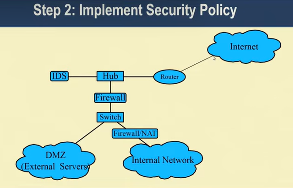

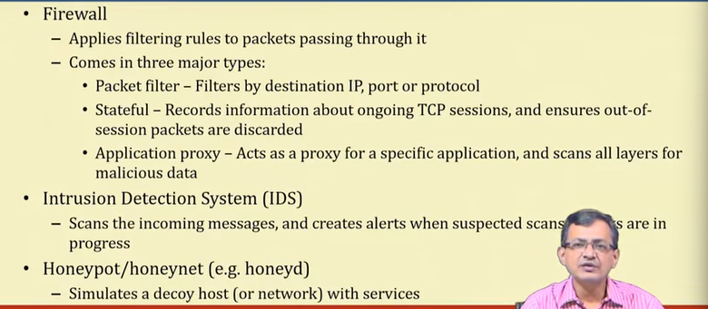

### Step 3 - Reconnaissance

* First, we learn about the network

- IP addresses of hosts on the network
- Identify key servers with critical data
- Services running on those hosts/servers
- Vulnerabilities on those services

* Two forms: passive and active
- Passive reconnaissance is undetectable
- Active reconnaissance is often detectable by IDS

### Step 4 - Vulnerability Scanning

* We now have a list of hosts and services
  - We can now target these services for attacks
* Many scanners will detect vulnerabilities (e.g. nessus)
  - These scanners produce a risk report
* Other scanners will allow you to exploit them (e.g. metasploit)
  - These scanners find ways in, and allow you to choose the payload to use (e.g. obtain a
root shell, download a package)
  - The payload is the code that runs once inside
* The best scanners are updateable
  - For new vulnerabilities, install/write new plug-ins
  - e.g. Nessus Attack Scripting Language (NASL)

### Step 5 - Penetration Testing

* We have identified vulnerabilities
  - Now, we can exploit them to gain access
  - Using frameworks (e.g. Metasploit), this is as simple as selecting a payload to execute
- Otherwise, we manufacture an exploit
* We may also have to try to find new vulnerabilities
  - This involves writing code or testing functions accepting user input

### Step 6 - Post-Attack Investigation

* Forensics of Attacks
* This process is heavily guided by laws
  - Also, this is normally done by a third party
* Retain chain of evidence
  - The evidence in this case is the data on the host
  - The log files of the compromised host hold the footsteps and fingerprints of the attacker
  - Every minute with that host must be accounted for
  - For legal reasons, you should examine a low-level copy of the disk and net modify the original

## Vulnerability Assessment
* Today's Enterprises are IT-enabled!
* Need for "Self-Security", Vulnerability Assessment
  * Content-aware IPS
  * File system Scanning
  * **Penetration Testing**

## Penetration Testing(Tiger team attack/Read team attack)

* Test for evaluating the strengths of all security controls on the computer
system
* Goal : Violate the site security policy
* NOT a replacement for careful design and implementation with structured
testing
* Methodology for testing the system in toto - once it is in place
* Examines procedural and operational controls as well as technogical control

## Penetration Testing tools

- **Proprietary Tools**
  - Extremely expensive.
  - Likely to have backdoors.
  - Inextensible.
  - No access to source
  - Usually not adaptable

- **Public domain Tools**
  - Good - but others also knows it !
  - Not integrated / automated
  - Not fully functional

- Need to evolve our own framework - proprietary to the organization

## System Vulnerablity

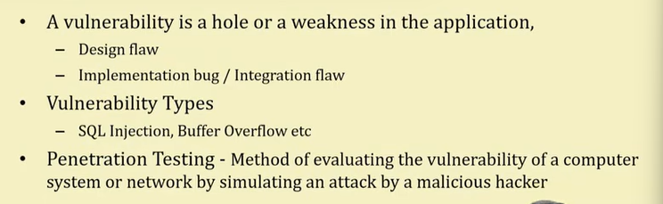

## Penetration Test Methodology

· Information gathering  
· Reconnaissance  
· Scanning  
· Enumeration  
· Vulnerability identification  
· Exploitation  
· Escalation / Advancement  
· Suggestions & Workarounds  

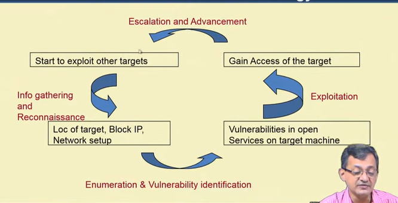

## Typical Architectural Model of Penetration Testing Tool

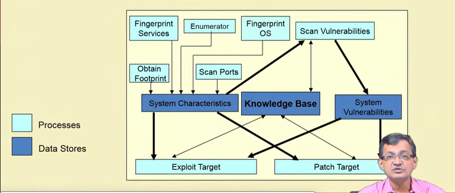

## Proxy Server, Network Address Translator(NAT), Firewall

## Proxy Server

* **What is a proxy server?**
  * Acts on behalf of other clients, and presents requests from other clients to a server.
  * Acts as a server while talking with a client, and as a client while talking
with a server.
* **Commonly used HTTP proxy server:**
  * Squid
    * available on all platforms.
* It is a server that sits between a client application (Web
browser), and a real server.
  * It intercepts all requests to the real server to see if it can fulfill the requests itself.
  * If not, it forwards the request to the real server.

## Proxy Server - Types
* Mainly serves two purposes:
  * **Improve performance**
    * Can dramatically improve performance for a group of users.
    * It saves all the results of requests in a cache.
    * Can greatly conserve bandwidth.
  * **Filter requests**
    * Prevent users from accessing a specific set of web sites.
    * Prevent users for accessing pages containing some specified strings.
    * Prevent users from accessing video files (say).

## Anonymous Proxy Servers
* Hide the user's IP address, thereby preventing unauthorized access to
user's computer through the Internet.
* All requests to the outside world originate with the IP address of the
proxy server.
* Very convenient for group subscription:
- On-line journals.
- Digital library.

## Location of Proxy Server

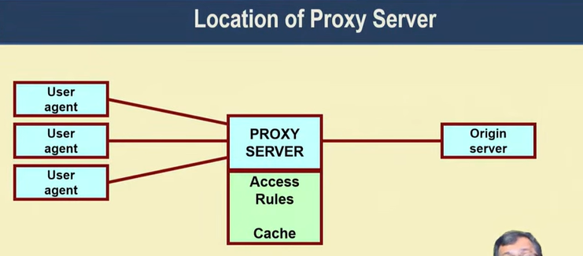

## Functions of a HTTP Proxy

* Request forwarding  
  - Primary function.
  - Acts as a rudimentary firewall.
* Access control  
  - Allow or deny accesses, based on
      - Contents
      - Location  
* Cache management
  * Efficient utilization of bandwidth.
  * Faster access.

## Network Address Translator(NAT)

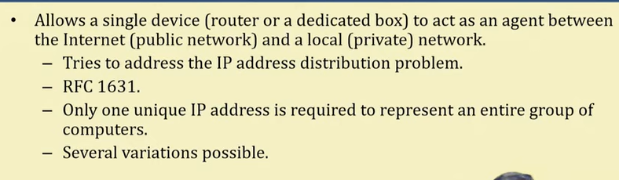

| Feature      | NAT           | Proxy             | VPN           |
| ------------ | ------------- | ----------------- | ------------- |
| Works at     | Network layer | Application layer | Network layer |
| Hides IP     | ✅             | ✅                 | ✅             |
| Encryption   | ❌             | ❌                 | ✅             |
| User control | ❌ (automatic) | ✅                 | ✅             |

🔹 Real-Life Analogy

Think of NAT like a receptionist in an office:

Employees = devices (private IPs)  
Receptionist = router (NAT)  
Company phone number = public IP  

👉 Outsiders only see the company number, not individual employees.

## Private Addresses

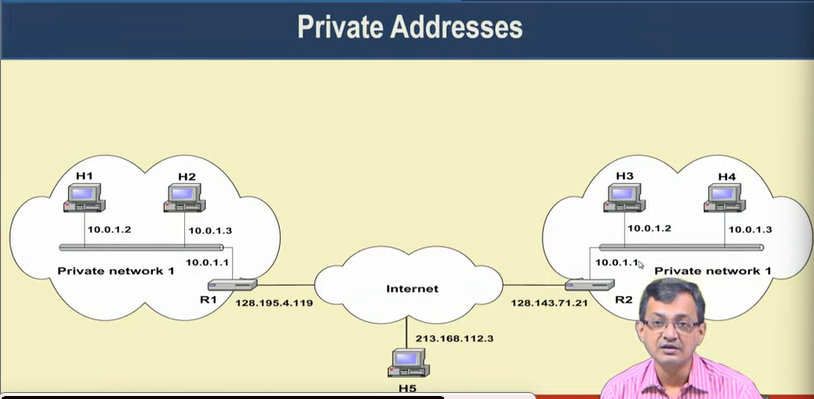

## Basic Operation of NAT

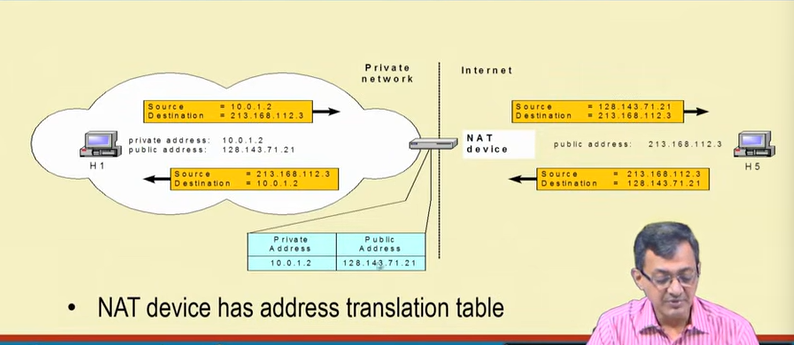

It maps the address while going and coming back

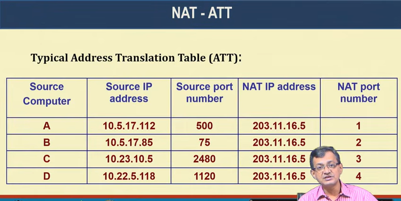

## Capability Limit of a NAT

## Main uses of NAT
· Pooling of IP addresses  
· Supporting migration between network service providers  
· IP masquerading  
. Load balancing of servers

## Concerns about NAT

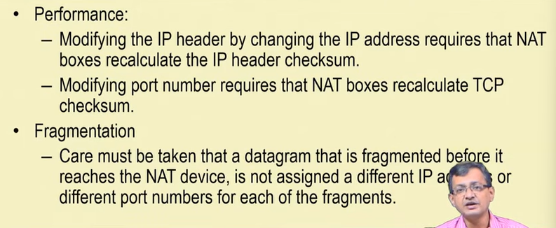

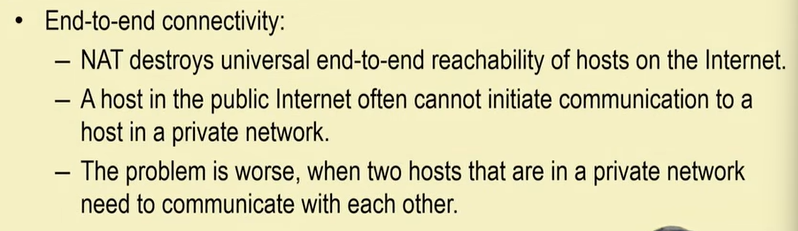

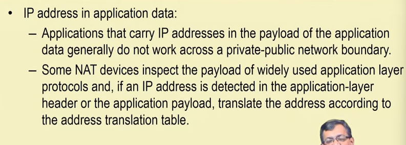

## Other Benefits of NAT

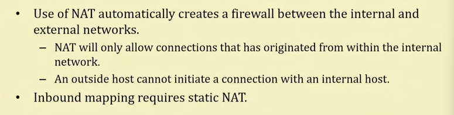

## Is NAT a Proxy Server?

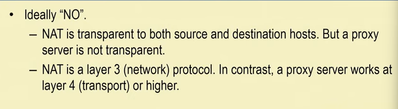