# Lecture 60 : Network Security-III[TCP/IPSecurity]

> Today we will talk about TCP/IP security

## Common Structure of security Protocols

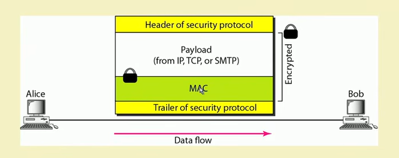

## IPSecurity(IPSec)

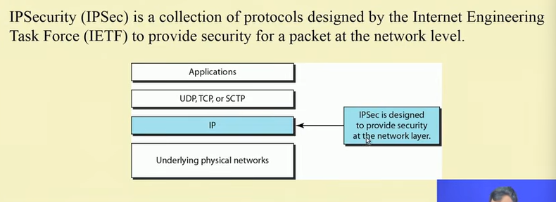

## IPSec - Transport mode and Tunnel Modes

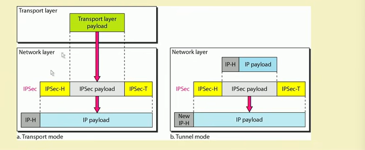

### Transport mode

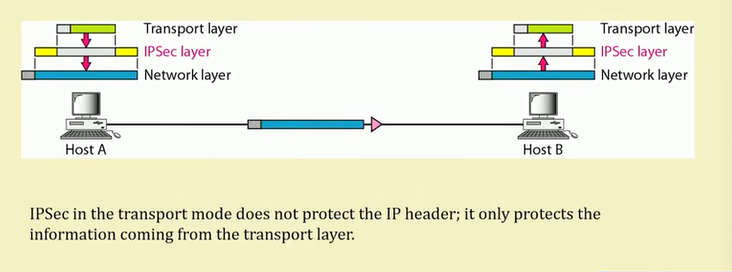

### Tunel mode

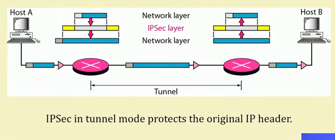

## IPSec services

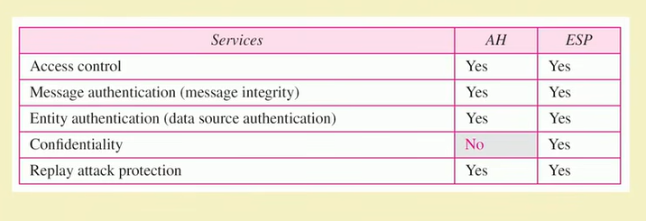

## Transport Layer Security - SSL/TLS

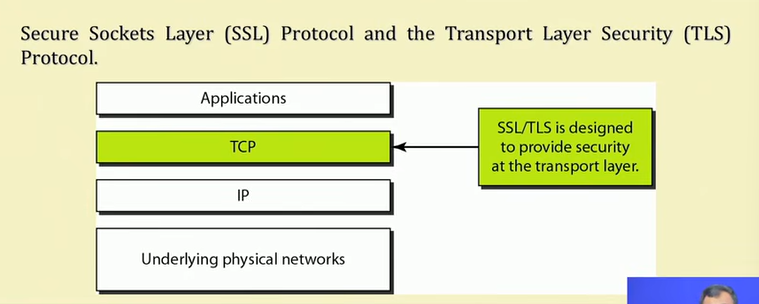

### Four SSL Protocols

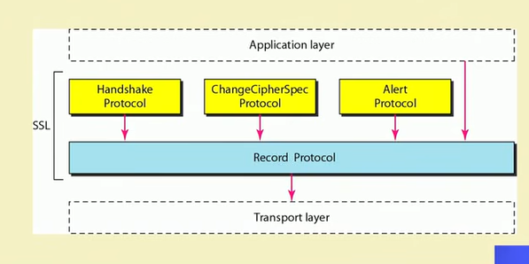

## Application Layer Security - PGP

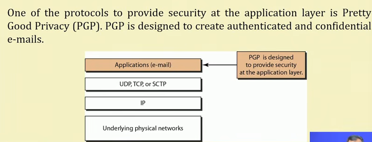

### PGP : E-mail message is authenticated and encrypted

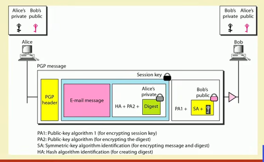

## Firewall

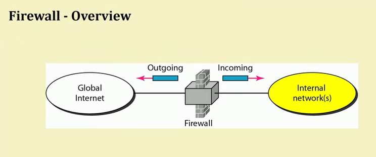

* Firewalls are effective to
  - protect local systems;
  - protect network-based security threats;
  - provide secured and controlled access to Internet;
  - provide restricted and controlled access from the Internet to local servers.

## Types of Firewalls

1. Packet filters
2. Application-level gateways/ Proxy Firewall
3. Circuit-level gateways

### Packet Filtering Firewall

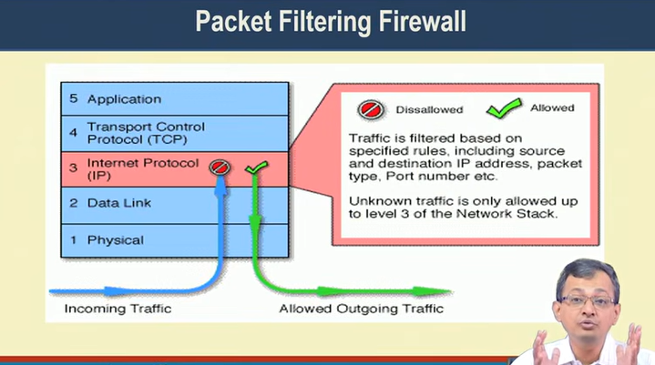

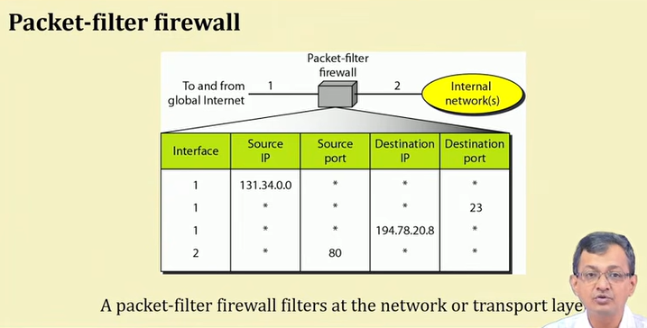

- Applies a set of rules to each incoming IP packet and then
forwards or discards the packet.
  - Typically based on IP addresses and port numbers.
- Filter packets going in both directions.
- The packet filter is typically set up as a list of rules based on
matches to fields in the IP or TCP header.
- Two default policies (discard or forward).

- Advantages:
  - Simplicity
  - Transparency to users
  - High speed
- Disadvantages:
  - Difficulty of setting up packet filter rules
  - Lack of authentication

## Application-Level Gateway

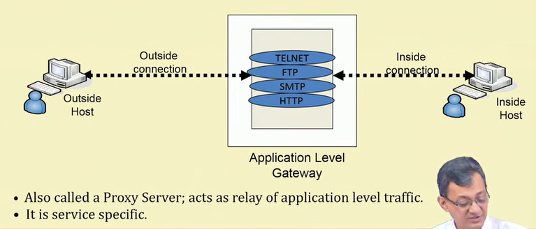

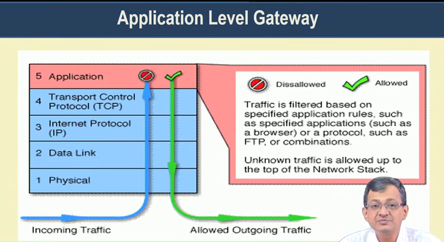

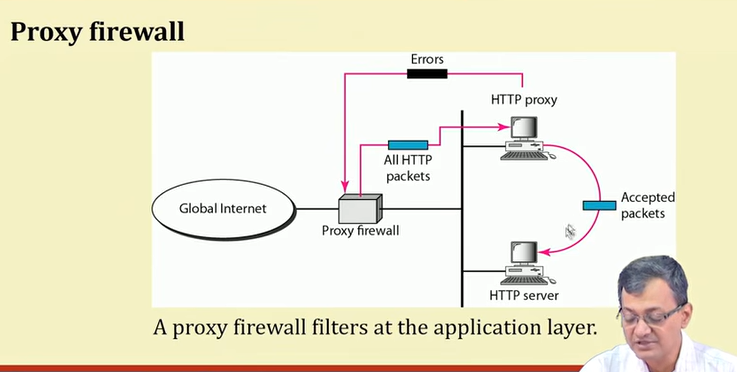

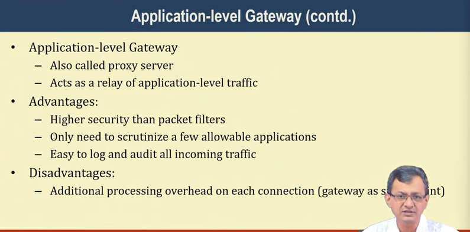

## Circuit-Level gateway

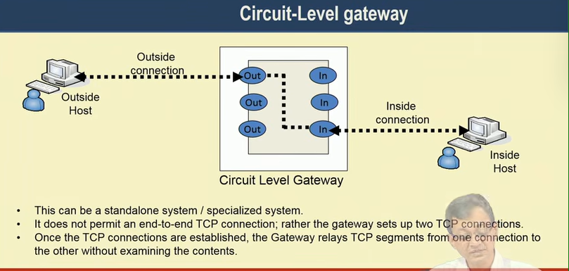

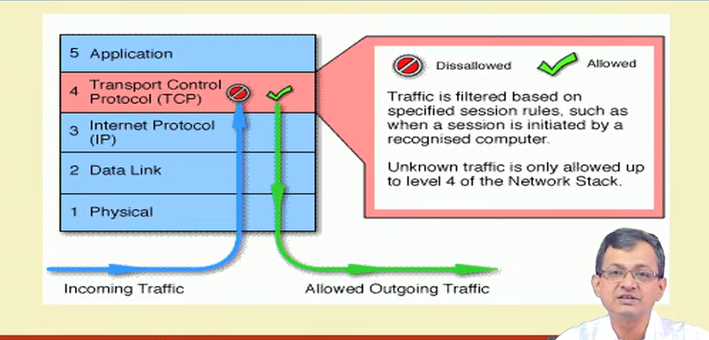

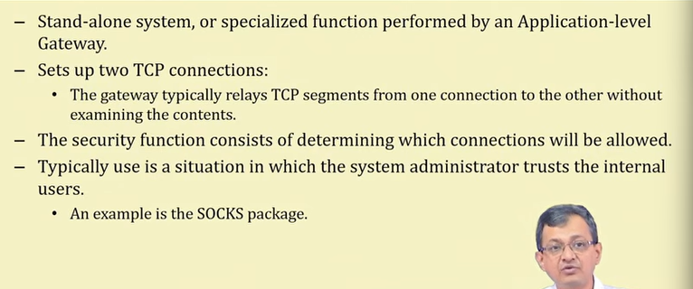

## Firewall Configurations
- In addition to the use of simple configuration of a single
system (single packet filtering router or single gateway),
more complex configurations are possible
- Three common configurations are in popular use.

### Screened Host Firewall(Single-homed host)

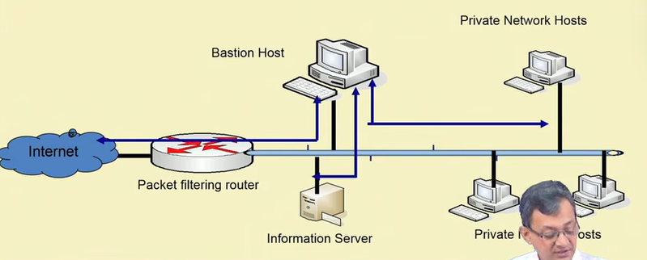

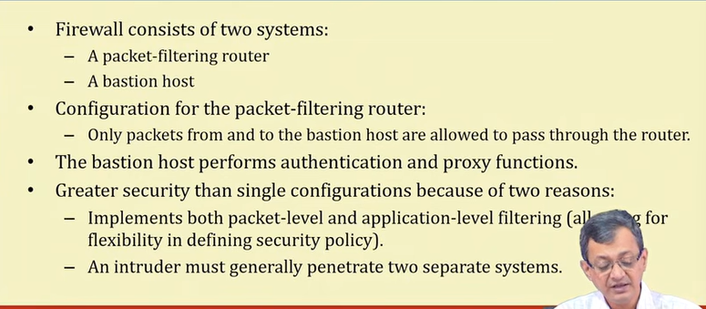

### Screened Host Firewall(dual-homed host)

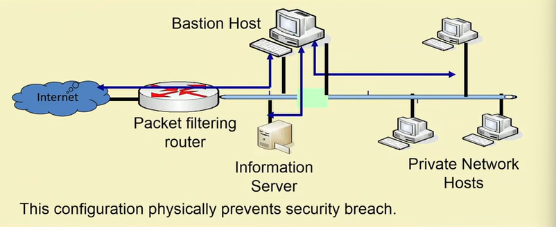

- The packet-filtering router is not completely compromised.
- Traffic between the Internet and other hosts on the private network has to flow through the bastion host.

### Screened Subnet Firewall

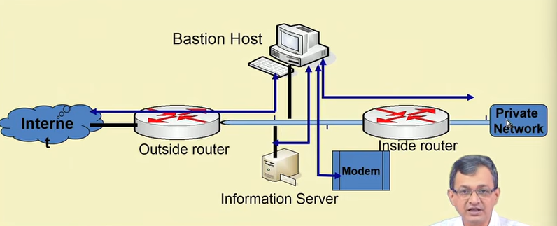

## Perimeter Defense and Firewall - Typical Scenario

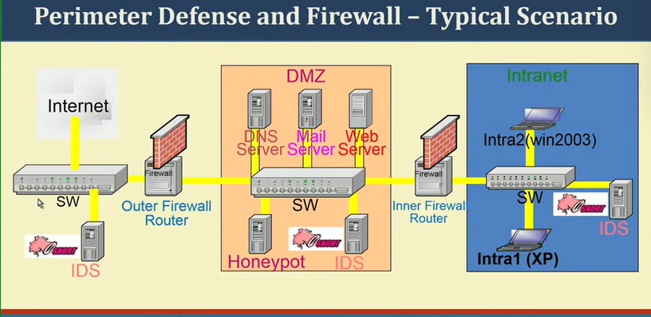