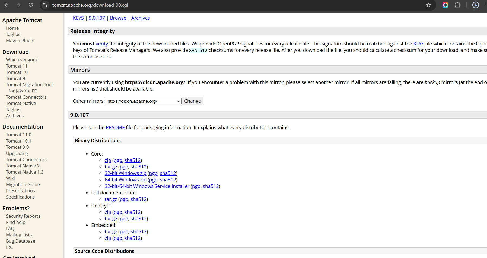
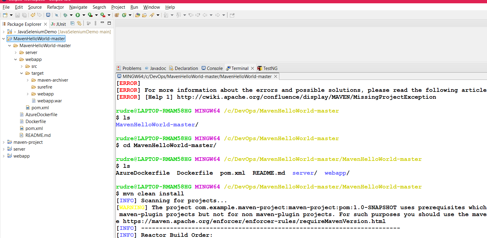
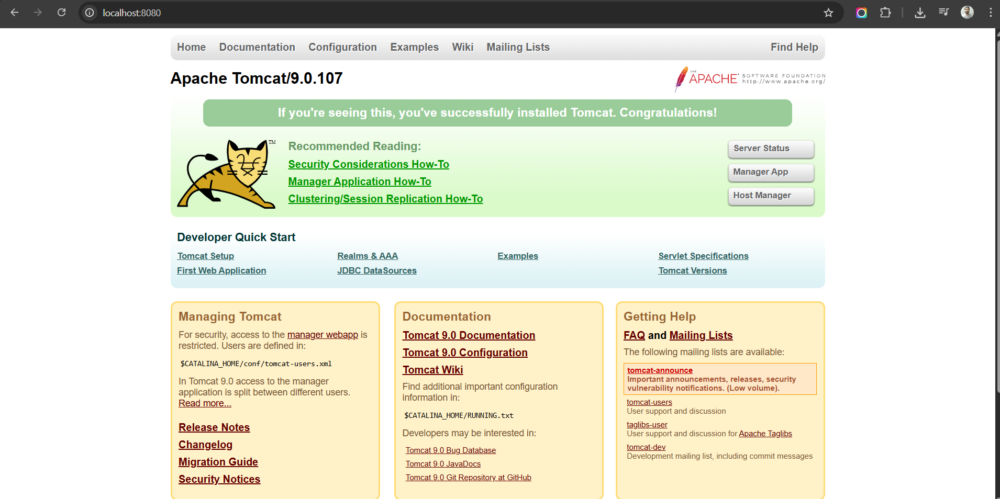
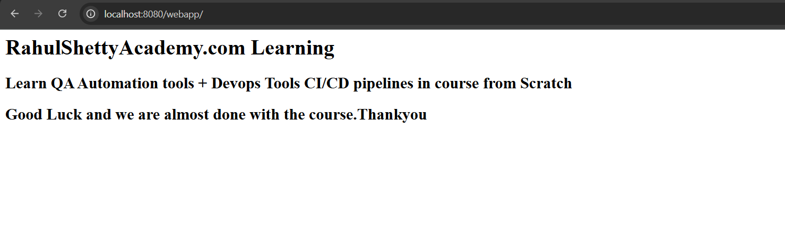

# Devops Fundamentals - CI/CD with AWS +Docker+Ansible+Jenkins

# https://www.udemy.com/course/devops-fundamentals-aws

# What is DevOps?
* DevOps is the combination of practices and tools that increases an organization's ability successful delivery of software into production at high velocity
* Devops teams use practices to automate processes that historically have been manual and slow

In one word, it's all about how quality code goes out to world from your local development machine.

Development + Operations = DevOps

* Link - https://aws.amazon.com/devops/what-is-devops/


**Practices**
Continuous Integration(CI)  
Continuous Delivery(CD)  

**Tools**
Docker  
AWS Linux Servers  
Ansible  
Jenkins  
GIT  
Maven, Chef  

```txt
I am from QA/Testing background. How this course helps in my career
Devops Fundamentals are need of the hour for every Software Engineer no matter if they are from Dev or QA/Testing Background.

Why?

Devops word originated to remove the gap between Development team and Operations team with single merge called DEV (Development Team) + OPS (Operations Team) = DEVOPS

From above point, we just understood that Development team should also be responsible for Devops.

Now what is Development Team? who all comes under?

As Per Agile Standards, Development Team Constitutes both Developers + QA Testers. There is no such differentiation between the skill roles. All the Technical team who contributes to the product are called as Development Team.

If your company follows Strict Agile Scrum Principles (which 80% of the companies are following) then though you are from QA, you may face the heat of Devops at any phase in your Iteration/Sprint as you are part of Agile Development team

I am sure most of them who are working under Agile Methodology are already aware of keywords like CI/CD Pipelines, Automated releases, Docker Containers, Deployments, Linux Servers if there are Devops Practices implemented in project

So, this course establishes Strong foundation for Devops so that one can confidently involve in any discussion related to Devops for your project with out any fear and can suggest best practices for faster delivery of the Project.

And for any Dev/ QA SDET Interviews,   Devops fundamentals are most commonly checked if you have more than 5 years of Industry experience with questions like

What is Continuous Integration/ Continuous Delivery?
Deployment basics?
Importance of Dockers, why do we need them?
AWS Testing or AWS SSH connection basics
Jenkins GitHub Integration to build Pipelines etc.

This course answers to many of these devops foundation questions with practical hands on delivery!

So finally, in one word, If you are software Engineer, you must need to have the knowledge of Devops and you are on right place now to get this knowledge

All the Best 😊
```

## Getting Started with Deployment Basics
1. Continuous Integration(CI)

Continuous Integration (CI) is the process of automating the build and testing of code everytime a team member commits changes to version control
2. Continous Delivery(CD)

Continuous Delivery(CD) is the process to build, test, configure and deploy from a build to a production environment.

* **What are Application servers**
  * An application/web server is a server specifically desined to run applications(or) It is server to host applications.
  * It handles Http requests and send response calls over Http protocol
* **What are Hosted servers?**
  * Hosted Servers are nothing but physical machines where application/Web/Databases servers are hosted.

* Application server can start at any port in Hosted server. And can be accessed through `HostedServerIpAddress:portNumber`
* We can map HostedServerIpAddress:portNumber to any custom Domain Name so that we can access the application server directly with Domain Name
  
```txt
Apache Tomcat
199.323.434.53:8080
Dist -ng build
mvn clean install
```

### Steps
1. Download Apache Tomcat



2. Open project in eclipse
   1. GitHub - https://github.com/rahulshettyacademy/MavenHelloWorld
3. mvn clean install from proper inside the directory where pom file is located

copy the webapp.war file inside the `webapps` of folder `..\apache-tomcat-9.0.107-windows-x64\apache-tomcat-9.0.107\webapps`



1. Go to bin directory and double click `startup.bat` file. Then go to browser `localhost:8080`






# 6. Spin up Jenkins Instance in Windows for Deployment