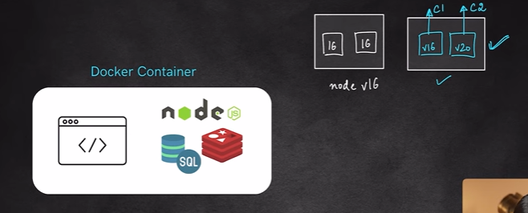
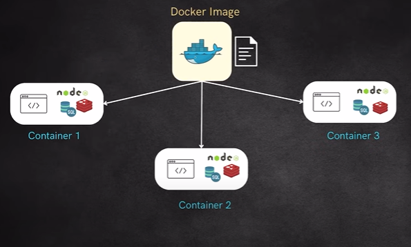

# Index
1. What is Docker? why do we need it?
2. Docker Images & Containers
3. Installation of Docker CLI & Desktop
4. Important Docker Commands
5. Docker vs VM
6. Port Mapping & Setting Env Variables
7. Troubleshooting Containers
8. Using Containers to build Node application
9. Dockerization of Node.js Application(Dockefile)
10. Docker Compose
    1.  Services
    2.  Port Mapping
    3.  Env Variables
    4.  Volumes
11. Publishing to DockerHub
12. Layering in Docker Images
13. Volume Mounting
14. Docker Networking
    1.  Default & Custom Networks
    2.  Using custom network for multi-container apps
    3.  Network drivers - Bridge, Host, Null

Got it bhai ✅ Let me rewrite the whole thing in **English** for you:

---

## 🚩 Problems Before Docker

Software development used to face 3 big issues:

### 1. **“Works on my machine” Problem**

* An app would run fine on a developer’s laptop, but fail on the server.
* Why?

  * Different OS versions
  * Different library versions
  * Missing dependencies

👉 Example: Developer has **Python 3.9** installed, server has **Python 3.7** → app crashes.

---

### 2. **Heavy Virtual Machines (VMs)**

* The old solution was to use **VMs**.
* But a VM runs a **full operating system** (Windows/Linux), which is **slow and resource-heavy**.
* You could only run a limited number of VMs on one server.

---

### 3. **Scaling & Portability Issues**

* Moving applications between environments (Dev → Test → Prod → Cloud) was painful.
* Keeping dependencies consistent across all environments was hard.

---

## ✅ Why Docker Came Into Existence

Docker solved all of these by introducing **containers**:

* A **container = lightweight, isolated environment** that packages your app + its dependencies.
* Unlike VMs, containers **share the host OS kernel**, so they are fast and efficient.

---

### 🔑 Benefits of Docker

1. **Consistency**

   * Build a container once → it runs the same way everywhere (laptop, server, cloud).

2. **Lightweight & Fast**

   * Containers start in **seconds** (VMs take minutes).
   * You can run many containers on the same machine.

3. **Portability**

   * Build a Docker image → run it anywhere (AWS, GCP, Azure, bare metal, laptop).

4. **Scalability**

   * Containers are small and lightweight, so they scale up/down very easily.

---

## ⚡ In Short:

* **Docker came into existence** because developers and companies needed a tool to:

  * Fix environment/dependency problems
  * Avoid the heavy overhead of VMs
  * Easily ship, run, and scale applications

👉 That’s why Docker is called **“Build once, run anywhere.”** 🐳

# Docker Contaier

Great question, bhai 👍 Let’s go step by step:

---

## 🐳 **What is a Docker Container?**

A **Docker container** is a **lightweight, standalone, executable package** that includes:

* Your application code
* Dependencies (libraries, runtimes)
* System tools and configs needed to run the app

But it **shares the host OS kernel** instead of running a full OS like a Virtual Machine.

---

## 🛠 Simple Analogy

* **Docker Image = Recipe** 📖
* **Docker Container = Cooked Dish** 🍛

👉 The image defines *how* the app should be built, and the container is the *running instance* of that image.

---

## ✨ Key Properties of a Container

1. **Isolated**

   * Runs in its own environment, doesn’t interfere with other containers.

2. **Lightweight**

   * Shares the host OS kernel, so it doesn’t need a full operating system.
   * Starts in seconds.

3. **Portable**

   * Runs the same way everywhere: your laptop, a server, or cloud (GCP/AWS/Azure).

4. **Ephemeral (Temporary)**

   * Containers are meant to be **short-lived**. You can stop/remove them anytime and recreate from the image.

---

## 📌 Example

Run this command:

```bash
docker run -it ubuntu bash
```

* This pulls the **Ubuntu image** (if not already present).
* Starts a **container** from that image.
* Drops you into an Ubuntu shell, isolated from your host system.

Another example with an app:

```bash
docker run -p 8080:80 nginx
```

* Runs an **nginx web server container**.
* Maps container port 80 → host port 8080.
* Now you can open `http://localhost:8080` and see nginx running.

---

## 🚩 In Short:

A **Docker container** is a **running instance of a Docker image**, providing a lightweight, isolated environment for your app.

---

Do you want me to also explain **difference between Docker Image and Docker Container** in a comparison table? That usually clears confusion instantly.


## Docker Image

Class -> Object

---

## 📦 **What is a Docker Image?**

* A **Docker Image** is like a **blueprint/template** that defines **what goes inside a container**.
* It contains:

  * Application code
  * Dependencies (libraries, runtimes)
  * Configurations
  * Base OS files (like Ubuntu, Alpine, etc.)

👉 But an image itself **doesn’t run**. It’s **read-only**.
👉 When you run an image, it becomes a **container**.

---

## 🛠 Analogy

* **Image = Recipe** 📖
* **Container = Cooked Dish** 🍛

You can make multiple dishes (containers) from the same recipe (image).

---

## ✨ Key Properties of a Docker Image

1. **Read-only**: Once built, the image doesn’t change.
2. **Layered**: Images are built in layers, so if one layer changes (say you add one library), Docker doesn’t rebuild the whole image → very fast & efficient.
3. **Portable**: Same image can be shared via **Docker Hub** or private registries and run anywhere.

---

## 📌 Example

### Dockerfile (to create an image):

```dockerfile
FROM python:3.9
COPY app.py /app/
CMD ["python", "/app/app.py"]
```

### Build an image:

```bash
docker build -t my-python-app .
```

* Now you have an **image** called `my-python-app`.

### Run the image (creates a container):

```bash
docker run my-python-app
```

---

## 🔑 Difference Between Image and Container

| **Docker Image** 🖼️                       | **Docker Container** 📦                          |
| ------------------------------------------ | ------------------------------------------------ |
| Blueprint/template for the app             | Running instance of an image                     |
| Static (read-only)                         | Dynamic (mutable, live)                          |
| Doesn’t consume resources until run        | Actively consumes CPU, RAM, ports, etc.          |
| Stored in registry (Docker Hub, GCR, etc.) | Runs on host machine                             |
| Example: `nginx:latest`                    | Example: A running nginx web server on port 8080 |

---

⚡ **In short**:

* **Docker Image = What to run**
* **Docker Container = Actually running it**


