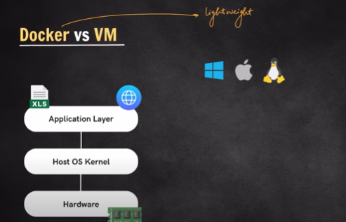

# Index
1. What is Docker? why do we need it?
2. Docker Images & Containers
3. Installation of Docker CLI & Desktop
4. Important Docker Commands
5. Docker vs VM
6. Port Mapping & Setting Env Variables
7. Troubleshooting Containers
8. Using Containers to build Node application
9. Dockerization of Node.js Application(Dockefile)
10. Docker Compose
    1.  Services
    2.  Port Mapping
    3.  Env Variables
    4.  Volumes
11. Publishing to DockerHub
12. Layering in Docker Images
13. Volume Mounting
14. Docker Networking
    1.  Default & Custom Networks
    2.  Using custom network for multi-container apps
    3.  Network drivers - Bridge, Host, Null

Got it bhai ✅ Let me rewrite the whole thing in **English** for you:

---
# Links
* https://docs.docker.com/
* https://hub.docker.com/

## 🚩 Problems Before Docker

Software development used to face 3 big issues:

### 1. **“Works on my machine” Problem**

* An app would run fine on a developer’s laptop, but fail on the server.
* Why?

  * Different OS versions
  * Different library versions
  * Missing dependencies

👉 Example: Developer has **Python 3.9** installed, server has **Python 3.7** → app crashes.

---

### 2. **Heavy Virtual Machines (VMs)**

* The old solution was to use **VMs**.
* But a VM runs a **full operating system** (Windows/Linux), which is **slow and resource-heavy**.
* You could only run a limited number of VMs on one server.

---

### 3. **Scaling & Portability Issues**

* Moving applications between environments (Dev → Test → Prod → Cloud) was painful.
* Keeping dependencies consistent across all environments was hard.

---

## ✅ Why Docker Came Into Existence

Docker solved all of these by introducing **containers**:

* A **container = lightweight, isolated environment** that packages your app + its dependencies.
* Unlike VMs, containers **share the host OS kernel**, so they are fast and efficient.

---

### 🔑 Benefits of Docker

1. **Consistency**

   * Build a container once → it runs the same way everywhere (laptop, server, cloud).

2. **Lightweight & Fast**

   * Containers start in **seconds** (VMs take minutes).
   * You can run many containers on the same machine.

3. **Portability**

   * Build a Docker image → run it anywhere (AWS, GCP, Azure, bare metal, laptop).

4. **Scalability**

   * Containers are small and lightweight, so they scale up/down very easily.

---

## ⚡ In Short:

* **Docker came into existence** because developers and companies needed a tool to:

  * Fix environment/dependency problems
  * Avoid the heavy overhead of VMs
  * Easily ship, run, and scale applications

👉 That’s why Docker is called **“Build once, run anywhere.”** 🐳

# Docker Contaier

Great question, bhai 👍 Let’s go step by step:

---

## 🐳 **What is a Docker Container?**

A **Docker container** is a **lightweight, standalone, executable package** that includes:

* Your application code
* Dependencies (libraries, runtimes)
* System tools and configs needed to run the app

But it **shares the host OS kernel** instead of running a full OS like a Virtual Machine.

---

## 🛠 Simple Analogy

* **Docker Image = Recipe** 📖
* **Docker Container = Cooked Dish** 🍛

👉 The image defines *how* the app should be built, and the container is the *running instance* of that image.

---

## ✨ Key Properties of a Container

1. **Isolated**

   * Runs in its own environment, doesn’t interfere with other containers.

2. **Lightweight**

   * Shares the host OS kernel, so it doesn’t need a full operating system.
   * Starts in seconds.

3. **Portable**

   * Runs the same way everywhere: your laptop, a server, or cloud (GCP/AWS/Azure).

4. **Ephemeral (Temporary)**

   * Containers are meant to be **short-lived**. You can stop/remove them anytime and recreate from the image.

---

## 📌 Example

Run this command:

```bash
docker run -it ubuntu bash
```

* This pulls the **Ubuntu image** (if not already present).
* Starts a **container** from that image.
* Drops you into an Ubuntu shell, isolated from your host system.

Another example with an app:

```bash
docker run -p 8080:80 nginx
```

* Runs an **nginx web server container**.
* Maps container port 80 → host port 8080.
* Now you can open `http://localhost:8080` and see nginx running.

---

## 🚩 In Short:

A **Docker container** is a **running instance of a Docker image**, providing a lightweight, isolated environment for your app.

---

Do you want me to also explain **difference between Docker Image and Docker Container** in a comparison table? That usually clears confusion instantly.


## Docker Image

Class -> Object

---

## 📦 **What is a Docker Image?**

* A **Docker Image** is like a **blueprint/template** that defines **what goes inside a container**.
* It contains:

  * Application code
  * Dependencies (libraries, runtimes)
  * Configurations
  * Base OS files (like Ubuntu, Alpine, etc.)

👉 But an image itself **doesn’t run**. It’s **read-only**.
👉 When you run an image, it becomes a **container**.

---

## 🛠 Analogy

* **Image = Recipe** 📖
* **Container = Cooked Dish** 🍛

You can make multiple dishes (containers) from the same recipe (image).

---

## ✨ Key Properties of a Docker Image

1. **Read-only**: Once built, the image doesn’t change.
2. **Layered**: Images are built in layers, so if one layer changes (say you add one library), Docker doesn’t rebuild the whole image → very fast & efficient.
3. **Portable**: Same image can be shared via **Docker Hub** or private registries and run anywhere.

---

## 📌 Example

### Dockerfile (to create an image):

```dockerfile
FROM python:3.9
COPY app.py /app/
CMD ["python", "/app/app.py"]
```

### Build an image:

```bash
docker build -t my-python-app .
```

* Now you have an **image** called `my-python-app`.

### Run the image (creates a container):

```bash
docker run my-python-app
```

---

## 🔑 Difference Between Image and Container

| **Docker Image** 🖼️                       | **Docker Container** 📦                          |
| ------------------------------------------ | ------------------------------------------------ |
| Blueprint/template for the app             | Running instance of an image                     |
| Static (read-only)                         | Dynamic (mutable, live)                          |
| Doesn’t consume resources until run        | Actively consumes CPU, RAM, ports, etc.          |
| Stored in registry (Docker Hub, GCR, etc.) | Runs on host machine                             |
| Example: `nginx:latest`                    | Example: A running nginx web server on port 8080 |

---

⚡ **In short**:

* **Docker Image = What to run**
* **Docker Container = Actually running it**


# Install Docker
* For Windows - https://www.youtube.com/watch?v=JBEUKrjbWqg

# Docker commands
```bash
C:\Users\rudre>docker
Usage:  docker [OPTIONS] COMMAND

A self-sufficient runtime for containers

Common Commands:
  run         Create and run a new container from an image
  exec        Execute a command in a running container
  ps          List containers
  build       Build an image from a Dockerfile
  bake        Build from a file
  pull        Download an image from a registry
  push        Upload an image to a registry
  images      List images
  login       Authenticate to a registry
  logout      Log out from a registry
  search      Search Docker Hub for images
  version     Show the Docker version information
  info        Display system-wide information

Management Commands:
  ai*         Docker AI Agent - Ask Gordon
  builder     Manage builds
  buildx*     Docker Buildx
  cloud*      Docker Cloud
  compose*    Docker Compose
  container   Manage containers
  context     Manage contexts
  debug*      Get a shell into any image or container
  desktop*    Docker Desktop commands
  extension*  Manages Docker extensions
  image       Manage images
  init*       Creates Docker-related starter files for your project
  manifest    Manage Docker image manifests and manifest lists
  mcp*        Docker MCP Plugin
  model*      Docker Model Runner
  network     Manage networks
  plugin      Manage plugins
  sbom*       View the packaged-based Software Bill Of Materials (SBOM) for an image
  scout*      Docker Scout
  system      Manage Docker
  trust       Manage trust on Docker images
  volume      Manage volumes

Swarm Commands:
  swarm       Manage Swarm

Commands:
  attach      Attach local standard input, output, and error streams to a running container
  commit      Create a new image from a container's changes
  cp          Copy files/folders between a container and the local filesystem
  create      Create a new container
  diff        Inspect changes to files or directories on a container's filesystem
  events      Get real time events from the server
  export      Export a container's filesystem as a tar archive
  history     Show the history of an image
  import      Import the contents from a tarball to create a filesystem image
  inspect     Return low-level information on Docker objects
  kill        Kill one or more running containers
  load        Load an image from a tar archive or STDIN
  logs        Fetch the logs of a container
  pause       Pause all processes within one or more containers
  port        List port mappings or a specific mapping for the container
  rename      Rename a container
  restart     Restart one or more containers
  rm          Remove one or more containers
  rmi         Remove one or more images
  save        Save one or more images to a tar archive (streamed to STDOUT by default)
  start       Start one or more stopped containers
  stats       Display a live stream of container(s) resource usage statistics
  stop        Stop one or more running containers
  tag         Create a tag TARGET_IMAGE that refers to SOURCE_IMAGE
  top         Display the running processes of a container
  unpause     Unpause all processes within one or more containers
  update      Update configuration of one or more containers
  wait        Block until one or more containers stop, then print their exit codes

Global Options:
      --config string      Location of client config files (default
                           "C:\\Users\\rudre\\.docker")
  -c, --context string     Name of the context to use to connect to the
                           daemon (overrides DOCKER_HOST env var and
                           default context set with "docker context use")
  -D, --debug              Enable debug mode
  -H, --host string        Daemon socket to connect to
  -l, --log-level string   Set the logging level ("debug", "info",
                           "warn", "error", "fatal") (default "info")
      --tls                Use TLS; implied by --tlsverify
      --tlscacert string   Trust certs signed only by this CA (default
                           "C:\\Users\\rudre\\.docker\\ca.pem")
      --tlscert string     Path to TLS certificate file (default
                           "C:\\Users\\rudre\\.docker\\cert.pem")
      --tlskey string      Path to TLS key file (default
                           "C:\\Users\\rudre\\.docker\\key.pem")
      --tlsverify          Use TLS and verify the remote
  -v, --version            Print version information and quit

Run 'docker COMMAND --help' for more information on a command.

For more help on how to use Docker, head to https://docs.docker.com/go/guides/


```

# What is the difference between Docker and Virtual Machine


## 🖥️ **Virtual Machine (VM)**

* A **VM** is a full emulation of a computer system.
* Each VM runs its **own operating system** (Windows/Linux).
* Uses a **Hypervisor** (like VMware, VirtualBox, Hyper-V) to allocate resources.

👉 Example:
If you want to run 3 apps, each VM will need:

* A full OS (\~2–4 GB RAM)
* App + dependencies

That’s heavy.

---

## 🐳 **Docker (Containers)**

* Docker runs apps in **containers**, which share the **host OS kernel**.
* No need to install a full OS for each app.
* Just app + dependencies run in an isolated environment.

👉 Example:
If you want to run 3 apps in Docker:

* All 3 apps share the same host OS
* Each app only carries its libraries + configs
* Uses **MBs**, not GBs

---

## ⚡ Key Differences: Docker vs VM


| Feature            | **Virtual Machine** 🖥️                              | **Docker (Container)** 🐳                 |
| ------------------ | ---------------------------------------------------- | ----------------------------------------- |
| **OS Requirement** | Each VM has its own full OS                          | All containers share host OS kernel       |
| **Size**           | GBs (heavy)                                          | MBs (lightweight)                         |
| **Startup Time**   | Minutes (boot full OS)                               | Seconds (start process only)              |
| **Performance**    | Slower (overhead of hypervisor + OS)                 | Faster (closer to bare metal)             |
| **Resource Usage** | High (RAM/CPU per VM)                                | Efficient (many containers per host)      |
| **Isolation**      | Strong (full OS boundary)                            | Process-level (still secure, but lighter) |
| **Use Case**       | Run multiple OSs (Windows + Linux), strong isolation | Microservices, app portability, scaling   |

---

## 🎯 Why Docker is Lightweight

* Docker **doesn’t ship a full OS** with every app.
* It reuses the host OS kernel.
* That’s why containers start in **seconds**, while VMs take **minutes**.

---

## 🛠️ Visual Analogy

* **VM = Renting 1 full house per person** 🏠 (each with its own kitchen, bathroom, electricity).
* **Docker = Multiple roommates sharing 1 house** 🏡 (each has their own room, but kitchen/electricity are shared).

---

👉 In short:

* Use **VMs** when you need multiple **different OS environments** (Windows + Linux).
* Use **Docker** when you want to run multiple **apps** efficiently on the same OS.

# Hello-world
```bash

C:\Users\rudre>docker run hello-world

Hello from Docker!
This message shows that your installation appears to be working correctly.

To generate this message, Docker took the following steps:
 1. The Docker client contacted the Docker daemon.
 2. The Docker daemon pulled the "hello-world" image from the Docker Hub.
    (amd64)
 3. The Docker daemon created a new container from that image which runs the
    executable that produces the output you are currently reading.
 4. The Docker daemon streamed that output to the Docker client, which sent it
    to your terminal.

To try something more ambitious, you can run an Ubuntu container with:
 $ docker run -it ubuntu bash

Share images, automate workflows, and more with a free Docker ID:
 https://hub.docker.com/

For more examples and ideas, visit:
 https://docs.docker.com/get-started/
 ```

 # Interactive mode

## 🐳 **Interactive Mode in Docker**

When you run a container, by default it just executes its command and exits.
But sometimes you want to **“interact” with the container** (type commands inside it, explore its filesystem, etc.).

That’s where **interactive mode** comes in.

---

## 🛠 How to Use Interactive Mode

You use two flags:

* `-i` → **Interactive** (keeps STDIN open)
* `-t` → **Terminal** (allocates a pseudo-TTY for shell access)

Together, we usually write `-it`.

---

## 📌 Example 1: Run Ubuntu in Interactive Mode

```bash
docker run -it ubuntu bash
```

* `ubuntu` = the image
* `bash` = command to run inside
* You’ll now be inside the container’s shell → like logging into a mini Linux machine.
* Try commands like:

  ```bash
  ls
  pwd
  cat /etc/os-release
  ```

---

## 📌 Example 2: Exit Interactive Mode

Type:

```bash
exit
```

👉 This stops the container and brings you back to your host system.

---

## 📌 Example 3: Attach to a Running Container

If a container is already running, you can attach into it:

```bash
docker exec -it <container_id> bash
```

---

## ⚡ In Short

* **Interactive mode** = You can “enter” the container and work inside it as if it’s a separate Linux environment.
* Command:

  ```bash
  docker run -it <image> <command>
  ```

# What is Root directory

## 📂 What is Root Directory (`/`)?

* In Linux (and also Android, since Android = Linux-based), the **root directory** is simply the **starting point of the entire filesystem**.
* It’s written as just `/`.
* Every file, folder, and program in Linux is located *somewhere under* this root directory.

👉 Think of it as the **top-most folder** in a tree 🌳.

---

## 🛠 Example (Linux File Tree)

```
/
├── bin     → basic commands (ls, cat, etc.)
├── etc     → configuration files
├── home    → users’ personal folders
│   ├── rudre → your personal folder
├── root    → root (admin) user’s home folder
├── var     → logs, temporary data
├── usr     → installed apps & libraries
└── tmp     → temporary files
```

So when you landed here inside the Docker container:

```
root@764cd17d6205:/#
```

* That `:/#` means you are currently at the **root directory** `/`.

---

## 📱 On Mobile (Android)

* Same concept. Android is built on Linux, so it also has `/` as root.
* But normal users don’t see it because you need **root access (superuser)** to browse those system files.
* That’s why people say “phone is rooted” → meaning you now have permission to explore and modify everything under `/`.

---

## ⚡ Why is Root Directory Useful?

1. **Organization** → Everything is structured under `/` (no mess like Windows C:, D:, E: drives).
2. **Single hierarchy** → Whether it’s USB drive, SD card, or system apps → all mounted somewhere under `/`.
3. **Permissions** → Some folders are accessible to normal users (like `/home/rudre`), but critical ones (`/etc`, `/bin`, `/root`) are restricted.

---

## 🧠 Analogy

* **Root directory `/` = The entrance gate of a big house 🏠**
* All rooms (folders) are inside this house.
* You can walk into rooms you’re allowed, but locked rooms need a master key (root user).

---

✅ So in short:

* `/` = the **starting point of everything** in Linux/Android/Docker.
* It ensures **everything is in one tree** → not split like Windows drives.


