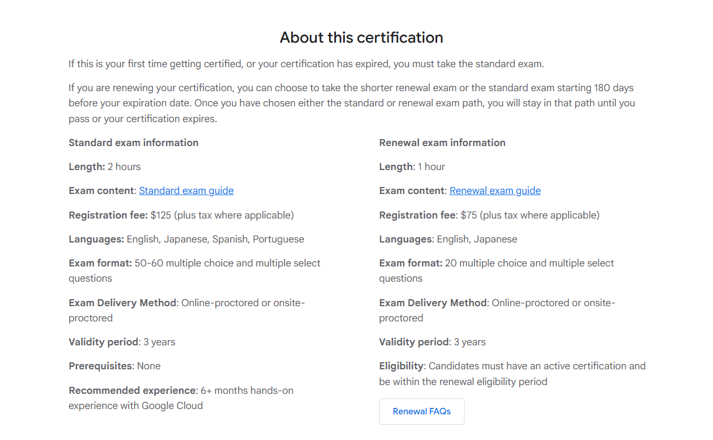
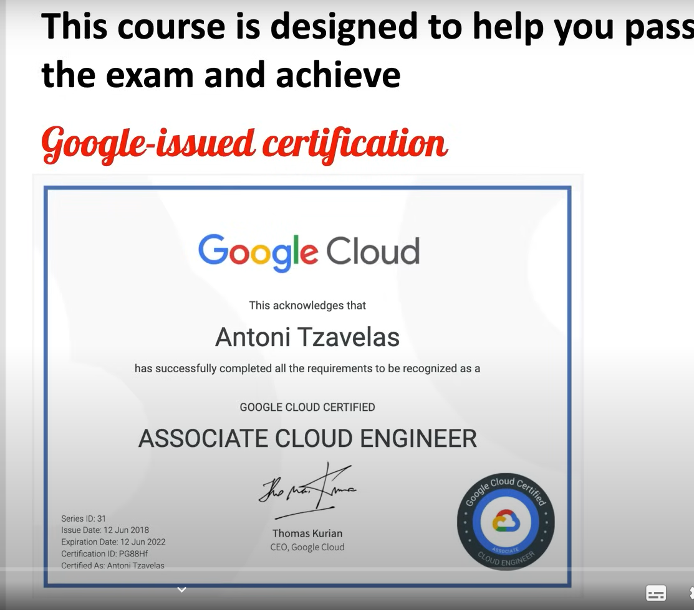
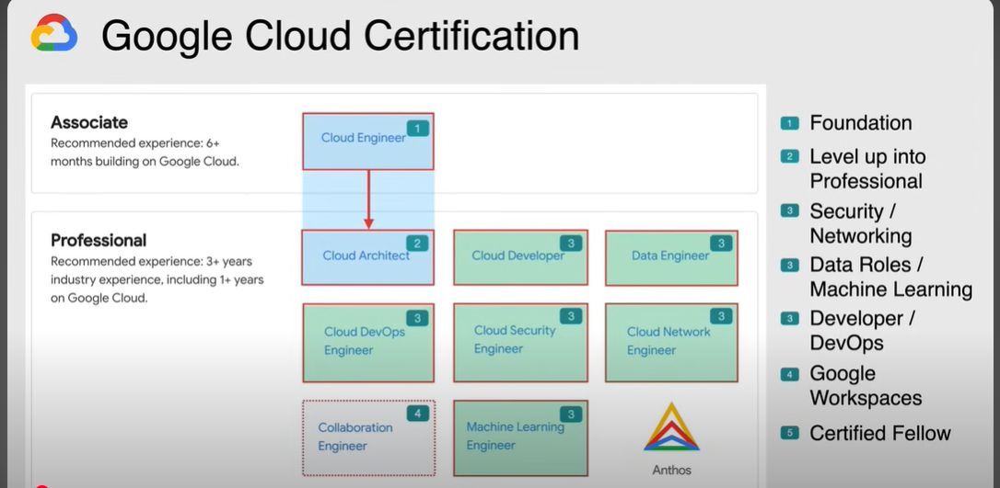
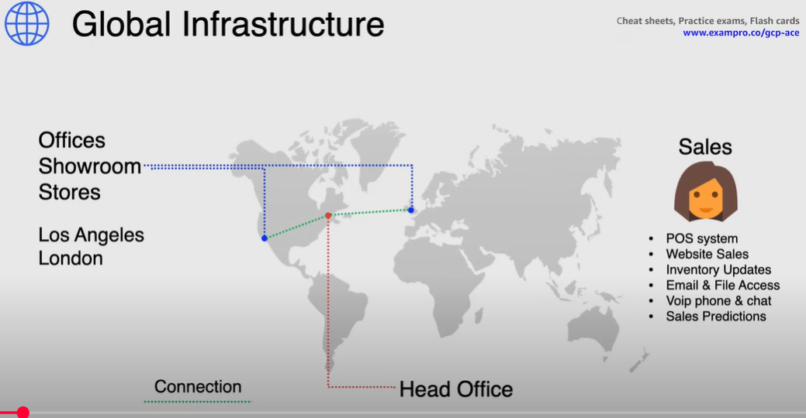

# Section 1 - Introduction
# Google Cloud Associate Cloud Engineer Course - Pass the Exam!

## Associate Cloud Engineer
An Associate Cloud Engineer deploys and secures applications, services, and infrastructure, monitors operations of multiple projects, and maintains enterprise solutions to ensure that they meet target performance metrics. This individual has experience working with public clouds or on-premises solutions. They are able to perform common platform-based tasks to maintain and scale one or more deployed solutions that leverage Google-managed or self-managed services on Google Cloud.

The Associate Cloud Engineer exam assesses your ability to:  
* Set up a cloud solution environment
* Plan and implement a cloud solution
* Ensure successful operation of a cloud solution
* Configure access and security



* Link - https://cloud.google.com/learn/certification/cloud-engineer/


Example certificate - 



* Lecture contents
* Follow alongs
* ChetSheets - On the day of the exam
* Put it on the resume - Get that cloud job or promotion

## View Exam Guide - 
https://services.google.com/fh/files/misc/associate_cloud_engineer_exam_guide_english.pdf

## Meet Your Instructor
* Antoni Tzavelas
* 18 years of industry experience
* 7 years specializing in cloud
* 4 years as a cloud trainer
* Previously cloud and DevOps Engineer
* Published multiple free cloud courses
* Like Looney Toons and Coffee

## Exam Pro
* Buy extra study material - **www.exampro.co/gcp-ace**
  * for the certification
  * study notes, flash cards, quiz, downloadable cheat Sheets
  * Sign up and 
  * Get learning support
  * Twitter - @antoniscloud
  * Share with me - When you've passed your exam, What course you'd like to see next.

## Introduction
### Course Resources
* Study notes
* Lesson files
* Scripts
* resources used in demo lessons
* **GitHub Repository** - https://github.com/antonitz/google-cloud-associate-cloud-engineer

`cement the knowledge learned`

## Google Cloud Certification
1. **Associate** - Cloud Engineer(Starting point - Foundation) - This is the stepping stone for other professional course.This certification will cover the general knowledge that is needed to know about starting on Google cloud and the services within it.
   1. Exam is 2 hours long and cost is $125
   2. 50 Questions and Multiple choice questions and multiple answers questions.
   3. Recommended experience **6+ months** building on Google cloud

> I truly believe that anyone with even a basic skill level in IT should be able ot achieve this associate level certification. Now it is recommended from Google themselves that prior to taking this exam that you should have over 6 months experience building on Google

2. Professional
   1. Cloud Architect(after associate certificate)
      1. 200$ cost
      2. Google recommend 3+ years industry experience
      3. It's definitely not a walk in the park and wll take some good concentration and detailed knowledge on Google cloud to solidy the pass
   2. After above take according to your interest
      1. Security/Networking
      2. Data Roles/Machine Learning
      3. Developer/DevOps
   3. Collaboration Engineer
      1. Google Workspaces
   4. Anthos - Certified Fellow(Most harder)

## Why Certify?
* Milestone for **learning**
  * Targeting yourself for a certification gives you a milestone for learing something new.
* Keeping your **skills up to date**
* Help advance your **career**(due to certification in the interview)
* Achieve a **higher market value**
* Self **Motivation** - When you Continue learning you continue to continue grow. So in short, Google Cloud Certifications are a great way to grow.




## Scenario - Bowtie Inc.
> Inc. stands for "Incorporated".It means the business has been legally registered as a corporation under the law of a particular state or country. Incorporation gives the company its own legal identity, separate from its owners.


* Fictitious Org called Bowtie
* So that theory and practical examples are easy to understand.  
* Bowtie Inc is a Bowtie manufacturing comapnay that designs and manufactures bow ties within their own factoreis
* They mainly deal with commerce, security and big data sets
* **Global company,** headquartered in Montreal, Canada
* ~300 employees globally with 100 in **Sales**
* In-store staff, IT, marketing, manufacturing, finance, ...
* Sales people, managers, sewers, etc...
* **Offices/stores** in **Montreal, London, Los Angeles**
* 2 racks in each **on-premises** location
* **Global inventory** updated upon sales and new stock
* **POS systems** in each store/office location
* All office/store infrasturucture connected and backed up to tape in Montreal HQ
* Management is extremely **thrifty**(spends when it makes sense) but have finally come to terms with spending money



## Global Infrastructure

* The **head office** is located in Montreal, Canada (the * main database for the CRM and POS systems). It has its main database for the CRM and point of sale systems as well as holding the responsibility of housing the equipment for the tape backups. the tapes are then takne off site within Montreal by a 3rd party company for storage.
* The company has **two major offices** one in **London** covering the EU and the other in the West Coast US specifically **Los Angeles**
* These Major offices are also retail locations that consume IT services from the headquarters in Montreal.
* Again being in the **Fashion business** bowtie Inc. employees a large amount of sales people and the managers that support them.
* These Employees **operate** the **POS(point of sale) systems**, so are constantly looking to have the website sales and the inventory updated at all times.
* Each sales person has access to email and files for updated forecasts on various new bowtie designs
* Most sales people communicate over a Voice over IP phone and chat programs through their mobile phone
* The managers also manually look at inventory on what's been sold versus what's in stock to predict the sales for stores in upcoming weeks.
* This will give manufacturing a head start to making more bow ties for future sales.
* Now whatever implementations that we discuss throughout this course, we will need to support the day-to-day operations of the sales people and the managers.
* And because of the different time zones in play, the backend infrastructure needs to be available 24 hours a day , 7 days a week. And downtime will impact updated inventory for both online sales as well as store sales at any given time.
* Now let's talk about the current probles the business is facing.

## Current Issues
* Legacy **on-premises hardware** is out of warranty
* **Performance issues** from store to store - POS systems
* Lack of **HA and Scalability**
* Tape(Magnetic tape cartridges) **backups** are slow and offsite storage is costly
* **Outdated IT skills** -a lot of manual intervention
* Rush to open stores to **supply demand globally**

>> Now above are some realistic yet common scenarios that come up in rality for a lot of business. Throughout the course we will dive into how google cloud can help ease the pain of these current ongoing issues.

## Favourable Results
* **Reliable and stable connection** between stores
  * Between all the locations of the stores and offices - so that sales, inventory and point of sale systems are quick and up to date at all times.This will also allow all staff in these locations to work a lot more efficiently. With stable and reliable connection in place, bakups should be able to run smoothly and also eliminate the cost of offsite backup. Not to mention the manpower and infrastructure involved to get the job done while scaling up offices and stores due to increase in demand.
* **Fast** and **cost-effective** cloud backup
* Deploy into **new regions quickly** when required
  * The business should be able to deploy stores in new regions using pay as you go billing while also meeeting the requirements and regulations when it comes to GPDR and PCI. This would also give the business flexibility of having a disaster recovery strategy in place in case there was a failure of the main database in Montreal.
* Base infrastructure is **scalable and low cost**
  * Now as mentioned before, the business is extremely thrifty, especially when it comes to spend on IT infrastructure and so the goal is to have the cost as low as possible, yet having the flexibility of scaling up when needed, especially when new marketing campaigns are launched during high demand sales periods. This would also give bow tie inc. the flexibility of analyzing sales ahead of time, using real time analytics and catering to exactly what the customer is demanding. Thus making inventory a lot more accurate and reducing costs in manufacturing items that end up going on sale and costing the company money in the end.
* No manual intervention - **Automation**
  * Removing manual steps in a lot of the processes can reduce the amount of manpower needed to keep the infrastructure alive, and especially will reduce downtime when disaster arises. Putting automation in place will also reduce the amount of tedious tasks that all departments have on their plate so that they can focus on more important business needs.

>> Now above is a typical scenario that you will face as a cloud engineer and cloud architect. The key to this scenario is the fact that there are areas that are lacking in detail and areas that are fully comprehensible and this will trigger knowing when and where to ask relevant questions. Especially in your day to day role as an engineer. It will allow you to fill the gaps so that you're able to figure out what services you will need And what type of architecture to use. This is also extremely helpful when it comes to the exam as in the exam you will be faced with questions that pertain to real life scenarios that will test you in a similar manner. Knowing wat servies and archtecture to use based on the information given will alwways give you the keys to the door with the right answer. And lastly when it comes to demos, this scenario used throughtout the course will help put things in perspective as we will come to resolve a lot of these common issues. Real world scenarios can give you a better perspective on learning as it is tied to something that makes it easy to comprehend. And again Bow tie inc. is the scenrio that I will be using throughout the course to help you grasp these concepts.

## Preview of Practice Exam(!Imp)

* Note - you should generally not attempt the practice exam unless you have completed all the lecture content including the follow alongs.
* And so I always recommend to use the practice exam as a serious attempt and not just a way to get to the final exam at a faster pace. Taking your time with the course will allow you to really **prevail** through these practice exams and allow for a for **a way better pass rate** on the final exam. 
<!-- ------------------------------------------ -->

```txt
## Bowtie Inc.

#### ✅ Purpose:

The instructor is setting the stage for the course by explaining a **realistic company scenario** that will be used to:

* Demonstrate GCP architecture
* Explain cloud migration
* Design solutions based on business needs
* Link theory to practice

---

### 🏢 **About the Company: Bow Tie Inc.**

* A **global bow tie manufacturing company**
* Has **factories**, **retail stores**, and **wholesale channels**
* Offices in **Montreal (HQ)**, **London**, and **Los Angeles**
* Deals with **commerce, big data, and security**

---

### ⚙️ **Current Tech Challenges:**

* Their IT infrastructure is **outdated** and **underfunded**
* All their store systems are connected via **VPN**
* **Inventory updates** depend on **point-of-sale (POS) systems**
* **Backups are done on tape** at HQ and stored offsite
* There's **technical debt** and poor scalability

---

### 🧠 **Why Is This Scenario Important?**

Throughout the course, this Bow Tie Inc. setup will:

* Be the **basis for cloud migration discussions**
* Help you design GCP architecture to solve **real business problems**
* Simulate challenges like **availability, data syncing, security**, etc.

---

### 🔄 What You'll Likely Do in the Course:

* Migrate Bow Tie Inc.'s infrastructure to GCP
* Use **GCP services like Compute Engine, Cloud Storage, BigQuery**
* Build **resilient, scalable, and global systems**
* Improve backup, security, and real-time inventory updates
```


