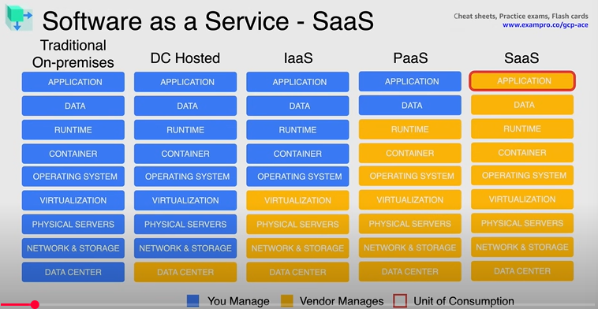

# Section 2 - ☁️ Cloud Computing Fundamentals
# What is Cloud Computing
Noun - 
The delivery of a shared pool of on-demand computing services over the public internet, that can be rapidly provisioned and released with minimal management effort or service provider interaction.

## The 5 Characteristics of Cloud

* **On-demand Self Service** - Provision resources automatically without requiring human interaction
* **Broad Network Access** - Available over the network
* **Resource Pooling** - Pooled resources to support a multi-tenant model allowing multiple customers to share the same applications or the same physical infrastructure
* **Rapid Elasticity** - Rapidly provision and de-provision any of the cloud computing resources
* **Measured Service** - Resource usage can be monitored, controlled and reported using metering capabilities

## Benefits of Cloud
1. Agility - Flexibility for provisioning resources, Innovate faster
2. Cost - Pay as you go, Trade capital expenditure for variable expense
3. Speed - Resources on demand, Scriptable infrastructure
4. Global - Global data centres, Disaster recovery becomes easier, High availability
5. Security - Always up-to-date, Physical security, Encryption at rest and in transit, Compliance

## Cloud Deployment Models
* **Public Cloud** - 1 public cloud
* **Multi-Cloud** - 2 or more public clouds
* **Private Cloud** - on-premise cloud
* **Hybrid Cloud** - private cloud + public cloud
* **Hybrid Environment** - on-premise data center + public cloud

## Cloud Service Models and Concepts
Referred as XaaS - Anything as a Service

## 🔧 What Are Cloud Service Models?

Cloud service models define **how services are delivered** over the internet by cloud providers like AWS, Azure, GCP, etc. They describe the **level of control, responsibility, and flexibility** a user has.

There are **3 main cloud service models**:

---

## 1. **IaaS (Infrastructure as a Service)**

### 🔍 What it means:

You rent **basic IT infrastructure** – servers, storage, and networking – from a cloud provider. You manage the OS, apps, and runtime.

### 🏗️ You Manage:

* OS (Linux/Windows)
* Applications
* Middleware
* Runtime

### ☁️ Provider Manages:

* Virtualization
* Servers
* Storage
* Network

### ✅ Use Case:

* Hosting virtual machines
* Storage and backups
* Network configuration

### 🛠 Examples:

* **Amazon EC2**
* **Microsoft Azure Virtual Machines**
* **Google Compute Engine**

---

## 2. **PaaS (Platform as a Service)**

### 🔍 What it means:

You rent a **ready-made platform** to develop, run, and manage applications. No need to handle infrastructure.

### 🏗️ You Manage:

* Applications
* Data

### ☁️ Provider Manages:

* Runtime
* OS
* Middleware
* Servers
* Networking
* Storage

### ✅ Use Case:

* Rapid application development
* Deploying apps without managing servers

### 🛠 Examples:

* **Google App Engine**
* **Heroku**
* **Azure App Services**

---

## 3. **SaaS (Software as a Service)**

### 🔍 What it means:

You use **ready-made software** over the internet. You don’t worry about how it’s built or maintained.

### 🏗️ You Manage:

* Nothing (just use it)

### ☁️ Provider Manages:

* Everything (app, runtime, OS, infrastructure)

### ✅ Use Case:

* Email, CRM, collaboration tools

### 🛠 Examples:

* **Gmail**
* **Dropbox**
* **Salesforce**
* **Microsoft 365**

---

## 🔁 Comparison Summary Table:

| Feature            | IaaS         | PaaS            | SaaS              |
| ------------------ | ------------ | --------------- | ----------------- |
| Who manages infra? | You          | Provider        | Provider          |
| Customization      | High         | Medium          | Low               |
| Dev speed          | Slower       | Faster          | Fastest           |
| Use case           | Hosting, VMs | App development | Ready-to-use apps |

---

## 🧠 Real-Life Analogy:

**Pizza as a Service:**

| Service Model | Who does what?                                            |
| ------------- | --------------------------------------------------------- |
| IaaS          | You bring ingredients, cook at home (Cloud gives kitchen) |
| PaaS          | You bring toppings, Cloud gives dough, oven, chef         |
| SaaS          | You order a pizza (Cloud does everything)                 |

You're almost there, Rudreshwar! Here's a refined version of your analogy to better align with the actual **IaaS, PaaS, and SaaS** concepts:

---

### Pizza-as-a-Service Analogy:

* **IaaS** – *You pick up the raw ingredients or a pizza base and cook it at home.*
  → You manage most of the process, but basic infrastructure (kitchen = servers) is provided.

* **PaaS** – *You get a pre-made pizza base delivered and just add toppings & bake.*
  → The platform is ready; you focus on your application logic.

* **SaaS** – *You dine at a restaurant and eat a ready-made pizza.*
  → Everything is done for you — just consume the service.
