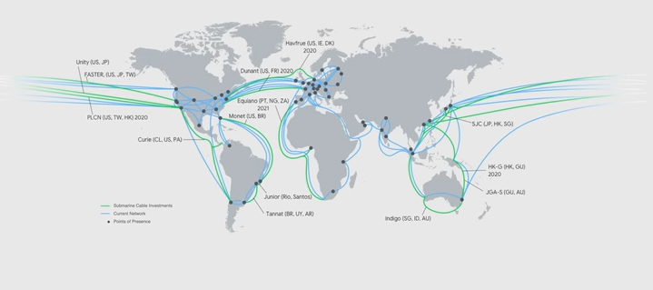
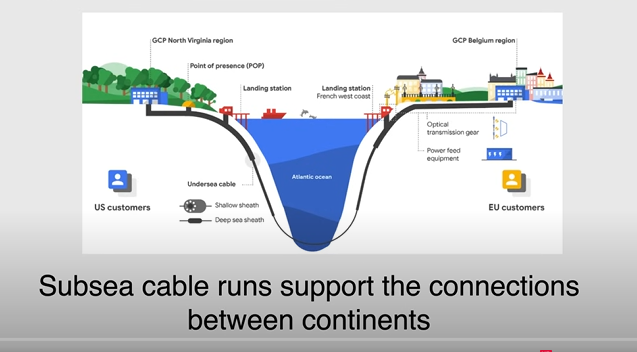
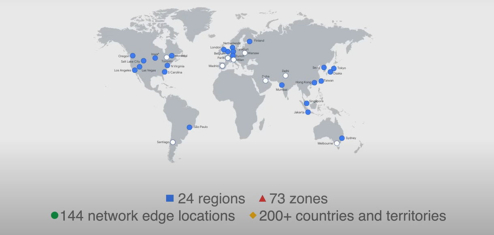
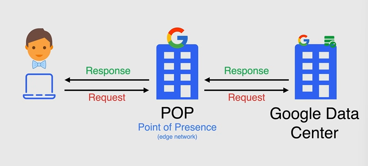
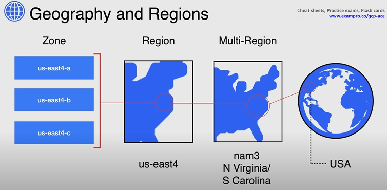
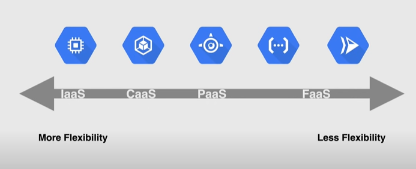

# Section 3 - Google Cloud Fundamentals(Overview)
Later we will dive deep into all of these

## 1. Google Cloud Global Infrastructure











* **Zone** - A zone is a **deployment area** for Google Cloud resources **within a region.** The smallest entity in Google's global infrastructure

A  single failure domain within a region Deploy closer to users for optimal latency

* **Region** - Regions are independent geographic areas that are **sub-divided into zones**

* **Multi-Region** - Multi-Regions are large geographic areas, that contains **two or more regions**

## 2. Compute Service Options



### Compute Engine
* Virtual Machines (VMs) called instances, Choose region and zone to deploy , You decide the operating system and the software you decide to put on it
* Use public or private images to create instances
* Pre-configured images and software packages available in Google Cloud Marketplace
* Manage multiple instances using instance groups
* Add/remove capacity using autoscaling with instance groups
* Attach/detach disks as needed
* Can be used with Google Cloud Storage
* Use SSH to connect directly
* Considered to be IaaS

### Google Kubernetes Engine(GKE)
* Container-orchestration system for automating deploying, scaling, and managing containers
* Built on open-source Kubernetes
* Flexibility to integrate with on-premise Kubernetes
* Uses Compute Engine instances as nodes in a cluster.
* A cluster is a group of nodes or Compute Engine instances
* Considered Container as a Service (CaaS)

```txt
1. Think of GKE as an automated factory manager for running many small machines (apps). You tell it what each machine needs — like how much power, how many workers — and it takes care of organizing and running them without you needing to do it all by hand. It's built by Google to make running big software systems easier.

2. Google Kubernetes Engine (GKE) is a managed Kubernetes service by Google Cloud. It abstracts the complexity of manually setting up a Kubernetes cluster by handling provisioning, scaling, upgrading, and securing the underlying infrastructure. You deploy containers, and GKE schedules, scales, and manages them for you — including networking, storage, and monitoring integration.
```

### App Engine
* Fully managed, serverless platform for developing and hosting web applications at scale (PaaS)
* Provisions servers and scales your app instances based on demand
* Build your app in Go, Java, .NET, Node.js, PHP, Python, or Ruby
* Connect with other Google services seamlessly
* Integrates with Web Security Scanner to identify threats

### Cloud Functions
* Serverless execution environment for building and connecting cloud services
* Simple, single-purpose functions that are attached to events
* Triggered when an event being watched is fired
* Your code executes in a fully managed environment
* No need to provision any infrastructure
* Cloud Functions can be written using JavaScript, Python 3, Go, or Java runtimes
* **Use Cases** - 
  * Data processing or ETL operations(Video trancoding)
  * Webhooks to respond to HTTP triggers
  * APIs that compose loosely coupled logic
  * Mobile backend functions
  * FaaS - Function as a service

### Cloud Run
* Fully managed compute platform for deploying and scaling containerized applications quickly and securely
* Built upon an open standard Knative
* Abstracts away all infrastructure management
* Known as serverless for containers
* Any language, any library, any binary
* Considered Function as a service(FaaS)

## 3. Storage & Databases

### Cloud Storage
* Consistent, scalable, large-capacity, highly durable object storage
* 11 9’s Durability (99.999999999%)
* Unlimited storage with no minimum object size
* Use Cloud Storage for content delivery, data lakes, and backup
* Available in different storage classes and availability
* Storage Classes
  * Standard
    * Maximum availability and no limitations
  * Nearline
    * Low-cost archival storage
    * Accessed <1/quarter
  * Coldline
    * Even lower-cost archival storage
    * Accessed <1/quarter
  * Archive
    * Lowest-cost archival storage
    * Accessed <1/year
* Region 
  * Single Region
  * Dual Region
    * Pair of regions
  * Multi Region
    * Large geographic area

### Filestore
* Fully managed NFS file server
* NFSv3 compliant
* Store data from running applications
* Use with VM instances and Kubernetes clusters

### Persistent Disks
* Durable **block storage** for instances
* Standard – Regular standard storage at a reasonable price
* Solid State (SSD) - Lower latency/higher IOPS

### Database Options

1. SQL/Relational
   1. Cloud SQL
      1. Fully Managed database service
      2. PostgreSQL, MySQL, and SQL Server
      3. High availability across zones
   2. Cloud Spanner
      1. Scalable relational database service
      2. Support transactions, strong consistency and synchronous replication
      3. High availability across regions and globally

2. NoSQL
   1. Bigtable
      1. Fully managed, scalable NoSQL database
      2. High throughput with low latency
      3. Cluster resizing without downtime
   2. Datastore
      1. Fast, fully managed, serverless, NoSQL document database
      2. For mobile, web and IoT apps
      3. Multi-region replication
      4. ACID transactions
   3. Firestore
      1. NoSQL, realtime database
      2. Optimized for offline use
      3. Cluster resizing without downtime
   4. Memorystore
      1. Highly available in-memory service for Redis and Memcached
      2. Fully Managed
   

### Networking Services
1. VPC (Virtual Private Cloud)
   1. Virtualized network within Google Cloud
   2. Core networking service
   3. Global resource
   4. Each VPC contains a default network
   5. Additional networks can be created in your project, but networks cannot be shared between projects.

2. Firewalls and Routes
   1. Firewall Rules
      1. Govern traffic coming into instances on a network
      2. Default network has a default set of firewall rules
      3. custom rules can be created
   2. Routes
      1. Advanced networking functions for your instances
      2. Specifies how packets leaving an instance should be directed

### Load Balancing
Distributing Workloads across multiple instances
1. HTTP(S) Load Balancing
   1. Distribute traffic across regions to ensure that requests are routed to the closest region or, in the event of a failure or over-capacity, to a healthy instance in the next closest region
   2. Distribute traffic based on content type
2. Network Load Balancing
   1. Distribute traffic among server instances in the same region based on incoming IP protocol data, such as address, port, and protocol

### Cloud DNS
* Publish and maintain DNS records by using the same infrastructure that Google uses.
* Work with managed zones and DNS records through the CLI, API, or SDK
* Advanced Connectivity
  * Cloud VPN
    * Connect your existing network to your VPC through an IPsec connection
  * Direct Interconnect
    * Connect an existing network to your VPC using a highly available, low-latency, enterprise-grade connection
  * Direct Peering
    * Exchange internet traffic between your business network and Google at one of Google's broad-reaching edge network locations
  * Carrier Peering
    * Connect your infrastructure to Google's network edge through highly available, lower-latency connections by using service providers