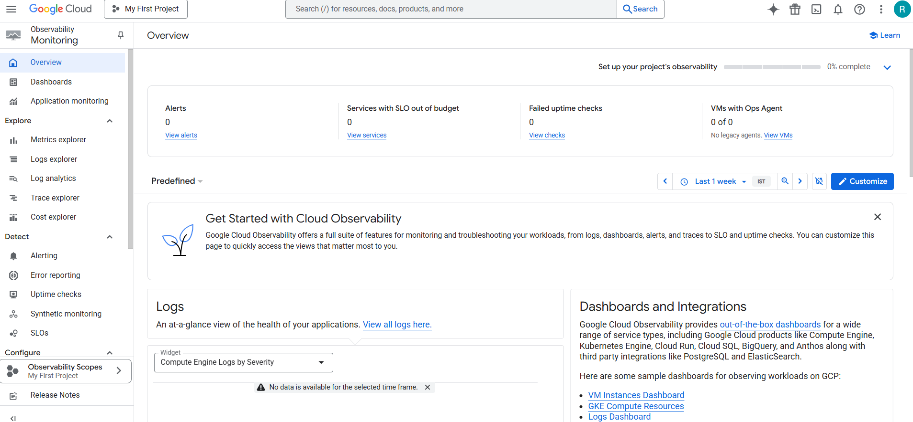
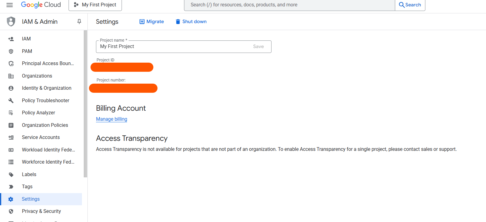
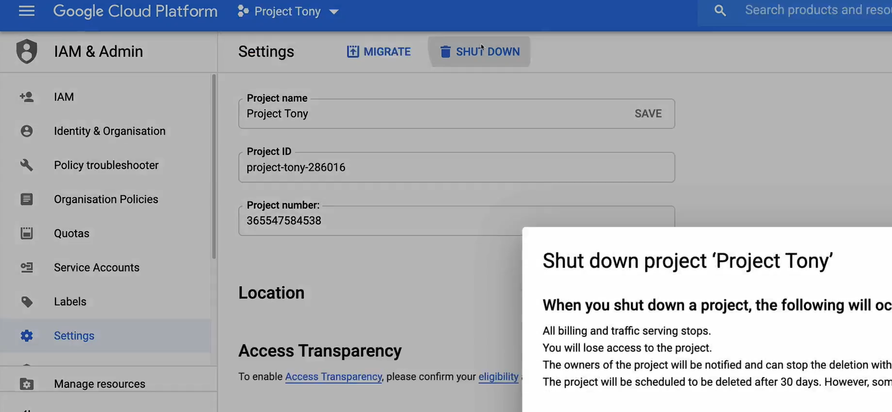
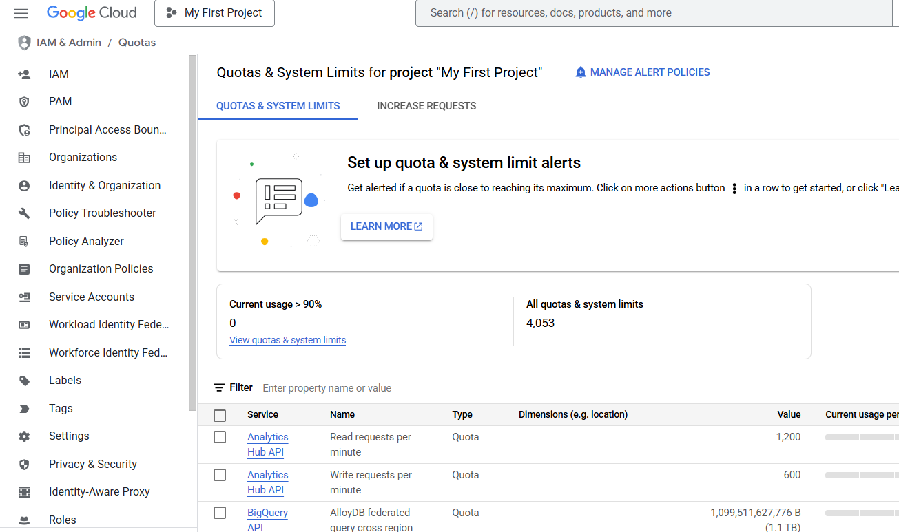

# Account Setup

## Resource Hierarchy

In Google Cloud Platform (GCP), the resource hierarchy helps organize and manage GCP resources (like VMs,   buckets, etc.) systematically, especially in large organizations. It allows setting permissions (IAM) and   policies at different levels.

1. Organization (optional, for large companies)  
   ↓
2. Folders (optional, used to group projects/departments)  
   ↓
3. Projects (mandatory, main container for resources)  
   ↓
4. Resources (e.g., Compute VMs, Cloud Storage, Cloud SQL, etc.)  

1. **Service-level resources**
   1. Compute Instance VM's
   2. Cloud Storage buckets
   3. Cloud SQL databases

2. **Account-level resources**
   1. Organization
   2. Folders
   3. Projects

* Configure and grant access to the various resources
* Resource Hierarchy Structure


* Resources are organized hierarchically using a parent/child relationship


* Designed to map organizational structure to Google Cloud
* Better management of permissions and access control
* Policies controlled by **IAM**
* **Access control policies** and **configuration settings** on a parent resource are inherited by the child
* Each child object has exactly **one parent.**
* **Labels** - Categorize resources


## Create Free Tier Account


Link - https://console.cloud.google.com/freetrial


## Securing Your Account 

* Security Key, Google Authenticator, Text, voice, Google prompt by 2 step verification
* Username + passwod + 2 Step verification
* Demo

**Two-Factor Authentication (2FA)** is a security method that requires **two different types of verification** to confirm your identity when logging into an account or system. The goal is to make it harder for someone to gain unauthorized access—even if they know your password.

### The Two Factors Typically Include:

1. **Something You Know** – like your password or PIN.
2. **Something You Have** – like a phone, authenticator app, or hardware token.

---

### 🔐 Example:

When you log in to your email:

1. You enter your **password** (something you know).
2. Then, you're asked to enter a **code sent to your phone** or generated by an app like Google Authenticator (something you have).

---

### ✅ Common 2FA Methods:

* SMS code sent to your phone
* App-generated code (e.g., Google Authenticator, Microsoft Authenticator)
* Email verification code
* Biometric (like fingerprint or face ID, sometimes considered a third factor)

---

### 🚀 Why Use 2FA?

Even if a hacker steals your password, they **can’t access your account without the second factor**, making it a simple but powerful way to secure your online identity.

## GCP Console Overview
The GCP Console (https://console.cloud.google.com) is a web-based graphical user interface provided by Google to manage cloud resources and services. It allows users to create, configure, monitor, and manage everything from virtual machines and databases to AI models and billing.

* Components
  * Dashboard
  * Services
    * Compute
    * Resource Management
  * Search bar - Use to find any services e.g. sql
  * Google cloud logo
  * Select a project
   
  * Preferences
  * Notifications
  * IAM & Admin
  * Billing
  * APIs & Services
  * Cloud Shell & Cloud Editor 

## Cloud Billing


* Defines **who pays** for a given set of Google Cloud resources
* Tracks all **costs incurred** by Google Cloud usage
* Linked to a **Payments profile**
* Can be **linked to one or more projects**
* Billing specific **roles and permissions** to control access.
* **Self-service**(online) or **Invoiced** (offline) payments available
* **Sub-accounts** can be used for resellers
* Billing account can **pay for projects** in a **different organization**
* Projects that are **not linked** to a cloud billing account **cannot use paid Google Cloud services**

```txt
creating, editing and closing a new billing account
Linking and Unlinking a project - to and from a different billing account

```

### Payments Profile
* **Processes payments** for all Google services
* **Stores** all **payments methods**
* Single pane of glass for **viewing invoices** and **payment history**
* **Controls who can** view and receive invoices
* **Individual** or **Business** profile types - **cannot be changed**
  * Business profile gives more flexibility
  * Once a profile type is selected, it cannot be changed afterwards

* Create a new billing account, edit that billing account, close a billing account


Question - What are the different functions of roles present in billing 


* Navigate to hamburger menu >> billing >> scroll down to bottom of sidebar >> account management
  * First unlink the project and then close the billing account
* Google also gives option for reopen the billing account if you accidently close it.


## Controlling, Cost Management and Budget Alerts
1. **Committed Use Discounts(CUD's)**
   1. **Discounted prices** when you commit to using a **minimum level of resource for a specified term**
   2. **1 or 3** year Commitment

2. **Commitment Types** - 
   1. **Spend**-based
   2. **Resource**-based
   The commitment fee is **billed monthly**
3. **Spend-based commitment**
   1. **Discount** for a commitment to **spend a minimum amount for a service** (hours) in a particular **region**
   2. **25% discount** for 1 year – **52% discount** on a 3 year
   Available for 
      1. Cloud SQL database instances and 
      2. Google Cloud VMWare Engine
   3. Applies only to **CPU** and **memory usage**

4. **Resource-based commitment**
   1. **Discount** for commitment to **spend a minimum amount for Compute Engine resource** in a particular **region**.
   2. Available for vCPU, Memory, GPU and Local SSD
   3. **57% discount** for most resources
   4. **70% for memory-optimized** machine types
   5. For use **across Projects**

5. **Sustained-use discounts**
   1. **Automatic discounts** of running Compute Engine resources a significant portion of the billing month
   2. **Applies to VCPUs and memory** for most Compute Engine instance types
   3. Includes VM’s created by **GKE**
   4. **Does not apply** to App Engine flexible, Dataflow and E2 machine types

**GCP Pricing Calculator** - Quick estimate of what your usage will cost on Google Cloud


* It gives a pretty good idea of what the architecture will cost.

URL - https://cloud.google.com/products/calculator

### **Cloud Billing Budgets**  


* Enables you to **track your actual Google Cloud spend** against your planned spend
* Budget alert threshold rules that are used to **trigger email notifications** to help you stay informed about your spending
* Define the scope of the budget
  * Spend of billing account or more granular
* Budget amount can be set to a **specified total**, or based on **previous month's spend**
* **Alert emails** are sent to billing account admins and specific users when **costs exceed a percentage** of the budget
* Email recipients can be customized by using Cloud
Monitoring to specify other people to receive budget
alert emails

* Use Pub/Sub for programmatic notifications or to
automate cost management tasks


* Demo - for committed use discounts, budget alerts and editing budget alerts, adding automation to budget alerts

* Compute engine >> Committed use discounts


* Purchase a committed use discount


* Create a reservation


* Create a budget 


* Monitoring 



## Export billing data
* Navigation - Menu >> Billing >> Billing export
* Billing export enables **granular billing data** (such as
usage, cost details, and pricing data) to be **exported
automatically to BigQuery** for detailed analysis
* Not retroactive


* What is BigQuery dataset - It is where the billing data is going to be stored
* Billing export will work once BigQuery data transfer Service API is enabled 


## Cloud APIs
* Navigation - Menu >> APIs & Services
* Google Cloud Platform is pretty much run on the APIs whether it's in the console or the SDK
* API Library - 


* In order to use any service in Google cloud, we must enable the API 

## Adding an Admin User
* Super Admin account
  * Irrevocable admin permissions
  * Grant Organization Admin role(or any other role)
  * Recover accounts at the domain level

* Admin user account architecture


## Cloud SDK and CLI
* CLI guide - https://cloud.google.com/sdk/gcloud
* Set of **command line tools** that allow you to manage resources through the terminal
  * gcloud
  * gsutil
  * bq
  * kubectl

* A user account is a Google account that allows end-users to authenticate directly to your application. For most common use cases on a single machine, using a user account is best practice.

* A service account is a Google account associated with your GCP project and not a specific user. A service account can be used by providing a service account key to your application and is recommended to script Cloud SDK tools for use on multiple machines.

* **Gcloud Init** - Authorizes access and performs other common Cloud SDK setup steps.
* **gcloud auth login** - Authorize access for gcloud with Google user credentials
* **Gcloud config** - Allows you to configure accounts and projects
* **gcloud components** - Allow you to install, update and delete the components of the sdk

* Cloud SDK allows to do everything that the console can do, yet it has more options than the console.
  * Infrastructure as Code
  * Autocompletion
  * Powershell


* Installation
  * Guide - https://cloud.google.com/sdk/docs/install-sdk#windows


Finish Installation - 
 


**Pick a project** - 


* After authentication is completed


## Managing the Cloud SDK

### Commands
1. `gauth cloud list` - 


2. gcloud config set account `ACCOUNT`

`gcloud config set account tonybowtieace@gmail.com`

3. `gcloud auth revoke`
4. `gcloud info`


5. `gcloud config list`


6. `gcloud config configurations activate default`


7. `gcloud config configurations describe default`


8. `gcloud config set compute/zone`

9. `gcloud components list`


10. `gcloud components install beta`
It will auto suggestion and information with commands. It can be used with any commands.


## Cloud Shell and Editor
* It is a browser based shell called cloud shell
* cloud shell is a virtual machine that is loaded with development tools and offers a persistent 5 gigabyte home directory
* cloud shell provides command line access to google cloud resources within the console.
* Cloud shell also comes with a built in code editor.
* Icon


* cloud shell provisions on e2 google compute engine instance running on a Debian based Linux operating system. 
* Cloud shell instances are provisioned on a per user per session basis.
* The instance persists while your cloud shell session is active and after an hour of inactivity the session terminates and the VM is discared.


* To know where Cloud shell is currently running

`curl metadata/computeMetadata/v1/instance/zone`


* Cloud shell has pre installed tools that come with it such as Cloud SDK, bash, Vim, Helm, Git, Docker
* * It support programming languages like - Java, Go, Python, Node, JS, Ruby and .Net


* Installing terraform using Cloud shell editor


* Cloud Shell Quota


## Creating and Managing Projects
* Navigation
  * Cloud Overview >> Dashboard
  * Edit



* Using Shell
  * `gcloud projects create catbowties2020`

* To view project list
  * `gcloud projects list`

* `gcloud projects describe catbowties2020`

* Shutdown a project



## Limits and Quotas
* Google cloud enforces quotas on resource usage for project owners, setting a hard limit on how much of a particular Google cloud resource your project can use.
* API request per day - Resets after specified time
* Allocation quota - Must be explicitly released
* Enforcement of Quotas
  * Protection
  * Resource Management
  * Countable
* Monitoring and alerting on Quotas
* Viewing your quota
  * using UI
  * using API

* Navigation to view quotas



* using API & Services

