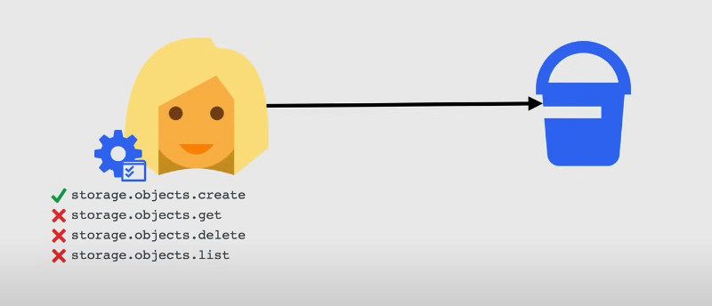
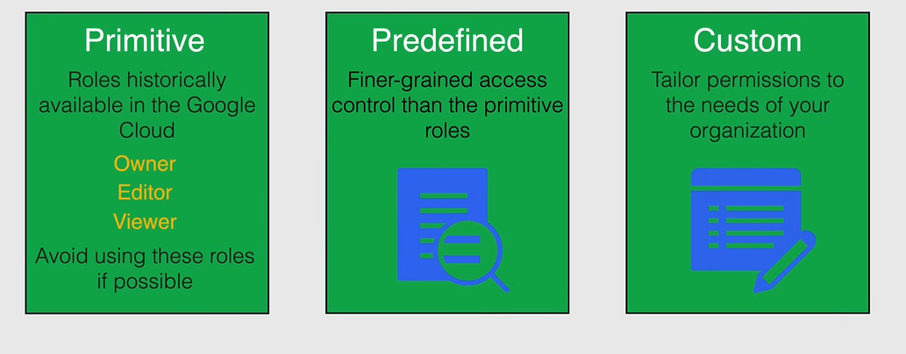

# Cloud IAM

## Principle of Least privilege
* A user, program, or process should have only the bare
minimum privileges necessary to perform its function

## Cloud Identity
**Cloud Identity** is an Identity as a Service (IDaaS) solution that centrally manages users and groups. This would be the sole system for authentication and that provides a single sign-on experience for all employees of an organization to be used for all your internal and external applications.

**Device management** - lets people in any organization access their work accounts from mobile devices while keeping the organization's data more secure.

**Security** - Helps by applying security best practices along with being able to deploy 2SV for the whole company along with enforcement controls and can also manage passwords to make sure they are meeting the enforced password requirements automatically.

**Single Sign-on** - With single sign-on (SSO), users can access many applications without having to enter their username and password for each application

**Reporting** - This covers audit logs for logins, groups, devices and even tokens. You are even able to export these logs to BigQuery for analysis. You can then create reports from these logs that cover security, applications and activity.

**Directory Management** - Provides profile information for users in your organization, email and group addresses, and shared external contacts in the Directory. Using Google Cloud Directory Sync (GCDS), you can synchronize the data in your Google Account with your Microsoft Active Directory or LDAP server. GCDS doesn't migrate any content (such as email messages, calendar events, or files) to your Google Account. You use GCDS to synchronize all your users, groups, and shared contacts to match the information in your LDAP server.

**Google Cloud Directory Sync** is a free Google-provided tool that implements the synchronization process and can be run either on Google Cloud or in your on-premises environment. Synchronization is one-way so that Active Directory remains the source of truth.

## Identity And Access Management(IAM)
### Policy Architecture

You manage access control by defining who (identity) has what access (role) for which resource. This also includes organizations, folders, and projects.

* A **policy** is a collection of bindings, audit configuration, and metadata.
  * A policy is attached to a resource and is used to enforce access control whenever that resource is accessed

* A **binding** specifies how access should be granted on resources. It binds one or more members with a single role and any context-specific conditions that change how and when the role is granted.

The **metadata** includes additional information about the policy, such as an etag and version to facilitate policy management.

The **AuditConfig** field specifies the configuration data for how access attempts should be audited.
### The Who

**Google Account** - Any email address that's associated with a Google Account, including gmail.com or other domains.

**Service Account** - An account for an application instead of an individual end user.

**Google Groups** - A named collection of Google Accounts and service accounts

**G Suite Domain** - Google Accounts that have been created in an organization's G Suite account

**Cloud Identity Domain** - Google Accounts in an organization that are not tied to any G Suite applications or features

**AllAuthenticatedUsers** - A special identifier that represents all service accounts and all users on the internet who have authenticated with a Google Account

**AllUsers** - A special identifier that represents anyone who is on the internet, including authenticated and unauthenticated users

### Roles -  
* This is a named **collection of permissions** that grant access to perform actions on Google Cloud resources.
* You **cannot grant** a permission to the user **directly**
* You **grant a role** to a user and a**ll the permissions that the role contains.**

**Permissions** - 
* Determines what **operations are allowed** on a resource
* Correspond one-to-one with **REST API** methods
* **Not granted** to users **directly**
* You grant roles which contain one or more permissions
* E.g., `compute.instances.list`

**Primitive** - Roles historically available in the Google Cloud
    * Owner
    * Editor
    * Viewer
    * Avoid using these roles if possible

**Predefined** - Finer-grained access control than the primitive roles

**Custom** - Tailor permissions to the needs of your organization

* Launch Stages
  * alpha - in testing
  * beta - tested and awaiting approval
  * ga - generally available 
### Conditions - 
* Further constraints binding
* Used to **define** and **enforce conditional, attribute-based access control** for Google Cloud resources.
* Conditions allow you to choose **granting resource access to identities only if configured conditions are met**
* When a condition exists, the access request is only granted if the condition expression = true

### Metadata
* etags - Concurrency control
* version - Specifies schema version

To help prevent a race condition when updating the policy, IAM supports concurrency control through the use of an etag field in the policy

### Audit Config
* Used to configure audit logging
* Determines which permission types are logged, and what identities, if any, are exempted from logging

* Resource Hierarchy

## Policies and Conditions

### Policy Statement

* Using cloud shell

* Commands
  * `gcloud projects get-iam-policy <project-id>`
  * `gcloud resource-manager folders get-iam-policy <folder-id>`
  * `gcloud organizations get-iam-policy <organization-id>`

### Policy versions

**Policy Limitations**  

1 policy per resource (including organizations, folders, projects)  
1500 members or 250 Google groups per policy  
Up to 7 minutes for policy changes to fully propagate across GCP  
Limit of 100 conditional role bindings per policy
Conditions - Condition attributes are either based on resource or based on details about the request (timestamp, originating/destination IP address)  

**Condition Limitations**

Limited to specific services  
Primitive roles are unsupported  
Members cannot be allUsers or allAuthenticatedUsers  
Limit of 100 conditional role bindings per policy  
20 role bindings for same role and same member  

**AuditConfig Logs**  

Specifies the audit configuration for a service. The configuration determines which permission types are logged, and what identities, if any, are exempted from logging. An AuditConfig must have one or more AuditLogConfigs.

## ✅ **Cloud IAM Best Practices**

### 🔒 1. **Principle of Least Privilege (PoLP)**

* **Grant only the minimum permissions** required to perform a task.
* Avoid using broad roles like `Editor` or `Owner` unless absolutely necessary.
* Instead, use **predefined roles** or create **custom roles** for precision.

---

### 🧑‍🤝‍🧑 2. **Use Groups Instead of Individuals**

* Assign IAM roles to **Google Groups** (e.g., `devs@yourdomain.com`) instead of individual users.
* Easier to manage permissions as people join/leave the team.

---

### 🧱 3. **Use Folders and Projects for Structure**

* Organize resources into **folders and projects**.
* Apply IAM policies at folder or organization level when roles apply broadly.
* Projects can inherit permissions from folders and the organization.

---

### 🧪 4. **Audit Permissions Regularly**

* Use **Cloud Asset Inventory** or **Policy Analyzer** to view who has access to what.
* Review and **remove unused roles or accounts**.
* Use the **Recommender** service to get IAM role reduction suggestions.

---

### 🧑‍💻 5. **Avoid Granting Roles to All Users**

* Do **not use `allUsers` or `allAuthenticatedUsers`** unless your resource is truly public.
* For example, `Storage Object Viewer` to `allUsers` will expose a bucket to the internet.

---

### 🔐 6. **Enable Two-Factor Authentication (2FA)**

* Enforce **multi-factor authentication (MFA)** for all accounts, especially those with admin privileges.
* Use **Google Workspace or Identity Platform** policies for enforcement.

---

### 🧰 7. **Use Service Accounts Correctly**

* Give **each application/service a unique service account**.
* **Do not use user accounts** for automation.
* Apply minimal permissions to service accounts and **use Workload Identity Federation** if you want to avoid long-lived keys.

---

### 🧾 8. **Enable and Monitor Audit Logs**

* Enable **Cloud Audit Logs** (Admin Activity logs are always on).
* Monitor logs for **suspicious activity**, such as unexpected permission grants or denied requests.

---

### 📦 9. **Use Custom Roles Carefully**

* Use **predefined roles** when possible — they're well-tested.
* Create **custom roles** if you need a precise set of permissions not available in predefined roles.
* Keep custom roles documented and version-controlled.

---

### 🚨 10. **Set Up Alerts for Critical Changes**

* Use **Cloud Monitoring and Logging** to:

  * Alert on changes to IAM policies
  * Alert on use of high-risk permissions (like `resourcemanager.projects.delete`)

---

## **Use Organization Policy Constraints**

* Use **Org Policies** to:

  * Restrict where resources can be created (e.g., specific regions)
  * Enforce SSL
  * Prevent external service account keys

