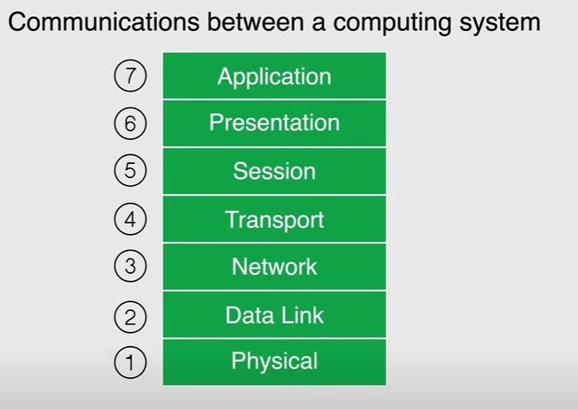

# Networking Services
## Networking Refresher PART 1
### Internet Protocol - IP
Internet Protocol (IP) is like the postal system of the internet.

It’s a set of rules that define **how data is packaged, addressed, transmitted, and received** across networks so computers, phones, and other devices can talk to each other.

Here’s the breakdown:

* **Purpose** – It assigns each device a unique address (called an IP address) so data knows exactly where to go.
* **Data Packaging** – Before sending, IP breaks information into chunks called *packets*.
* **Addressing** – Each packet carries a *source address* (where it came from) and a *destination address* (where it’s going).
* **Delivery** – IP does its best to deliver packets, but it doesn’t guarantee arrival or order—that’s why it’s often paired with **TCP** (Transmission Control Protocol) for reliability.

Two main versions exist:

* **IPv4** – older, uses 32-bit addresses (like `192.168.1.1`).
* **IPv6** – newer, uses 128-bit addresses (like `2001:0db8:85a3:0000:0000:8a2e:0370:7334`), made to handle the internet’s massive growth.

In short: **IP = Internet’s addressing and delivery system**—without it, devices wouldn’t know where to send or get information.

### Open Systems Interconnection Model (OSI)


The **OSI Model** (Open Systems Interconnection Model) is like a **seven-layer map** that explains how data travels from one device to another in a network.

It’s a **conceptual framework** created by the ISO (International Organization for Standardization) to make sure everyone—engineers, developers, and hardware makers—speaks the same “networking language.”

---

### **The 7 Layers of the OSI Model (Top to Bottom)**

💡 Think of it like sending a letter, where each layer has its own job.

| **Layer** | **Name**         | **Main Job**                                        | **Example**                              |
| --------- | ---------------- | --------------------------------------------------- | ---------------------------------------- |
| 7         | **Application**  | Directly interacts with user applications           | Web browsers, email apps, HTTP, FTP      |
| 6         | **Presentation** | Formats and encrypts data for the Application layer | Data compression, SSL/TLS encryption     |
| 5         | **Session**      | Starts, manages, and ends communication sessions    | Login sessions, API connections          |
| 4         | **Transport**    | Breaks data into segments, ensures delivery         | TCP (reliable), UDP (fast)               |
| 3         | **Network**      | Decides the path for data and addresses it          | IP addresses, routing                    |
| 2         | **Data Link**    | Sends data between devices on the same network      | MAC addresses, Ethernet                  |
| 1         | **Physical**     | Deals with the actual hardware & signals            | Cables, Wi-Fi signals, electrical pulses |

---

### **How it works in real life**

When you load a website:

1. The **Application layer** is your browser asking for the page.
2. The **Presentation layer** formats the data (e.g., decrypting HTTPS).
3. The **Session layer** keeps your connection alive while you browse.
4. The **Transport layer** breaks the website data into small packets.
5. The **Network layer** figures out the best route to the server.
6. The **Data Link layer** delivers data between your device and the router.
7. The **Physical layer** is the actual wires or Wi-Fi radio waves carrying it.

---

📌 **Fun tip to remember the order**:
**A**ll **P**eople **S**eem **T**o **N**eed **D**ata **P**rocessing
(Application → Presentation → Session → Transport → Network → Data Link → Physical)


# 1. IPv4 Classful Addressing
**IPv4 Classful Addressing** is the **old way** of dividing IPv4 addresses into fixed blocks called **classes** so networks could be organized and routed easily.

It was used in the early days of the internet (before CIDR came in the 1990s) when IP addresses were assigned based purely on these classes.

---

## **1. IPv4 Address Basics**

* An IPv4 address is **32 bits** long (4 octets, e.g., `192.168.1.1`).
* It has two parts:

  * **Network ID** → Identifies the network.
  * **Host ID** → Identifies the device within that network.

---

## **2. The 5 Classes in Classful Addressing**

| **Class** | **First Octet Range** | **Default Subnet Mask** | **Networks Available**   | **Hosts per Network** | **Usage**               |
| --------- | --------------------- | ----------------------- | ------------------------ | --------------------- | ----------------------- |
| **A**     | `1 – 126`             | `255.0.0.0` (/8)        | 128 (0 and 127 reserved) | \~16 million          | Very large networks     |
| **B**     | `128 – 191`           | `255.255.0.0` (/16)     | 16,384                   | \~65,000              | Medium-sized networks   |
| **C**     | `192 – 223`           | `255.255.255.0` (/24)   | 2,097,152                | 254                   | Small networks          |
| **D**     | `224 – 239`           | N/A                     | N/A                      | N/A                   | Multicasting            |
| **E**     | `240 – 255`           | N/A                     | N/A                      | N/A                   | Experimental / research |

---

## **3. How Classful Addressing Worked**

Example:

* IP: `10.20.30.40`

  * First octet = `10` → Falls in Class A (range 1–126)
  * Subnet mask = `255.0.0.0` → First 8 bits are the **network** part, remaining 24 bits are **host** part.
  * Means: Network = `10.0.0.0`, Host ID = `20.30.40`.

---

## **4. Limitations**

* Wasted addresses (a Class A network gave you **millions** of host addresses, even if you only needed 10).
* Not flexible for subnetting.
* Led to **IPv4 exhaustion** faster.
* Replaced by **CIDR (Classless Inter-Domain Routing)** for efficient allocation.

---

💡 **Memory Tip**:

* Class A → *"All the big guys"*
* Class B → *"Business range"*
* Class C → *"Compact networks"*
* Class D → *"Distribute to many"* (multicast)
* Class E → *"Experimental"*

---

# 2. Private IP addresses

**Private IP addresses** are special IPv4 addresses reserved for use **inside** private networks (like your home Wi-Fi, office LAN, or internal company network) and **cannot be accessed directly from the public internet**.

They are used so multiple devices in a private network can communicate with each other without using up the limited pool of public IPv4 addresses.

---

## **Private IP Address Ranges (RFC 1918)**

| **Class** | **Private Range**               | **Subnet Mask**     | **Max Hosts** | **Typical Use**       |
| --------- | ------------------------------- | ------------------- | ------------- | --------------------- |
| Class A   | `10.0.0.0 – 10.255.255.255`     | 255.0.0.0 (/8)      | \~16 million  | Large enterprises     |
| Class B   | `172.16.0.0 – 172.31.255.255`   | 255.255.0.0 (/12)   | \~1 million   | Medium-sized networks |
| Class C   | `192.168.0.0 – 192.168.255.255` | 255.255.255.0 (/16) | \~65,000      | Home/Small office     |

---

## **Key Points**

* **Not routable on the internet** → Routers automatically block them from going outside.
* Devices with private IPs access the internet using **NAT** (Network Address Translation) via a public IP.
* Multiple private networks can reuse the **same IP ranges** without conflict (as long as they’re not directly connected).

---

## **Examples in Real Life**

* Your laptop at home might have `192.168.1.5`.
* Your phone on the same Wi-Fi might have `192.168.1.10`.
* Both use the router’s public IP (e.g., `203.0.113.45`) when browsing the internet.

---

💡 **Quick Difference**

* **Public IP** → Unique worldwide, used for internet communication.
* **Private IP** → Only works inside a private network.

# 3. Classless Inter-Domain Routing(CIDR)

## **What is CIDR?**

**CIDR** is a method of assigning IP addresses and routing traffic **without relying on fixed address classes (A, B, C)**.
It was introduced in 1993 to replace **classful addressing** and make IP address allocation **more flexible and efficient**.

---

### **Why CIDR Was Needed**

In **classful addressing**, the IP address ranges were fixed (e.g., Class A = `/8`, Class B = `/16`, Class C = `/24`), which wasted a lot of addresses.
Example: If you needed 300 addresses, you had to take a whole Class B (\~65,000 addresses) even though you needed just 300.

CIDR solved this by allowing **variable-length subnet masks (VLSM)**.

---

### **CIDR Notation**

CIDR uses the format:

```
IP_address / prefix_length
```

* **IP\_address** → The starting address of the network.
* **prefix\_length** → Number of bits used for the network part.

Example:

* `192.168.10.0/26` → First 26 bits are the network, last 6 bits are hosts.

  * Network size: 2⁶ = 64 total addresses (62 usable, 2 reserved for network & broadcast).

---

### **Benefits of CIDR**

1. **Efficient IP usage** → Allocate just the right number of addresses.
2. **Reduces routing table size** → Supports route aggregation (supernetting).
3. **Works with both IPv4 & IPv6**.
4. **Enables subnetting & supernetting**.

---

### **Example**

Old Classful:

* Needed 200 IPs → Forced to use a **Class C** with 254 usable IPs (wasting 54).

With CIDR:

* Use `192.168.1.0/24` for 254 IPs
  **OR** `192.168.1.0/25` for 126 IPs
  **OR** `192.168.1.0/26` for 62 IPs — pick exactly what you need.

---

💡 **In short**: CIDR = **flexible addressing + efficient routing**, replacing the rigid old system of Class A/B/C.


# Networking Refresher PART 2

# IP Version 6
**IPv6 (Internet Protocol version 6)** is the **newest version** of the Internet Protocol, created to replace IPv4 because the world was running out of IPv4 addresses.

---

## **1. Why IPv6 Was Created**

* **IPv4** has 32-bit addresses → about **4.3 billion unique addresses**.
* The internet exploded (phones, IoT devices, computers), and IPv4 couldn’t keep up.
* **IPv6** uses 128-bit addresses → about **340 undecillion addresses** (that’s 340 followed by 36 zeros!), meaning we won’t run out anytime soon.

---

## **2. IPv6 Address Format**

* Written in **8 groups** of **4 hexadecimal digits** (0–9, a–f), separated by colons `:`.
* Example:

  ```
  2001:0db8:85a3:0000:0000:8a2e:0370:7334
  ```
* Can be shortened by:

  * Removing leading zeros: `2001:db8:85a3:0:0:8a2e:370:7334`
  * Replacing consecutive zeros with `::` (only once in an address):
    `2001:db8:85a3::8a2e:370:7334`

---

## **3. Key Features of IPv6**

* **Huge address space** (128-bit vs 32-bit in IPv4).
* **No need for NAT** (Network Address Translation) in many cases—every device can have a unique public IP.
* **Simpler header** for faster processing.
* **Built-in security** → IPSec support is mandatory.
* **Auto-configuration** (devices can generate their own IP without a DHCP server).
* **Better multicast and anycast support** for efficient data delivery.
* **No broadcast** (reduces unnecessary network traffic).

---

## **4. IPv4 vs IPv6 Quick Comparison**

| Feature         | IPv4             | IPv6                     |
| --------------- | ---------------- | ------------------------ |
| Address Length  | 32 bits          | 128 bits                 |
| Address Example | 192.168.1.1      | 2001\:db8::1             |
| Total Addresses | \~4.3 billion    | \~340 undecillion        |
| Security        | Optional (IPSec) | Mandatory (IPSec)        |
| NAT Required?   | Often yes        | No (usually)             |
| Header Size     | Larger           | Smaller & more efficient |

---

💡 **In short**:
IPv6 is like moving from a small neighborhood (IPv4) to a whole galaxy of addresses—faster, more secure, and future-proof.

# Transport - TCP-UDP - IP Packets
# IP - TCP/UDP


**IP, TCP, and UDP** are different parts of the networking “stack” that work together to send and receive data over the internet.

---

## **1. IP (Internet Protocol) – The Addressing & Delivery System**

* **Job:** Finds the destination and delivers data packets.
* Works like the **postal service** — it puts the sender and receiver’s addresses on every package.
* Two versions: **IPv4** (older, 32-bit addresses) and **IPv6** (newer, 128-bit addresses).
* Doesn’t guarantee delivery or order — it just gets the packet *as far as possible*.

---

## **2. TCP (Transmission Control Protocol) – Reliable Delivery**

* Works **on top of IP** → together called **TCP/IP**.
* Ensures **reliable, ordered, and error-checked** delivery of data.
* Before sending, TCP sets up a **connection** (like a phone call) using a *3-way handshake*.
* If packets are lost, TCP resends them.
* Used when accuracy matters more than speed:

  * Web browsing (HTTP/HTTPS)
  * Email (SMTP, IMAP, POP3)
  * File transfers (FTP)

---

## **3. UDP (User Datagram Protocol) – Fast, No Guarantees**

* Also works **on top of IP**.
* Sends data **without establishing a connection** (fire-and-forget style).
* No error checking, no guarantee of delivery, no ordering — but **very fast**.
* Ideal for real-time applications where speed matters more than reliability:

  * Video streaming
  * Online gaming
  * Voice calls (VoIP)
  * DNS lookups

---

## **4. Summary Table**

| Feature          | **TCP**                     | **UDP**                 |
| ---------------- | --------------------------- | ----------------------- |
| Reliability      | Yes (retransmits lost data) | No                      |
| Connection       | Connection-oriented         | Connectionless          |
| Speed            | Slower                      | Faster                  |
| Order of Packets | Guaranteed                  | Not guaranteed          |
| Use Cases        | Web, email, file transfer   | Streaming, gaming, VoIP |

---

💡 **In short**:

* **IP** = Finds where to send the data.
* **TCP** = Makes sure it gets there correctly.
* **UDP** = Sends it quickly without checking.

# Application Layer

Protocol - HTTP - HTTPS - DHCP - DNS - SSH - Telnet

Alright — let’s go layer-by-layer and protocol-by-protocol.
All of these you mentioned work at the **Application Layer** of the OSI Model (Layer 7) or the **Application Layer** of the TCP/IP Model.

---

## **🌐 Application Layer Overview**

* **Role:** This is where user-facing network services live — the layer closest to the end user.
* **Function:** Provides network services directly to applications, handling things like file transfers, email, web browsing, and network management.
* **Data Unit:** Messages (before being broken into packets/segments).
* **Examples:** HTTP, HTTPS, DNS, DHCP, SSH, Telnet, FTP, SMTP.

---

## **📜 Common Application Layer Protocols You Asked About**

### **1. HTTP (HyperText Transfer Protocol)**

* **Purpose:** The foundation of data communication for the World Wide Web.
* **How it works:** A client (browser) sends an HTTP request to a server, and the server responds with the requested content (HTML, CSS, images, etc.).
* **Port:** 80 (default).
* **Security:** **Not secure** — data sent in plain text.
* **Use case:** Loading web pages, APIs.

---

### **2. HTTPS (HyperText Transfer Protocol Secure)**

* **Purpose:** Secure version of HTTP.
* **How it works:** Uses **SSL/TLS encryption** to protect data between client and server.
* **Port:** 443 (default).
* **Security:** Encrypts content, preventing eavesdropping and tampering.
* **Use case:** Secure websites, online banking, e-commerce.

---

### **3. DHCP (Dynamic Host Configuration Protocol)**

* **Purpose:** Automatically assigns IP addresses and other network configuration to devices.
* **How it works:** When a device joins a network, it broadcasts a request, and a DHCP server responds with an IP address, subnet mask, gateway, DNS, etc.
* **Port:** UDP 67 (server), UDP 68 (client).
* **Security:** Can be vulnerable to spoofing if not protected.
* **Use case:** Home and office networks where devices need IPs automatically.

---

### **4. DNS (Domain Name System)**

* **Purpose:** Translates human-friendly domain names (like `google.com`) into IP addresses (like `142.250.190.14`).
* **How it works:** Your computer queries a DNS server, which returns the corresponding IP address.
* **Port:** UDP 53 (primary), TCP 53 (for large responses/zone transfers).
* **Security:** Can be secured with DNSSEC to prevent tampering.
* **Use case:** Every time you visit a website or send an email.

---

### **5. SSH (Secure Shell)**

* **Purpose:** Securely access and manage remote devices/servers over a network.
* **How it works:** Encrypts commands and responses, allowing safe remote administration.
* **Port:** TCP 22.
* **Security:** Strong encryption (public/private key or password-based authentication).
* **Use case:** Logging into Linux servers, secure file transfers (SCP, SFTP).

---

### **6. Telnet**

* **Purpose:** Remote access to devices/servers.
* **How it works:** Sends commands in plain text to a remote machine and receives output.
* **Port:** TCP 23.
* **Security:** **Not secure** — data (including passwords) is unencrypted.
* **Use case:** Legacy network equipment management (mostly replaced by SSH).

---

## **📊 Summary Table**

| Protocol   | Purpose              | Port       | Security   | Typical Use         |
| ---------- | -------------------- | ---------- | ---------- | ------------------- |
| **HTTP**   | Transfer web content | 80         | None       | Websites, APIs      |
| **HTTPS**  | Secure web content   | 443        | SSL/TLS    | Secure websites     |
| **DHCP**   | Assign IP addresses  | UDP 67/68  | Low        | Auto network config |
| **DNS**    | Domain → IP lookup   | UDP/TCP 53 | Low/Medium | Website access      |
| **SSH**    | Secure remote login  | TCP 22     | High       | Server admin        |
| **Telnet** | Remote login         | TCP 23     | None       | Legacy admin        |

## Virtual Private Cloud - Follow Along
* **Virtualized network** within Google cloud
* A VPC is a **Global resource**
* Encapsulated **within a Project**
* VPC's **do not have any IP address ranges** associated with them
* **Firewall rules** control traffic flowing in and out of the VPC
* Resources within a VPC **can communicate with one
another** by using internal (private) IPv4 addresses
* Support **only for IPv4** addresses
* Each VPC contains a **default network**
* 2 Network types: **Auto Mode** or **Custom Mode**


In **Google Cloud**, a **Virtual Private Cloud (VPC)** is your own **private, isolated network** within Google’s cloud infrastructure where you can run and connect your resources securely.

Think of it like having your own **custom data center inside Google Cloud**, but entirely virtual.

---

## **Key Features**

1. **Private Networking**

   * Your VPC isolates your workloads from other customers in Google Cloud.
   * You can create your own **IP address ranges** (both internal & external).

2. **Global Scope**

   * A Google Cloud VPC is **global** — you can have resources in multiple regions using the same VPC.
   * No need to create separate networks for each region.

3. **Subnets**

   * You divide your VPC into **subnets** (each in a specific region).
   * Each subnet gets its own **IP range**.
   * Subnets can communicate privately using Google’s backbone network.

4. **Routing**

   * You can define custom **routes** to control how traffic moves within your VPC or to/from the internet.

5. **Firewall Rules**

   * Built-in **stateful firewalls** control inbound and outbound traffic at the instance or subnet level.

6. **Peering & VPN**

   * You can connect your VPC to:

     * Another VPC (VPC Peering)
     * On-premises network (Cloud VPN or Cloud Interconnect)

---

## **Use Cases**

* Hosting web apps in a secure private network.
* Hybrid cloud setups (connect your on-premises network to GCP).
* Multi-tier applications (frontend, backend, database) within private subnets.
* Big data or ML workloads with restricted internet access.

---

## **Example**

Imagine you’re running a web application:

* **Frontend servers** in one subnet (public IPs).
* **Database servers** in another subnet (private IPs, no internet access).
* Both subnets are in the same VPC but in different regions.
* You control traffic between them using **firewall rules**.

---

💡 **In short**:
A **VPC in Google Cloud** is your **custom, secure, and flexible virtual network** for running resources — with full control over IP ranges, routing, and access.


##  VPC Network Subnets
In **Google Cloud**, a **VPC Network** is your private, virtual network, and **subnets** are subdivisions of that network that organize and isolate resources.

Think of it like this:

* **VPC Network** = The entire building (your global private network).
* **Subnets** = Separate rooms inside the building (regional private networks).

---

## **1. VPC Network**

* **Global scope** in Google Cloud — one VPC can span multiple regions.
* Contains:

  * **Subnets** (regional)
  * **Routes**
  * **Firewall rules**
* Can connect to the internet, on-premises networks, or other VPCs.

---

## **2. Subnets**

* **Definition:** A subnet is a **range of IP addresses** within a VPC, assigned to a specific region.
* Each subnet belongs to exactly **one region** but can have resources (VMs, load balancers, etc.) in multiple zones of that region.
* You decide the **IP range** (CIDR block) when creating it — e.g., `10.0.0.0/24`.
* Subnets **do not overlap** within the same VPC.

---

## **3. Types of Subnets in Google Cloud**

1. **Auto mode**

   * Automatically creates one subnet per region.
   * Uses predefined IP ranges.
   * Easier for beginners but less flexible.

2. **Custom mode**

   * You manually create subnets and choose IP ranges.
   * Allows complex network architectures.
   * Preferred for production workloads.

---

## **4. How Subnets Work**

* Resources in the **same subnet** can communicate using private internal IPs.
* Resources in **different subnets** of the same VPC can still communicate unless blocked by firewall rules (because VPC networking is global in scope).
* Firewall rules apply at the VPC level but can be targeted to specific subnets.

---

## **5. Example**

**VPC Network:** `corp-network`

* **Subnet 1:** `frontend-subnet` in `us-central1` with `10.0.1.0/24` (web servers)
* **Subnet 2:** `backend-subnet` in `asia-southeast1` with `10.0.2.0/24` (databases)

Both subnets are in the same VPC, but they’re in different regions, with separate IP ranges.

---

💡 **In short:**

* **VPC Network** = The whole private network (global).
* **Subnets** = Regional IP ranges inside that network to organize and isolate resources.

## Firewall and Firewall Rules
A **firewall** is like a security guard for your network — it decides what traffic (data) is allowed in and out based on a set of rules you configure.

It’s used to **protect networks, devices, and applications** from unauthorized access, malware, and other threats by filtering network packets.

---

## **1. What is a Firewall?**

* **Definition:**
  A network security system (hardware, software, or both) that monitors and controls incoming and outgoing network traffic based on predetermined **security rules**.

* **Purpose:**

  * Block unwanted or harmful traffic.
  * Allow only approved communications.
  * Prevent hackers from exploiting vulnerabilities.

* **Types of Firewalls:**

  1. **Packet-Filtering Firewall** – checks packets based on IP, port, and protocol.
  2. **Stateful Inspection Firewall** – tracks active connections and context of traffic.
  3. **Proxy Firewall** – acts as an intermediary between user and internet.
  4. **Next-Gen Firewall (NGFW)** – includes deep packet inspection, intrusion prevention, application control.

---

## **2. What are Firewall Rules?**

* Firewall rules are **instructions** that tell the firewall what to do with certain network traffic.
* Each rule specifies **conditions** and an **action**.

---

### **Basic Components of a Firewall Rule**

1. **Source** – where the traffic is coming from (IP address or range).
2. **Destination** – where the traffic is going.
3. **Protocol** – type of communication (TCP, UDP, ICMP, etc.).
4. **Port** – network port number (e.g., 80 for HTTP, 443 for HTTPS).
5. **Action** – Allow, Deny, or Drop the packet.
6. **Direction** – Inbound (coming into your network) or Outbound (going out).

---

### **Example Firewall Rules**

| Rule # | Direction | Source IP    | Destination IP | Protocol | Port | Action |
| ------ | --------- | ------------ | -------------- | -------- | ---- | ------ |
| 1      | Inbound   | Any          | 192.168.1.10   | TCP      | 22   | Allow  |
| 2      | Outbound  | 192.168.1.10 | Any            | TCP      | 80   | Allow  |
| 3      | Inbound   | Any          | Any            | Any      | Any  | Deny   |

---

💡 **Example in Real Life:**

* Imagine your house as a network.
* The firewall is your gatekeeper.
* The **rules** are like:

  * Let friends in (allow specific IPs).
  * Don’t let strangers in (deny unknown IPs).
  * Allow pizza delivery (allow specific ports).
  * Block anyone carrying dangerous stuff (block malicious traffic).


## VPC Network peering
**VPC Network Peering** is a way to connect two **Virtual Private Cloud (VPC)** networks so they can communicate with each other **privately** using **internal IP addresses**, without sending traffic over the public internet.

Think of it like creating a **private bridge** between two separate neighborhoods so that residents can visit each other without going through a public highway.

---

## **Key Points**

* Works **within the same project** or **across different projects** (and even different organizations in some cases).
* Uses **Google’s internal backbone network** → low latency, high security.
* Traffic between peered VPCs **never goes through the public internet**.
* **One-to-one relationship** – each peering connection is between two VPCs.

---

## **When to Use VPC Peering**

* You have multiple projects/environments (e.g., *dev*, *test*, *prod*) and need them to talk to each other securely.
* Different teams manage their own VPCs but need shared access to resources.
* You want to avoid **VPN or public IP costs**.

---

## **How it Works**

1. You request peering from VPC **A** to VPC **B**.
2. The other side accepts the request.
3. Both networks update their **routes** to allow internal communication.
4. Now instances in VPC A can talk to instances in VPC B using **private IPs**.

---

## **Limitations**

* **No transitive peering**: If A is peered with B, and B is peered with C, **A cannot talk to C** unless A and C also peer directly.
* Overlapping IP ranges are **not allowed**.
* No centralized firewall rules – each VPC manages its own.

---

## **Example**

Let’s say:

* VPC **Prod**: 10.0.0.0/16
* VPC **Analytics**: 192.168.0.0/16

If you set up **VPC Peering**:

* A VM in **Prod** with IP `10.0.1.5` can directly connect to a VM in **Analytics** with IP `192.168.2.7` without using a public IP.

## DNS Fundamentals
DNS fundamentals are the **basics of the Domain Name System (DNS)**, which is like the “phonebook of the internet.” Instead of remembering long numerical IP addresses (like `142.250.183.14`), DNS lets us use human-friendly names (like `www.google.com`).

Here’s a breakdown of the key fundamentals:

---

### 🔑 **What is DNS?**

* DNS (Domain Name System) is a **distributed, hierarchical naming system** that maps domain names to IP addresses.
* Without DNS, we’d have to type in IP addresses to visit websites instead of names.

---

### ⚙️ **How DNS Works (Step by Step)**

1. **User enters a domain name** (e.g., `www.example.com`) in the browser.
2. **DNS Resolver (usually your ISP or Google DNS 8.8.8.8)** checks if it already knows the IP address (cache).
3. If not, it queries the DNS hierarchy:

   * **Root Server** → directs query to the right TLD (Top-Level Domain) server (`.com`, `.org`, `.net`, etc.).
   * **TLD Server** → directs query to the authoritative DNS server for that domain.
   * **Authoritative DNS Server** → responds with the correct IP address (e.g., `93.184.216.34`).
4. The resolver sends the IP back to the browser.
5. Browser connects to the website using the IP address.

---

### 🏗️ **DNS Components**

* **Domain Names** → Human-readable names (`example.com`).
* **IP Address** → Machine-readable address (IPv4: `192.0.2.1`, IPv6: `2001:db8::1`).
* **Resolvers** → Do the DNS lookups on behalf of clients.
* **Root Servers** → Top of the hierarchy, know where TLD servers are.
* **TLD Servers** → Manage `.com`, `.org`, `.in`, etc.
* **Authoritative Name Servers** → Contain actual domain records.

---

### 📂 **Common DNS Record Types**

* **A Record** → Maps domain name → IPv4 address.
* **AAAA Record** → Maps domain name → IPv6 address.
* **CNAME Record** → Alias (e.g., `mail.example.com` → `example.com`).
* **MX Record** → Mail exchange (email servers).
* **NS Record** → Nameservers for a domain.
* **TXT Record** → Misc. text info (often for security like SPF, DKIM).

---

### 🕒 **Caching**

* DNS responses are cached at multiple levels (browser, OS, ISP).
* **TTL (Time to Live)** determines how long a record is cached before it expires.

---

### 🔐 **Security**

* **DNS Spoofing/Cache Poisoning** → Attackers give false DNS info.
* **DNSSEC (DNS Security Extensions)** → Adds authentication and integrity to DNS responses.

---

✅ **In short**:
DNS is the backbone of the internet’s addressing system. It’s hierarchical, distributed, and designed to translate human-friendly names into machine-friendly IP addresses quickly and reliably.


