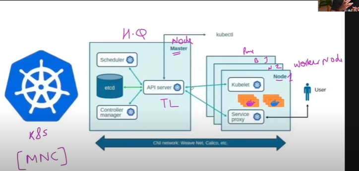

# Kubernetes

## Borg
* Websites crash हो जा रहा था ।
* तो 2014 में इन्होंने Borg शुरुवात किया
* Later rename kubernetes कर दिया

# Kubernetes
* ये एक orchestration tool है
* इसको K8S भी बोलते हैं
* Kubernetes use क्यों करते हैं ?
* पहले application monolithic होते हैं(Mono means single)
* e.g. D-Mart
* एक बड़े application को छोटे pieces में बना दिया
* Why to study kubernetes?
  * **Microservice** का प्रयोग अधिक हो रहा है
* CKA(Certified Kubernetes Administrator)

# Kubernetes Architecture


* **Node** = Server
  * 1 Node = 1 Server
  * Multi Node = Cluster
  * Master Node and Worker Node
  * Master Node - Ye worker node se kaam karwate hain
  * Worker node me docker ka container chal raha hota hai
* **Master node me kya hota hai?**
  * 1. **API Server** - API Server ka kaam kya hai? To communicate. It's a medium. If you want to talk to Kubernetes Cluster you need to talk through API server
  * 2. Requirement hai DevOps Engineer ki. Hire kaun karwata hai? HR
    * **Scheduler** - To schedule container or Pods.Aapke containers ko worker node par schedule karti hai
  * 3. 


## Scheduler
In **Kubernetes**, a **scheduler** is the control plane component responsible for deciding **which node a newly created pod should run on**.

👉 Think of it like this:

* You ask Kubernetes to create a **Pod** (your application container).
* That pod starts in a **"Pending"** state.
* The **Kube-scheduler** looks at all available nodes in the cluster and picks the most suitable one for your pod.
* Once scheduled, the **kubelet** on that node actually runs the pod.

---

### How does the scheduler decide?

It considers many factors:

1. **Resource requirements** (CPU, memory, etc.)
2. **Node constraints/affinity rules** (e.g., this pod should run only on nodes with GPUs).
3. **Taints and tolerations** (e.g., some nodes are reserved for special workloads).
4. **Pod affinity/anti-affinity** (e.g., keep pods together or spread them out).
5. **Load balancing** (distribute workloads across nodes fairly).

---

### Workflow in short:

1. User creates a Pod → Pod is "Pending".
2. Scheduler watches for "unscheduled" pods.
3. Scheduler picks the best node.
4. Pod gets bound to that node.
5. Kubelet on that node pulls the image and runs the container.

## Pod

### 🔹 Container (e.g., Docker container)

* Smallest unit of software packaging.
* Runs **one process/app** (e.g., Node.js app, MySQL DB).
* Self-contained with its own filesystem, libraries, and runtime.

Think of it like: **a single meal packed in a lunchbox**.

---

### 🔹 Pod

* A **wrapper around one or more containers**.
* Provides **shared network (same IP/port space)** and **shared storage (volumes)** to those containers.
* Containers inside a Pod are **always scheduled together** on the same Node.
* Usually → a Pod has **just one container** (most common case).
* Sometimes → a Pod has **multiple tightly-coupled containers** (like a main app + sidecar helper).

Think of it like: **a lunch tray** that can hold **one or multiple lunchboxes**, and all of them share the same table (network & storage).

---

### ✅ So:

* **Container** = the actual application.
* **Pod** = the Kubernetes unit that holds container(s).
* **Node** = the machine (VM/server) where Pods run.

---

📌 Example:

* You run a **Docker container** of Nginx → it’s just Nginx.
* You run an **Nginx Pod in Kubernetes** → it’s Nginx inside a Pod, managed by Kubernetes.
* If you need Nginx + a sidecar (say, a logging agent), **both containers go inside the same Pod**.


### ✅ Pod ≠ Docker Container

* A **Docker container** is just the application packaged with its dependencies.
* A **Pod** is a higher-level **Kubernetes abstraction** that manages **one or more containers together**, plus all the extra stuff they need to run smoothly inside a cluster.

---

### What extra things does a Pod have (beyond a container)?

1. **Networking** → Every Pod gets its own unique IP address in the cluster. All containers in that Pod share that IP.
2. **Storage** → Pods can define **volumes** (persistent or temporary) that containers share.
3. **Lifecycle & Restart Policies** → If a container inside a Pod crashes, Kubernetes can restart it.
4. **Metadata** → Labels, annotations, and configs so that other Kubernetes components (scheduler, controllers, services) can manage it.
5. **Multi-container support** → You can run a **main app container** + **sidecar containers** (for logging, proxy, monitoring) together.

---

### 🔹 So you can say:

👉 A **Pod is like a smart wrapper around one or more containers**, giving Kubernetes the power to schedule, network, scale, and manage them.

---

⚡ Quick analogy:

* **Docker container** = a single car 🚗
* **Pod** = a garage 🚘🏠 (can have one car, or a car + bike + tools) with electricity, address, and rules.
* **Node** = the whole parking lot (server) where many garages (pods) exist.

# etcd

### 🔹 What is **etcd**?

* **etcd** (pronounced *“et-cee-dee”*) is a **distributed key–value store**.
* It’s used by Kubernetes to store **all its cluster data**.
* Written in **Go**, it’s fast, reliable, and fault-tolerant.

👉 In simple words: etcd is like **Kubernetes’ database / brain**.

---

### 🔹 What does it store?

Everything about the cluster, for example:

* Cluster state (which nodes exist, are healthy, etc.)
* Pod definitions, ConfigMaps, Secrets
* Deployments, ReplicaSets, Services
* Any changes you apply with `kubectl apply`

Basically, when you run:

```bash
kubectl get pods
```

The info you’re retrieving ultimately comes from **etcd**.

---

### 🔹 Why “etcd” the name?

* **etcd = /etc + d**

  * `/etc` → traditional folder in Linux/Unix for system configuration.
  * `d` → stands for “distributed.”
* So, etcd = **distributed system configuration store**.

---

### 🔹 Properties of etcd

* **Consistent & Reliable** → uses the **Raft consensus algorithm** to agree on data across nodes.
* **Highly available** → usually runs as a cluster of 3, 5, or more nodes.
* **Key-Value store** → like a dictionary, where:

  ```
  /registry/pods/default/myapp  →  {pod details JSON}
  ```

---

### 🔹 Why Kubernetes needs etcd?

Kubernetes is a **distributed system** → many controllers, schedulers, API servers.
They all need a **single source of truth**.
That source is **etcd**.

Without etcd, Kubernetes wouldn’t “remember” the desired state of the cluster.

---

✅ **In short:**

* etcd = **Kubernetes’ database**
* Stores **all cluster state & configs**
* Highly available, distributed, consistent

---

⚡ Fun fact: If etcd crashes and you don’t have a backup, your cluster basically “forgets” everything.

# Controller Manager


## 🔹 What is the Controller Manager?

* In Kubernetes, a **controller** is a control loop that watches the cluster state and tries to make the **actual state** match the **desired state**.
* The **kube-controller-manager** is a **control plane component** that runs many such controllers as background processes.

👉 In simple words:
**Controller Manager = the automation engine that keeps the cluster running as you declared.**

---

## 🔹 Example (to make it clear)

Suppose you say:

```yaml
replicas: 3
```

in a Deployment.

* Desired state = 3 pods.
* Actual state (right now) = only 2 pods running.
* The **ReplicaSet controller** (running inside Controller Manager) notices the mismatch → creates 1 more pod.

This “check and fix” happens continuously.

---

## 🔹 Types of Controllers in kube-controller-manager

Some important ones are:

1. **Node Controller**

   * Detects if a node goes down and handles pod rescheduling.

2. **Replication Controller**

   * Ensures the correct number of pod replicas are always running.

3. **Endpoints Controller**

   * Maintains the list of endpoints (pods) that a Service should route to.

4. **Namespace Controller**

   * Cleans up resources when a namespace is deleted.

5. **ServiceAccount & Token Controllers**

   * Manage default accounts and access tokens for pods.

*(There are more, but these are the big ones.)*

---

## 🔹 Why is it important?

Without the **controller manager**, Kubernetes would not self-heal.

* If a pod crashes, no one would recreate it.
* If a node fails, no one would move workloads elsewhere.
* If a service changes, no one would update endpoints.

Basically, Kubernetes would lose its **autopilot**.

---

✅ **In short:**

* **Controller Manager** = a daemon that runs multiple controllers.
* Each controller constantly watches the cluster state and fixes mismatches.
* It’s what makes Kubernetes clusters **self-healing and automated**.

# Kubelet

## 🔹 What is the kubelet?

* The **kubelet** is an **agent** that runs on **every Node** in the cluster.
* Its job: make sure the **containers (pods)** that Kubernetes wants to run on that node are actually running and healthy.

👉 Think of it as the **node’s caretaker**.

---

## 🔹 What kubelet does

1. **Watches the API Server**

   * It listens for Pod specs (what should run on this Node).

2. **Starts containers**

   * Talks to the container runtime (Docker, containerd, CRI-O, etc.) to actually start the containers.

3. **Monitors containers**

   * Reports back to the control plane if pods are healthy or crashed.

4. **Applies PodSpecs**

   * Ensures containers run with the right config (CPU/memory limits, volumes, networking).

5. **Reports node status**

   * Sends Node health info (CPU, memory, disk, etc.) to the API server.

---

## 🔹 What kubelet does NOT do

* It does **not schedule pods** → that’s the job of the **Scheduler**.
* It does **not manage pods globally** → that’s the **Controller Manager’s** job.
* It only takes care of **its own Node**.

---

## 🔹 Simple Analogy

* **Scheduler** = airport traffic controller (decides which plane lands on which runway).
* **Controller Manager** = operations team ensuring the airport runs smoothly (right number of staff, gates, fuel, etc.).
* **Kubelet** = ground staff on each runway (makes sure the plane actually lands, gets fuel, passengers board, etc.).

---

✅ **In short:**

* **kubelet = node agent**.
* Ensures the containers described in PodSpecs are running and healthy on its Node.
* Reports back to the control plane.

# Service Proxy(Kube Proxy)
* Runs on every Node.  
* Makes Services work by routing traffic to the right Pods, even as Pods change dynamically.

# CNI Network: Weave Net, Calico
Good one 👍 — this is a **foundational concept** in Kubernetes networking. Let’s break it down:

---

## 🔹 What is CNI?

**CNI = Container Network Interface**

* It’s a **standard/specification** that defines **how container runtimes (like Docker, containerd, CRI-O) set up networking for containers**.
* Instead of Kubernetes inventing its own networking, it relies on **CNI plugins** to handle pod networking.

👉 In short: **CNI is the “plugin system” for container networking.**

---

## 🔹 Why do we need it?

Every Pod in Kubernetes must:

1. Get a unique IP address.
2. Be able to talk to other Pods (even on different nodes).
3. Be reachable by Services, Ingress, etc.

Kubernetes doesn’t do the networking itself — it delegates that job to **CNI plugins**.

---

## 🔹 How it works

* When a Pod is created:

  1. Kubelet asks the container runtime to start the Pod.
  2. The container runtime calls the **CNI plugin**.
  3. The CNI plugin sets up network interfaces, IP addresses, and routing rules for the Pod.

So, CNI = the script/tool that wires your Pod into the cluster network.

---

## 🔹 Popular CNI Plugins in Kubernetes

* **Flannel** → simple overlay network.
* **Calico** → advanced networking + network policies.
* **Weave Net** → easy to set up, automatic discovery.
* **Cilium** → very advanced, uses eBPF (fast, secure).
* **Amazon VPC CNI** (for EKS), **Azure CNI**, **GCP CNI** → cloud-native integrations.

---

## 🔹 Example

Let’s say you install **Calico** as your CNI:

* Each Pod gets an IP from the Calico-managed pool.
* Routing rules are set up so Pods across different nodes can talk directly.
* If you define **NetworkPolicies** (like firewall rules for Pods), Calico enforces them.

---

✅ **In short:**

* **CNI = networking standard for containers.**
* Kubernetes uses CNI plugins to give Pods their IPs and connect them.
* Different plugins (Calico, Flannel, Cilium, etc.) provide different networking features.

---

⚡ Without a CNI plugin, your cluster won’t even schedule Pods with networking properly (they’ll stay in `ContainerCreating` state).


# Kubectl

## 🔹 What is `kubectl`?

* **`kubectl`** (pronounced *“cube control”* or sometimes *“cube cuddle”*) is the **command-line tool** for interacting with a Kubernetes cluster.
* It talks to the **Kubernetes API Server** under the hood.

👉 In short: **`kubectl` is the remote control for your Kubernetes cluster.**

---

## 🔹 What you can do with `kubectl`

1. **View resources**

   ```bash
   kubectl get pods
   kubectl get nodes
   kubectl get services
   ```

2. **Create resources**

   ```bash
   kubectl create deployment myapp --image=nginx
   ```

3. **Update resources**

   ```bash
   kubectl scale deployment myapp --replicas=5
   ```

4. **Delete resources**

   ```bash
   kubectl delete pod mypod
   ```

5. **Debugging**

   ```bash
   kubectl logs mypod
   kubectl exec -it mypod -- /bin/bash
   ```

---

## 🔹 How does it work?

1. You run a `kubectl` command.
2. `kubectl` reads your **kubeconfig file** (default: `~/.kube/config`) → contains cluster endpoint, credentials, and context.
3. It sends an HTTP request to the **Kubernetes API Server**.
4. The API Server processes it → Controllers, Scheduler, kubelets, etc. do the actual work.

---

## 🔹 Simple Analogy

* **Kubernetes cluster** = a big distributed system.
* **API Server** = the receptionist / front desk.
* **kubectl** = your phone or remote control to talk to the receptionist.

---

✅ **In short:**

* `kubectl` = CLI tool for Kubernetes.
* Talks to the **API Server** to manage/view resources.
* Without `kubectl`, you’d have to interact with the API manually (ugly JSON/HTTP calls).


