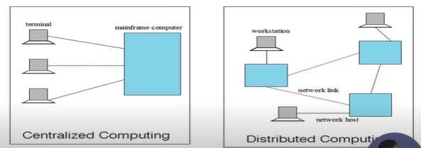
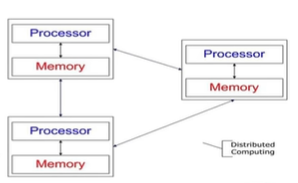

# Introduction

## Cloud Computing - Overview
* The ACM Computing Curricula 2005 defined "computing" as

```txt
In a general way, we can define computing, to mean any goal -
oriented activity requiring, benefiting from, or creating computers.
Thus, computing includes designing and building hardware and
software systenms for a wide range of purposes; processing,
structuring, and managing various kinds of information; doing
scientific studies using computers; making computer systems
behave intelligently; creating and using communications and
entertainment media; finding and gathering information relevant
any particular purpose, and so on. The list is virtually endless
the possibilities are vast.
```

### Examples
1. Buying a car for 20 km | 50 km once a month
2. Online Exam Resources | during practise
3. Stationary Shops(Notebooks, pens, books)
   1. How much I need to stock
   2. Situation - Shop is full or starving of resources

### Things to Manage in a computing in general
* CPU - Processor
* RAM
* Network Connectivity


## Topics
1. Introduction to Cloud Computing
   1. Overview of Computing
   2. Cloud Computing(NIST Model)
   3. Properties, Characteristics & Disadvantages
   4. Role of Open Standards
2. Cloud Computing Architecture
   1. Cloud computing stack
   2. Service Models(XaaS)
      1. Infrastructure as a Service(IaaS)
      2. Platform as a Service(PaaS)
      3. Software as a Service(SaaS)
   3. Deployment Models
3. Service Management in Cloud Computing
   1. Service Level Agreements(SLAs)
   2. Cloud Economics
4. Resource Management in Cloud Computing
5. Data Management in Cloud Computing
   1. Looking at Data, Scalability & Cloud Services
   2. Database & Data Stores in Cloud
   3. Large Scale Data Processing
6. Cloud Security
   1. Infrastructure Security
   2. Data security and Storage
   3. Identity and Access Management
   4. Access Control, Trust, Reputation, Risk
7. Case Study on Open source and Commercial clouds, Cloud Simulator
8. Research trend in Cloud Computing, Fog Computing

```txt
e.g. dropbox
your data is in other database
you cannot regenerate your data until you have recovering mechanism
how data is saved
whether my data is accessed by someone else
Issue of Identity and Access Management
how much trust, losing application, losing data
You are purchasing cloud to serve somebody

```

### Trends in Computing
* Distributed Computing
* Grid Computing
* Cluster Computing
* Utility Computing
* **Cloud Computing**


```txt
any invention driven by scientific community or
general citizens
It is not a suddenly new stuff emerged
```

### Centralized vs Distributed Computing
Early computing was performed on a single processor. Uni-processor computing can be called centralized computing




### Distributed Computing/System?
Distributed Computing - Distributed in different geography

* Distributed computing
  * Field of computing science that studies distributed system
  * Use of distributed systems to solve computational problems

* Distributed system
  * Wikipedia
    * There are several autonomous computational entities, each of which has its own local memory
    * The entities commmunicate with each other by message passing
  * Operating System Concept
    * The processors communicate with one another through various communication lines, such as high-speed buses or telephone lines
    * Each processor has its own local memory



### Example Distributed Systems
* Internet
* ATM(Bank) machines
* Intranets/workgroups
* Computing landscape will soon consist of ubiquitous network-connected devices

## Computers in a Distributed System
1. **Workstations** - Computers used by end-users to perform computing
2. **Server Systems** - Computers which provide resources and services
3. **Personal Assistance Devices** - Handheld computers connected to the system via a wireless communication link.

## Common properties of Distributed Computing
* **Fault tolerance**
  * When one or some nodes fails,
the whole can still work fine except performance
  * Need to check the status of each node
* **Each node play partial role**
    * Each computer has only a limited, inconnplete view of the svstem.
    * Each computer may know only one part of the input.
* **Resource sharing**
  * Each user can share the connputing power and storage resource in the system with other users
other users
* **Load Sharing**
  * Dispatching several tasks to each nodes can help share loading to the whole svsteni.
* **Easy to expand**
  * we expect to use few tinxe adding nodes. Hope to spend no time if possible
* **Performnance**
  * Parallel cornputing can be considered a subset of distr ibuted connputing

## Why Distributed Computing?
* Nature of application
* Performance
  * Computing intensive
    * The task could consume a lot of time on computing. For example, Computation of Pi value using Monte Carlo simulation
  * Data intensive
    * The task that deals with a large amount or large size of files. For example, Facebook. LHC(Large Hadron Collider) experimental data processing
  * Robustness
    * No SPOF(Single Point of Failure)
    * Other nodes can execute the same task executed on failed node