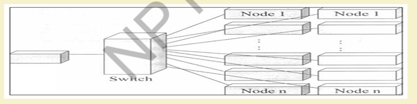
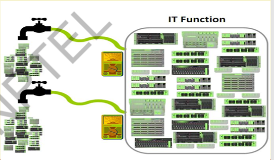
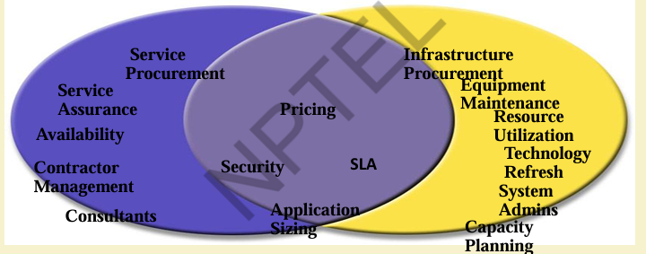

# Cloud Computing - Overview (contd..)

### Distributed applications

* Applications that consist of a set of processes that are distributed across a network Of machines and work together as an ensemble to solve a common
problem
* In the past, mostly "Client-server"
    * Resource management centralized at the server
* "Peer to Peer" computing represents a movement towards more "truly" distributed applications.

### Clients invoke individual servers - 

A typical distributed application based on peer processes

## 2. Grid Computing
* **Pewebopedia.com**
    * A form of networking unlike conventional networks that focus on communication
devices, grid computing harnesses unused processing cycles of all computers
in a network for solving problems too intensive for any stand-alone machine.
* **IBM**
    * Grid computing enables the virtualization of distributed computing and data
resources such as processing, network bandwidth and storage capacity to create a
single system image, granting users and applications seamless access to vast IT
capabilities. Just as an Internet user views a unified instance of content via the web, a
grid user essentially sees a single, large virtual computer.
* **Sun Microsystems**
    * Grid Computing is a computing infrastructure that provides dependable, consistent, pervasive and inexpensive access to computational capabilities.

### Electrical Power Grid Analogy
Here's the information from the image in a table format.

| Electrical Power Grid | Grid |
| :--- | :--- |
| Users (or electrical appliances) get access to electricity through **wall sockets** with no care or consideration for where or how the electricity is actually generated. | Users (or client applications) gain access to **computing resources** (processors, storage, data, applications, and so on) as needed with little or no knowledge of where those resources are located or what the underlying technologies, hardware, operating system, and so on are. |
| **"The power grid"** links together power plants of many different kinds. | **"The Grid"** links together computing resources (PCs, workstations, servers, storage elements) and provides the mechanism needed to access them. |

### Grid Computing - When we use

1. Share more than information: Data, computing power, applications in dynamic environment, multi-institutional, virtual organizations.
2. Efficient use of resources at many institutes. People from many institutions working to solve a common problem (virtual organisation) .
3. Join local conununities.
Interactions with the underneath lavers
4. Interactions be transparent and seamless to the user.

### Need of Grid Computing
* Today’s Science/Research is based on computations, data analysis, data 
visualization & collaborations 
* Computer Simulations & Modelling are more cost effective than 
experimental methods 
* Scientific and Engineering problems are becoming more complex & users 
need more accurate, precise solutions to their problems in shortest possible 
time 
* Data Visualization is becoming very important 
* Exploiting under utilized resources

### Who uses Grid computing
* Reactor Applications
* Detection and modelling Natural Disasters
* Crystallography
* Material Characterization
* Physics Applications
* Weather Forecast

### Types of Grids
* **Computational Grid:** These grids provide secure access to huge pool of shared processing 
power suitable for high throughput applications and computation intensive computing. 
* **Data Grid:** Data grids provide an infrastructure to support data storage, data discovery, data 
handling, data publication, and data manipulation of large volumes of data actually stored in 
various heterogeneous databases and file systems. 
* **Collaboration Grid:** With the advent of Internet, there has been an increased demand for 
better collaboration. Such advanced collaboration is possible using the grid. For instance, 
persons from different companies in a virtual enterprise can work on different components of 
a CAD project without even disclosing their proprietary technologies. 
### Grid Components
* Users
  * Large and dynamic population
  * Different accounts at different sites
  * Heterogeneous privileges(roles)
  * Desire Single Sign-on
* "Groups"
  * "Group" Data
  * Access Patterns
  * Membership
* Sites
  * Heterogeneous Resources
  * Access Patterns
  * Local policies
  * Membership

## 3. Cluster Computing
* A cluster is a type of parallel or distributed computer system, which consists of a collection on inter-connected stand-alone computers working together as a single integrated computing resource.
* Key components of a cluster include multiple standalone computers(PCs, Workstations, or SMPs), operating systems, high-performance interconnects, middleware, parallel programming environments, and applications
* Clusters are usually deployed to improve speed and/or reliability over that provided by a single computer, while typically being much more cost effective than single computer the of comparable speed or reliabilty
* In a typical cluster - 
  * Network - Faster, closer connection than a typical network(LAN)
  * Low latency communication protocols
  * Loosely coupled than SMP

### Types of Cluster
1. High Availability or Failover clusters
2. Load Balancing Cluster
3. Parallel/Distributed Processing Clusters

###  Cluster components
* Basic building blocks of clusters are broken down into multiple categories
  * Cluster nodes
  * cluster network
  * Network Characterization

### Key operational benefits of clustering
* System availability:  offer inherent high system availability due to 
the redundancy of hardware, operating systems, and applications. 
* Hardware fault tolerance:  redundancy for most system 
components (eg. disk-RAID), including both hardware and 
software.  
* OS and application reliability:   run multiple copies of the OS and 
applications, and through this redundancy 
* Scalability. adding servers to the cluster or by adding more clusters 
to the network as the need arises or CPU to SMP. 
* High performance: (running cluster enabled programs)

## 4. Utiliting Computing
* Utility Computing is purely a concept which cloud computing practically implements.
* Utility computing is a service provisioning model in which a service provider makes computing resources and infrastructure management available to the customer as  needed, and charges them for specific usage rather than a flat rate.
* This model has the advantage of a low or no initial cost to acquire computer resources; 
instead, computational resources are essentially rented.
* The word utility is used to make an analogy to other services, such as electrical power, 
that seek to meet fluctuating customer needs, and charge for the resources based on 
usage rather than on a flat-rate basis. This approach, sometimes known as **pay-per-use** 
* "Utility computing" has 
usually envisioned some 
form of virtualization so 
that the amount of 
storage or computing 
power available is 
considerably larger than 
that of a single time
sharing computer. 

* Utility Computing
  * Pay-for-use Pricing **business model**
  * Data center Virtualization and **Provisioning**
  * Solves **Resource Utilization** Problem
  * **Outsourcing**
  * **Web Services Delivery**
  * Automation
### Utility Computing example
* On Demand Cyber Infrastructure
### Utility Solution - Your perspective

### Utility Computing Payment Models
* Same range of charging models as other utility providers - gas, electricity, telecommuniations, water, television broadcasting
  * Flat rate
  * Tiered
  * Subscription
  * Metered
  * Pay as you go
  * Standing charges
* Different pricing models for different customers based on factors such as scale, commitment and payment frequency
* But the principle of utility computing remains
* The pricing model is simply an expression by the provider of the costs of provision of the resources and a profit margin
### Risks in a Utility Computing world
* Data backup
* Data security
* Partner competency
* Defining SLA
* Getting value from charge back

