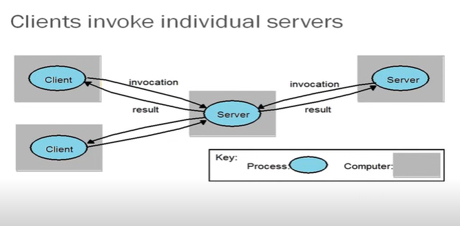
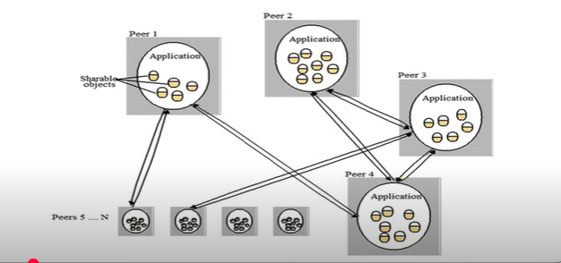

# Cloud Computing - Overview (contd..)

## Distributed applications

* Applications that consist of a set of processes that are distributed across a network Of machines and work together as an ensemble to solve a common
problem
* In the past, mostly "Client-server"
    * Resource management centralized at the server
* "Peer to Peer" computing represents a movement towards more "truly" distributed applications.

Clients invoke individual servers - 

A typical distributed application based on peer processes

## Grid Computing?
* **Pewebopedia.com**
    * A form of networking unlike conventional networks that focus on communication
devices, grid computing harnesses unused processing cycles of all computers
in a network for solving problems too intensive for any stand-alone machine.
* **IBM**
    * Grid computing enables the virtualization of distributed computing and data
resources such as processing, network bandwidth and storage capacity to create a
single system image, granting users and applications seamless access to vast IT
capabilities. Just as an Internet user views a unified instance of content via the web, a
grid user essentially sees a single, large virtual computer.
* **Sum Microsystems**
    * Grid Computing is a comnputing infrastructure that provides dependable,
consistent, pervasive and inexpensive access to computational capabilities.

## Electrical Power Grid Analogy
Here's the information from the image in a table format.

| Electrical Power Grid | Grid |
| :--- | :--- |
| Users (or electrical appliances) get access to electricity through **wall sockets** with no care or consideration for where or how the electricity is actually generated. | Users (or client applications) gain access to **computing resources** (processors, storage, data, applications, and so on) as needed with little or no knowledge of where those resources are located or what the underlying technologies, hardware, operating system, and so on are. |
| **"The power grid"** links together power plants of many different kinds. | **"The Grid"** links together computing resources (PCs, workstations, servers, storage elements) and provides the mechanism needed to access them. |