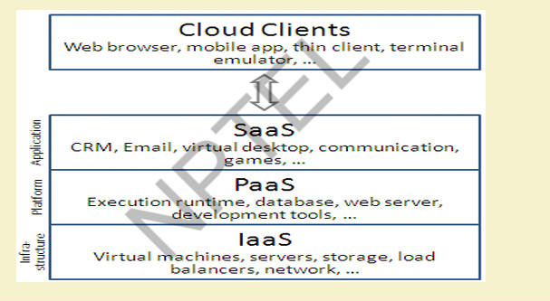

## 5. Cloud Computing
US **National Institute of Standards and Technology** defines Computing as 
Cloud computing is a model for enabling ubiquitous, convenient, on-demand network access to a shared pool of 
configurable computing resources (e.g networks, servers, storage, applications, and services) that can be 
rapidly provisioned and released with minimal management effort or service provider interaction. "
### Essential Characteristics
* On-demand self service
* Broad network access
* Resource pooling
* Measured Service
* Rapid elasticity

### Common Characteristics
* Massive Scale 
* Resilient Computing 
* Homogeneity 
* Geographic Distribution 
* Virtualization 
* Service Orientation 
* Low Cost Software 
* Advanced Security 

### Cloud Services Models
* Software as a Service (SaaS)
* Cloud Infrastructure as a Service (IaaS)
* Platform as a Service(PaaS)

### Cloud Services Models

### Types of Cloud(Deployment Models)
* Private cloud - The cloud infrastructure is operated solely for an organization. 
e.g Window Server 'Hyper-V'.
* Community cloud - The cloud infrastructure is shared by several organizations and supports a specific goal. 
* Public cloud - The cloud infrastructure is made available to the general public  e.g Google Doc, Spreadsheet,
* Hybrid cloud - The cloud infrastructure is a composition of two or more clouds (private,   community, or public)  
e.g Cloud Bursting for load balancing between clouds. 

## Cloud and Virtualization
* Virtual Workspaces
* Implement on virtual Machines(VMs)
* Provide infrastructure API
## Evolution of Cloud computing 

🧬 1. Foundations Before the Cloud (1950s–1990s)

1950s–60s: Mainframe and Terminal Computing

Centralized computing with dumb terminals connected to powerful mainframes.

Users shared resources, like memory and processing, over time (time-sharing concept).

1970s–80s: Virtualization Emerges

IBM introduced virtualization with its VM operating system, enabling multiple OSes to run on a single machine.

This laid the foundation for resource abstraction, crucial for cloud models.

1990s: Client-Server & Grid Computing

Rise of client-server architecture, where services were distributed but still needed specific infrastructure.

Grid computing appeared: pooling resources across networks to work on intensive tasks (e.g., scientific research).

---

☁️ 2. The Birth of Modern Cloud Computing (2000–2010)

Early 2000s:

Amazon launched Amazon Web Services (AWS) in 2002 (S3 in 2006, EC2 in 2006).

Idea: rent out unused server space as a service.

2006–2009:

Google introduced App Engine (2008) for deploying applications on their infrastructure.

Microsoft launched Azure (2009).

Introduction of IaaS, PaaS, and SaaS:

IaaS – Infrastructure as a Service (e.g., AWS EC2)

PaaS – Platform as a Service (e.g., Google App Engine)

SaaS – Software as a Service (e.g., Gmail, Salesforce)

---

🚀 3. Cloud Expansion and Enterprise Adoption (2010–2020)

2010–2015:

Enterprises started migrating data centers to the cloud.

Introduction of hybrid clouds (mix of on-premise + public cloud).

DevOps, CI/CD, and Containers (like Docker) started becoming key to cloud workflows.

2016–2020:

Rise of Kubernetes and serverless computing (e.g., AWS Lambda).

Emergence of multi-cloud strategies to avoid vendor lock-in.

Major players: AWS, Microsoft Azure, Google Cloud, IBM Cloud, Oracle Cloud.

---

🤖 4. Cloud-First and Intelligent Cloud Era (2020–Present)

2020–Now:

AI/ML on cloud becomes mainstream (e.g., AWS SageMaker, Azure ML, Google Vertex AI).

Edge computing grows to support IoT and low-latency applications.

Cloud-native development using microservices, containers, and Kubernetes.

Rapid growth in cloud security, compliance, and FinOps.

Sovereign cloud and green computing trends emerge due to geopolitical and environmental concerns.

---

🔮 5. The Future of Cloud Computing

AI-integrated cloud agents (e.g., Copilot-like services across clouds).

Quantum computing in the cloud (e.g., AWS Braket, IBM Q).

Fully automated DevOps pipelines with AI.

Rise of industry-specific clouds (e.g., healthcare, finance, manufacturing).

Potential shift toward decentralized computing with blockchain and Web3.
:

| Feature               | **Grid Computing**                                                                                    | **Utility Computing**                                                                                                                      |
| --------------------- | ----------------------------------------------------------------------------------------------------- | ------------------------------------------------------------------------------------------------------------------------------------------ |
| **Definition**        | Distributed computing model where multiple computers work together to solve a complex task.           | Computing model where computing resources (like CPU, storage, etc.) are provided as a metered service—like a utility (electricity, water). |
| **Resource Usage**    | Aggregates and shares resources from multiple locations to work on a single problem.                  | Allocates resources on-demand, and users pay based on usage.                                                                               |
| **Ownership**         | Typically uses the resources owned by different organizations or individuals.                         | Usually provided by a centralized service provider (like AWS, Azure, Google Cloud).                                                        |
| **Focus**             | Focused on parallel processing and workload distribution for large, compute-intensive tasks.          | Focused on providing flexible, scalable services to users on a pay-per-use basis.                                                          |
| **Example Use Cases** | Scientific research, simulations, large-scale computations (e.g., protein folding, climate modeling). | Web hosting, data storage, cloud services, virtual machines.                                                                               |
| **Scalability**       | Can be scaled by adding more nodes to the grid.                                                       | Easily scalable based on user demand—vertical and horizontal scaling.                                                                      |
| **User Interaction**  | Users often need technical knowledge to manage tasks on a grid.                                       | End users just consume services; provider handles the complexity.                                                                          |
| **Billing**           | Usually not tied to billing; resource sharing is often cooperative.                                   | Metered billing like utilities—pay for what you use.                                                                                       |

### Simple Analogy:

* **Grid Computing** = A group of people pooling their computers together to solve a big puzzle.
* **Utility Computing** = Renting computer power from a company when needed—just like paying for electricity.

