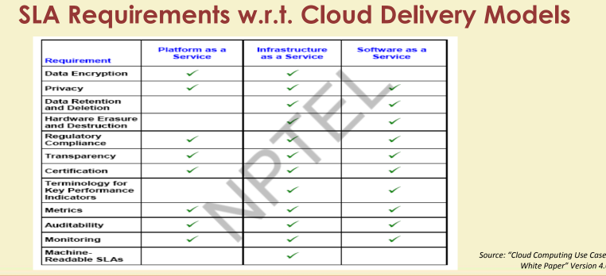
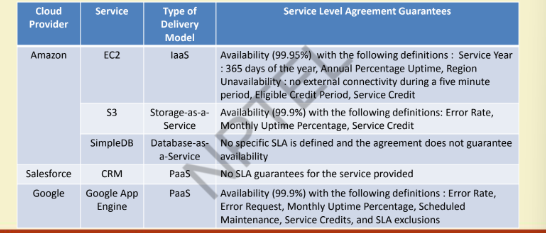
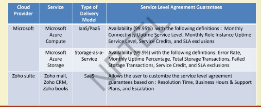
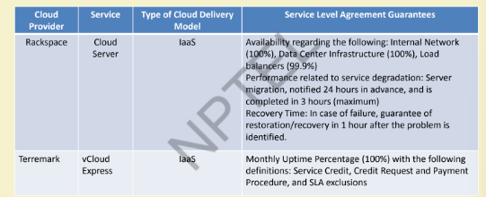
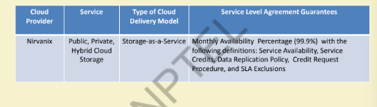

# Lecture 11: Service Level Agreement
## What is Service Level Agreement?
* A formal contract between a Service Provider (SP) and a Service Consumer
(SC)
* SLA: foundation of the consumer’s trust in the provider
* Purpose : to define a formal basis for performance and availability the SP
guarantees to deliver
* SLA contains Service Level Objectives (SLOs)
– Objectively measurable conditions for the service
– SLA & SLO: basis of selection of cloud provider

## SLA Contents

## Web Service SLA
1. WS-Agreement
2. WSLA(Web Service Level Agreement Framework)

## Difference between Cloud SLA and Web Service SLA
* QoS parameters
* Automation
* Resource Allocation

## Types of SLA
* Present market place features two types of SLAs
  * Off-the-shelf SLA or non-negotiable SLA or Direct SLA
  * Negotiable SLA

## Service Level Objectives (SLOs)

## Service Level Management

## Considerations for SLA

## SLA Requirements

## Key Performance Indicators(KPIs)

## Industry-defined KPIs

## Metrics for Monitoring and Auditiong

## SLA Requirements w.r.t cloud delivery models

## Example Cloud SLAs

## Limitations
* Service measurement
* Biasness towards vendors
* Lack of active monitoring on customer's side

## Expected SLA Parameters
* IaaS
* PaaS
* SaaS
* Storage as a service

# Cloud Computing - Economics
## Cloud Properties - Economic Viewpoint
* Common Infrastructure
* Location independence
* Online connectivity
* Utility pricing
* on-Demand Resources

## Value of Common Infrastructure

## A useful measure of "Smoothness"

## Coefficient of variation Cv
## But what about workloads?
## Common Infrastructure in Real World
## Value of Location Independence
## Value of Utility Pricing
### Utility Pricing in Detail
### Utility Pricing in Real World

## Value of on-Demand Services

## Penalty Costs for Exponential Demand

## Coefficient of Variation - Cv

## Assignment 1

# Cloud computing - Managing Data
## Introduction
1. Relational Database
2. For scalable web search service
   1. GFS
   2. BigTable
   3. MapReduce
   4. Suitable for
   5. Similar to BigTable data model are - 

## Relational Databases

## Data Storage Techniques

## Parallel Database Architectures

## Advantages of Parallel DB over Relational DB

## Cloud File Systems
