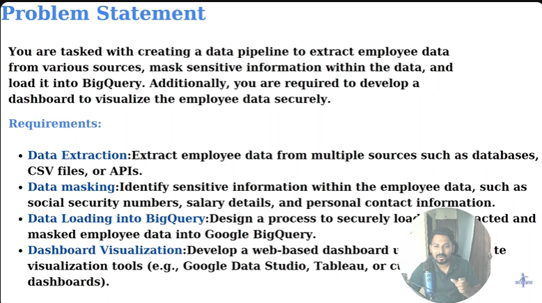
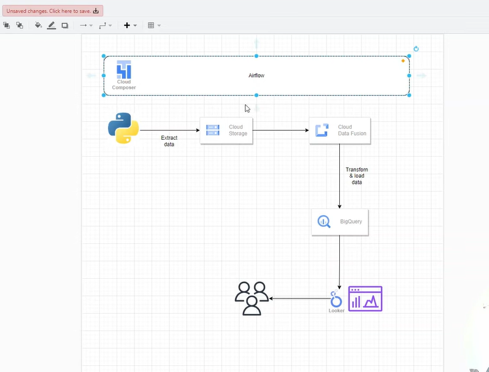

# Link - https://www.youtube.com/watch?v=lMaZnZldxcE&list=PLLrA_pU9-Gz2DaQDcY5g9aYczmipBQ_Ek&index=1

## Problem Statement

## Tech Stack

## Diagram view

## Steps
1. Go to Cloud console
2. Enable the **composer API**
3. Create environment => select Airflow 2 - modernized => Leave all the details as it is , do not customize
4. Click on create. It will take 20 minutes of time
5. Now go to **cloud data fusion** and enable the API
6. Create an instance. Grant permissions. Keep the region same as that above in Composer.
7. Click on create