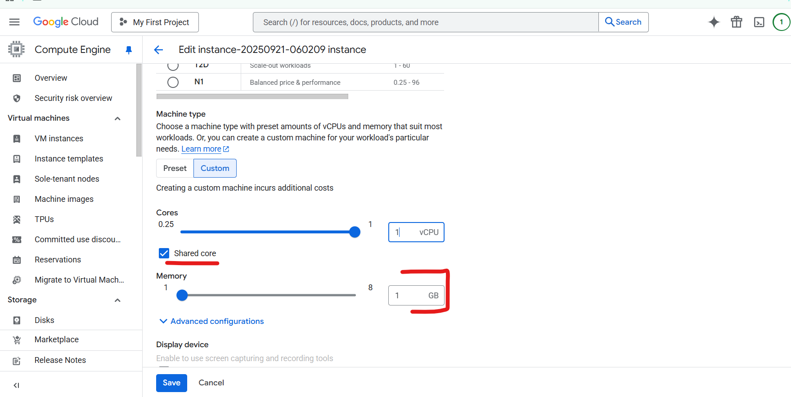

# Exam Breakdown

| Section | Description | Percentage |
|---------|-------------|------------|
| 1 | Setting up a cloud solution environment | 15% |
| 2 | Planning and configuring a cloud solution | 15% |
| 3 | Deploying and implementing a cloud solution | 30% |
| 4 | Ensuring successful operation of a cloud solution | 25% |
| 5 | Configuring access and security | 15% |

# Question 1
1. A software development company needs to provide a **cost estimate for a Kubernetes** cluster using the GCP pricing calculator for Kubernetes. The workload **requires high IOPs(Input/output operations per second)** and will be using **disk snapshots**. They start by entering the number of nodes, average hours, and average days.

What should they do next?  
* Select Add GPUs. Add estimated cost for cluster management.  
* Fill in local SSD. Fill in persistent disk storage and snapshot storage.  
* Fill in local SSD. Add estimated cost for cluster management.  
* Select Add GPUs. Fill in machine type  

```txt
High IOPS → They probably need to select SSD persistent disks (not standard HDD).
Disk snapshots → They need to account for snapshot storage costs in addition to VM + node costs.

option c - not possible (local SSD have temporary data. and question is asking for disk snapshots which is available in persistent disks)
option a - not possible(option don't mention anything about the which disk to use )
option d - not possible (same reasoning as that of a)
correct answer - b
```

```txt
The requirement is high IOPS → that points to Persistent Disks (SSD), not Local SSDs (local SSDs are very fast but ephemeral, data is lost if VM stops).

They also need disk snapshots → only Persistent Disks support snapshots (local SSDs don’t).

GPUs are irrelevant here (no mention of ML/AI).

Cluster management cost is flat ($0.10/hour per cluster), but the question highlights disks + snapshots specifically.
```


# Question 2

You want to verify the IAM users and roles assigned within a GCP project named exampro-project.

What should you do?  
* Navigate to the project and then to the Roles section in the GCP Console. Review the roles and status.  
* Navigate to the project and then to the IAM section in the GCP Console. Review the members and roles.  
* Run gcloud iam roles list. Review the output section.  
* Run gcloud iam service-accounts list. Review the output section.  

Correct answer is 2nd  


---

### **Principal in GCP IAM**

A **principal** is basically **“who” you are granting access to**. It’s the identity that can perform actions in a project.

**Types of principals:**

1. **User account** → e.g., `john@example.com`
2. **Service account** → e.g., `my-app-sa@project.iam.gserviceaccount.com` (used by apps)
3. **Google group** → e.g., `dev-team@example.com`
4. **Domain** → e.g., `@example.com` (all users in the domain)
5. **AllAuthenticatedUsers / AllUsers** → everyone with Google account / public

---

### **IAM view options**

* **View by principal** → Shows **all roles assigned to a particular identity**.

  * Example: “What roles does `alice@example.com` have in this project?”

* **View by roles** → Shows **all users who have a particular role**.

  * Example: “Who has the role `Editor` in this project?”

---

✅ **Memory trick:**

* **Principal = who**
* **Role = what**

By command line - `gcloud projects get-iam-policy   confident-inn-466803-r1`


# Question 3
You have a virtual machine that is currently configured with 1 vCPU and 2 GB of memory. It has reached the limit of available memory and you need to upgrade the virtual machine to have 4 GB of memory.

What should you do?



# Question 4
You created a Google Cloud Platform project with an **App Engin**e application inside the project.  
You initially configured the application to be served from the us-central1 region. Now you want the application to be served from the europe-west1 region.  
What should you do?  

Create a new GCP project and create an App Engine application inside this new project. Specify europe-west1 as the region to serve your application.  
Change the region property setting in the existing App Engine application from us-central1 to europe-west1  
Create a second App Engine application in the existing GCP project and specify europe-west1 as the region to serve your application.  
In an existing GCP project, change the default region property setting to europe-west1.  

```txt
App Engine is region specific. You CANNOT move it to different region. Create a new project and create new app engine in the new region
```

# Question 5
You have a developer laptop with the **Cloud SDK installed** on **Ubuntu**. The Cloud SDK was installed from the Google Cloud Ubuntu package repository.  
You want to **test your application locally** on your laptop with **Cloud Datastore**.  

What should you do?  
Install the google-cloud-sdk-datastore-emulator component using the apt get install command  
Create a Cloud Datastore index using gcloud datastore indexes create  
Install the cloud-datastore index using the gcloud components install command  
Export Cloud Datastore data using gcloud datastore export  

```txt
* Exporting and importing is something you’d do when you need to **back up data** or **move between projects**.
* For local testing, Google actually gives you a **Datastore emulator** that pretends to be Datastore, so you don’t need to export anything from the cloud.

Here’s the key:

* If the question says *“test your application locally”*, the correct approach is to **start the Datastore emulator** that comes with the Cloud SDK.  
* Then, you **point your app’s environment variables** to talk to the emulator instead of the real cloud service.

So exporting big datasets isn’t necessary (and yes, it could be huge!).

```

# Question 6
You need to select and configure compute resources for a set of batch processing jobs. These jobs take about 2 hours to complete and are scheduled for every night. You want to keep your service expenses as low as possible.  
Which of the following steps will meet the goal?  

	
Select Compute Engine. Use preemptible VM instances of the appropriate standard machine type  
Select Google Kubernetes Engine. Use a three-node cluster with micro instance types  
Select Compute Engine. Use VM instance types that support micro bursting  
Select Google Kubernetes Engine. Use a single-node cluster with a small instance type  

```txt

**1. Batch processing**

* Think of it as jobs that run on a schedule, crunch through a *batch* of data, and then stop.
* Example: Every night, process all sales records of the day, generate a report, and save results.
* Key: You don’t need servers running 24/7. You just need them for the job window (like 2 hours at night).

**2. Preemptible VM (in GCP)**

* These are **very cheap virtual machines** on Compute Engine.
* BUT: Google can shut them down at *any time*, and they last a max of **24 hours**.
* Cost: up to 80% cheaper than normal VMs.
* Use case: great for batch jobs or workloads that can restart or tolerate interruptions.

👉 So if your job takes only 2 hours (well under 24h) and runs nightly, **preemptible VMs are perfect** — they save lots of cost.

---

So now, can you guess why in your options the best answer is:
**“Select Compute Engine. Use preemptible VM instances of the appropriate standard machine type”**?

```