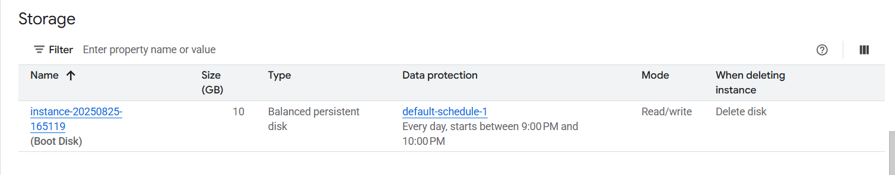

# Block and File Storage in GCP
# Storage
## Storage Types - Block Storage and File Storage
* What is the type of storage of your hard disk?
  * **Block storage**
* You've created a file share to share a set of files with your colleagues in a
enterprise. What type of storage are you using?
    * **File Storage**
### Block Storage
* Use case - Harddisks attached to your computers
* Typically, ONE Block storage can be connected to ONE virtual server
  * (EXCEPTIONS) You can attach read only block devices with multiple virtual servers and certain cloud providers are exploring multi-writer disks as well!
* However, you can connect multiple different block storage devices to one virtual server
* Used as - 
  * Direct-attached-storage(DAS) - Similar to a harddisk


### File Storage
* Media workflows need huge shared
storage for supporting processes like
video editing
* Enterprise users need a quick way to
share files in a secure and organized
way
* These file shares are shared by several
virtual servers

## GCP - Block Storage and File Storage
* Block Storage - 
  * **Persistent Disks** - Network Block Storage
    * Zonal - Data replicated in one zone
    * Regional - Data replicated in multiple zone
  * **Local SSDs** - Local Block Storage
* **File Storage** - 
  * **Filestore** - High performance file storage

## GCP - Block Storage
* Two popular types of block storage can be attached to VM instances
  * Local SSDs
  * Persistant Disks
* **Local SSDs** are physically attached to the host of the VM instance
  * Temporary data
  * Lifecycle tied to VM instance
* **Persistant Disks** are network storage
  * More durable
  * Lifecycle NOT tied to VM instance

## Persistent Disks vs Local SSDs

|Feature|Persistent Disks|Local SSDs|
|--|--|--|
|Attachment to VM instance|As a network drive|Physicallly attached|
|Lifycycle|Separate from VM instance|Tied with VM instance|
|I/O Speed|Lower(network latency)|10-100X of PDs|
|Snapshots(backups)|Supported|Not Supported|
|Use case|Permanent storage|Ephemeral storage|

## Persistent Disks(pd) - Standard vs Balanced vs SSD
|Feature|Standard|Balanced|SSD|
|--|--|--|--|
|Underlying Storage|Hard Disk Drive|Solid State Drive|Solid State Drive|
|Referred to as|pd-standard|pd-balanced|pd-ssd|
|Performance - Sequential IOPS(Big Data/Batch)|Good|Good|Very Good|
|Performance - Random IOPS(Transactional Apps)|Bad|Good|Very Good|
|Cost|Cheapest|In Between|Expensive|
|Use cases|Big Data(cost efficient)|Balance between cost and performance|High Performance|

## Taking Snapshots for Persistent Disks

## Persistent Disks - Snapshots - Recommendations

## Disk
* by default Balanced persistent disk is used



## Playing with Machine Images

## comparison

|Scenarios|Machine Image|Persistent disk snapshot|Custom Image|Instance template|
|--|--|--|--|--|
|Single disk backup|yes|yes|yes|no|
|Multiple disk backup|yes|No|No|No|
|Differential backup|Yes|Yes|No|No|
|Instance cloning and replication|yes|no|yes|yes|

e.g. can I use Machine image for VM instance configuration? - yes

## Command Line

```txt
gcloud compute disks list

```

## Cloud Filestore

* Shared cloud file storage
  * Supports NFSv3 protocol
  * Provisional capacity
* Suitable for high performance
  * upto 320 TB with throughput of 16GB/s and 480K IOPS
* Supports HDD (general purpose) and SSD (performance - critical workloads)
* Use cases - file share, media workflowsa and content management