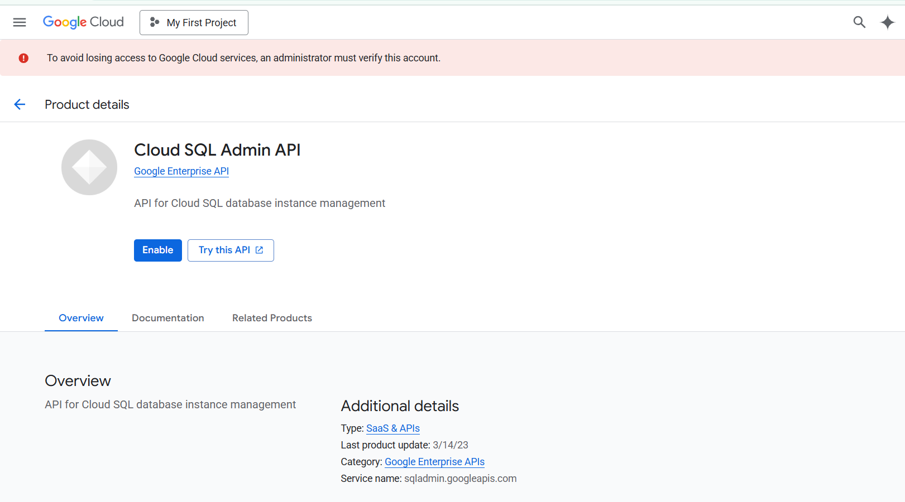
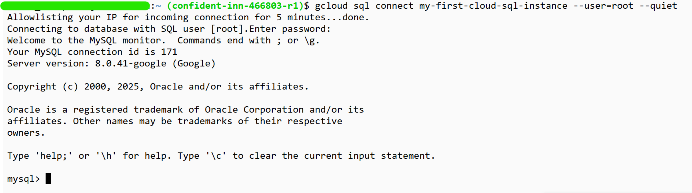
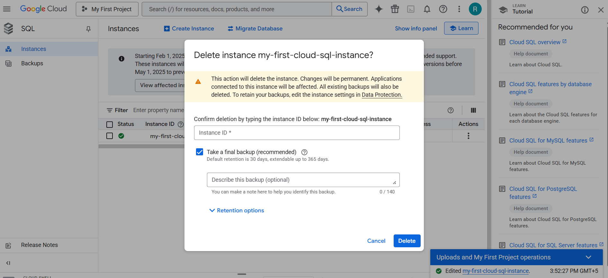

# Exploring Databases in GCP

## Commands

```txt
# Cloud SQL
gcloud sql connect my-first-cloud-sql-instance --user=root --quiet
gcloud config set project glowing-furnace-304608
gcloud sql connect my-first-cloud-sql-instance --user=root --quiet
use todos
create table user (id integer, username varchar(30) );
describe user;
insert into user values (1, 'Ranga');
select * from user;
 
# Cloud Spanner
CREATE TABLE Users (
  UserId   INT64 NOT NULL,
  UserName  STRING(1024)
) PRIMARY KEY(UserId);
 
 
# Cloud BigTable
bq show bigquery-public-data:samples.shakespeare
 
gcloud --version
cbt listinstances -project=glowing-furnace-304608
echo project = glowing-furnace-304608 > ~/.cbtrc
cat ~/.cbtrc
cbt listinstances
```

## Creating Database


Enable the API - 


Enter the password - 



Delete the instance - 



## Cloud SQL - Features
* Important Cloud SQL Features
  * Automatic encryption
  * High availability and failover
  * Read replicas for read workloads
  * Automatic storage increase without downtime(for newer versions)
  * Point-in-time recovery - Enable binary logging
  * Backups
  * Supports migration from other sources
  * You can export data from UI

## Cloud Spanner
* Fully managed, mission critical, relational(SQL), globally distributed database with very high availability(99.999%)
* Cloud Spanner scales horizontally for reads and writes
* Regional and Multi-Regional configurations
* Expensive(compared to Cloud SQL)

## BigQuery - Datawarehouse
* Exabyte scale modern Datawaarehousing
  * Relational database
  * Traditional
* importing and exporting data
* Automatically expire data(Configurable Table Expiration)
* Query external data sources without storing data in BigQuery
* Access databases using

## Relational Database - Import and Export