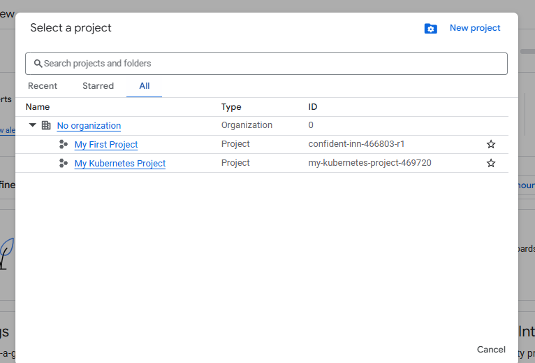

# Organizing GCP Resources

## Resource Hierarchy in GCP
* Well defined hierarchy - 
  * Org > folder > project > resources
* Resources are created in projects
* A folder can contain multiple projects
* Organization can contain multiple projects

## Resource Hierarchy - Recommendations for Enterprises
* Create **separate projects for different environments**
  * Create isolation between for each department
* Create **separate folders for each department**
  * Isolate production applications of one department from another
  * We can create a shared folder for shared resources
* **One project per application per environment**
  * Let's consider two apps - A1 and A2
  * Let's assuem we need two environments "DEV" and "PROD"
  * In the ideal world you will create four projects A1-DEV, A1-PROD, A2-DEV, A2-PROD
    * Isolates environments from each other
    * DEV changes will not break PROD
    * Grant all developers complete access(create, delete, deploy) to DEV projects
    * Provide production access to operations teams only!

In free trial only Org and projects are available

## Billing Accounts
* **Billing Account** is mandatory for creating resources in a project - 
  * Billing account contains the payment details
  * Every project with active resources should be associated with a Billing account
* Billing account can be associated with one or more projects
* You can have multiple billing accounts in an Organization
* (Recommendation) Create billing accounts representing your organization structure
  * A startup can have just one billing account
  * A large enterprise can have a separate billing account for each department
* Two Types - 
  * Self Serve - Billed directly to credit card or bank account
  * Invoiced - Generate invoices (Used by large enterprises)

## Managing Billing - Budget, Alerts and Exports
* Setup a Cloud Billing Budget to avoid surprises

## IAM Best Practices
* **Principle of Least Privileage** - Give least possible privilege needed for a role!
  * Basic roles are not recommended
    * Prefer predefined roles when possible
  * Use
* **Separation of Duties** - Involove atleast 2 people in sensitive tasks 
* **Constant Monitoring**
* Use Groups when possible
  * Makes it easy to manage users and permissions
  
## User Identity Management in Google Cloud
* Email used to create free trial => Super Admin
  * Access to everything in your GCP organization, folders and projects
  * Manage access to other users **using their Gmail accounts**
* However, this is **not recommended** for enterprises
* **Option 1** - Your Enterprise is using **Google Workspace**
* **Option 2** - Your Enterprise uses an Identity Provider of its own
  * Federate Google Cloud with your Identity Provider

## Corporate Directory Federation
* **Federate** Cloud Identity or Google Workspace **with your external identity provider (IdP)** such as Active Directory or Azure Active Directory.
* Enable Single Sign On - 
  * Users are redirected to an external IdP to authenticate
  * When users are authenticated, SAML assertion is sent to Google Sign-In
* Examples
  * Federate Active Directory with Cloud Identity by using Google Cloud Directory Sync(GCDS) and Active Directory Federation Services(ADFS)
  * Federating Azure AD with Cloud Identity

## IAM Members/Identities
* Google Account
* Service Account
* Google group
* Google Workspace domain
* Cloud Identity domain

### IAM Members/Identities - Use Cases

## Organization Policy Service
* How to enable **centralized constraints** on all resources created in an Organization
  * Configure **Organization policy**
  * Example - Disable creation of service accounts
  * Example - Allow/Deny creation of resources in specific regions
* Needs a role - Organization Policy Administrator
* (Remember)**IAM** focuses on **Who**
  * Who can take specific actions on resources
* (Remember)Organization Policy focuses on **What**
  * What can be done on specific resources?
## Resource Hierarchy & IAM Policy
* IAM policy can be set at any level of the hierarchy
* Resources inherit the policies of All Parents
* The effective policy for a resource is the union of the policy on the resource and its parents
* Policy inheritance is transitive
  * Eg. Organization policies are applied at resource level
* You can't restrict policy at lower level if permission is given at an higher level

## SSHing into Linux VMs - Options