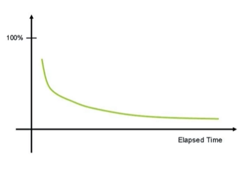
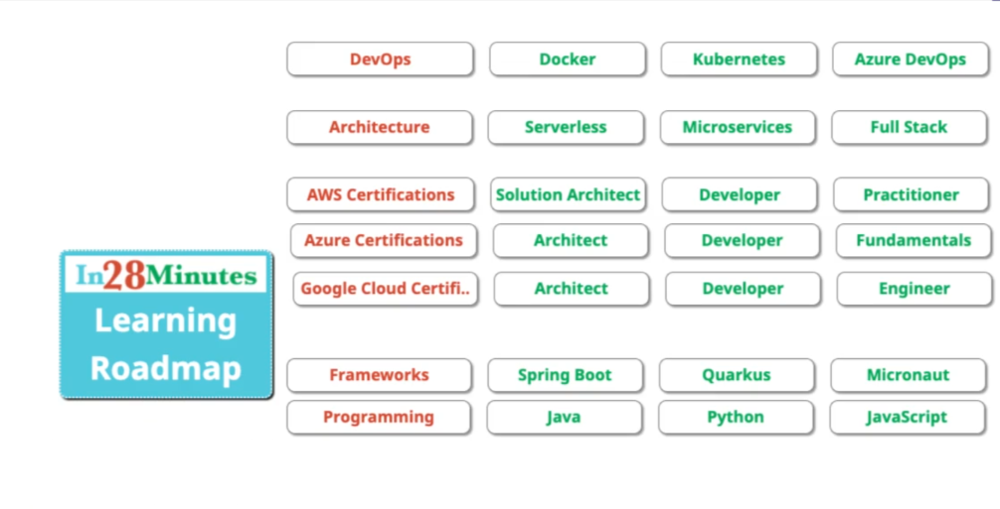

# Getting Started

* GCP has 200+ services. This exam expects knowledge of 40+ Services.
* Exam expects **in-depth knowledge** about these services
* Exam tests your **decision making abilities:**
• Which service do you choose in which situation?
• This course is **designed** to give you in-depth knowledge & make tough choices

## How do you put your best foot forward
* **Challenging certification** - Expects
understand and to you
**REMEMBER** a number of services
* As time passes, humans forget
things.
* How do you improve your chances
of remembering things?
  * **Active learning** - think and take notes
  * **Review** the presentation every once in a while

## Our Approach
* Three-pronged approach to reinforce concepts
  * Presentations(video)
  * Demos(Video)
  * Two kinds of quizzes
    * Text quizzes
    * Video quizzes

* (Recommended) Take your time. Do not hesitate to replay videos!
* (Recommended) Have Fun!

## Before the cloud - Example 1 - Online shopping App
## Before the Cloud - Example 2 - Startup
## Before the Cloud - Challenges
## Silver Lining in the Cloud
## Cloud - Advantages
## Google Cloud Platform(GCP)
## Best Path to learn GCP
## Maximizing Learning Efficiency with Playback Speed

