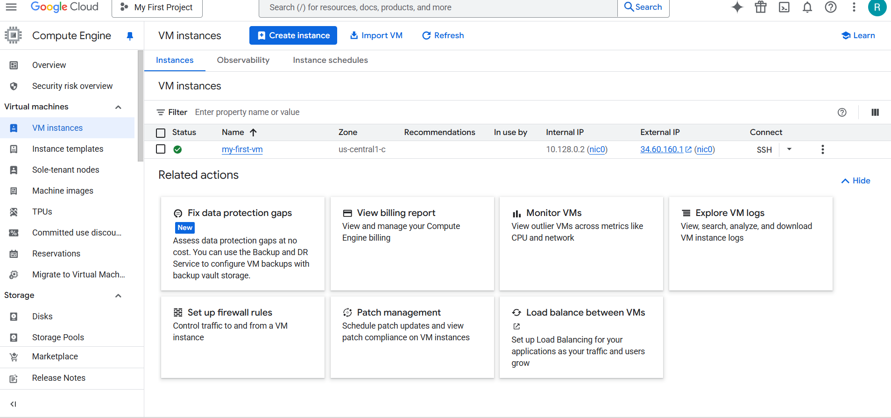

# Compute Engine Fundamentals

## Google Compute Engine(GCE)

## Compute Engine - Features
* In corporate data centers, applications are
deployed to physical servers
* Where do you deploy applications in the
cloud?
    * Rent virtual servers
    * Virtual Machines - Virtual servers in GCP
    * Google Compute Engine (GCE) - Provision & Manage
Virtual Machines
* Create and manage lifecycle of Virtual Machine (VM) instances
* Load balancing and auto scaling for multiple VM instances
* Attach storage (& network storage) to your VM instances
* Manage network connectivity and configuration for your VM instances
* Our Goal:
  * Setup VM instances as HTTP (Web) Server
  * Distribute load with Load Balancers

## Create your first VM

## What is Compute Engine?
Google Compute Engine (GCE) is an Infrastructure-as-a-Service (IaaS) offering from Google Cloud Platform (GCP) that allows users to run virtual machines (VMs) on Google's infrastructure. It provides scalable and flexible computing resources, high-performance persistent storage, advanced networking capabilities, and integration with other GCP services, making it suitable for a variety of workloads including web hosting, data processing, and high-performance computing.

## What is Compute Engine API?
The Compute Engine API is a RESTful interface provided by Google Cloud Platform that allows users to programmatically manage and control their virtual machines, networks, and other resources within Google Compute Engine.

## What is an Instance?
An instance is a virtual machine (VM) running on Google Cloud Platform's Compute Engine, providing the necessary resources and environment to run applications and workloads.

## What are General purpose Machines?
General purpose machines in Google Cloud Platform are VM instances optimized for a balanced mix of compute, memory, and network resources, suitable for a wide variety of workloads such as web servers, applications, and development environments.

## What are Compute optimized Machines?
Compute optimized machines in Google Cloud Platform are VM instances designed for high-performance computing tasks that require significant computational power, such as scientific simulations, machine learning, and data analysis.

## What are Memory optimized Machines?
Memory optimized machines in Google Cloud Platform are VM instances optimized for workloads that require a large amount of memory relative to CPU, such as in-memory databases, real-time analytics, and high-performance computing applications that manipulate large data sets in memory.

## What are Storage optimized Machines?
Storage optimized machines in Google Cloud Platform are VM instances designed for workloads that require high disk throughput and storage capacity, such as databases, data warehousing, and big data processing tasks that rely heavily on local disk performance.

## What are GPUs ?
GPUs, or Graphics Processing Units, are specialized hardware accelerators used to enhance the performance of compute-intensive tasks, particularly those involving parallel processing. In the context of Google Cloud Platform (GCP), GPUs are available as virtual machine instances within Compute Engine and are used for tasks such as machine learning, scientific simulations, video transcoding, and more. They excel at handling large volumes of data and performing complex calculations efficiently.

## What is E2 in General Purpose Machine?
E2 instances in Google Cloud Platform's Compute Engine are part of the general-purpose machine family optimized for cost-effective performance. They offer a balanced mix of CPU and memory resources suitable for a wide range of applications, from web servers to enterprise applications, providing flexibility and cost efficiency.

## What are Boot Disks?
Boot disks in Google Cloud Platform (GCP) are virtual disks attached to virtual machine (VM) instances that contain the operating system and boot files necessary to start and run the instance. They provide the initial software environment required for the VM to boot up and operate normally.

## What is Firewall?

A firewall is a network security system, either hardware- or software-based, that controls incoming and outgoing network traffic based on predetermined security rules. In the context of Google Cloud Platform (GCP), firewall rules define the allowed connections to and from VM instances, providing a layer of protection by filtering traffic based on IP addresses, protocols, and ports. This helps prevent unauthorized access and ensures network security within GCP environments.
#### What is the Allow HTTP Traffic option?

The "Allow HTTP Traffic" option in Google Cloud Platform (GCP) refers to a firewall rule set that permits incoming HTTP (Hypertext Transfer Protocol) traffic to specified resources, typically virtual machine instances. Enabling this option allows these instances to receive and respond to HTTP requests, facilitating web server functionality and web application hosting within GCP environments.

## What are Labels in GCP?
Labels in GCP are key-value pairs that help organize, manage, and filter resources for purposes such as billing, administration, and automation.

## What is Migrate VM instance option?
This option allows GCP to automatically migrate your VM instance to another host without shutting it down. This ensures continuous availability of your application during maintenance activities.

#### What is the Terminate VM instance option?

This option involves stopping and then restarting your VM instance on a new host after the maintenance is complete. It requires your application to handle the downtime and potential data loss if the instance is not set up for automatic restart.

## Google Cloud Instance Actions

Here are the key actions for managing a Google Cloud VM instance and their billing implications:

**Stop:**

  - Shuts down the VM, but keeps the persistent disk.
  - You are not charged for the VM's core and memory, but you are still charged for the persistent disk storage.

**Suspend:**

  - Saves the VM's state to disk and stops it.
  - You are still charged for the persistent disk and the VM's memory and CPU resources.

**Delete:**

  - Permanently deletes the VM and its associated resources, including the persistent disks.
  - All charges for the VM and its disks are stopped.

To **stop all charges**, you can directly **choose to Delete** the instance without needing to Stop it first.