## Compute Engine - Features

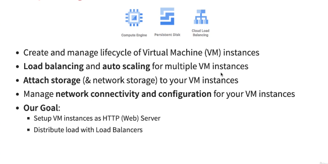

## Understanding Machine Types and Images in Google Compute Engine - GCE

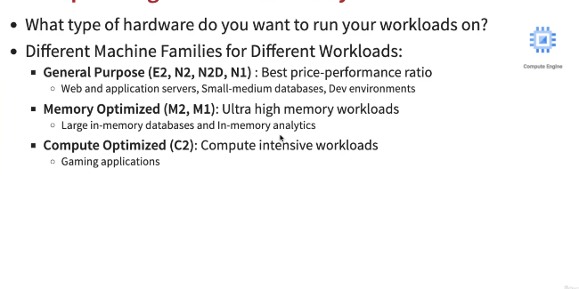

* If you want lot of RAM to run your applications, you need memory optimized families
* For Gaming applications , you need lot of CPU so in that we go for Compute Optimized

## Compute Engine Machine Types

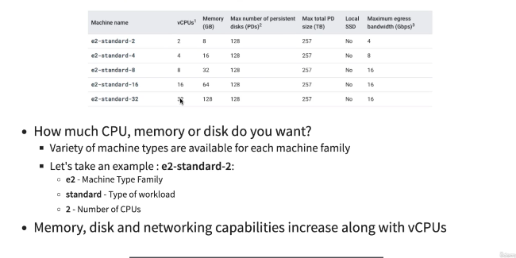

* And after selecting the machine family we need what type of Operating system we would like.

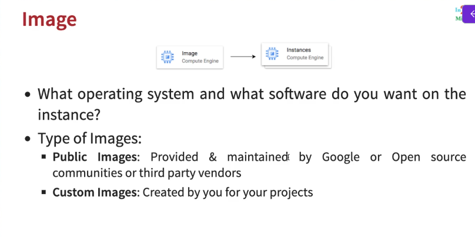

## Installing HTTP Weserver on Google Compute Engine Virtual Machine

* `sudo su` to become root user
* Now let's install Apache
  * Apache is the http server that we would want to run on the virtual machine
  * `apt install apache2` - 
    * apache2 is the name of the package
    * apt is the package manager
    * Click on external IP address of the VM machine
* now go to `ls /var/www/html`
  * you will find index.html file, if you want to customize
* type 
  * `echo "hello world" > /var/www/html/index.html`
    * above is basically pipe the output into index.html file
* To start Apache server again after installing use this - `service apache2 start`

## Understanding Internal and External IP addresses

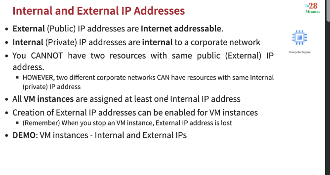

* Exteranl IP address is changed most of the times when we stop and start a virtual machine again

## Static IP Addresses
* Scenario - How do you get a constant External IP address for a VM instance?
  * Quick and dirty way is to assign an Static IP Address to the VM
* Demo

To reserve static IP address navigate to VPC Networks >> IP Addresses

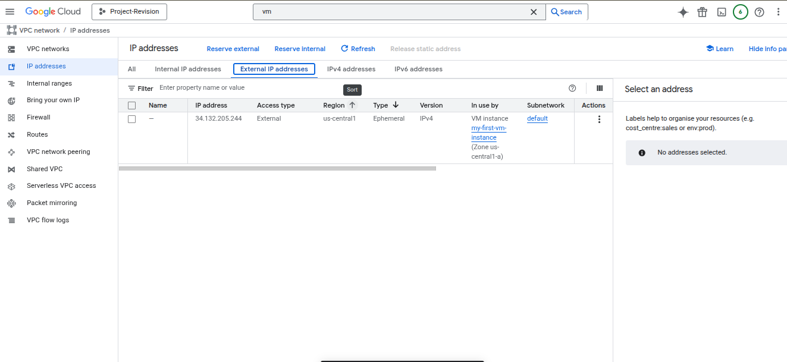

* **Caution** - Do not change the region while reserving the external IP address. Static address should be in the same region as your VM

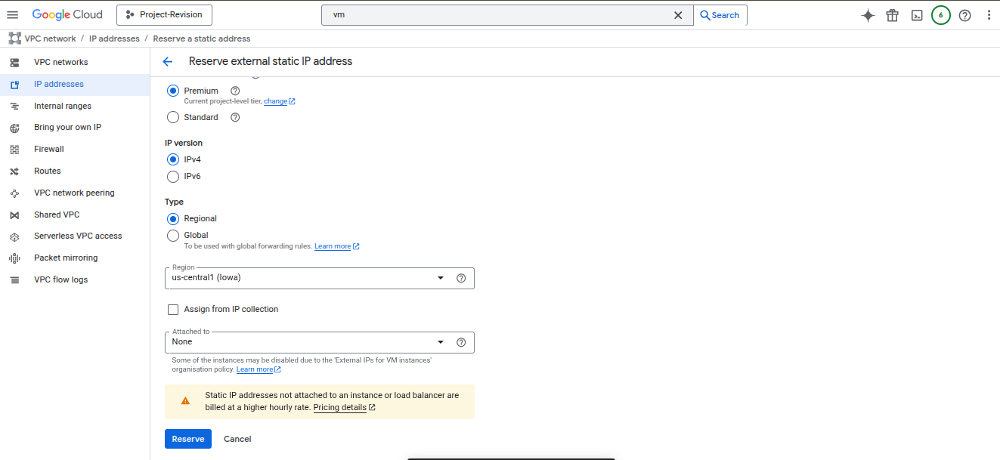

* Stati IP address do not get removed even if we stop the VM instance

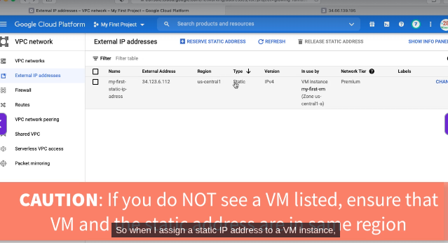

## Understanding Static IP Address in GCP 
Note - Static IP can be switched to another VM instance in same project

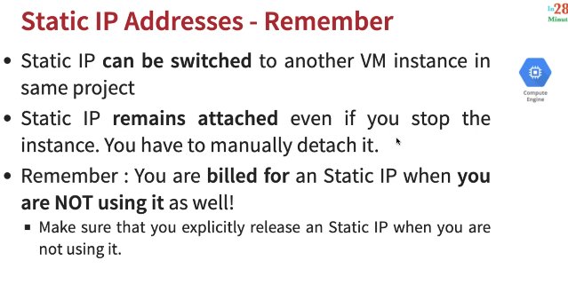

## Start up scrit for next step

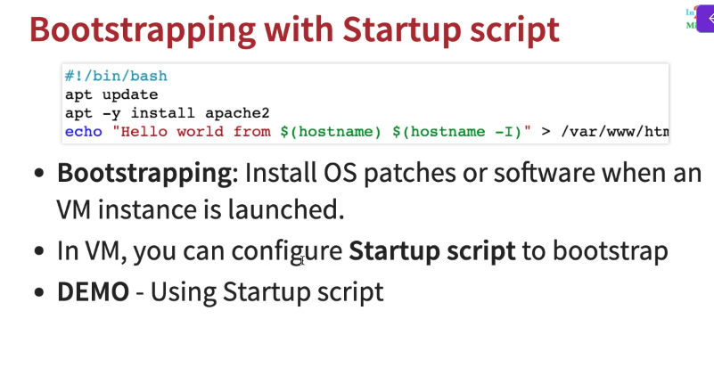

```
#!/bin/bash
apt update 
apt -y install apache2
echo "Hello world from $(hostname) $(hostname -I)" > /var/www/html/index.html
```

Why we want to do it? The idea is "Can the machine prepare itself automatically the first time it wakes up?”

`🧠 Bootstrapping is the process by which a VM configures itself automatically during its first boot, using predefined instructions.`

* Note - `-y` is given for Yes when it asks if to install or not

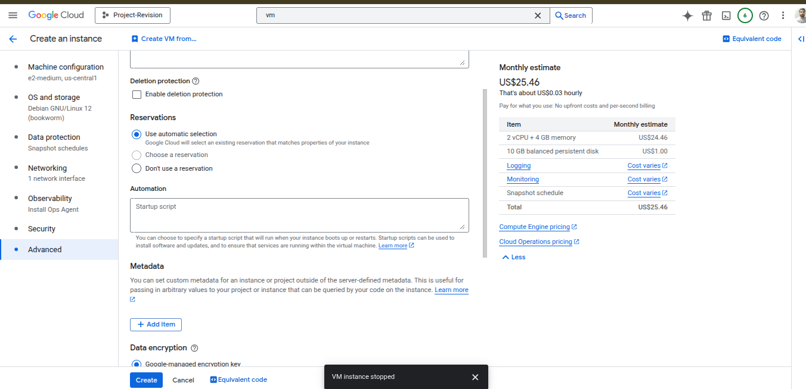

## Simplifying VM creation with Instance Template
Basically - Remember this - **Describe a VM instance once and then use that template to create groups of identical instances**


* Now above process are manual
* can we make it more easy if we require again and again for fixed things

* Why do you need to specify all the VM instance details(Image, instance type etc) every time you launch an instance?
  * How about creating a Instance a Instance template?
  * Define machine type, image, labels, starup script and other properties
* Used to create VM instances and managed instance groups
  * Provides a convenient way to create similar instances
* One thing to node - After creation of instance template we **CANNOT** update it.
  * To make an update/change , copy an existing template and modify it.

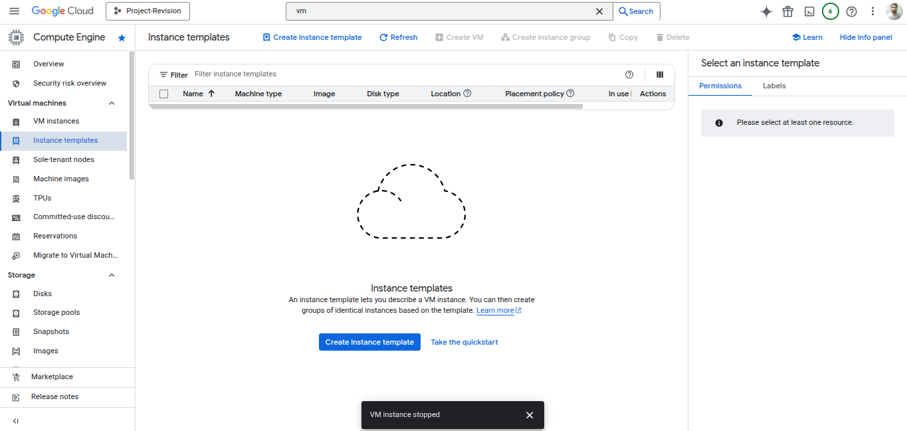

>So and later when we later create a VM machine from instance template, all the details will be automatically pre-populated.
> you can customize further while creating, but ideally just click "create"

## Reducing Launch Time with Custom Image
> There is one more problem with the above approach we took
> Intalling OS patches and software at the launch of VM instances increases boot up time
> Basically it takes a lot of time to launch that VM Instance
> so how to avoid it? one approach - is to create custom image with OS Patches and software pre-installed

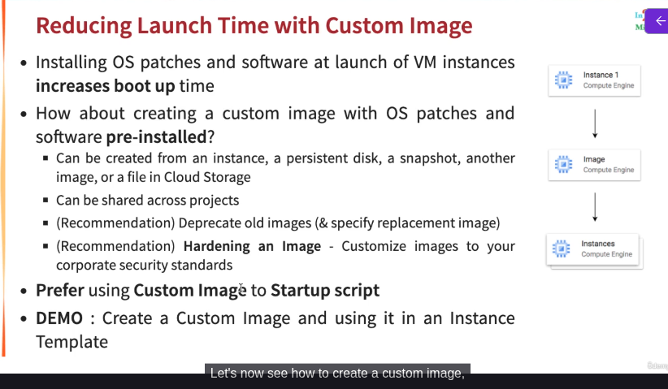

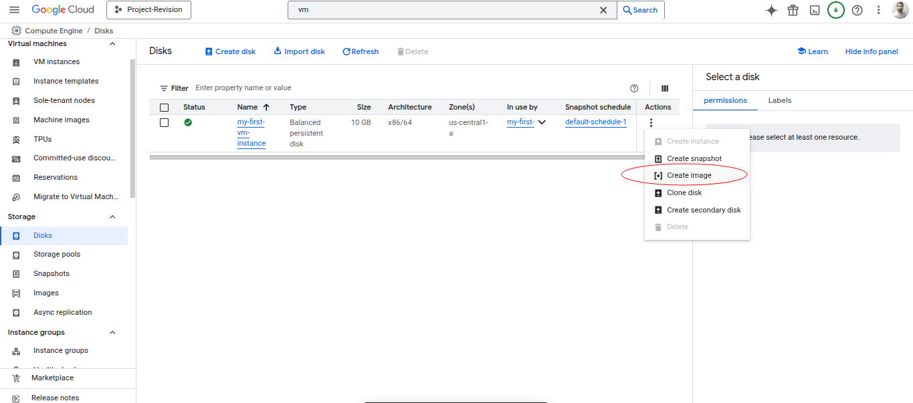


| Option                    | Core idea                    | Question it answers                         |Use it when|
| ------------------------- | ---------------------------- | ------------------------------------------- |-------------------|
| **Create snapshot**       | Time-freeze                  | “How does this disk look *right now*?”      |You want backups, You want rollback, You want safety before risky changes|
| **Create image**          | Make a reusable OS blueprint | “Can I create *new VMs* from this?”         |You want to launch many identical VMs, You want consistency, You want automation, Auto-scaling VMs, Production replicas, |
| **Clone disk**            | Exact copy                   | “Can I get *another identical disk*?”       |You want a quick copy, Same zone, Same size, Same data|
| **Create secondary disk** | Attach extra storage         | “Can I give another VM *this disk’s data*?” |This disk is not booted, OS already exists on another disk. You want just extra space|


Important - 

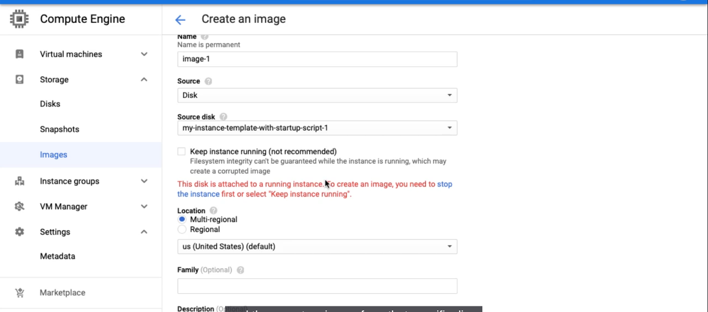

you will be able to create an Image if a VM instance is stopped, else it will give error

So after creating an Image , now we can go create VM from instance template and it this from custom image which we created above

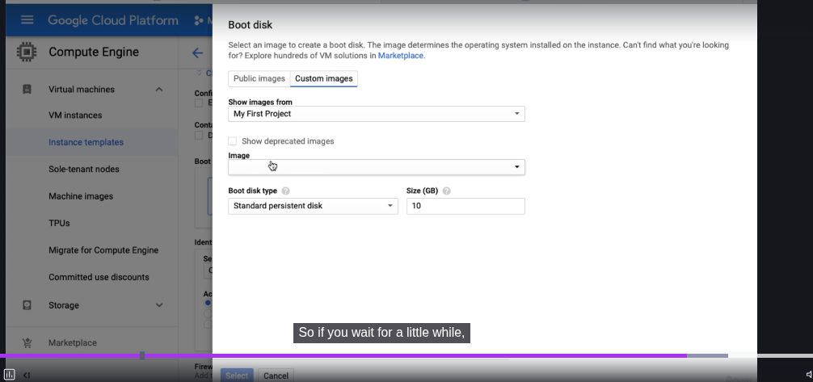

* Your custom-image created above will appear under **Image** option

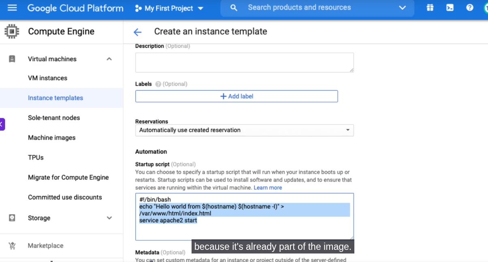

we can also put our start-up script in above. 

**So by creating custom image, it reduces our time of launching the VM instance**

