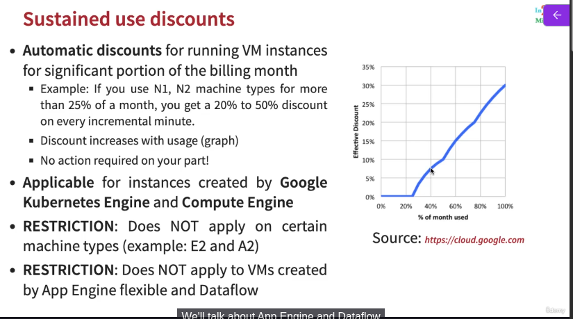
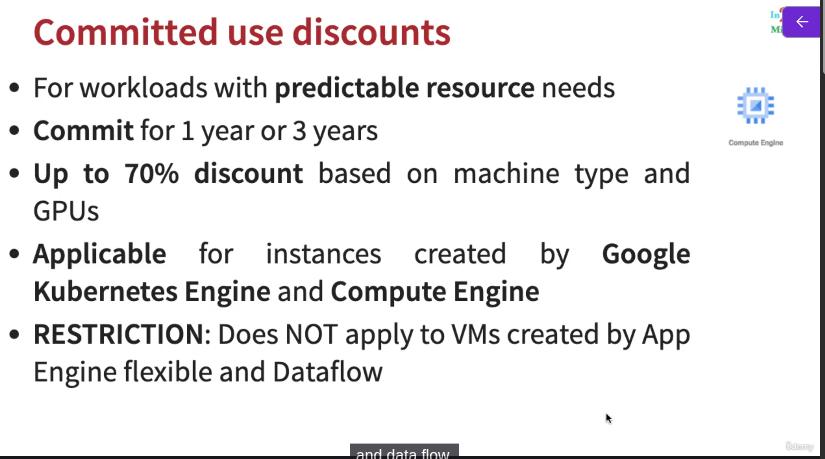
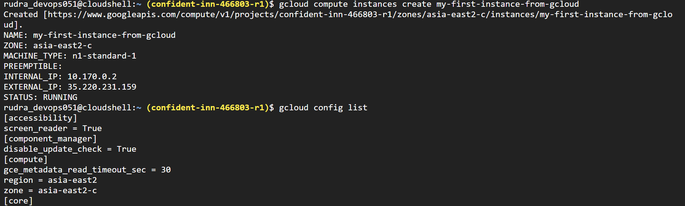
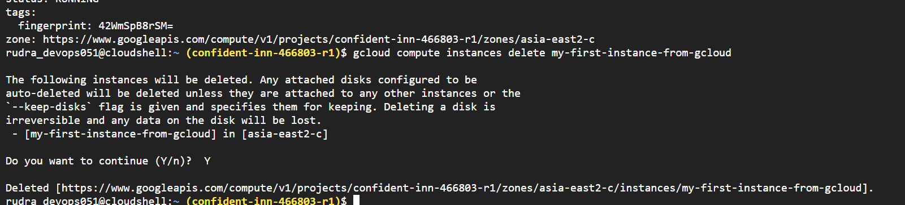

# Section 5: Google Compute - Optimizing Costs and Performance in GCP

## Sustained Use Discounts

* These are automatically applied when you use instanes created by GKE or VMs usage




## Committed use discounts
* It needs commitment from you if you think you need specific resources for some fixed time like 1 year




## Gcloud
* Command line interface to interact with Google Cloud Resources
* Most GCP services can be managed from CLI using Gcloud:
  * Compute Engine Virtual Machines
  * Managed Instance Groups
  * Databases
  * and ... many more
* You can create/delete/update/read existing resources and perform
actions like deployments as well!
* (REMEMBER) SOME GCP services have specific CLI tools:
  * Cloud Storage - gsutil
  * Cloud BigQuery - bq
  * Cloud Bigtable - cbt
  * Kubernetes - kubectl (in addition to Gcloud which is used to manage clusters)

## commands
```txt
gcloud config list project
gcloud config configurations list
gcloud config configurations activate my-default-configuration
gcloud config list
gcloud config configurations describe my-second-configuration
gcloud compute instances list
gcloud compute instances create
gcloud compute instances create my-first-instance-from-gcloud
gcloud compute instances describe my-first-instance-from-gcloud
gcloud compute instances delete my-first-instance-from-gcloud
gcloud compute zones list
gcloud compute regions list
gcloud compute machine-types list
 
gcloud compute machine-types list --filter zone:asia-southeast2-b
gcloud compute machine-types list --filter "zone:(asia-southeast2-b asia-southeast2-c)"
gcloud compute zones list --filter=region:us-west2
gcloud compute zones list --sort-by=region
gcloud compute zones list --sort-by=~region
gcloud compute zones list --uri
gcloud compute regions describe us-west4
 
gcloud compute instance-templates list
gcloud compute instance-templates create instance-template-from-command-line
gcloud compute instance-templates delete instance-template-from-command-line
gcloud compute instance-templates describe my-instance-template-with-custom-image
```



delete the instance - 

