# Section 5: Google Compute - Optimizing Costs and Performance in GCP

## Sustained Use Discounts

* These are automatically applied when you use instanes created by GKE or VMs usage


* Note above does not apply to VMs created using App engine and dataflow


## Committed use discounts
* It needs commitment from you if you think you need specific resources for some fixed time like 1 year


* Note above does not apply to VMs created using App engine and dataflow

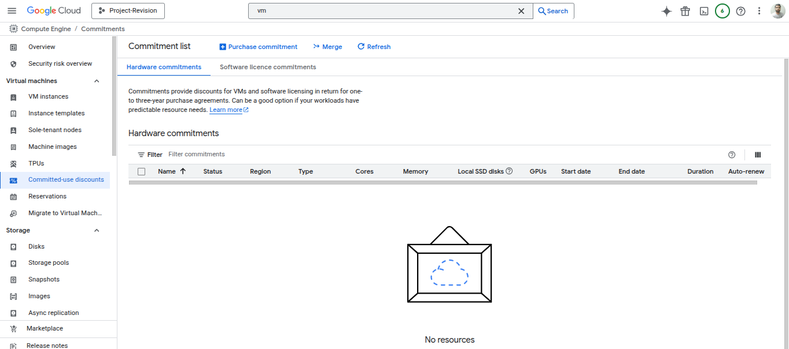

## Preemptible VM
* Use it when
  *  your applications are **fault tolerant**
  *  you are very **cost sensitive**
  *  your workload is **NOT immediate**
  *  Example - Non immediate batch processing jobs

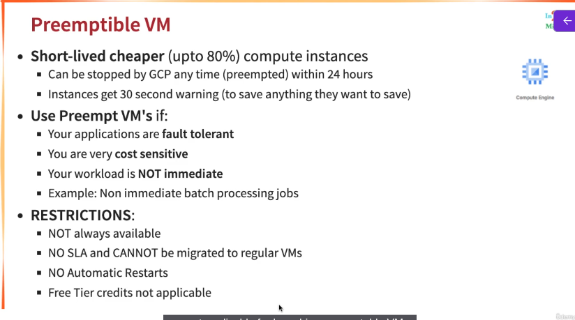

Under Machine Configuration >> Advanced Configurations

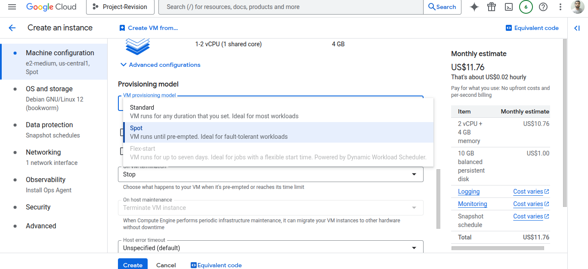

Update - Only change is now it **doesn't have maximum runtime**. Previously it was only for 24 hours.

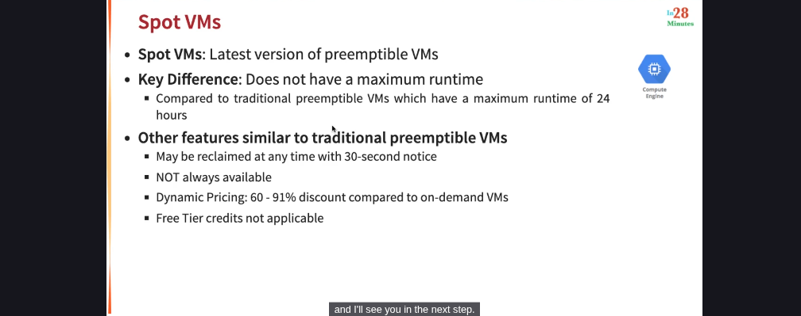

## Understanding Billing for Google Compute Engine
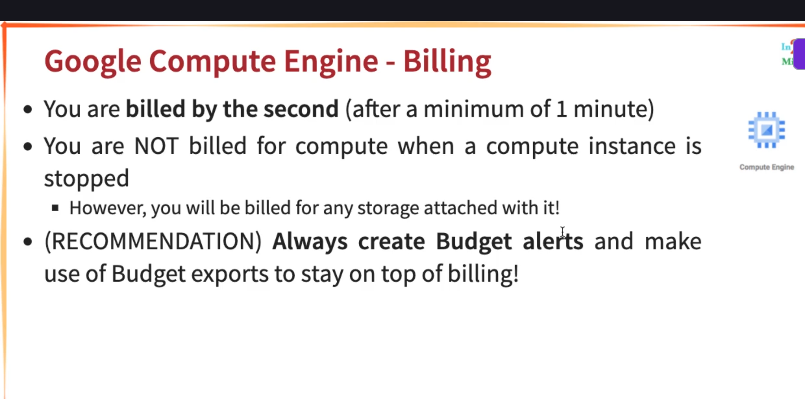

Navigate to the following

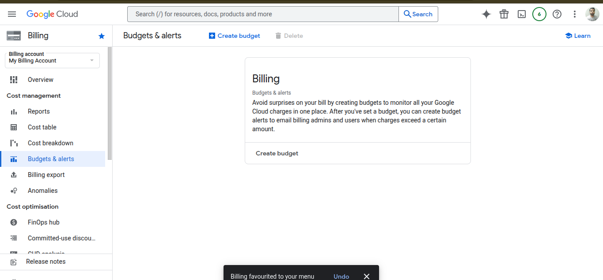

* Billing Export

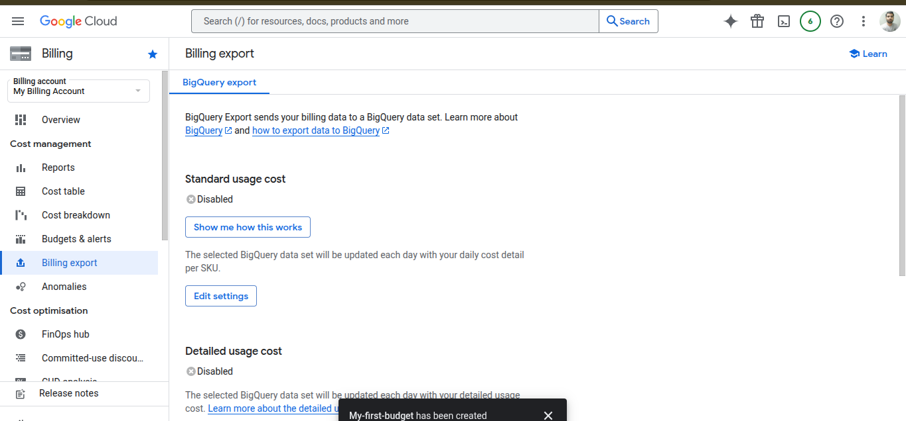

you can send your billing data to BigQuery Dataset

## Achieving High Availability with Live Migration and Automatic Restart
* How do you keep your VM instances running when a host system needs to be updated(a software or a hardware update needs to be performed)?
  * > You don't wnat your application to go down when you want to upgrade your software or hardware
* **Live Migration**
  * Your running instances is migrated to another host in the same zone
  * Does not change any attributes or properties of the VM
  * SUPPORTED for instances with local SSDs
  * NOT SUPPORTED for GPUs and preemptible instance
* Important Configuration - **Availability Policy**
  * **On host maintenance** - What should happen during periodic infrastructure maintenance?
    * Migrate(default) - Migrate VM instance to other hardware
    * Terminate - Stop the VM instance
  * **Automatic restart** - Restart VM instances if they are terminated due to non-user-initiated reasons(maintenance event, hardware failure etc.)

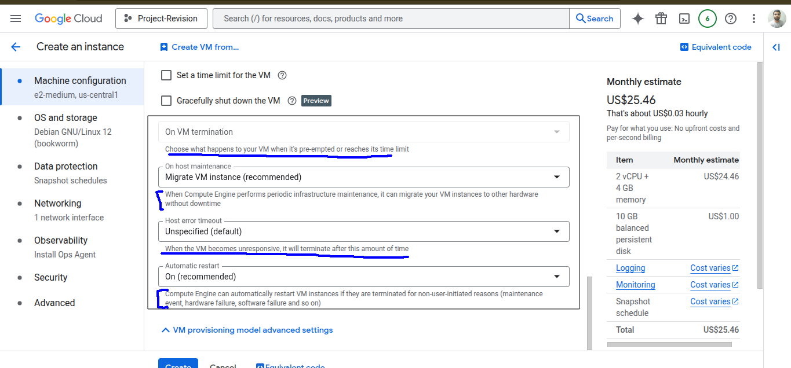

**Basically set the "On host maintenance" to Migrate**

## Exploring GPUs(Graphic Processing Unit) in Google Compute Engine


**Note** - On host maintenance, you need to terminate the VM instance

> GPUs can't be added to VMs while in the free trial programme. To enable adding GPUs to VMs, upgrade to a paid Cloud Billing Account.

## Quick Review

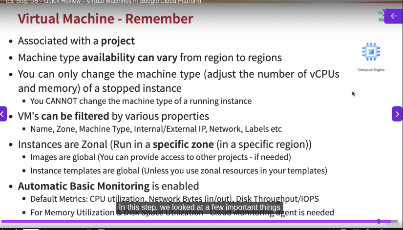

* Important - You must stop the VM instance to edit it's machine type.
  * Don't get confused with live migration. Here machine type is not changed. This is done by google to maintain the host.
  * But when we do, we need to stop the VM

Note - 
* Instances are zonal(in a specific zone NOT region)
  * Instance templates global(unless you use zonal resources in your templates)
  * Custom Images(to reduce launch time of VM) are global - You can provide access to other project if needed
* **Automatic Basic Monitoring** is enabled

## Sole-tenant nodes
* when you want more security, compliance
  
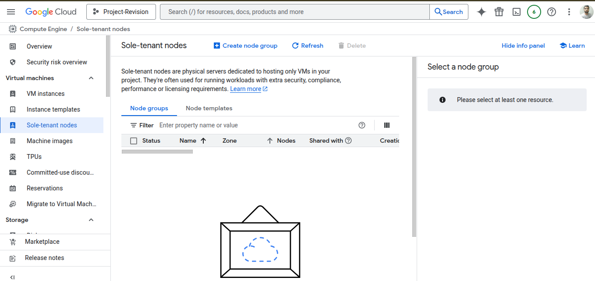

## Virtual Machine manager
* Basically to manage Virtual Machine
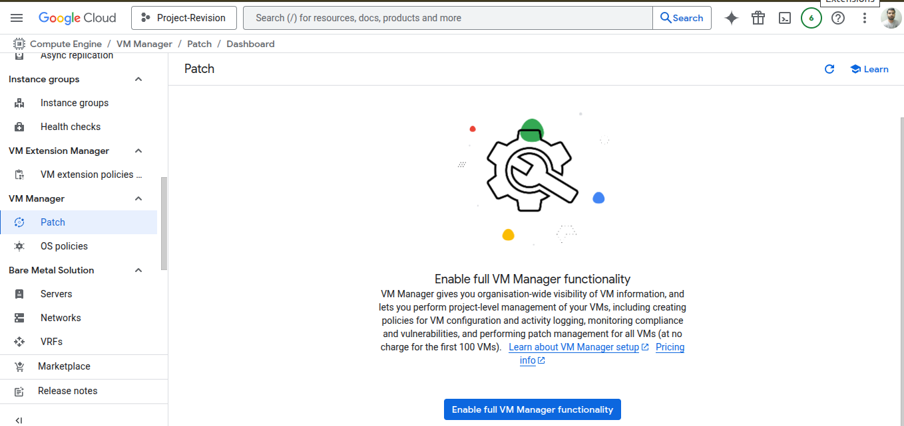

## Scenarios - Virtual Machine

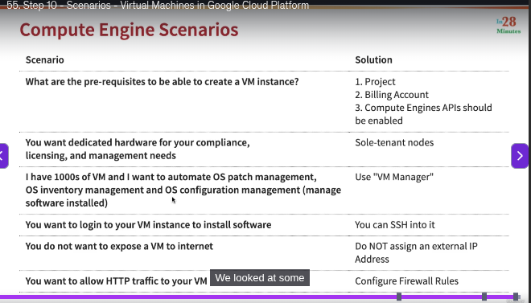

## Quick Review

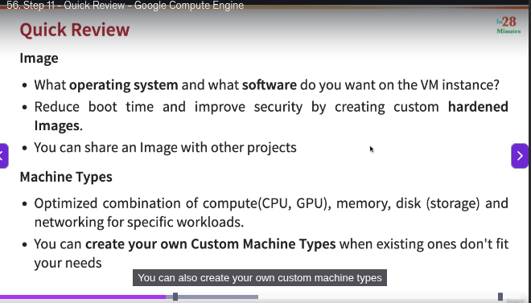

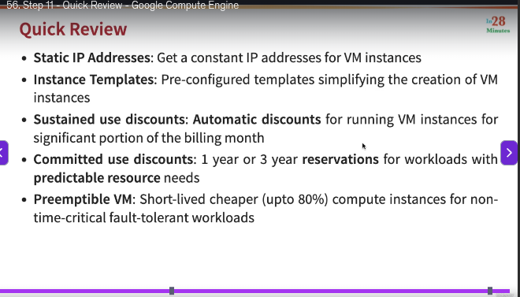


## Gcloud
* Command line interface to interact with Google Cloud Resources
* Most GCP services can be managed from CLI using Gcloud:
  * Compute Engine Virtual Machines
  * Managed Instance Groups
  * Databases
  * and ... many more
* You can create/delete/update/read existing resources and perform
actions like deployments as well!
* (REMEMBER) SOME GCP services have specific CLI tools:
  * Cloud Storage - gsutil
  * Cloud BigQuery - bq
  * Cloud Bigtable - cbt
  * Kubernetes - kubectl (in addition to Gcloud which is used to manage clusters)

## commands
```txt
gcloud config list project
gcloud config configurations list
gcloud config configurations activate my-default-configuration
gcloud config list
gcloud config configurations describe my-second-configuration
gcloud compute instances list
gcloud compute instances create
gcloud compute instances create my-first-instance-from-gcloud
gcloud compute instances describe my-first-instance-from-gcloud
gcloud compute instances delete my-first-instance-from-gcloud
gcloud compute zones list
gcloud compute regions list
gcloud compute machine-types list
 
gcloud compute machine-types list --filter zone:asia-southeast2-b
gcloud compute machine-types list --filter "zone:(asia-southeast2-b asia-southeast2-c)"
gcloud compute zones list --filter=region:us-west2
gcloud compute zones list --sort-by=region
gcloud compute zones list --sort-by=~region
gcloud compute zones list --uri
gcloud compute regions describe us-west4
 
gcloud compute instance-templates list
gcloud compute instance-templates create instance-template-from-command-line
gcloud compute instance-templates delete instance-template-from-command-line
gcloud compute instance-templates describe my-instance-template-with-custom-image
```


delete the instance - 

