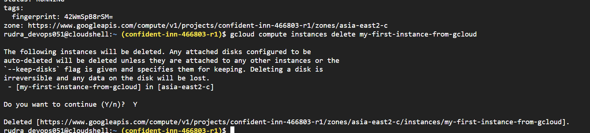

## Gcloud for Associate Cloud Engineer
* **Command line interface** to interact with Google Cloud Resources
* Most **GCP services can be managed from CLI** using Gcloud:
  * Compute Engine Virtual Machines
  * Managed Instance Groups
  * Databases
  * and ... many more
* You can **create/delete/update/read** existing resources and perform
actions like deployments as well!
* (REMEMBER) SOME GCP services have specific CLI tools:
  * Cloud Storage - **gsutil**
  * Cloud BigQuery - **bq**
  * Cloud Bigtable - **cbt**
  * Kubernetes - **kubectl** (in addition to Gcloud which is used to manage clusters)

## Gcloud - Getting Started
**Installation**  
* Gcloud is part of Google Cloud SDK
  * Cloud SDK requires Python
  * Instructions to install Cloud SDK(and Gcloud) => https://cloud.google.com/sdk/docs/install
  * But you don't need to install it. There is alternative for above
* You can also use Gcloud on **Cloud Shell**
* **Connecting to GCP**
  * `gcloud init` - initialize or reinitialize gcloud
    * Authorize gcloud to use your user account credentials
    * Setup configuration
      * Includes current project, default zone etc
  * `gcloud config list` - It will list all properties of the active configuration

## Commands
* `gcloud --version` - It will show the version of gcloud we are using and list of tools that are already installed like bq, cbt, gsutil etc
* Run `gcloud help config` to learn how to change individual settings
* Run `gcloud --help` to see the Cloud Platform services you can interact with. And run `gcloud help COMMAND` to get help on any gcloud command.
* Run `gcloud topic --help` to learn about advanced features of the CLI like arg files and output formatting
* Run `gcloud cheat-sheet` to see a roster of go-to `gcloud` commands.
* Important things to remember
  * compute.zone
  * compute.region
  * core.account
  * core.project

## Commands executed in next steps
```txt
gcloud config list project
gcloud config configurations list
gcloud config configurations activate my-default-configuration
gcloud config list
gcloud config configurations describe my-second-configuration
gcloud compute instances list
gcloud compute instances create
gcloud compute instances create my-first-instance-from-gcloud
gcloud compute instances describe my-first-instance-from-gcloud
gcloud compute instances delete my-first-instance-from-gcloud
gcloud compute zones list
gcloud compute regions list
gcloud compute machine-types list
 
gcloud compute machine-types list --filter zone:asia-southeast2-b
gcloud compute machine-types list --filter "zone:(asia-southeast2-b asia-southeast2-c)"
gcloud compute zones list --filter=region:us-west2
gcloud compute zones list --sort-by=region
gcloud compute zones list --sort-by=~region
gcloud compute zones list --uri
gcloud compute regions describe us-west4
 
gcloud compute instance-templates list
gcloud compute instance-templates create instance-template-from-command-line
gcloud compute instance-templates delete instance-template-from-command-line
gcloud compute instance-templates describe my-instance-template-with-custom-image
```
## Playing with Gcloud config set
* list commands
  * e.g. `gcloud config list`
  * `gcloud config list compute/region`
  * `gcloud config list compute/zone`
* set commands
  * This is use to set the specified property in your active configuration
  * e.g. change the default region or zone or default account or default project
    * e.g. gcloud config set 


* If I want to remove the default project which is configured - `gcloud config unset`

## Managing Multiple Configurations in Gcloud 
* **Scenario** - You are working on multiple projects from the same machine. You would want to be able to execute commands using different configurations.  
  * Basically you would want to **easily switch between projects** and easily execute commands for them
  * **Solution** - we need to create multiple configurations
  * `gcloud config configurations create/delete/describe/activate/list`


| Command                             | Think of it as                 |
| ----------------------------------- | ------------------------------ |
| `gcloud config list`                | **What am I using right now?** |
| `gcloud config configurations list` | **What profiles do I have?**   |

* `gcloud config configurations create my-seond-configuration` - It will create a new configurations as well as activate it

## Understanding Command structure in Gcloud to play with services


## Playing with Gcloud compute instances create


## Setting Default Region and Zone for Compute zone
* Basically navigate to VM instances >> settings >> set value for `Default location`


Note - The third way in above will override the first two things.


## Exploring Gcloud commands - list and describe


## Update - Move command is deprecated


## Playing with Compute Instances in Gcloud


## Playing with Instance Templates in Gcloud


delete the instance - 



* Second Milestone completed


