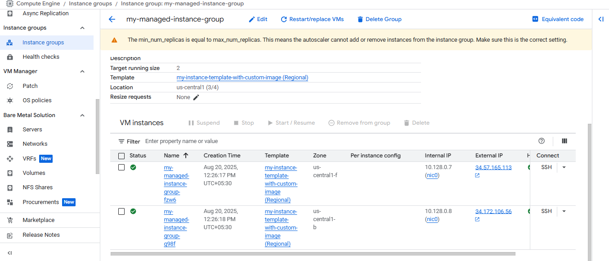
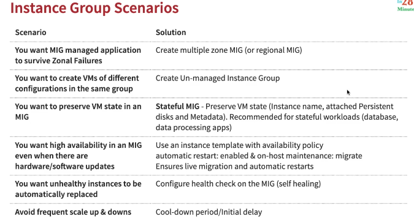
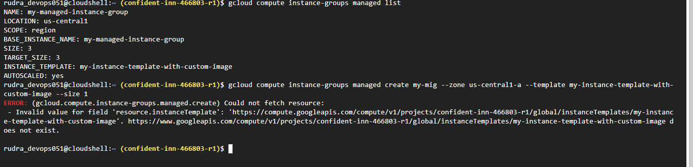

## Gcloud for Associate Cloud Engineer
* **Command line interface** to interact with Google Cloud Resources
* Most **GCP services can be managed from CLI** using Gcloud:
  * Compute Engine Virtual Machines
  * Managed Instance Groups
  * Databases
  * and ... many more
* You can **create/delete/update/read** existing resources and perform
actions like deployments as well!
* (REMEMBER) SOME GCP services have specific CLI tools:
  * Cloud Storage - **gsutil**
  * Cloud BigQuery - **bq**
  * Cloud Bigtable - **cbt**
  * Kubernetes - **kubectl** (in addition to Gcloud which is used to manage clusters)

## Gcloud - Getting Started
**Installation**  
* Gcloud is part of Google Cloud SDK
  * Cloud SDK requires Python
  * Instructions to install Cloud SDK(and Gcloud) => https://cloud.google.com/sdk/docs/install
* You can also use Gcloud on Cloud Shell
* **Connecting to GCP**
  * `gcloud init` - initialize or reinitialize gcloud
    * Authorize gcloud to use your user account credentials
    * Setup configuration
      * Includes current project, default zone etc
  * `gcloud config list` - It will list all properties of the active configuration

## Commands
* `gcloud --version` - It will show the version of gcloud we are using and list of tools that are already installed like bq, cbt, gsutil etc
* Run `gcloud help config` to learn how to change individual settings
* Run `gcloud --help` to see the Cloud Platform services you can interact with. And run `gcloud help COMMAND` to get help on any gcloud command.
* Run `gcloud topic --help` to learn about advanced features of the CLI like arg files and output formatting
* Run `gcloud cheat-sheet` to see a roster of go-to `gcloud` commands.
* Important things to remember
  * compute.zone
  * compute.region
  * core.account
  * core.project

## Commands executed in next steps
```txt
gcloud config list project
gcloud config configurations list
gcloud config configurations activate my-default-configuration
gcloud config list
gcloud config configurations describe my-second-configuration
gcloud compute instances list
gcloud compute instances create
gcloud compute instances create my-first-instance-from-gcloud
gcloud compute instances describe my-first-instance-from-gcloud
gcloud compute instances delete my-first-instance-from-gcloud
gcloud compute zones list
gcloud compute regions list
gcloud compute machine-types list
 
gcloud compute machine-types list --filter zone:asia-southeast2-b
gcloud compute machine-types list --filter "zone:(asia-southeast2-b asia-southeast2-c)"
gcloud compute zones list --filter=region:us-west2
gcloud compute zones list --sort-by=region
gcloud compute zones list --sort-by=~region
gcloud compute zones list --uri
gcloud compute regions describe us-west4
 
gcloud compute instance-templates list
gcloud compute instance-templates create instance-template-from-command-line
gcloud compute instance-templates delete instance-template-from-command-line
gcloud compute instance-templates describe my-instance-template-with-custom-image
```
## Playing with Gcloud config set
* list commands
  * e.g. `gcloud config list`
  * `gcloud config list compute/region`
  * `gcloud config list compute/zone`
* set commands
  * This is use to set the specified property in your active configuration
  * e.g. change the default region or zone or default account or default project


delete the instance - 


# Section 6: Getting started with Instance Groups in Google Cloud

* How do you create a group of VM instances?
  * Instance Group - Group of VM instances managed as a single entity
    * Manage group of similar VMs having similar lifecycle as ONE UNIT
* Two Types of Instance Groups:
  * Managed : Identical VMs created using a template:
 Features: Auto scaling, auto healing and managed releases
   * Unmanaged : Different configuration for VMs in same group:
     * Does NOT offer auto scaling, auto healing & other services
     * NOT Recommended unless you need different kinds of VMs
 * Location can be Zonal or Regional
   * Regional gives you higher availability (RECOMMENDED)

## Managed Instance Groups(MIG)
* Managed Instance Group - Identical VMs created using an Instance template
* Important Features - 
  * Maintain
  * Detect application failures
  * Increase and decrease instances based on load(Auto scaling)
  * Add Load balancer to distribute load

## Creating Managed Instance Group(MIG)
* Instance template is mandatory

# Questions
## What is Compute Engine?

Google Compute Engine (GCE) is an Infrastructure-as-a-Service (IaaS) offering from Google Cloud Platform (GCP) that allows users to run virtual machines (VMs) on Google's infrastructure. It provides scalable and flexible computing resources, high-performance persistent storage, advanced networking capabilities, and integration with other GCP services, making it suitable for a variety of workloads including web hosting, data processing, and high-performance computing.

## What are Instance groups?

Instance groups in GCP are sets of virtual machine instances managed together for load balancing and scaling. They distribute traffic evenly across instances, automatically adjust capacity based on demand, and ensure high availability by spreading instances across multiple zones.

## What are New managed instance group (stateless)?

A new managed instance group (stateless) in GCP is a set of VM instances managed as a single unit without preserving individual instance data. It automatically scales, balances traffic, and ensures all instances are identical, making it ideal for applications that don't need to retain data between restarts.

## What are Multiple zones in Location?

In GCP, multiple zones in a location refer to deploying resources across different zones within the same region. This enhances availability and reliability by spreading instances across separate physical locations, reducing the impact of a single-zone failure. Each zone operates independently, but resources within a region can communicate with low latency.

## What is the Autoscaling option On: add and remove instances to the group?

In GCP, the autoscaling option "On: add and remove instances to the group" automatically adjusts the number of VM instances based on demand. It adds instances when demand is high and removes them when demand is low, ensuring efficient resource usage and cost savings.

## What is CPU utilization: 60% (default) option in Autoscaling signals?

The "CPU utilization: 60% (default)" option in Autoscaling signals in GCP means that the autoscaler will aim to keep the average CPU usage of the instances in the group at 60%.
    * Add Instances: If CPU usage exceeds 60%, the autoscaler will add more instances to reduce the load.
    * Remove Instances: If CPU usage is below 60%, the autoscaler will remove instances to optimize resource usage and costs.

## What is Predictive autoscaling?

Predictive autoscaling in GCP is a feature that uses machine learning to forecast future traffic patterns and proactively adjust the number of VM instances in a managed instance group. It predicts changes in demand and scales the instances up or down in advance to ensure optimal performance and resource utilization, reducing latency and improving user experience.

## What is the Initialization Period?

The Initialization Period in GCP is the time allotted for a new VM instance to start and become fully operational before it starts receiving traffic. This period allows the instance to complete startup tasks like installing software and configuring settings, ensuring it is ready to handle requests effectively.

## What is the Health check option in Autohealing?

The Health Check option in Autohealing in GCP is used to monitor the health of VM instances in a managed instance group. It periodically checks whether instances are running properly. If an instance fails the health check, it is automatically replaced with a new one to ensure the group remains healthy and available.

## What is HTTP protocol?

HTTP (HyperText Transfer Protocol) is the protocol used for communication between web browsers and servers, defining how data is requested and delivered over the internet.

## What are Logs?

Logs are records of events or actions that occur within a system, application, or service. They capture information such as errors, warnings, activities, and status updates, providing a detailed history that helps in monitoring, debugging, and troubleshooting. In cloud environments like GCP, logs are essential for understanding system behavior, auditing, and ensuring security and compliance.

## What is a Check interval?

In computing and networking, the check interval refers to the time interval between successive checks or probes performed by a monitoring system to assess the status or health of a resource, such as a server or a service.

#### What is Timeout?

Timeout refers to the maximum amount of time a system or application will wait for a response before considering an operation as failed or abandoned. It is a crucial parameter in networking, communication protocols, and application interactions, ensuring that processes do not wait indefinitely for a response that may never arrive.

## What is a Healthy threshold?

The Healthy Threshold is a parameter used in health checks to determine how many consecutive successful checks are required to mark a target (such as a VM instance or a service) as healthy. It ensures that a target is considered healthy only after it consistently passes a certain number of health checks in succession, indicating that it is operating correctly and can handle traffic.

#### What is Unhealthy threshold?

The Unhealthy Threshold is a parameter used in health checks to determine how many consecutive failed checks are required to mark a target (such as a VM instance or a service) as unhealthy. It specifies the number of consecutive unsuccessful health checks that must occur before a target is considered unhealthy and potentially removed from rotation or replaced.

## What is the Initial delay?

Initial Delay refers to the time duration that a load balancer or health checker waits before starting to perform health checks on a newly registered or newly created instance. It allows the instance to complete initialization tasks, such as starting up services or loading applications before it is subjected to health checks. Setting an initial delay ensures that instances are fully operational and ready to handle requests before they are included in the pool of available resources, thereby improving the reliability and stability of the system.

### Instance Groups



## Updating a Managed Instance Group(MIG)
* Rolling update - Gradual
  * Specifiy new template
  * Specify how you want the update to be done
    * when should the update happen?
    * how should the update happen?
      * Maximum surge
      * Maximum unavailable
* Rolling Restart/replace
  * No change in template but replace/restart existing VMs




## Instance Groups Commands

`gcloud config set project [Project ID]`

```txt
gcloud compute instances create my-test-vm --source-instance-template=my-instance-template-with-custom-image
gcloud compute instance-groups managed list
gcloud compute instance-groups managed delete my-managed-instance-group
gcloud compute instance-groups managed create my-mig --zone us-central1-a --template my-instance-template-with-custom-image --size 1
gcloud compute instance-groups managed set-autoscaling my-mig --max-num-replicas=2 --zone us-central1-a
gcloud compute instance-groups managed stop-autoscaling my-mig --zone us-central1-a
gcloud compute instance-groups managed resize my-mig --size=1 --zone=us-central1-a
gcloud compute instance-groups managed recreate-instances my-mig --instances=my-mig-85fb --zone us-central1-a
gcloud compute instance-groups managed delete my-managed-instance-group --region=us-central1
```

update - `gcloud compute instances create my-test-vm --source-instance-template=https://compute.googleapis.com/compute/v1/projects/<<PROJECT_ID>>/regions/<<REGION>>/instanceTemplates/<<INSTANCE_TEMPLATE_NAME>>`

