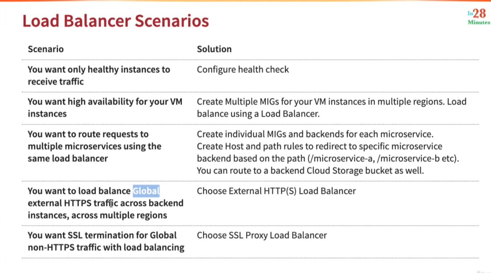

# Getting started with Instance Groups in Google Cloud

# Load Balancing in Google Cloud Platform

## Cloud Load Balancing
* Distributes user traffic across instances of an application in single region or multiple regions
* Enables
  * High Availability
  * Auto Scaling
  * Resiliency

Testing should cover edge cases: old timestamps, time zones, leap years, or migrated data.

## Load Balancer Scenarios

## Learning Pledge