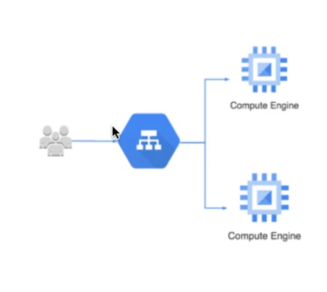
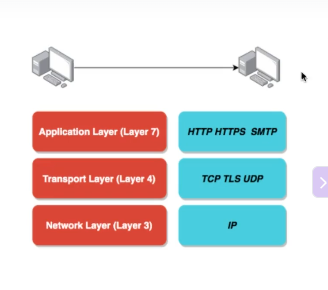
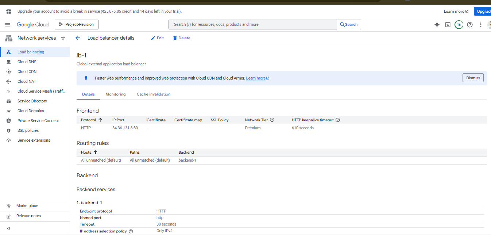
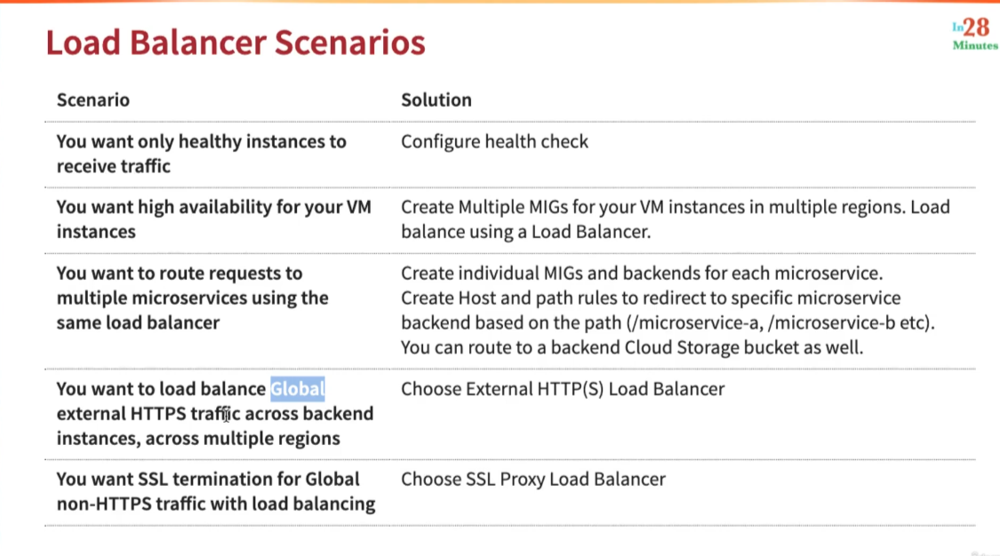
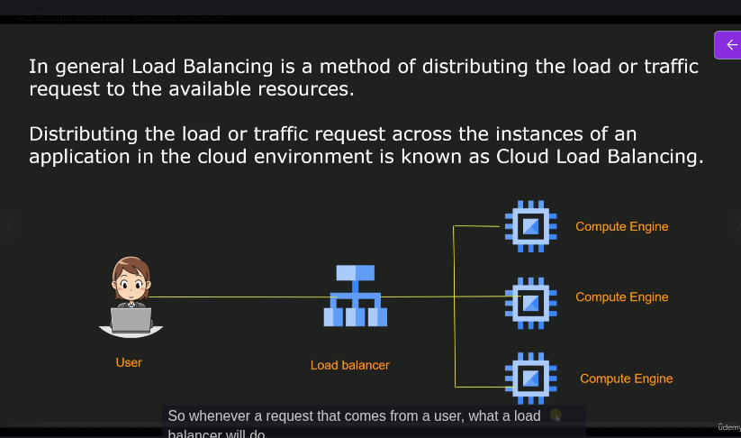
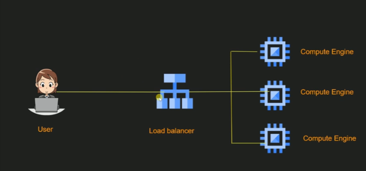

# Load Balancing in Google Cloud Platform

## Cloud Load Balancing
* Distributes user traffic across instances of an application in single region or multiple regions
* **Fully distributed, software defined** managed service
* Important Features - 
  * Health check - Route to healthy instances
    * Recover from failures
  * Auto Scaling
  * Global load balancing with single anycast IP
    * Also supports internal load balancing
* **Enables**
  * High Availability
  * Auto Scaling
  * Resiliency

above is high level view of cloud load balancer

## Understanding HTTP, HTTPS, UDP and TCP Protocols
* Computers use protocols to communicate
* Multiple layers and multiple protocols
* **Network Layer** - Transfer bits and bytes
* **Transport Layer** - Are the bits and bytes tranferred properly
* **Application Layer** - Make REST API calls and Send Emails
* (Remember) Each layer makes use of the layers beneath it
* (Remember) Most applications talk at application layer. But some applications talk at network layer directly(High Performance)

* **Network Layer**
  * IP(Internet Protocol) - Tranfer bytes. Unreliable
* **Transport Layer**
  * TCP(Transmission control) - Reliability > Performance
  * TLS(Transport Layer Security) - Secure TCP
  * UDP(User Datagram Protocol) - Performance > Reliability
* **Application Layer**
  * HTTP(Hypertext Transfer Protocol) - Stateless Request Response Cycle
  * HTTPS - Secure HTTP
    * It secure HTTP communication by having certificates. It uses certificates which are installed on the servers to ensure communication between two system is secure.
  * SMTP - Email Transfer Protocol
  * and a lot of others

**In summary -** 

What's happening under the hood will help in understanding what's happening what we are going to talk in the next steps.

## Creating a Load Balancer in GCP - Demo | Hands-on
Add the details for frontend, backend and Routing rules  

## Cloud Load Balancing - Terminology
* **Backend** - Gropu of endpoints that receive traffic from a Google Cloud load balancer(example - Instance Groups)
  * > Backend is nothing but managed Instance group
  * > You can create backend for each of your microservices.
* **Frontend** - Specify an IP address, port and protocol. This IP address is the frontend IP for your client request. 
  * > If you are using SSL then a certificate is assigned to your cloud load balancer.
* **Host and path rules**(For HTTP(S) Load Balancing) - Define rules redirecting the traffic to different backends
  * **Based on path** - in28minutes.com/a vs in28minutes.com/b
  * **Based on Host** - a.in28minutes.com vs b.in28minutes.com
  * **Based on HTTP headers**(Authorization header) and methos(POST, GET, etc)

### Load Balancing - SSL/TLS Termination/ Offloading
> If you are using layer 7, then you're doing SSL termination or SSL offloading.
> If you are using layer 4, then you're doing TLS termination or TLS offloading.

* Client to Load Balancer - Over Internet
  * HTTPS recommended
* Load Balancer to VM instance - Through Google internal network
  * HTTP is ok. HTTPS is preferred
* SSL/TLS Termination/Offloading
  * Client to Load Balancer - HTTPS/TLS
  * Load Balancer to VM instance - HTTP/TCP

## Cloud Load Balancing - Features

|**Load Balancer**|**Type of Traffic**|**Proxy or pass-through**|**Destination Ports**|
|--|--|--|--|
|**External HTTP(S)**|Global, External, HTTP or HTTPS|Proxy|HTTP on 80 or HTTPS on 443|
|**Internal HTTP(S)**|Regional, Internal, HTTP or HTTPS|Proxy|HTTP on 80 or 8080, HTTPS on 443|
|**SSL Proxy**|Global, External, TCP with SSL offload|Proxy|A big list|
|**TCP Proxy**|Global, External, TCP without SSL offload|Proxy|A big list|
|**External Network TCP/UDP**|Regional, External, TCP or UDP|Pass-through|any|
|**Internal TCP/UDP**|Regional, internal, TCP or UDP|Pass-through|any|

## Load Balancer Scenarios

## OR Google Cloud Load Balancer
* Basically method of distributing the load or traffic request to the available resource

Advantages - 
* Auto Scaling
* High Availability
* Health Monitors
* Global Load Balancing

* **What is Auto-Scaling?**

Suppose above 3 VM can handle 10000 requests per second. what if there are 15000 requests per second? It will lead to application unavailability.
So load balancer will monitor when load is coming more than threshold.
So auto-scaling is basically increasing or decreasing resources

* **What is High-availability?**
What if one VM crashes, then still our application will be available from other 2 Virtual machine. So it will be serving from there

* **What is Health Monitors?**

Above situation will not occur because we have Health monitors. what if some VM becomes slow or went down. so load balancer will check the health of the available  resources.

* **What is Global Load balancing?**

You can distribute the load across multple zones or multiple regions.

## Cloud Load Balancing Terminologies - 
* **Frontend**
  * It is basically representation of the application.
  * It is basically combination of IP address and port number.
* Host and Path rules
  * Which traffic should be allowed.
* **Backend**
  * It is where the actual application is running.