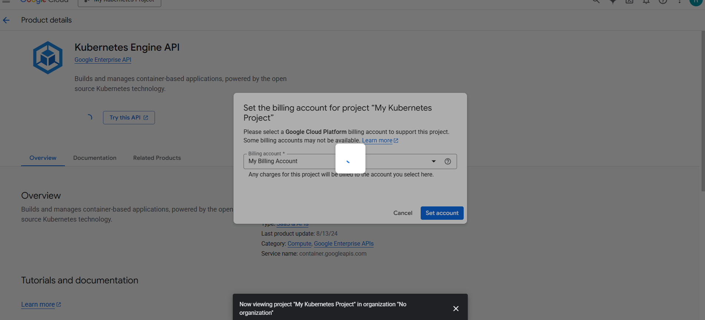
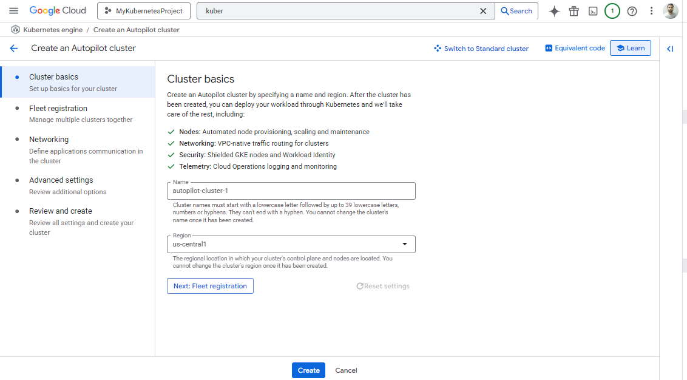
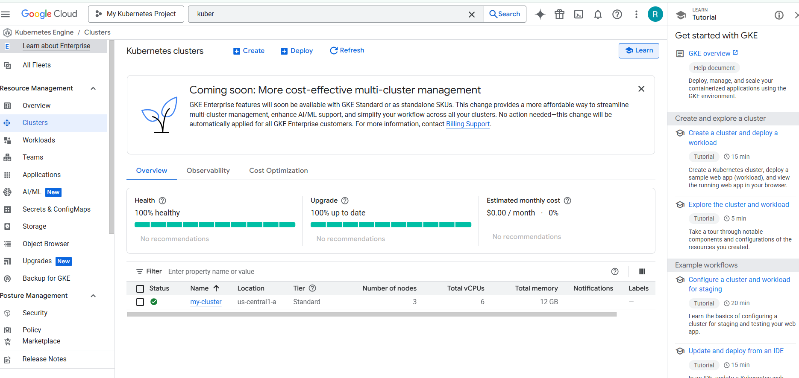

# Google Kubernetes Engine
* Most popular open source container orchestration solution
* Provides Cluster (including upgrades) Management
  * Each cluster can have different types of
 virtual machines
 * Provides all important container
 orchestration features:
    * Auto Scaling
    * Service Discovery
    * Load Balancer
    * Self Healing
    * Zero Downtime Deployments
* Managed Kubernetes service
* Minimize operations with auto-repair(repair failed nodes) and auto-upgrade(use lates version of K8S always) features
* Provides **Pod and Cluster Autoscaling**
* Enable Cloud Logging and Cloud Monitoring with simple configuration
* Uses Container-Optimized OS, a hardened OS built by Google
* Provides support for persistent disks and local SSD

## Commands

```txt
gcloud config set project my-kubernetes-project-304910
gcloud container clusters get-credentials my-cluster --zone us-central1-c --project my-kubernetes-project-304910
kubectl create deployment hello-world-rest-api --image=in28min/hello-world-rest-api:0.0.1.RELEASE
kubectl get deployment
kubectl expose deployment hello-world-rest-api --type=LoadBalancer --port=8080
kubectl get services
kubectl get services --watch
curl 35.184.204.214:8080/hello-world
kubectl scale deployment hello-world-rest-api --replicas=3
gcloud container clusters resize my-cluster --node-pool default-pool --num-nodes=2 --zone=us-central1-c
kubectl autoscale deployment hello-world-rest-api --max=4 --cpu-percent=70
kubectl get hpa
kubectl create configmap hello-world-config --from-literal=RDS_DB_NAME=todos
kubectl get configmap
kubectl describe configmap hello-world-config
kubectl create secret generic hello-world-secrets-1 --from-literal=RDS_PASSWORD=dummytodos
kubectl get secret
kubectl describe secret hello-world-secrets-1
kubectl apply -f deployment.yaml
gcloud container node-pools list --zone=us-central1-c --cluster=my-cluster
kubectl get pods -o wide
 
kubectl set image deployment hello-world-rest-api hello-world-rest-api=in28min/hello-world-rest-api:0.0.2.RELEASE
kubectl get services
kubectl get replicasets
kubectl get pods
kubectl delete pod hello-world-rest-api-58dc9d7fcc-8pv7r
 
kubectl scale deployment hello-world-rest-api --replicas=1
kubectl get replicasets
gcloud projects list
 
kubectl delete service hello-world-rest-api
kubectl delete deployment hello-world-rest-api
gcloud container clusters delete my-cluster --zone us-central1-c
```

## Autopilot Mode - GKE
* New mode of operation for GKE
* Reduce your operational costs in running Kubernetes clusters
* Provides an hands-off experience
  * Do NOT worry about managing the cluster infrastructure(nodes, node pools..)
  * GKE will maange the cluster for you!

## Kubernetes - A Microservice Journey - Getting Started


## Google Kubernetes Engine(GKE) Cluster
* Cluster - Group of Compute Engine instances
  * Master Node - Manages the cluster
  * Worker Node - Run your workloads(pods)
* Master Node(Control Plane) components - 
  * API Server
  * Scheduler
  * Control manager
  * etcd
* Worker Node components - 
  * Runs your pods
  * Kubelet - Manages communication with master node(s)

## Google Kuberenetes engine cluster Types
|Type|Description|
|--|--|
|Zonal cluster|Single Zone - Single control plane. Nodes running in the same zone|
||Multi-zonal - Single control plane but nodes running in multiple zones|
|Regional Cluster|Replicas of the control plane runs in multiple zones of a given region. Nodes also run in same zones where control plane runs|
|Private cluster|VPC-native cluster. Nodes only have internal IP addresses|
|Alpha cluster|Clusters with alpha APIs-early feature APIs. Used to test new K8S features|

### Set the billing account



## Commands

```txt
kubectl create deployment hello-world-rest-api --image=in28min/hello-world-rest-api:0.0.1.RELEASE
```

## Create a Kubernetes cluster

1. Autopilot Mode



* Don't do any custimization just review and create cluster.




## GKE Remember