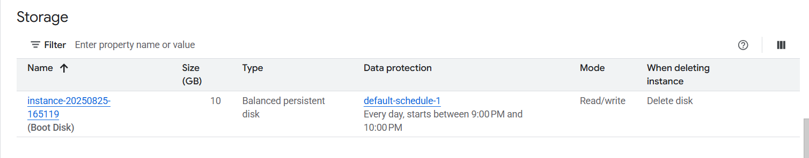

# Block and File Storage in GCP
# Storage
## Storage Types - Block Storage and File Storage
* What is the type of storage of your hard disk?
  * **Block storage**
* You've created a file share to share a set of files with your colleagues in a
enterprise. What type of storage are you using?
    * **File Storage**
### Block Storage
* Use case - Harddisks attached to your computers
* Typically, ONE Block storage can be connected to ONE virtual server
  * (EXCEPTIONS) You can attach read only block devices with multiple virtual servers and certain cloud providers are exploring multi-writer disks as well!
* However, you can connect multiple different block storage devices to one virtual server
* Used as - 
  * Direct-attached-storage(DAS) - Similar to a harddisk


### File Storage
* Media workflows need huge shared
storage for supporting processes like
video editing
* Enterprise users need a quick way to
share files in a secure and organized
way
* These file shares are shared by several
virtual servers

## GCP - Block Storage and File Storage
* Block Storage - 
  * **Persistent Disks** - Network Block Storage
    * Zonal - Data replicated in one zone
    * Regional - Data replicated in multiple zone
  * **Local SSDs** - Local Block Storage
* **File Storage** - 
  * **Filestore** - High performance file storage

## GCP - Block Storage
* Two popular types of block storage can be attached to VM instances
  * **Local SSDs**
  * **Persistant Disks**
* **Local SSDs** are physically attached to the host of the VM instance
  * Temporary data
  * Lifecycle tied to VM instance
* **Persistant Disks** are network storage
  * More durable(basically data is stored persistently)
  * Lifecycle NOT tied to VM instance

## Local SSDs
* **Physically attached** to the host of VM instance
  * Provide very high(IOPS) and very low latency
  * (BUT) **Ephemeral storage** - Temporary data(Data persists only until instance is running)
    * **Enable live migration** for data to survive maintenance events
    * Data automatically encrypted
      * However, you cannot configure encryption keys!
    * Lifecycle tied to VM instance
    * ONLY some machine types support Local SSDs
    * Supports SCSI and NVMe interfaces
* Remember :
  * Choose NVMe-enabled and multi-queue SCSI images for best performance
  * Larger Local SSDs(more storage), More vCPUs(attached to VM) => Even Better Performance

## Local SSDs - Advantages and Disadvantages
* **Advantages**
  * Very fast I/O(~10-100x compared to PDs)
    * Higher throughput and lower latency
  * Ideal for use cases needing high IOPs while storing **temporary information**
* **Disadvantages**
  * **Ephemeral storage**
    * Lower durability, lower availability, lower flexibility compared to PDs
    * You **CANNOT detach and attach** it to another VM instance

## Persistent Disks(PD)
* **Network block storage** attached to your VM instance
* **Provisioned capacity**
* Very Flexible - 
  * **Increase size when you need it** - when attached to VM instance
  * Performance scales with size
    * For higher performance, resize or add more PDs
  * **Independent lifecycle** from VM instance
    * Attach/Detach from one VM instance to another
  * Options - Regional and Zonal
    * Zonal PDs replicated in single zone, Regional PDs replicated in 2 zones in same Region
    * Typically Regional PDs are 2x the cost of Zonal PDs
  * **Use Case** - Run your custom database

## Persistent Disks vs Local SSDs

|Feature|Persistent Disks|Local SSDs|
|--|--|--|
|**Attachment to VM instance**|As a network drive|Physicallly attached|
|**Lifycycle**|Separate from VM instance|Tied with VM instance|
|**I/O Speed**|Lower(network latency)|10-100X of PDs|
|**Snapshots(backups)**|Supported|Not Supported|
|**Use case**|Permanent storage|Ephemeral storage|

## Persistent Disks(pd) - Standard vs Balanced vs SSD
|Feature|Standard|Balanced|SSD|
|--|--|--|--|
|**Underlying Storage**|Hard Disk Drive|Solid State Drive|Solid State Drive|
|**Referred to as**|pd-standard|pd-balanced|pd-ssd|
|**Performance - Sequential IOPS(Big Data/Batch)**|Good|Good|Very Good|
|**Performance - Random IOPS(Transactional Apps)**|Bad|Good|Very Good|
|**Cost**|Cheapest|In Between|Expensive|
|**Use cases**|Big Data(cost efficient)|Balance between cost and performance|High Performance|

## Persistent Disks - Snapshots
* Take **point-in-time snapshots** of your persistent Disks
* You can also schedule snapshots(configure a scheudle)
  * You can also auto-delete snapshots after X days
* Snapshots can be Multi-regional and Regional
* You can share snapshots across projects
* You can create new disks and instances from snapshots
* Snapshots are **incremental**
  * Deleteing a snapshots only **deletes data which is NOT needed** by other snapshots
  * Keep similar data together on a Persistent Disk
    * Separate your operating system, volatile and parmanent data
    * Attach multiple disks if needed
    * This helps to better organize your snapshots and images
* Avoid taking snapshots more often than once an hour
* Disk volume is available for use **but Snapshots reduce performance**
  * (RECOMMENDED) Schedule snapshots during off-peak hours
* Creating snapshots from disk is faster than creating from images
  * But creating disks from image is faster than creating from snapshots
  * (RECOMMENDED) If you are repeatedly creating disks from a snapshot - 
    * Create an image from snapshot and use the image to create disks
* Snapshots are **incremental**
  * BUT you don't lose data by deleting older snapshots
  * Deleting a snapshot **only deletes data which is NOT needed** by other snapshots
  * (RECOMMENDED) Do not hesitate to delete unnecessary snapshots

## Taking Snapshots for Persistent Disks

## Persistent Disks - Snapshots - Recommendations

## Disk
* by default Balanced persistent disk is used



## Playing with Machine Images
* (Remember) **Machine image** is different from Image
* **Multiple disks can be attached** with a VM-
  * One Boot Disk(Your OS runs from Boot Disk)
  * Multiple Data Diks
* An image is created from the boot Persistent Disk
* HOWEVER, a Machine Image is created from a VM instance - 
  * Configuration
  * Metadata
  * Permissions
  * Data from one or more disks
* **Recommended for** disk backups, instance cloning and replication

## comparison

|Scenarios|Machine Image|Persistent disk snapshot|Custom Image|Instance template|
|--|--|--|--|--|
|Single disk backup|yes|yes|yes|no|
|Multiple disk backup|yes|No|No|No|
|Differential backup|Yes|Yes|No|No|
|Instance cloning and replication|yes|no|yes|yes|

e.g. can I use Machine image for VM instance configuration? - yes
https://cloud.google.com/compute/docs/machine-images

## Playing with Disks - Command Line

```txt
gcloud compute disks list

```

## Cloud Filestore

* Shared cloud file storage
  * Supports NFSv3 protocol
  * Provisional capacity
* Suitable for high performance
  * upto 320 TB with throughput of 16GB/s and 480K IOPS
* Supports HDD (general purpose) and SSD (performance - critical workloads)
* Use cases - file share, media workflowsa and content management