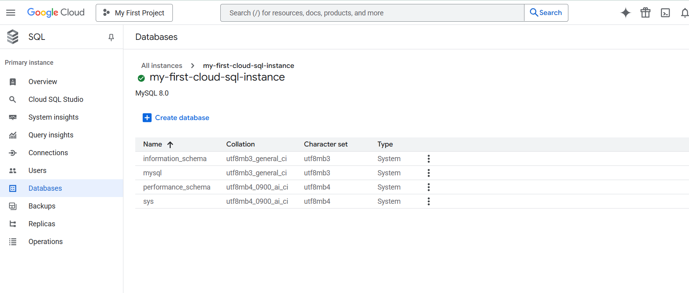

# Exploring Databases in GCP

# => Google Cloud SQL
* It is fully managed relational database service
* Supports MySQL, PostgresSQL and SQL Server
* 99.95% uptime SLA
* Vertical Scalability
  * > Increasing resources in the same machine
* Supports both SSD and HDD
* High Availability
* Backup and restore
* Strong encryption
* Read Replica


## Commands

```txt
# Cloud SQL
gcloud sql connect my-first-cloud-sql-instance --user=root --quiet
gcloud config set project glowing-furnace-304608
gcloud sql connect my-first-cloud-sql-instance --user=root --quiet
use todos
create table user (id integer, username varchar(30) );
describe user;
insert into user values (1, 'Ranga');
select * from user;
 
# Cloud Spanner
CREATE TABLE Users (
  UserId   INT64 NOT NULL,
  UserName  STRING(1024)
) PRIMARY KEY(UserId);
 
 
# Cloud BigTable
bq show bigquery-public-data:samples.shakespeare
 
gcloud --version
cbt listinstances -project=glowing-furnace-304608
echo project = glowing-furnace-304608 > ~/.cbtrc
cat ~/.cbtrc
cbt listinstances
```

## Creating Database


Enable the API - 


Enter the password - 


Delete the instance - 


## Cloud SQL - Features
* Important Cloud SQL Features
  * Automatic encryption
  * High availability and failover
  * Read replicas for read workloads
  * Automatic storage increase without downtime(for newer versions)
  * Point-in-time recovery - Enable binary logging
  * Backups
  * Supports migration from other sources
  * You can export data from UI

## Cloud Spanner
* Fully managed, mission critical, relational(SQL), globally distributed database with very high availability(99.999%)
* Cloud Spanner scales horizontally for reads and writes
* Regional and Multi-Regional configurations
* Expensive(compared to Cloud SQL)

## BigQuery - Datawarehouse
* Exabyte scale modern Datawaarehousing
  * Relational database
  * Traditional
* importing and exporting data
* Automatically expire data(Configurable Table Expiration)
* Query external data sources without storing data in BigQuery
* Access databases using

## Relational Database - Import and Export


## => Google Cloud Memory Store
* It is a **fully managed** in-memory database.
* It helps us to reduce the latency with scalable, secure and high available by in-memory services using **Redis** and **Memcached**.
* As Redis most commonly used, most of the document examples are around only Redis
* Redis stands for **Remote dictionary server**.
* Redis is an open-source in-memory data structure store that is used as a database, cache and message broker.
* In Memorystore, Redis in-memory data store is used to build an application cache that helps us to access the data in **sub-milliseconds**.
* Memorystore is more flexible. Based on our requirement to match the operation needs we can choose from different service tiers.
* It allows us to **scale up** the **Memorystore instance** at any time with minimal impact to our applications.
* We can connect to the Memorystore for Redis instance using the private IP address and are protected from public Internet access. In addition to that we can add IAM role based access control and in-transit encryption for further security.
* It is high used in the situation which requires fast, real-time data processing like Gaming, Stream processing and App Data Caching.

Below are some of the features of Memorystore - 
* Fully managed
* Choice of choosing the machine
* Security
* High Availability
* Highly scalable
* Monitoring

## 🧠 What is **MemoryStore in GCP** (Explained from First Principles)

Let’s build this **from the ground up**, not from product docs.

---

## 1️⃣ Start With the Core Problem: Why Do We Even Need “Memory”?

Imagine a typical application:

* User opens an app.
* App fetches data from a **database**.
* Database reads from disk.
* Disk is **slow** compared to RAM.

### Speed Comparison (rough intuition)

| Storage Type     | Speed                                              |
| ---------------- | -------------------------------------------------- |
| CPU Cache        | 🚀 Ultra fast                                      |
| RAM              | ⚡ Very fast                                        |
| SSD              | 🐢 Slower                                          |
| Database on disk | 🐢🐢 Even slower (due to queries, locks, indexing) |

👉 Modern apps fail not because of CPU…
👉 They fail because **data access is slow**.

---

## 2️⃣ First Principle of System Design

> **If you need something repeatedly, keep it in memory instead of recomputing or rereading it.**

This is called:

### **Caching**

Instead of:

```
App → Database → Disk → Return Result
```

We do:

```
App → Memory (RAM) → Return instantly
```

---

## 3️⃣ But Why Not Just Use RAM in My Server?

Because modern apps are:

* Distributed (many servers)
* Auto-scaled
* Stateless (cloud-native)
* Running in containers (Kubernetes, Cloud Run, etc.)

If each server keeps its own memory cache:

❌ Cache becomes inconsistent
❌ Scaling breaks
❌ You lose cache when instance dies
❌ Hard to share session state
❌ Not fault-tolerant

---

## 4️⃣ So We Need a **Shared Memory Layer**

We introduce a dedicated system:

```
Application Layer
       ↓
Shared In-Memory Store  ← ultra-fast shared RAM
       ↓
Database (slow, persistent)
```

This shared RAM must be:

* Network accessible
* Extremely fast
* Highly available
* Managed automatically
* Scalable
* Durable enough for caching/session use

---

## 5️⃣ That’s Exactly What **MemoryStore** Is

### 🔹 **Google Cloud MemoryStore = Fully Managed In-Memory Data Store**

It provides:

> A distributed, cloud-managed RAM layer for your application.

---

## 6️⃣ What Technology Powers MemoryStore?

MemoryStore is not something new invented by Google.

It is managed versions of:

* **Redis** (most common)
* **Memcached**

These are industry-standard in-memory databases.

---

## 7️⃣ Why Redis/Memcached? (From First Principles)

Because they are designed to:

* Store data **directly in RAM**
* Avoid disk completely
* Use simple key-value access
* Serve millions of requests per second
* Have deterministic low latency (~microseconds)

They trade:

❌ Complex querying
for
✅ Extreme speed

---

## 8️⃣ What Kind of Problems Does MemoryStore Solve?

### ✅ Use Case 1 — Caching Expensive Queries

Without cache:

```
User → App → SQL Query → Compute → Return (200ms)
```

With MemoryStore:

```
User → App → MemoryStore → Return (2ms)
```

Huge performance gain.

---

### ✅ Use Case 2 — Session Storage

When users log in:

```
Session data must be shared across instances.
```

MemoryStore lets:

* Any server read/write session instantly
* No sticky sessions needed

---

### ✅ Use Case 3 — Real-Time Applications

Like:

* Gaming leaderboards
* Rate limiting
* Chat presence
* Streaming counters

These need **fast mutable state** — perfect for in-memory stores.

---

### ✅ Use Case 4 — Reducing Database Load

Databases are expensive bottlenecks.

MemoryStore absorbs repeated reads so DB doesn’t melt.

---

## 9️⃣ Where It Fits in Cloud Architecture

Think of MemoryStore as:

```
           Users
             ↓
        App Servers
             ↓
        MemoryStore  ← FAST LAYER
             ↓
        Cloud SQL / BigQuery / Spanner ← SLOW SOURCE OF TRUTH
```

MemoryStore is **not** the source of truth.

It is an **acceleration layer**.

---

## 🔟 Important Concept: It Is NOT a Database Replacement

MemoryStore:

| Property        | MemoryStore            | Database          |
| --------------- | ---------------------- | ----------------- |
| Persistence     | ❌ Usually No           | ✅ Yes             |
| Speed           | ⚡ Ultra Fast           | Slower            |
| Complex Queries | ❌ No                   | ✅ Yes             |
| Purpose         | Cache / transient data | Permanent storage |

---

## 11️⃣ Why Managed (Why Not Self-Host Redis?)

Running Redis yourself means:

* Patch management
* Failover handling
* Replication setup
* Scaling
* Monitoring
* Security

MemoryStore gives:

✅ Auto failover
✅ Monitoring
✅ Google networking
✅ No ops work
✅ Seamless integration with GKE / Cloud Run

---

## 12️⃣ Simple Mental Model

Think of MemoryStore like:

> **L1 Cache for your entire cloud architecture.**

CPU has cache → your system has MemoryStore.

---

## 13️⃣ Example Real Flow (E-Commerce App)

User loads product page.

**Without MemoryStore**

```
Fetch product → DB read → pricing calc → return
```

**With MemoryStore**

```
Check MemoryStore:
   if exists → return instantly
   else → fetch DB → store in MemoryStore → return
```

This pattern is called:

### **Cache-Aside Pattern**

---

## ✅ Final One-Line Definition

> **Google Cloud MemoryStore is a fully managed Redis/Memcached service that provides a shared, ultra-fast, in-memory layer to cache and share transient application data, reducing latency and database load.**


## More Explanation

1) The basic hardware/software trade-off: memory vs disk

Computers store data either on volatile fast memory (RAM) or slower but durable storage (disk / SSD).  

RAM is orders of magnitude faster (measured in nanoseconds to microseconds) than disks (milliseconds). For workloads that need very low latency (session lookups, caches, leaderboards, real-time counters), reading from RAM is the right choice.  

An in-memory data store keeps the working dataset in RAM so reads and writes are extremely fast compared with a disk-backed database.  

2) What a key-value (in-memory) data store is

At its core it’s a mapping: key → value. Values can be simple strings or richer data structures (lists, sets, sorted sets, hashes) depending on the engine (Redis supports many such structures). Operations are typically O(1) or very fast, so throughput is high and latency is low. (This is the primitive used for caching, sessions, counters, queues, etc.)

3) Why run this as a managed cloud service (the problem Memorystore solves)

Running your own Redis/Memcached cluster means you must handle:  
provisioning servers and memory, 
OS and engine upgrades,  
replication and failover logic,  
backups, monitoring, scaling,  
and network/VPC configuration and security.  

A managed service like Memorystore removes that operational burden: you get a simple endpoint to connect to, and Google automates provisioning, replication, failover, patching and monitoring so teams can focus on application logic.

## 🔎 Redis vs Memcached — From First Principles

Both **Redis** and **Memcached** exist to solve the same root problem:

> **Databases are too slow for frequently accessed data, so keep hot data in RAM.**

They are **in-memory data stores**, but they were designed with **different philosophies**.

---

# 🧠 1️⃣ Design Philosophy (Core Difference)

| Aspect             | Redis                             | Memcached                  |
| ------------------ | --------------------------------- | -------------------------- |
| **Idea**           | “In-memory data structure server” | “Simple distributed cache” |
| **Goal**           | Be powerful + flexible            | Be extremely lightweight   |
| **Think of it as** | A mini in-memory database         | A RAM-based hash table     |

👉 Memcached = **Do one thing very fast**
👉 Redis = **Do many things fast**

---

# ⚙️ 2️⃣ Data Model

## Memcached → Only Key–Value (Strings)

```
key → blob/string
```

That’s it.

You store serialized objects and retrieve them.

No understanding of structure.

---

## Redis → Rich Data Structures

Redis understands the value type.

```
key → string
key → list
key → hash (object)
key → set
key → sorted set
key → stream
key → bitmap
```

Example:

Instead of storing:

```
"user:1001" → "{name:'Rudreshwar', score:95}"
```

Redis lets you do:

```
HSET user:1001 name Rudreshwar score 95
HINCRBY user:1001 score 5
```

👉 You can **modify data without deserializing**.

---

# 🚀 3️⃣ Performance Reality

People assume Memcached is faster.

That was true **15 years ago**.

Today:

| Operation          | Winner           |
| ------------------ | ---------------- |
| Simple GET/SET     | Roughly equal    |
| Complex operations | Redis (by far)   |
| Network efficiency | Redis            |
| Real-world latency | Nearly identical |

Redis is fast because it uses:

* Single-threaded event loop (no locking)
* Memory-optimized structures
* Smart I/O multiplexing

---

# 💾 4️⃣ Persistence (Huge Difference)

## Memcached → No Persistence

If it restarts:

```
Everything is gone.
```

It is purely a **temporary cache**.

---

## Redis → Optional Persistence

Redis can snapshot to disk:

* RDB snapshots
* AOF (Append Only File)

So Redis can behave like:

✅ Cache
✅ Primary datastore (for some workloads)

---

# 🔁 5️⃣ Replication & High Availability

## Memcached

* No native replication.
* Client must handle distribution.
* If a node dies → cache loss.
* Scaling = client-side hashing.

This is why Memcached is called **“dumb cache.”**

---

## Redis

Built-in:

* Master–replica replication
* Automatic failover (Redis Sentinel)
* Redis Cluster (sharding)
* Data consistency tools

Redis is **cloud-native ready**.

---

# 🧮 6️⃣ Memory Management

Both store data in RAM, but eviction differs.

| Feature              | Redis                      | Memcached   |
| -------------------- | -------------------------- | ----------- |
| Eviction Policies    | Many (LRU, LFU, TTL-based) | Mostly LRU  |
| Fine-grained control | Yes                        | Limited     |
| Memory optimization  | Advanced                   | Basic slabs |

Redis gives **predictable control** over what gets evicted.

---

# 🔧 7️⃣ Use Cases They Target

## Memcached Is Best For:

* Simple web caching
* Stateless data
* Short-lived values
* Extremely basic architectures

Example:

```
HTML fragment cache
```

---

## Redis Is Used For Much More:

* Session stores
* Leaderboards
* Rate limiting
* Real-time analytics
* Messaging queues
* Distributed locks
* Feature flags
* Streaming data
* Gaming state
* AI feature caching

Redis is now an **application infrastructure component**, not just a cache.

---

# 🏗️ 8️⃣ Scaling Model

## Memcached Scaling

Client decides:

```
hash(key) → which node
```

If you add/remove nodes → cache invalidation storm.

---

## Redis Scaling

Server-managed cluster:

```
Redis handles slot allocation and rebalancing.
```

Much easier operationally.

---

# 📦 9️⃣ Command Capability

Memcached supports very few commands:

```
GET
SET
DELETE
INCREMENT
```

Redis supports **200+ operations** including:

```
Atomic counters
Pub/Sub messaging
Transactions
Lua scripting
Streams
Geospatial queries
```

Redis is programmable.

---

# 🔐 🔟 Modern Cloud Reality

All major clouds (including GCP MemoryStore) prioritize **Redis** because:

* Works with microservices
* Handles stateful workloads
* Supports distributed systems patterns
* Easier HA + scaling
* Fits Kubernetes environments

Memcached is slowly becoming niche.

---

# ✅ Simple Analogy

| Tool      | Analogy                                                  |
| --------- | -------------------------------------------------------- |
| Memcached | A very fast whiteboard                                   |
| Redis     | A fast whiteboard + calculator + organizer + message bus |

---

# 🏁 When Should YOU Choose Which?

### Choose Memcached if:

* You only need dumb caching
* No persistence required
* Ultra-simple architecture
* Legacy system already uses it

### Choose Redis if:

* You need anything beyond GET/SET
* You want scalability + HA
* You need counters, queues, sessions, ranking, etc.
* You’re building modern distributed systems

👉 Today, **~90% of new systems choose Redis.**

---

# 📌 One-Line Difference

> **Memcached is a simple volatile cache.
> Redis is a full-fledged in-memory data platform.**

---
=========================================================================================================  

# => Google Cloud Data Store

## ☁️ What is **Cloud Datastore in Google Cloud?**

Let’s again build this step-by-step from the **problem it solves**.


## 1️⃣ Start With the Limitation of Traditional Databases

Traditional relational databases (MySQL, PostgreSQL):

* Require **fixed schema** (tables, columns).
* Hard to scale to millions of users globally.
* Need joins → slow at massive scale.
* Vertical scaling hits limits.
* Managing sharding is painful.

But modern apps (mobile/web/SaaS) need:

✅ Massive scale
✅ Flexible structure
✅ Automatic scaling
✅ Low operational effort
✅ Global availability

This led to a different model called:

> **NoSQL (Non-relational) Databases**

---

## 2️⃣ First Principle Behind Datastore

Instead of storing data like:

```
Table → Rows → Columns
```

Store data like:

```
Object → Properties → Value
```

This is closer to how application code thinks.

Example (User object):

```json
{
  "id": 1001,
  "name": "Rudreshwar",
  "city": "Bangalore",
  "score": 95
}
```

No rigid schema required.

---

## 3️⃣ What Cloud Datastore Is

> **Cloud Datastore is a fully managed NoSQL document database built for automatic scaling and high availability.**

It is designed for **application data**, not analytics.

Today, Google positions it as part of:

### 👉 Firestore in Datastore Mode

(Cloud Datastore is the original version.)

---

## 4️⃣ Core Concept: Entities Instead of Rows

Datastore doesn’t use tables.

It uses:

### **Kinds → Entities → Properties**

| SQL Concept | Datastore Equivalent |
| ----------- | -------------------- |
| Table       | Kind                 |
| Row         | Entity               |
| Column      | Property             |
| Primary Key | Key                  |

---

### Example

Kind: `User`

Entity:

```json
Key: User/1001

{
  "name": "Rudreshwar",
  "city": "Bangalore",
  "skills": ["QA", "Automation", "GCP"]
}
```

Each entity can have **different fields**.

---

## 5️⃣ Why This Matters (Schema-less Design)

You don’t need migrations like:

```
ALTER TABLE ADD COLUMN ...
```

Datastore lets data evolve naturally:

Entity A:

```
{name: "A", age: 30}
```

Entity B:

```
{name: "B", city: "Delhi"}
```

This is perfect for agile, rapidly changing apps.

---

## 6️⃣ Built for Horizontal Scale (Google’s DNA)

Cloud Datastore automatically:

* Splits data across machines
* Handles replication
* Balances load
* Survives failures

You never manage:

❌ Servers
❌ Shards
❌ Replication
❌ Scaling rules

---

## 7️⃣ Strong Focus on Application Workloads

Datastore is optimized for:

* User profiles
* Product catalogs
* Orders
* Mobile app data
* Metadata
* Stateful backend services

Not for joins or analytics.

---

## 8️⃣ Query Model (Different From SQL)

No joins.

Instead, you model relationships using:

### 🔹 Denormalization

Instead of:

```
Users JOIN Orders
```

You embed or duplicate data for fast reads.

This is intentional:

> Datastore optimizes for **read scalability**, not relational purity.

---

## 9️⃣ Transactions & Consistency

Cloud Datastore supports:

✅ ACID transactions (within entity groups)
✅ Strong consistency for key lookups
✅ Eventual consistency for global queries (for scalability)

This balance allows global scaling without locking systems.

---

## 🔟 Index-Driven Database (Important Concept)

Every query in Datastore must be backed by an index.

That’s why it scales:

Instead of scanning tables, it performs:

```
Index lookup → Direct fetch
```

This is similar to how Google Search works internally.

---

## 11️⃣ How It Fits Compared to Other GCP Databases

| Service     | Type                | Use Case              |
| ----------- | ------------------- | --------------------- |
| Cloud SQL   | Relational          | Traditional apps      |
| Spanner     | Global relational   | Financial-grade scale |
| Bigtable    | Wide-column         | Massive time-series   |
| BigQuery    | Analytics warehouse | BI / analytics        |
| MemoryStore | In-memory           | Caching               |
| Datastore   | NoSQL document      | App data at scale     |

---

## 12️⃣ Typical Architecture Using Datastore

```
Frontend App
     ↓
App Engine / Cloud Run
     ↓
Cloud Datastore  ← primary app database
     ↓
Cloud Storage (files)
```

It’s often used with serverless apps because it scales automatically.

---

## 13️⃣ Example Real-World Use

Imagine a ride-sharing app:

Each ride stored as an entity:

```json
Kind: Ride

{
  "userId": 1001,
  "driverId": 501,
  "pickup": "Whitefield",
  "drop": "Indiranagar",
  "status": "completed",
  "fare": 342
}
```

Millions of these can scale seamlessly.

---

## 14️⃣ Why Google Built Datastore

It is based on Google’s internal system:

> **Megastore → Spanner-inspired distributed storage**

Designed to support apps like:

* Gmail metadata
* Google Docs structure
* Large-scale web properties

---

## ✅ One-Line Definition

> **Cloud Datastore is a serverless, schema-less NoSQL database in GCP designed to store and scale application data automatically without managing infrastructure.**

---

## ⚠️ Important Modern Note

If you see **Cloud Datastore** today:

It usually means:

👉 **Firestore in Datastore Mode** (backward compatibility).

Google now recommends **Firestore (Native Mode)** for new apps.


===========================================================================================================  

# Firestore

## 🔥 What is **Firestore (Google Cloud Firestore)** — From First Principles

Let’s forget the product name and build the idea from the **real engineering problem**.

---

## 1️⃣ The Core Problem Modern Apps Faced

Old-world databases assumed:

* Data lives in one region.
* Apps are server-based.
* Traffic is predictable.
* Schema changes are slow.
* Scaling is manual.

Modern apps (mobile + web + realtime) need:

✅ Millions of concurrent users
✅ Global access (low latency everywhere)
✅ Flexible schema (features change weekly)
✅ Real-time updates (chat, live dashboards)
✅ Serverless backends
✅ Automatic scaling
✅ Offline capability (mobile-first world)

Traditional SQL databases struggle here.

Even earlier NoSQL systems (like Datastore) lacked **true realtime sync** and developer-friendly querying.

So Google built **Firestore** to solve:

> **How do we build a globally scalable, realtime, serverless database for application data?**

---

## 2️⃣ First Principle: Store Data the Way Apps Use It (Documents)

Instead of tables:

```
users table → rows → columns
```

Firestore stores **documents**:

```
Document = JSON-like object
```

Example:

```json
{
  "name": "Rudreshwar",
  "city": "Bangalore",
  "skills": ["QA", "GCP", "Automation"],
  "experience": 3
}
```

This maps naturally to how frontend apps already think.

---

## 3️⃣ Data Organization Model (Important)

Firestore structure is:

```
Collection → Document → Subcollection → Document → ...
```

Think of it like folders and files.

---

### Example Structure

```
users (collection)
   └── user_1001 (document)
           ├── name: "Rudreshwar"
           ├── city: "Bangalore"
           └── orders (subcollection)
                 └── order_501 (document)
```

No rigid schema required.

Each document can look different.

---

## 4️⃣ Why Documents Instead of Rows?

Because modern apps deal with **hierarchical, nested, evolving data**.

Firestore avoids:

❌ Joins
❌ Table migrations
❌ Schema locks

Instead:

> Data is shaped for fast reads at scale.

This is called **NoSQL document modeling**.

---

## 5️⃣ Firestore is Built for Horizontal Scale (Automatically)

When your app grows:

* Firestore automatically splits data across machines.
* Replicates data across zones/regions.
* Balances load.
* Handles failures.

You don’t provision anything.

This is called:

> **Serverless database scaling**

---

## 6️⃣ The Big Innovation: Real-Time Synchronization

This is what makes Firestore very different from Datastore.

Firestore supports:

```
"Listen to data changes"
```

Instead of polling:

```
App → query → refresh → query → refresh
```

Firestore pushes updates instantly:

```
Database → notifies clients automatically
```

Used in:

* Chat apps
* Live dashboards
* Multiplayer games
* Collaborative tools (like Google Docs behavior)

---

## 7️⃣ Offline-First Design (Mobile-Centric)

Firestore SDKs allow:

* App works offline.
* Data stored locally.
* Syncs automatically when connection returns.
* Conflict resolution handled by backend.

This is critical for real-world mobile networks.

---

## 8️⃣ Query Model (Indexed by Default)

Firestore does not scan data like SQL.

Every query uses an index → ensures predictable performance.

Example query:

```
Get all users where city = "Bangalore"
```

Firestore already indexed it → fast lookup.

This guarantees:

> Query time depends on result size, not database size.

That’s how it scales to billions of records.

---

## 9️⃣ Strong Consistency (Improvement Over Datastore)

Firestore provides:

✅ Strong consistency by default
✅ ACID transactions
✅ Multi-region correctness
✅ Deterministic reads

Datastore had eventual consistency in many cases — Firestore fixed that.

---

## 🔟 Designed for Microservices & Serverless Apps

Firestore integrates naturally with:

* Cloud Run
* App Engine
* Firebase
* Mobile SDKs
* Event-driven systems

So architecture becomes:

```
Frontend (Web/Mobile)
       ↓
Firestore (direct connection via SDK)
       ↓
Cloud Functions (optional backend logic)
```

You often **don’t even need a custom backend server**.

---

## 11️⃣ Firestore vs Traditional Database Thinking

| Traditional SQL Thinking | Firestore Thinking    |
| ------------------------ | --------------------- |
| Normalize data           | Denormalize for speed |
| Joins                    | Embed or duplicate    |
| Schema-first             | Query-first modeling  |
| Vertical scaling         | Horizontal auto-scale |
| Manual caching           | Built-in scalability  |

---

## 12️⃣ Example Real-World Usage

### Chat Application

Firestore document:

```
chats/chat_001/messages/msg_101
```

```json
{
  "sender": "user_1001",
  "text": "Hello!",
  "timestamp": "2026-02-15T10:30:00"
}
```

Clients subscribe:

```
Listen to messages collection
```

Message appears instantly across all devices.

No refresh needed.

---

## 13️⃣ How Firestore Differs from Cloud Datastore

| Feature               | Datastore | Firestore |
| --------------------- | --------- | --------- |
| Realtime updates      | ❌ No      | ✅ Yes     |
| Strong consistency    | Partial   | Default   |
| Mobile SDK focus      | ❌         | ✅         |
| Hierarchical data     | Limited   | Native    |
| Offline sync          | ❌         | ✅         |
| Modern recommendation | Legacy    | Preferred |

Firestore is essentially **Datastore evolved for realtime + mobile era**.

---

## 14️⃣ Where Firestore Fits in GCP Database Landscape

| If You Need                    | Use                 |
| ------------------------------ | ------------------- |
| Relational transactions        | Cloud SQL / Spanner |
| Analytics                      | BigQuery            |
| Caching                        | MemoryStore         |
| Massive time-series            | Bigtable            |
| Application data (modern apps) | **Firestore**       |

---

## ✅ Final One-Line Definition

> **Cloud Firestore is a globally scalable, serverless NoSQL document database designed for real-time, mobile, and web applications, with automatic scaling and strong consistency.**

