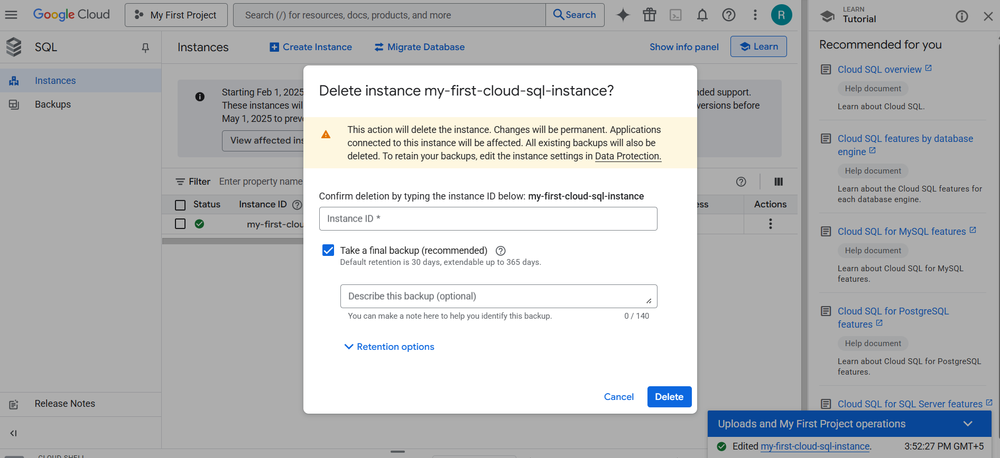

# Exploring Databases in GCP

# => Google Cloud SQL
* It is fully managed relational database service
* Supports MySQL, PostgresSQL and SQL Server
* 99.95% uptime SLA
* Vertical Scalability
  * > Increasing resources in the same machine
* Supports both SSD and HDD
* High Availability
* Backup and restore
* Strong encryption
* Read Replica


## Commands

```txt
# Cloud SQL
gcloud sql connect my-first-cloud-sql-instance --user=root --quiet
gcloud config set project glowing-furnace-304608
gcloud sql connect my-first-cloud-sql-instance --user=root --quiet
use todos
create table user (id integer, username varchar(30) );
describe user;
insert into user values (1, 'Ranga');
select * from user;
 
# Cloud Spanner
CREATE TABLE Users (
  UserId   INT64 NOT NULL,
  UserName  STRING(1024)
) PRIMARY KEY(UserId);
 
 
# Cloud BigTable
bq show bigquery-public-data:samples.shakespeare
 
gcloud --version
cbt listinstances -project=glowing-furnace-304608
echo project = glowing-furnace-304608 > ~/.cbtrc
cat ~/.cbtrc
cbt listinstances
```

## Creating Database


Enable the API - 


Enter the password - 


Delete the instance - 



## Cloud SQL - Features
* Important Cloud SQL Features
  * Automatic encryption
  * High availability and failover
  * Read replicas for read workloads
  * Automatic storage increase without downtime(for newer versions)
  * Point-in-time recovery - Enable binary logging
  * Backups
  * Supports migration from other sources
  * You can export data from UI

## Cloud Spanner
* Fully managed, mission critical, relational(SQL), globally distributed database with very high availability(99.999%)
* Cloud Spanner scales horizontally for reads and writes
* Regional and Multi-Regional configurations
* Expensive(compared to Cloud SQL)

## BigQuery - Datawarehouse
* Exabyte scale modern Datawaarehousing
  * Relational database
  * Traditional
* importing and exporting data
* Automatically expire data(Configurable Table Expiration)
* Query external data sources without storing data in BigQuery
* Access databases using

## Relational Database - Import and Export


## => Google Cloud Memory Store
* It is a **fully managed** in-memory database.
* It helps us to reduce the latency with scalable, secure and high available by in-memory services using **Redis** and **Memcached**.
* As Redis most commonly used, most of the document examples are around only Redis
* Redis stands for **Remote dictionary server**.
* Redis is an open-source in-memory data structure store that is used as a database, cache and message broker.
* In Memorystore, Redis in-memory data store is used to build an application cache that helps us to access the data in **sub-milliseconds**.
* Memorystore is more flexible. Based on our requirement to match the operation needs we can choose from different service tiers.
* It allows us to **scale up** the **Memorystore instance** at any time with minimal impact to our applications.
* We can connect to the Memorystore for Redis instance using the private IP address and are protected from public Internet access. In addition to that we can add IAM role based access control and in-transit encryption for further security.
* It is high used in the situation which requires fast, real-time data processing like Gaming, Stream processing and App Data Caching.

Below are some of the features of Memorystore - 
* Fully managed
* Choice of choosing the machine
* Security
* High Availability
* Highly scalable
* Monitoring

## 🧠 What is **MemoryStore in GCP** (Explained from First Principles)

Let’s build this **from the ground up**, not from product docs.

---

## 1️⃣ Start With the Core Problem: Why Do We Even Need “Memory”?

Imagine a typical application:

* User opens an app.
* App fetches data from a **database**.
* Database reads from disk.
* Disk is **slow** compared to RAM.

### Speed Comparison (rough intuition)

| Storage Type     | Speed                                              |
| ---------------- | -------------------------------------------------- |
| CPU Cache        | 🚀 Ultra fast                                      |
| RAM              | ⚡ Very fast                                        |
| SSD              | 🐢 Slower                                          |
| Database on disk | 🐢🐢 Even slower (due to queries, locks, indexing) |

👉 Modern apps fail not because of CPU…
👉 They fail because **data access is slow**.

---

## 2️⃣ First Principle of System Design

> **If you need something repeatedly, keep it in memory instead of recomputing or rereading it.**

This is called:

### **Caching**

Instead of:

```
App → Database → Disk → Return Result
```

We do:

```
App → Memory (RAM) → Return instantly
```

---

## 3️⃣ But Why Not Just Use RAM in My Server?

Because modern apps are:

* Distributed (many servers)
* Auto-scaled
* Stateless (cloud-native)
* Running in containers (Kubernetes, Cloud Run, etc.)

If each server keeps its own memory cache:

❌ Cache becomes inconsistent
❌ Scaling breaks
❌ You lose cache when instance dies
❌ Hard to share session state
❌ Not fault-tolerant

---

## 4️⃣ So We Need a **Shared Memory Layer**

We introduce a dedicated system:

```
Application Layer
       ↓
Shared In-Memory Store  ← ultra-fast shared RAM
       ↓
Database (slow, persistent)
```

This shared RAM must be:

* Network accessible
* Extremely fast
* Highly available
* Managed automatically
* Scalable
* Durable enough for caching/session use

---

## 5️⃣ That’s Exactly What **MemoryStore** Is

### 🔹 **Google Cloud MemoryStore = Fully Managed In-Memory Data Store**

It provides:

> A distributed, cloud-managed RAM layer for your application.

---

## 6️⃣ What Technology Powers MemoryStore?

MemoryStore is not something new invented by Google.

It is managed versions of:

* **Redis** (most common)
* **Memcached**

These are industry-standard in-memory databases.

---

## 7️⃣ Why Redis/Memcached? (From First Principles)

Because they are designed to:

* Store data **directly in RAM**
* Avoid disk completely
* Use simple key-value access
* Serve millions of requests per second
* Have deterministic low latency (~microseconds)

They trade:

❌ Complex querying
for
✅ Extreme speed

---

## 8️⃣ What Kind of Problems Does MemoryStore Solve?

### ✅ Use Case 1 — Caching Expensive Queries

Without cache:

```
User → App → SQL Query → Compute → Return (200ms)
```

With MemoryStore:

```
User → App → MemoryStore → Return (2ms)
```

Huge performance gain.

---

### ✅ Use Case 2 — Session Storage

When users log in:

```
Session data must be shared across instances.
```

MemoryStore lets:

* Any server read/write session instantly
* No sticky sessions needed

---

### ✅ Use Case 3 — Real-Time Applications

Like:

* Gaming leaderboards
* Rate limiting
* Chat presence
* Streaming counters

These need **fast mutable state** — perfect for in-memory stores.

---

### ✅ Use Case 4 — Reducing Database Load

Databases are expensive bottlenecks.

MemoryStore absorbs repeated reads so DB doesn’t melt.

---

## 9️⃣ Where It Fits in Cloud Architecture

Think of MemoryStore as:

```
           Users
             ↓
        App Servers
             ↓
        MemoryStore  ← FAST LAYER
             ↓
        Cloud SQL / BigQuery / Spanner ← SLOW SOURCE OF TRUTH
```

MemoryStore is **not** the source of truth.

It is an **acceleration layer**.

---

## 🔟 Important Concept: It Is NOT a Database Replacement

MemoryStore:

| Property        | MemoryStore            | Database          |
| --------------- | ---------------------- | ----------------- |
| Persistence     | ❌ Usually No           | ✅ Yes             |
| Speed           | ⚡ Ultra Fast           | Slower            |
| Complex Queries | ❌ No                   | ✅ Yes             |
| Purpose         | Cache / transient data | Permanent storage |

---

## 11️⃣ Why Managed (Why Not Self-Host Redis?)

Running Redis yourself means:

* Patch management
* Failover handling
* Replication setup
* Scaling
* Monitoring
* Security

MemoryStore gives:

✅ Auto failover
✅ Monitoring
✅ Google networking
✅ No ops work
✅ Seamless integration with GKE / Cloud Run

---

## 12️⃣ Simple Mental Model

Think of MemoryStore like:

> **L1 Cache for your entire cloud architecture.**

CPU has cache → your system has MemoryStore.

---

## 13️⃣ Example Real Flow (E-Commerce App)

User loads product page.

**Without MemoryStore**

```
Fetch product → DB read → pricing calc → return
```

**With MemoryStore**

```
Check MemoryStore:
   if exists → return instantly
   else → fetch DB → store in MemoryStore → return
```

This pattern is called:

### **Cache-Aside Pattern**

---

## ✅ Final One-Line Definition

> **Google Cloud MemoryStore is a fully managed Redis/Memcached service that provides a shared, ultra-fast, in-memory layer to cache and share transient application data, reducing latency and database load.**