# Networking

## Need for Google Cloud VPC
* In a corporate network or an on-premises data center:
  * Can anyone on the internet s**ee the data exchange** between the application and the database?
    * No
* Can anyone from internet **directly connect to your database?**
  * Typically **NO.**
  * You need to connect to your corporate network and then access your applications or databases.
* Corporate network provides a **secure internal network** protecting your resources, data and communication from external users
* How do you do create **your own private network** in the cloud?
  * Enter Virtual Private Cloud (VPC)

## Google Cloud VPC(Virtual Private Cloud)
* Your **own isolated network** in GCP cloud
  * Network traffic within a VPC is isolated (not visible) from all other Google
Cloud VPCs
* You **control all the traffic** coming in and going outside a VPC
* **(Best Practice)** Create all your GCP resources (compute, storage, databases etc) **within a VPC**
  * Secure resources from unauthorized access AND
  * Enable secure communication between your cloud resources
* VPC is a **global resource** & contains subnets in one or more
region
  * (REMEMBER) NOT tied to a region or a zone. VPC resources can be in any region or zone!

## Need for VPC(Virtual Private Cloud) Subnets
* Different types of resources are created on cloud - databases, compute etc
  * Each type of resource has its **own access needs**
  * Load Balancers are accessible from internet(**public** resources)
  * Databases or VM instances should NOT be accessible from internet
    * ONLY or VM instances should NOT be accessbile from internet
* How do you **separate public resources from private resources** inside a VPC?
  * Create separate Subnets!
* (Additional Reason) - You want to **distribute resources** across multiple regions for high availability
  * This can be done by using creating subnets

## VPC Subnets
* (Solution)**Create different subnets** for public and private resources
  * Resources in a public subnet **CAN** be accessed from internet
  * Resources in a private subnet **CANNOT** be accessed from internet
  * But resources in public subnet can talk to resources in private subnet
* Each Subnet is crated in a region
* **Example** - VPC - demo-vpc => Subnets - region us-central1, europe-west1 or us-west1 or ..

## Creating VPCs and Subnets
* By default, every project has a default VPC
* You can create your own VPCs
* Options when you create a subnet
  * **OPTION 1** - Auto mode VPC network
    * Subnets are automatically created in each region
    * Default VPC created automatically in the project uses auto mode!
  * **OPTION 2** - Custom mode VPC network.
    * No subnets are automatically created
    * You have complete control over subnets and their IP ranges
    * Recommended for Production
  * Options when you create a subnet - 
    * Enable **Private Google Access** - Allows VM's to connect to Google API's using private IP's
  * Enable **FlowLogs** - To troubleshoot any VPC related network issues

## Step 03a - Understanding CIDR Blocks
* Resources in a network use continuous IP addresses to make routing easy
  * Example - Resources inside a specific network can use IP addresses from 69.208.0.0 to 69.208.0.15
* How do you express a **range of addresses** that resources in a network can have?
  * Using **CIDR block**
* A **CIDR block** consists of a **starting IP address(69.208.0.0)** and a **range(/28)**
  * Example - CIDR block 69.208.0.0/28 represents addresses from 69.208.0.0 to 69.208.0.15 - a total of 16 addresses
* **Quick Tip** - 69.208.0.0/28 indicates that the first 28 bits(out of 32) are fixed. 
  * > Ok basically the network id NID are fixed.
  * > Last 4 bits can change = 2^4 = 16 addresses
* https://cidr.xyz/

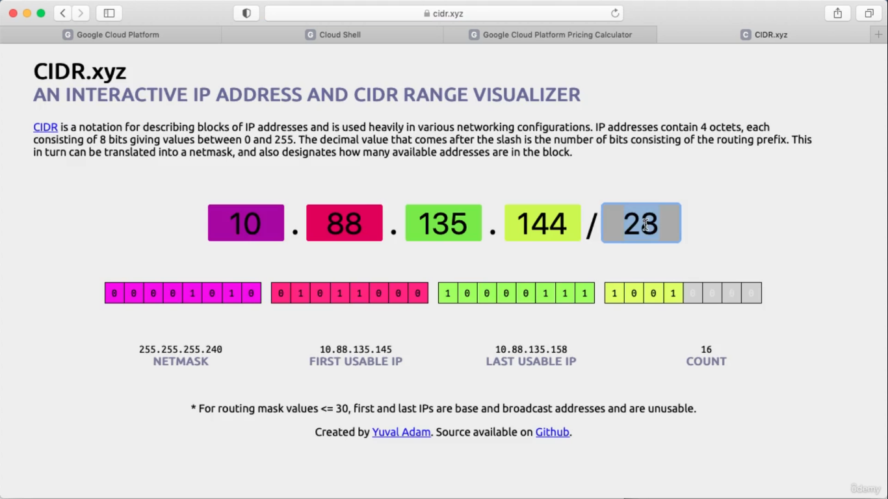

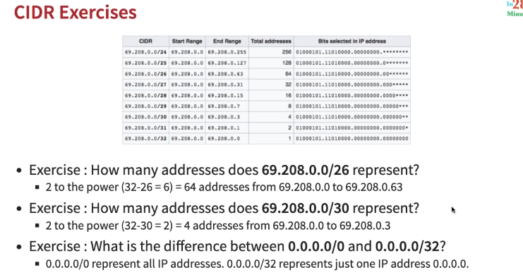

## Demo - Creating a VPCs and Subnets in GCP
(To be continued)
* How to identify non-overlapping subnets?
* What is MTU? and what is it's unit?
* What is secondary IP ranges in Custom-mode VPC creation?
* 


## Limitation of Default VPC
* **Global Scope**
  * The default VPC is global, which means it spans all GCP regions. while this can be advantageous in terms of connectivity, it might lead to increased complexity and potential security concerns, especially if you want to enforce regional isolation
* **Limited Customization**
  * The default VPC Is designed for simplicity and ease of use, but it might lack the level of customization required for complex networkarchitectures. If your project demands specific IP ranges,subnetting, or other advanced configurations, the default VPC may be restrictive
  * You cannot change the entire subnet
* **Address Range Limitations**
  * The default VPC comes with predefined IP address ranges. If these ranges conflict with your existing on-premises network or if they do not meet your specific addressing requirements, it could be a limitation
* **Security Concerns** - The default firewall rules in the default are relatively permissive to ensure broad compatibility. Depending on your security posture, these rules might need adjustment to adhere to specific compliance standards or internal security policies
* **Cross-Project Connectivity**
  * If you need to connect resources across different projects, the default VPC might not be the best choice. Setting up VPC Network Peering or using Shared VPCs might be more suitable for such scenarios
* **Lack of Isolation Controls**
  * The default VPC is designed to be straightforward, but it might lack the granularity needed for strict isolation between different parts of your infrastructure. This could be a concern in environments with stringent security or compliance requirements
* **Scalability Challenges**
  * For larger or more complex deployments, the default VPC might face scalability challenges. If your project grows significantly, you may need to migrate to a custom VPC with more scalable configurations.
* **Limited Routing Options**
  * The default VPC comes with a predefined set of routes. If your application requires specific configurations, such as custom route prioritization or VPN configurations, you may find the default VPC limiting
* **Resource Naming Restrictions**
  * Naming conventions within the default VPC may be generic and not aligned with your orgnizations standards. This can lead to confusion, especially in larger projects with multiple teams working concurrently

## Creating VPC in Auto mode - Demo
* Not much difference between default and auto-mode
* > If your customer belongs to a particular region, then you want to create VPC in that region. Basically we can create subnetworks for the region which is required

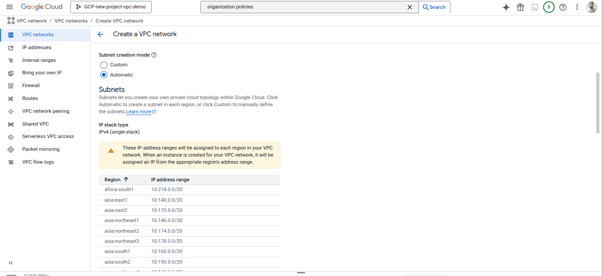

* Google will give the non-overlapping subnets after selecing auto-mode for "new VPC network" creation

## Creating new VPC - Custom mode - Demo
done


## Firewall Rules
what is Firewall? It is basically a first line of defence in the network security

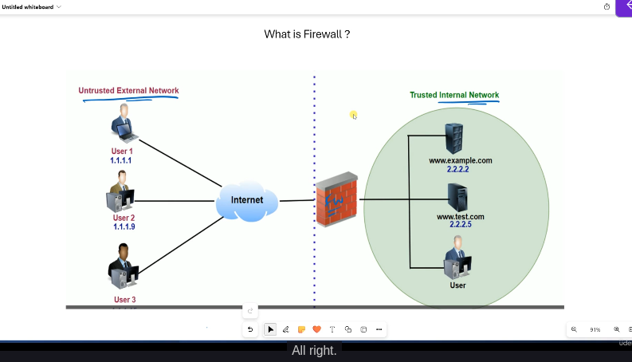

* It establishes a barrier between your trusted internal network from your external/untrusted network

> how it decides to allow or deny any packet? how does it happen? We need to define a security policy. It would be defined by administrator

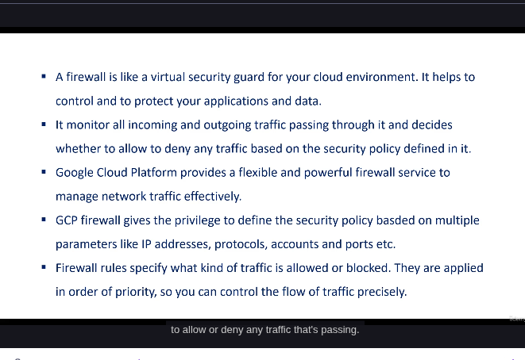

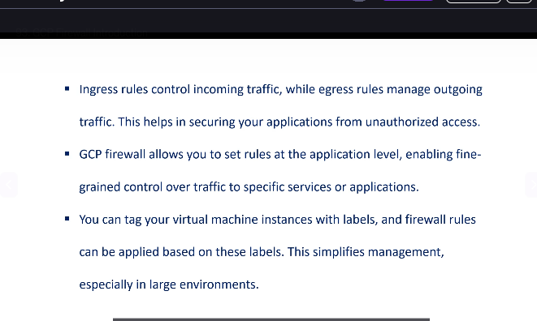

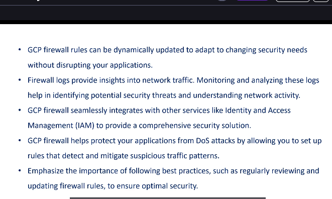

* **Lower the number higher the priority**

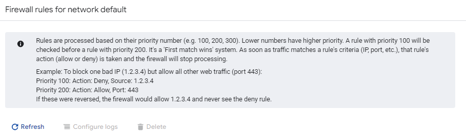


<hr>

* Configure Firewall Rules to control traffic going in or out of the network
  * Stateful
    * > If request is allowed, then automatically response is allowed
  * Each firewall rule has priority(0-65535) assigned to it
  * 0 has highest priorty. 65535 has least priority
  * **Default implied rule with lowest priority(65535)**
    * Allow **all** egress(outgoing)
    * Deny **all** ingress(incoming)
    * Default rules can't be deleted
    * You can override default rules by defining new rules with priority(0-65534)
  * Default VPC has **4-additional rules** with priority 65534
      * Allow incoming traffic from VM instances in same network **(default-allow-internal)**
      * Allow incoming TCP traffic on port22(SSH) **default-allow-ssh**
      * Allow Incoming TCP traffic on port 3389 (RDP) **default-allow-rdp**
      * Allow Incoming ICMP from any source on the network **default-allow-icmp**

## Firewall Rules - Ingress and Egress Rules
> We can define our own rule
* **Ingress Rules** - Incoming traffic from outside to GCP targets
  * **Target(defines the destination)** - All instances or instances with TAG/SA
  * **Source(defines where the traffic is coming from)** - CIDR instances with TAG/SA
* **Egress Rules** - Outgoing traffic to destination from GCP targets
  * Target(defines the source)- All instances or instances with TAG/SA
  * **Destination** - CIDR Block
* **Along with each rule**, you can also define:
  * **Priority** - **Lower the number, higher the priority**
  * **Action on match**- Allow or Deny traffic
  * **Protocol** - ex. TCP or Deny traffic
  * **Port** - which port?
  * **Enforcement status** - Enable or Disable the rule

## Basic Firewall Rule Configurations - Demo
Let's create a simple firewall rule.

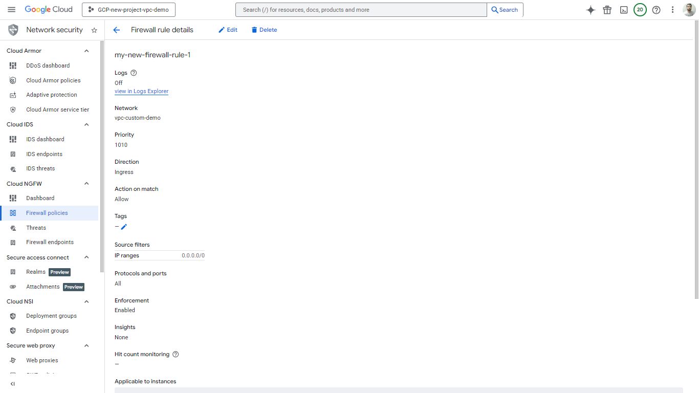

* Firewall rule is applied to two vm instances as we have chosen network "vpc-custom-demo"

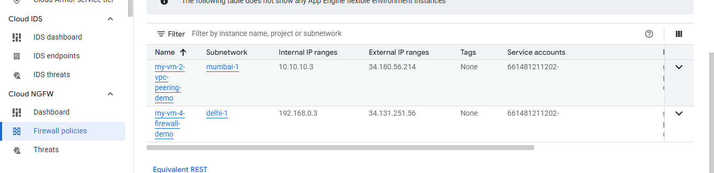

* Since source is 0.0.0.0/0

we are able to ping the public ip address of our VM machine with our simple firewall rule
```txt
Action on match
Allow

Source filters
IP ranges
0.0.0.0/0
```
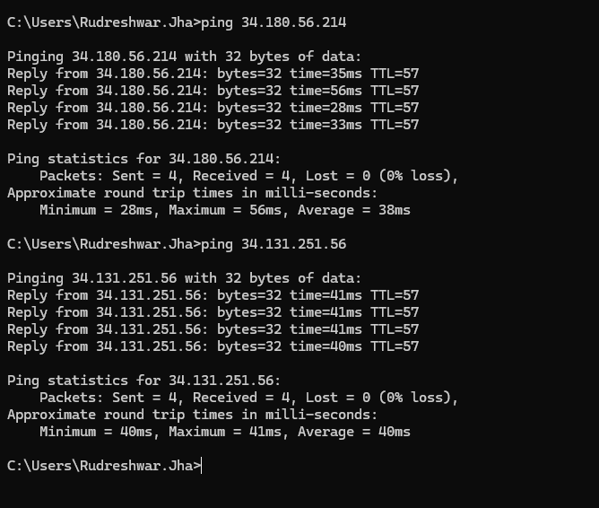


## Exploring more firewall Rules - Demo

* After disabling all the four firewall rule of vpc-custom-demo, it will deny all the incoming requests(by default it firewall deny if we don't allow anything)
  * Basically any communication to that VM is not possible

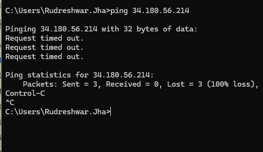

we will not be able to ping the public ip address of VMs

* Now let's create new firewall rule with source ip for ingress from your local machine

## GCP Firewall rules - Tag based - Demo
> What is Tag? Tag is nothing but a metadata that is defined to any instance in the GCP platform


* In the firewall rule choose the network tags option while selecting

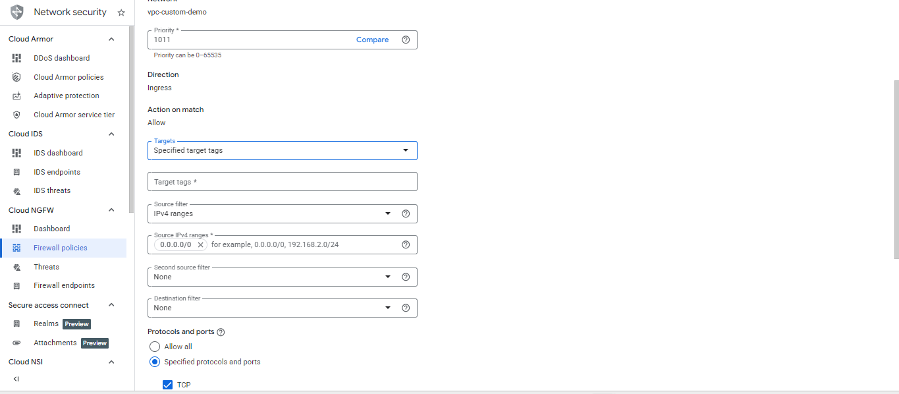

firewall rule updated - 

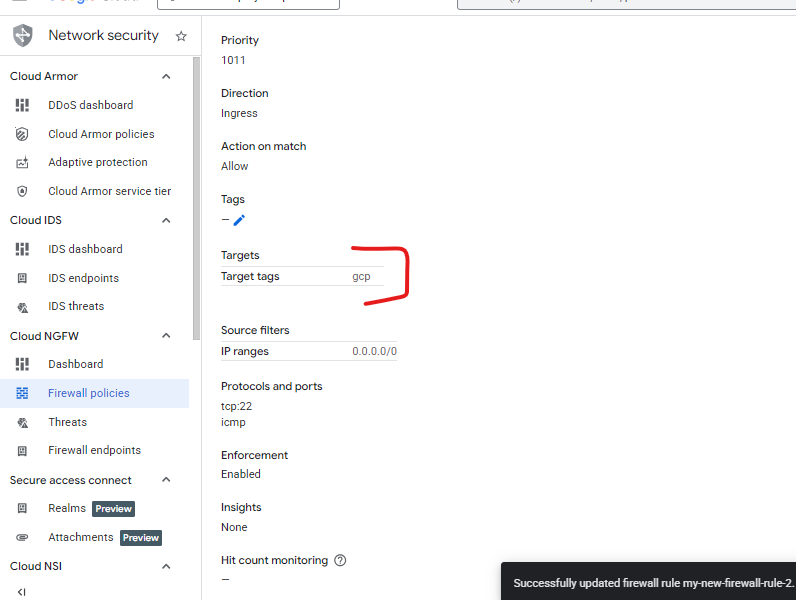

## Firewall rules - Service account based - Demo | Hands-on
> Now let's see how to create based on service accounts

By default compute engine default service account will be selected

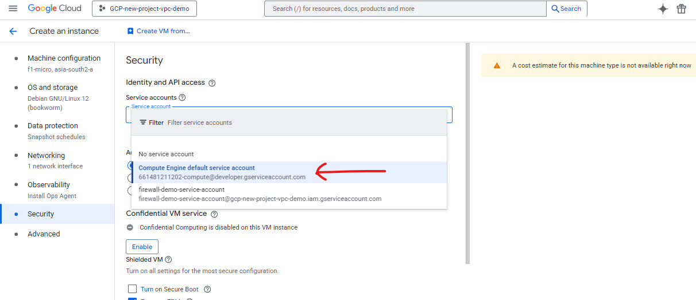

so what happens when we select service account in the firewall?
> Only vm-6 is part of that service account we created. so our firewall rule is now applicable to only vm-6 with the service account we created.

> For other VMs it will not ping because now firewall rule is appliable to specific service account which allows the traffic. Basically e.g. VM2 is not part of that service account and that's the reason firewall is not allowing the traffic

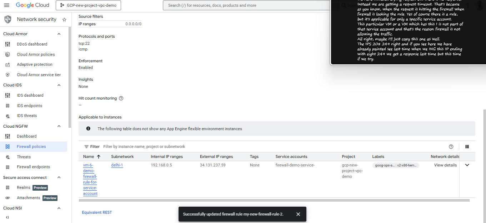

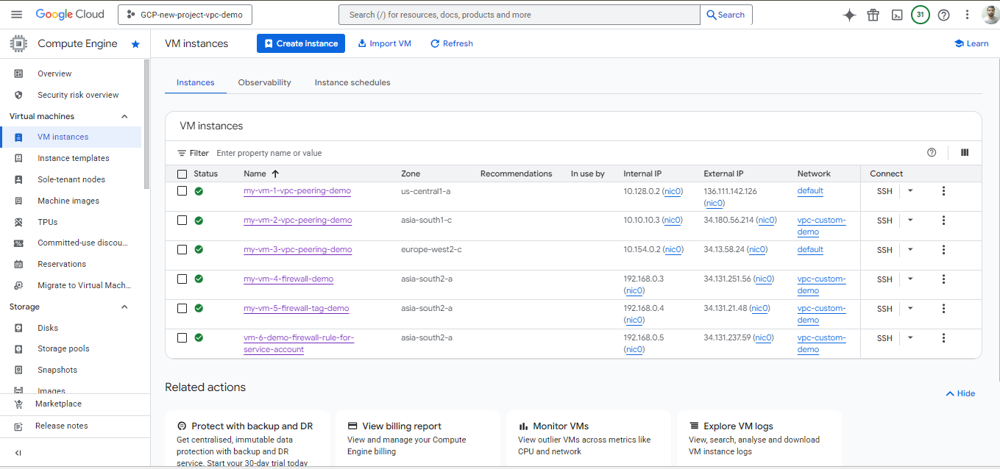

### GCP Firewall Policy - Demo | Hands-on
> So when you are having multiple requirement to define your firewall rule, so for easy management you can create a policy. Basically you can add all the related firewall rule under that policy and then you can associate to a VPC

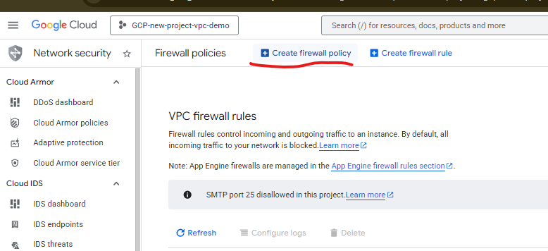

* 2nd step - Add the firewall rule

then associate the policy VPC network
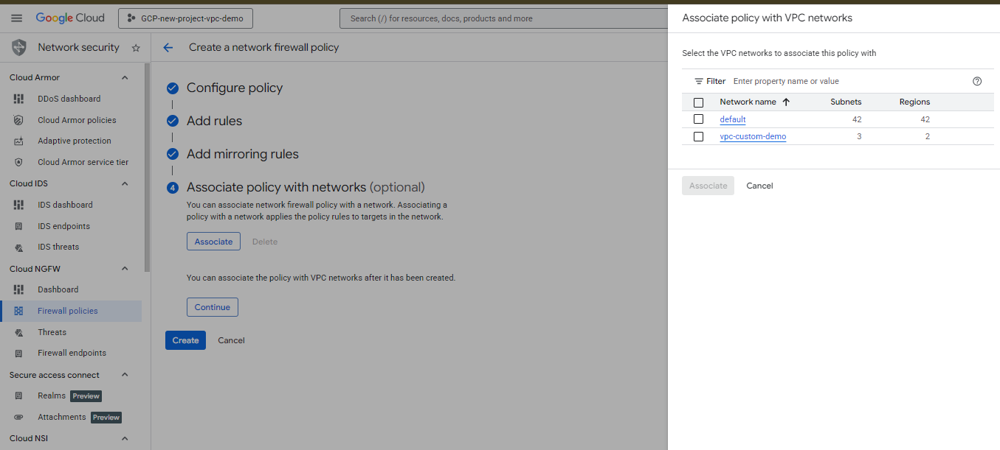

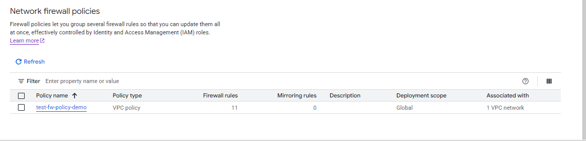

* We cannot delete a firewall policy directly, first we need to remove the VPC network association

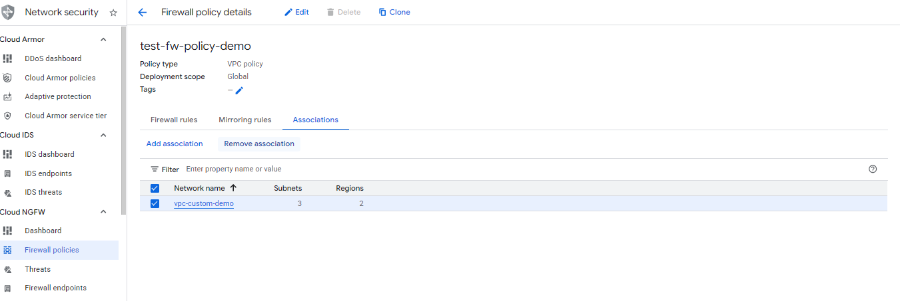

after removing the association we can now  delete the firewall policy

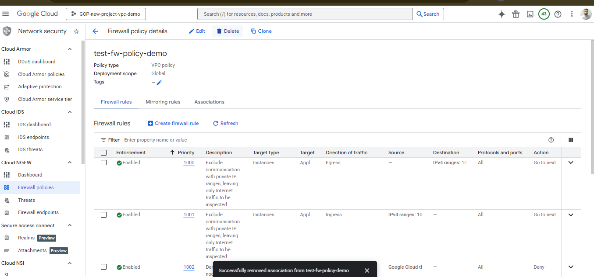


## Section - GCP Private Access
> without traversing the public internet we can securely connect to GCP resources
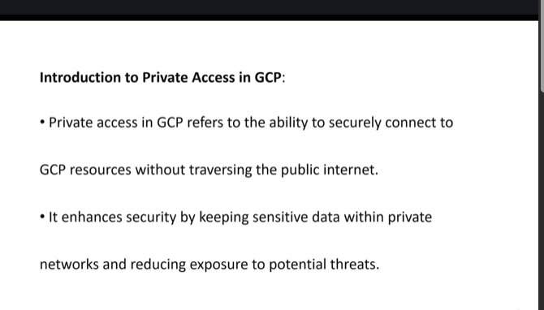

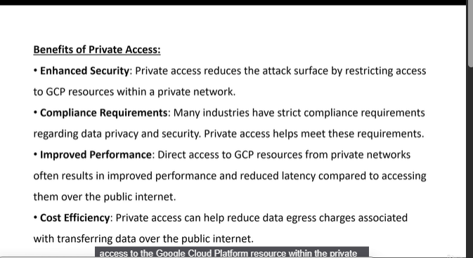

> suppose you want to connect to tenant network
> e.g. in Banking sector

## GCP Private Access - Demo | Hands-on

* Add two more subnets in vpc "custom-vpc-demo"

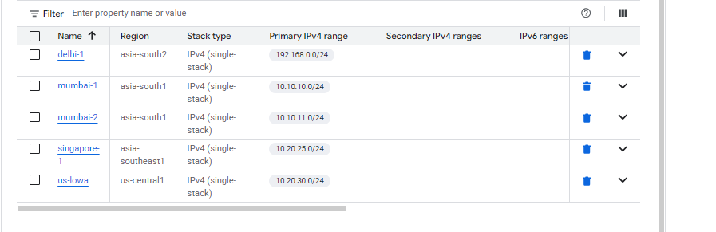
* Create a bucket in London-2 region and add an object

* A tenant = an isolated customer, team, or environment
  * A logically isolated network belonging to one tenant

So now we need to establish a communication between the storage which is in "London-2" region(tenant network) and with the VM which is in another network "cutom-vpc-demo" which has subnets in singapore, delhi, mumbai and us-lowa

So because of "public IP address" we can see the object . This VM is in delhi and object is in london

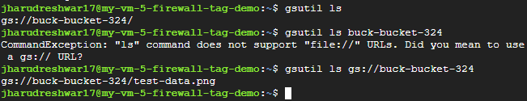

Above can be confirmed , if we disable the set the external ip address of vm5 to none

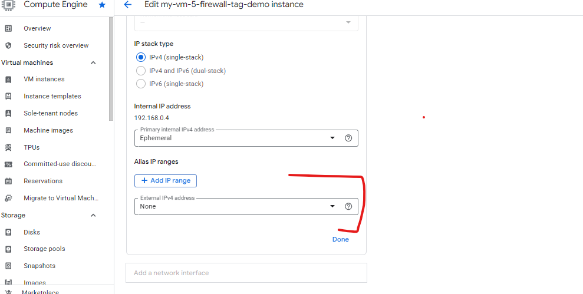

And now since we don't have public/external IP address for VM5, it will not be able to ping

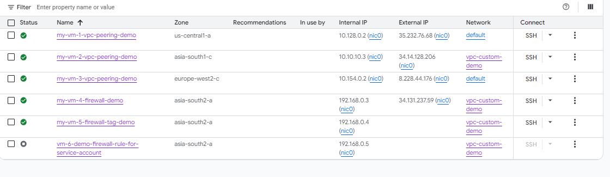

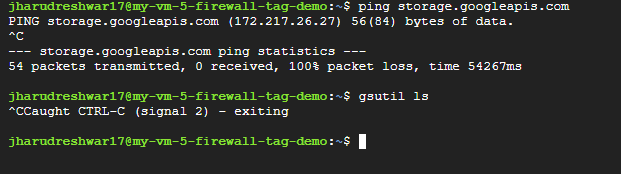

> Now let's enable the google private access. so with this it will be able to communicate even though it doesn't have public IP address

Now enable the google private access


So now we can see the object in our storage through google private access

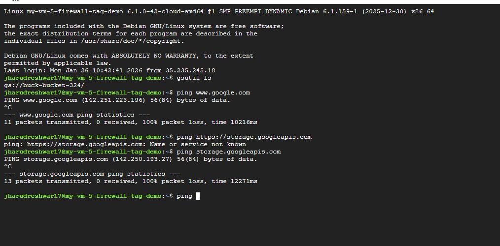

but still since external IP address is removed, we can't ping to public IP

## Section - Handling Multiple IP address to a single Instance
* There will be a requirement to assign multiple IP addresses to a single VM instance for many reasons. In that case, there are 2 methods we can assign more than one IP address to a VM instance.
  * **Assigning additional VM NIC(Network Interface Card)**
    * When we add more NIC, there is a limitation in this method. **Where each NIC will be a part of one VPC only**. We can NOT add same VPC to different NIC of a single VM instance.
  * **Assigning Alias IP addresses**
    * When we want to assign multiple IP address **from same VPC or subnet**, we can go with the second method, creating Alias IP addresses.

* Demo - 

Steps - 

In the network , click on network interface

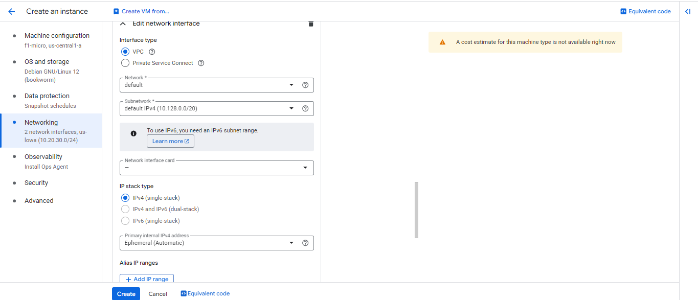

* Be default, every NIC will come under the default VPC
* So when you create multiple NIC each NIC will be part of one VPC not same
  * So now VM NIC 0 is part of my custom VPC and
  * VM NIC 1 is part of default VPC

So now we have **two IP addresses**

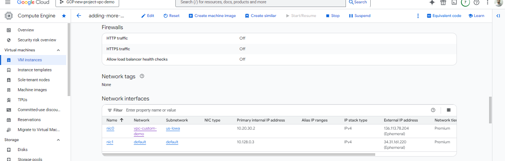

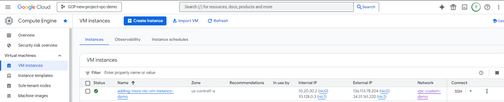

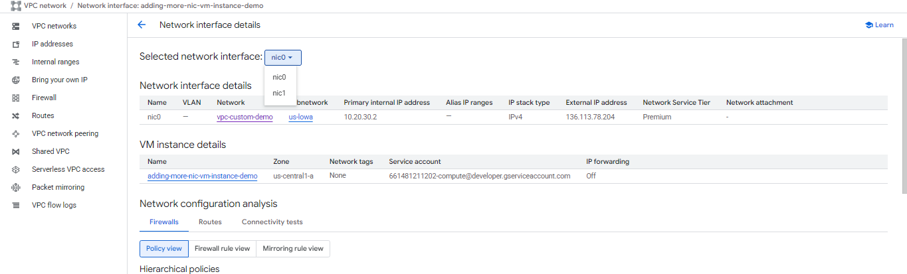

So above in one method of assigning multiple IPs to single VM.  
>So when you add multiple NIC or a network interface card, you cannot assign from the same VPC. 
> Each should have a different VPC. And it is kind difficult to manage

* Second Method
First add multiple subnet parts in a region

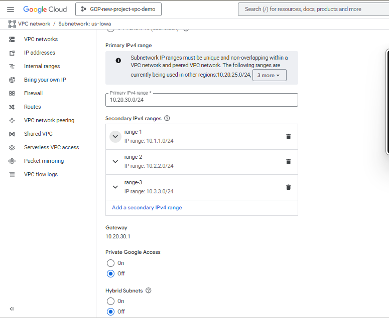

Now while creating the VM instance we will get the option to add alias IP range

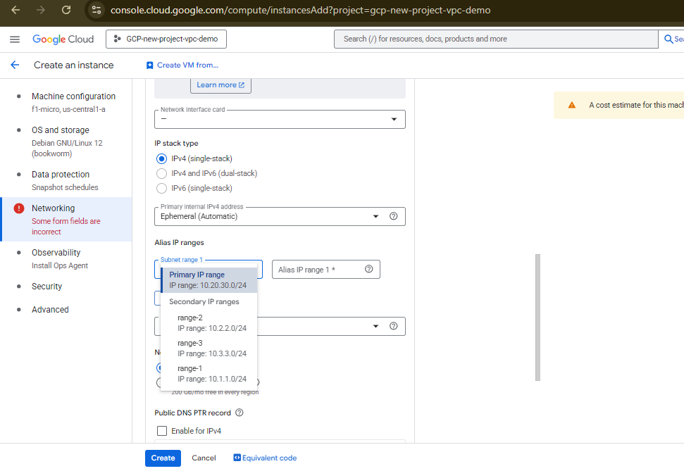

* Now add the IP address , which is under the same VPC

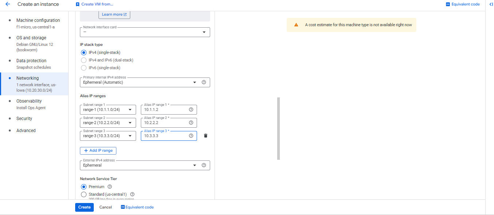

Navigate to network details, and we have alias IP ranges that is for same VM and are part of same VPC and same subnet.

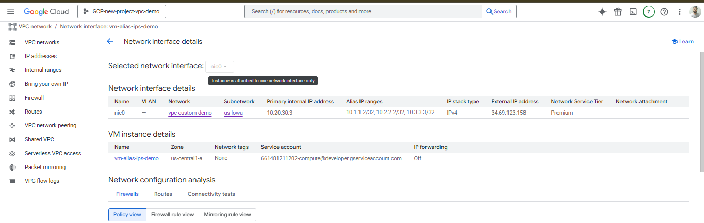


## Shard VPC
* **Scenario** - Your organization has **multiple projects**. You want **resources** in different projects to **talk to each other?**
  * How to allow resources in different projects to talk with internal IPs securely and efficiently?
* Enter **Shared VPC(virtual private cloud)**
  * Created at organization or shared folder level (Access Needed - Shared VPC Admin)
  * Allows VPC network to be shared between projects in same organization
  * Shared VPC contains one host project and multiple service projects
    * **Host Project** - Contains VPC network
    * **Servie Projects** - Attached to host projects
* Helps you achieve **separation of concerns**
  * Network administrators responsible for Host projects and Resources users use Service Project

## VPC Peering(To enable communication between VPCs)
* **Default VPC Communication** - 
  * In a Google Cloud environment, by default, Virtual Private Clouds(VPCs) operate in isolation. Each VPC is like its own private network, and instances within the same VPC can communicate with each other without any extra configuration
* **Isolation Challenges**
  * However, when you have multiple VPCs for different projects, teams, or purposes, they might need to collaborate. Without any special setup, direct communication between these isolated VPCs is not possible earlier


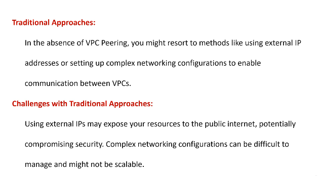

What is the solution? => VPC Peering

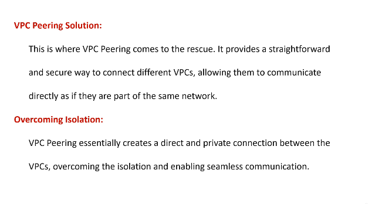

* **Advantages of VPC Peering**

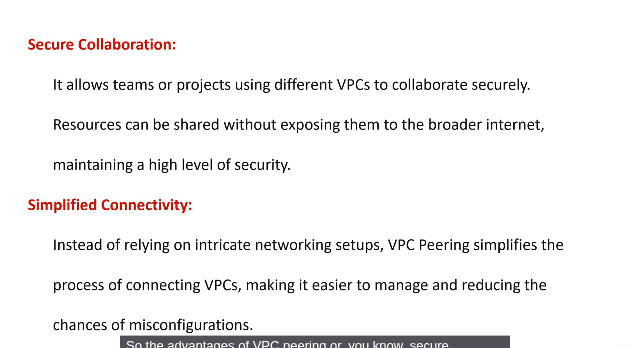

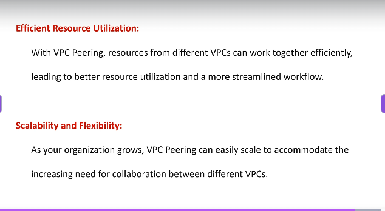

### VPC Peering - Detailed Understanding
How does it work?  
How communication happens between VMs within same VPC ?
* When VMs are in Same VPC - they will automatically use internal IP address(see below diagram)

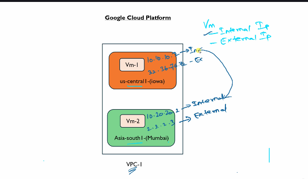

NOTE - See in above that the VMs are in different zones. while creating VPC, if we use default different non-overlapping subnetwork are created. But they are in same VPC

* What was traditional way of doing previously - when two VMs are in different VPCs was exposing the external IP address of VM to the public internet(basically configure it)

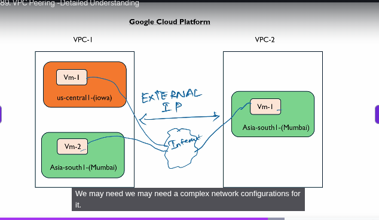

* Now what we use is VPC Peering - It establish a communiation between two different VPCs **using Internal IP address**
  * Nutshell - VPC helps us to establish a communication between VM instances or any resources that is runnin in a different VPCs, either within the same project or in different project
  * It helps us to avoid exposing public IP address
  * It is making communication in a secured way


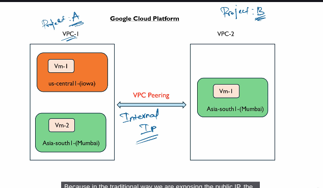


<!-- ---- -->
* **Scenario** - How to **connect VPC networks** across **different organizations?**
* Enter **VPC Peering**
  * Networks in same project, different projects and across projects in different organizations can be peered
  * All communication happens using internal IP addresses
    * Highly efficient because all communication happens **inside Google Network**
    * Highly secure because **not accessible from internet**
    * **No data transfer charges** for data transfer between services
  * (REMEMBER) Network administration is NOT changed - 
    * Admin of one VPC do not get the role automatically in a peered network.


### VPC Peering within same project - Demo

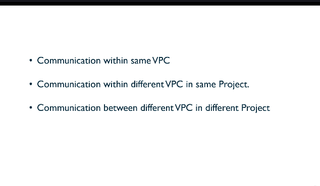

Delete the VM instance created before if taking long break as 4 VMs were created.


Steps - 
1. Create 3 VMs

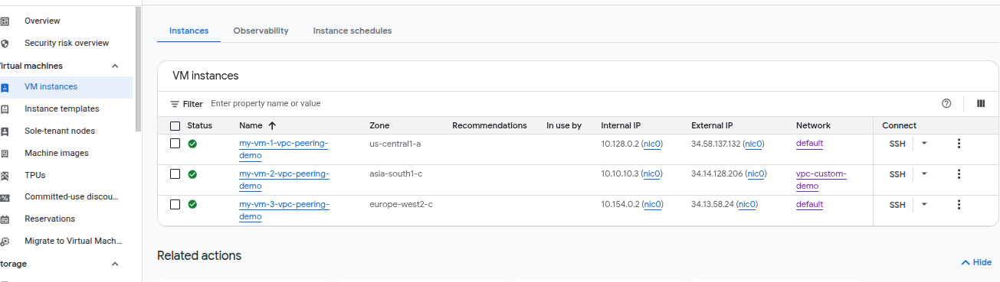

2. Click SSH into two VMs of same default VPC and ping the internal IP address

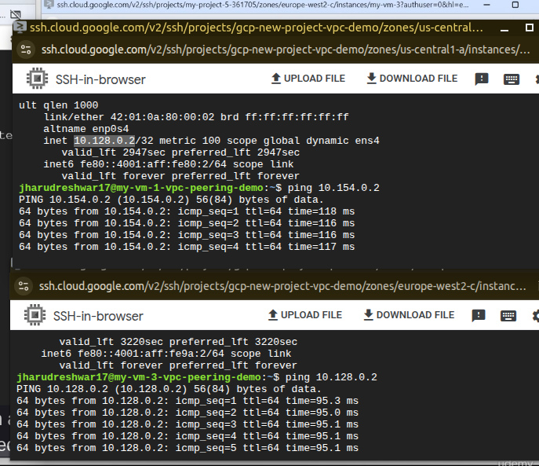

from above it confirms for communication within Same VPC it require internal IP address

3. Go VPC peering and create new connection . from default to vpc-custom as well as vpc-custom to default. else it will remain inactive

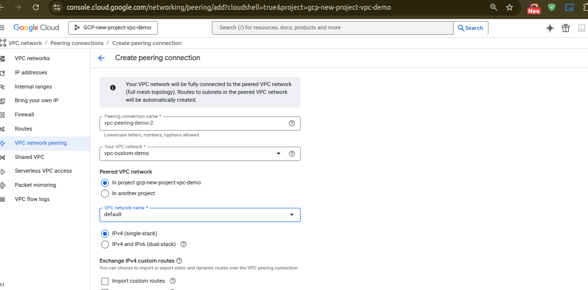

so now the status is active

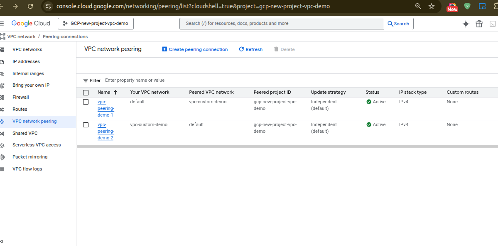

Now the ping of ip address will be working

### VPC Peering between Different Project -  Demo
1. Create new VPC peering from project 1 to project 2 inside project 1

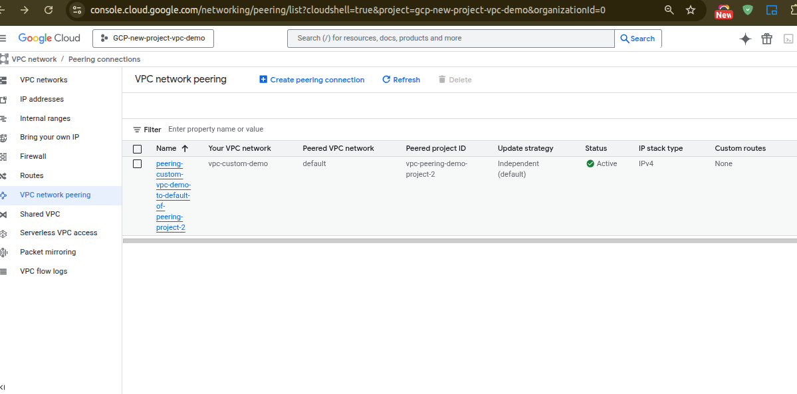

2. Create new VPC peering from project 2 to project 1 inside project 2

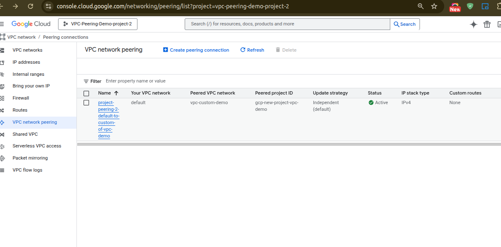

So now communication will be happening, because we have enabled between two projects and it is straighforward which is secure

## Hybrid Network Connectivity
* Hybrid connectivity refers to the ability to establish connections between **on-premises infrastructure**(data centers, private networks) and **resources in Google Cloud Platform(GCP).** It enables organizations to create integrated environments that span both on-premises and cloud infrastructure
* **Advantage of Hybrid connectivity**
  * The primary purpose of hybrid connectivity is to **facilitate communication** and **data exchange** between on-premises systems and resources hosted in GCP, allowing organizations to leverage the enefits of the cloud while maintaining some components on-premises
  * > What is the need to Hybrid?
  * > It depends on requirement. They still have some resources where they want to keep on-premises and move some resources to cloud
* **Different methods**
  * Cloud VPN
  * Cloud Interconnect
  * Peering

example -  

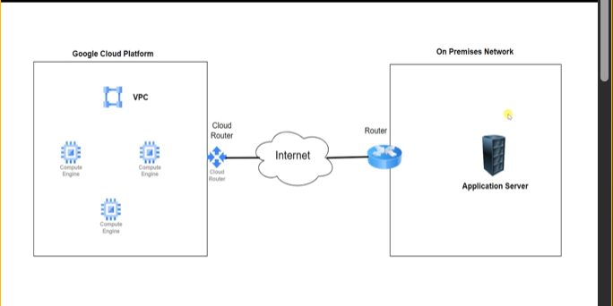


# Hybrid Cloud

## GCP Cloud VPN - Introduction
* Create a new VPC with new subnets
* Reserve **External**(public) IP address
* Create a new VM instance in the VPC
* Configure the Cloud VPN in the GCP
* Validate the connection

What is VPN?
* It is a virtual private network which is built on top of the internet. It's a secured connectivity over the unsecured. Basically it's a secured tunnel that's connected over the unsecured internet.
* How it works?


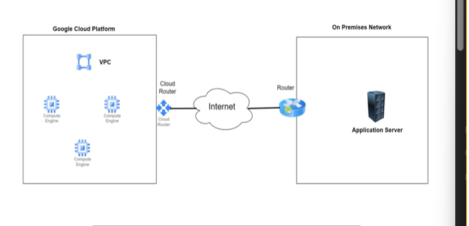

As we don't have on-premises network, consider below diagram. workin will be same.

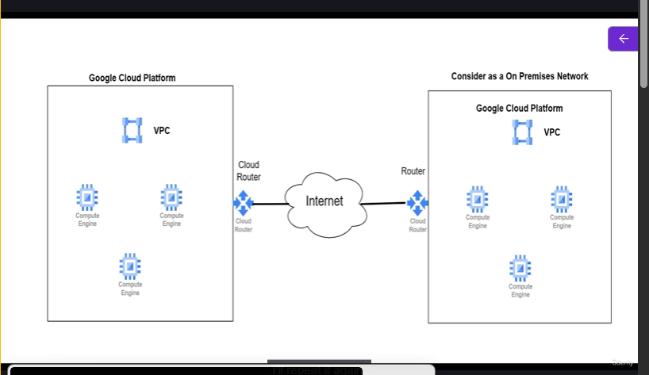

* Basically we will have two different GCP projects. Because we don't have real topology
* Consider project 2 as on-premise network.

### GCP Cloud VPN - Demo | Hands-on
1. Create one each vpc in each project. e.g one in singapore and one in us and allocate the subnet.

Reserve exteranl IP address from IP Address. GCP will automatically give one from that subnet created above

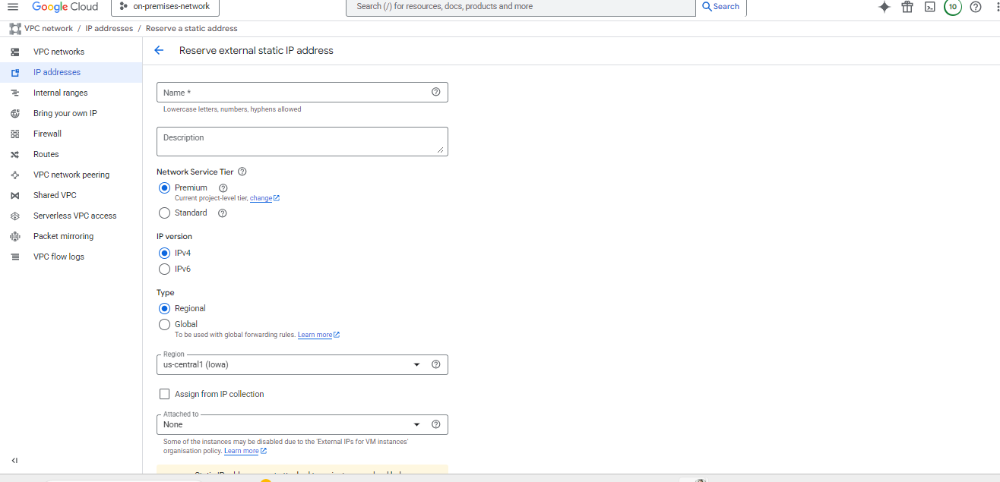


2. Our requirement is vm should have only internal IP address.

so keep it as none.

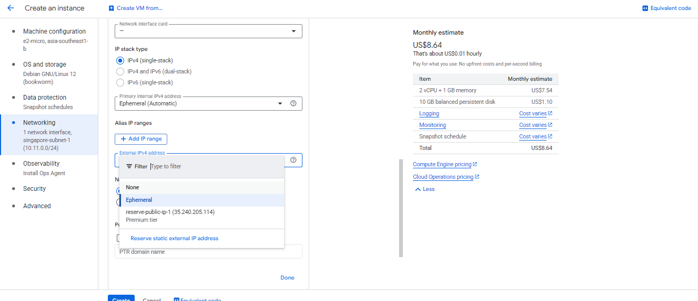

Step 4 - After creating the VM in the two gcp project with different vpc , now configure the VPN


The external ip address reserved will be shown while configuring the VPN

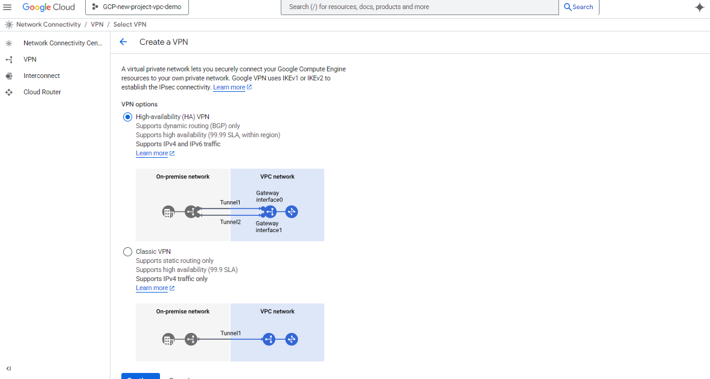

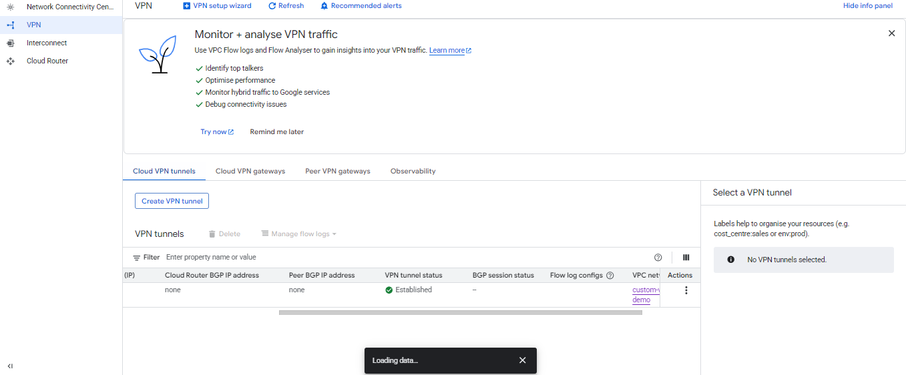

So we will start to get the response in the ping for vm instances when vpn tunnel for both the projects is established

### Static Routing - Demo | Hands-on
If you add a new subnet to on-premises network, then project 1 will not be able to connect to this new subnet because project 1 does not know about this even though vpn tunnel is created between these projects. but Project 1 is not aware of new subnet. so to solve this we need to create new Route

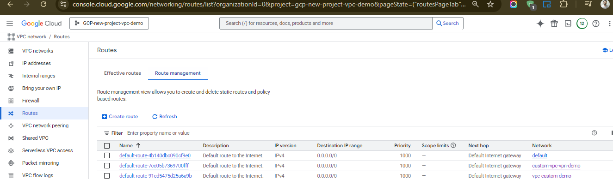

## Understanding Dynamic Routing in GCP

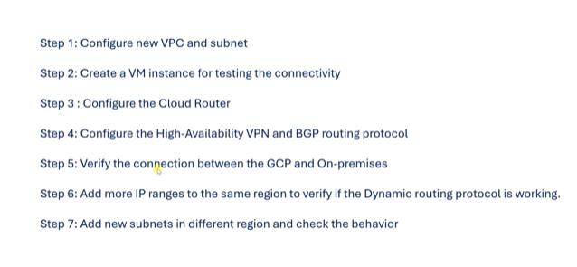


<hr>

> How to you connect an on-premise network to a cloud network
## 1. Cloud VPN
* Cloud VPN - Connect on-premise network to the GCP network
  * Implemented using **IPSec VPN Tunnel**
  * Traffic through internet(**public**)
  * Traffic encrypted using **Internet Key Exchange** protocol
* Two types of Cloud VPN Solutions
  * High Availability(HA) VPN - (SLA of 99.99% service availability with two external IP addresses)
    * Only dynamic routing (BGP) supported
  * Classic VPN (SLA of 99.9% service availability, a single external IP address)
    * Supports Static routing (policy-based, route-based) and dynamic routing using BGP

## 2. Cloud Interconnect
* High speed **physical direct connection** between on-premise and VPC networks
  * Highly available and high throughput
  * Two types of connections possible 
    * Dedicated interconnect - 10 Gbps or 100 Gpbs configurations
    * Partner interconnect - 50 Mbps to 10 Gbps configurations
* **Data exchange happens through a private network**
* (Feature) Supported Google API's and services can be privately accessed from on-premise
  * Communicate using VPC network's internal IP addresses from on-premise network
  * Reduces egress costs
    * As public internet is not used
* **Use only for high bandwidth needs** - 
  * For **low bandwidth** -  Cloud VPN is recommended

## 3. Direct Peering
* Connect customer network to google network using network peering
  * Direct path from on-premises network to Google services
* **Not a GCP service**
  * Lower level network connection outside of GCP
* NOT RECOMMENDED
  * Use Cloud Interconnect and Cloud VPN


## GCP CDN & Cache - Hands-on

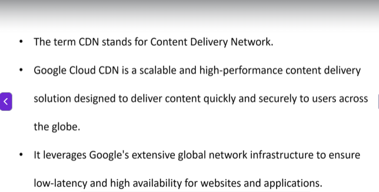

* Key Features - 

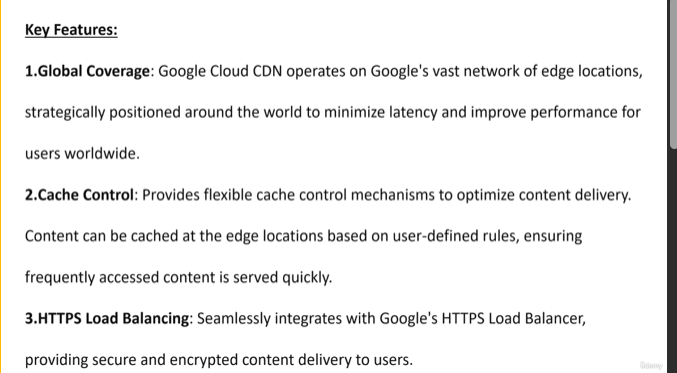

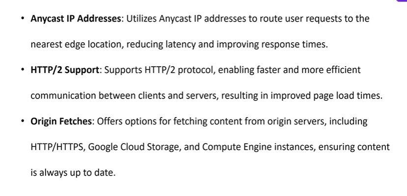

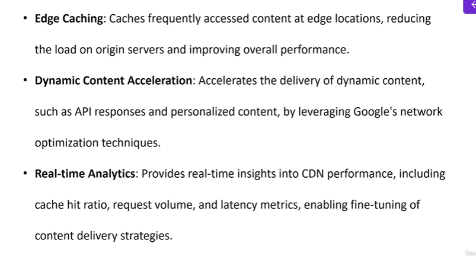

* **Use Cases** 

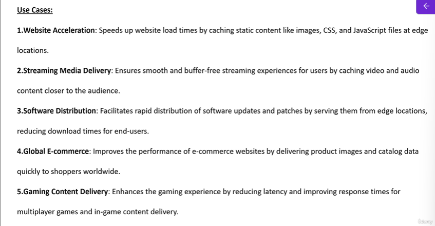

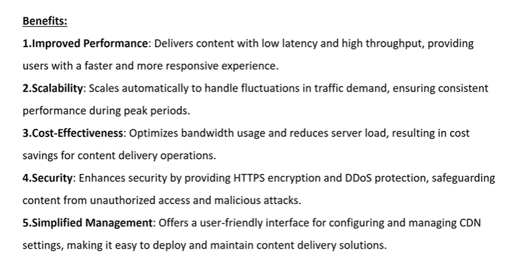

**Conclusion -**

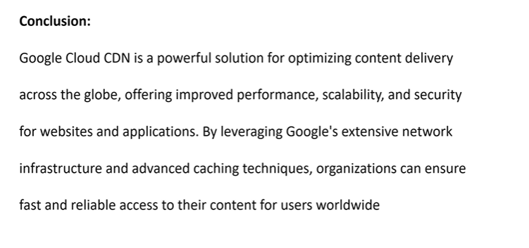