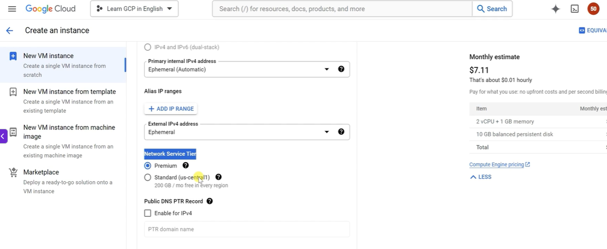
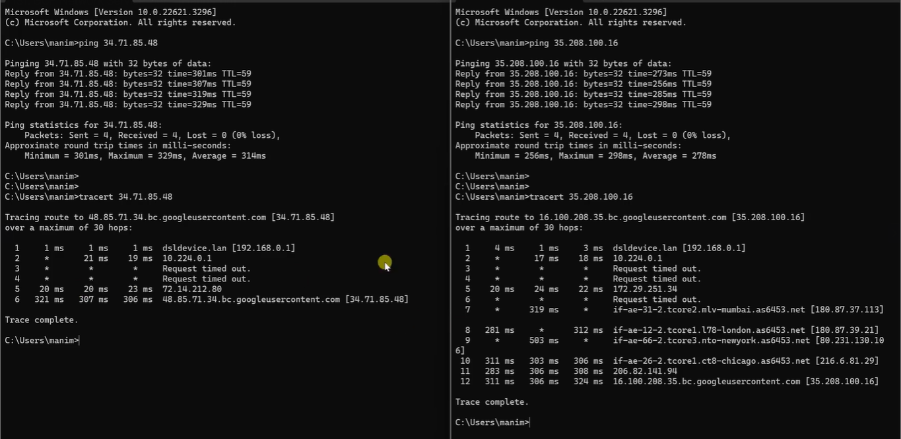
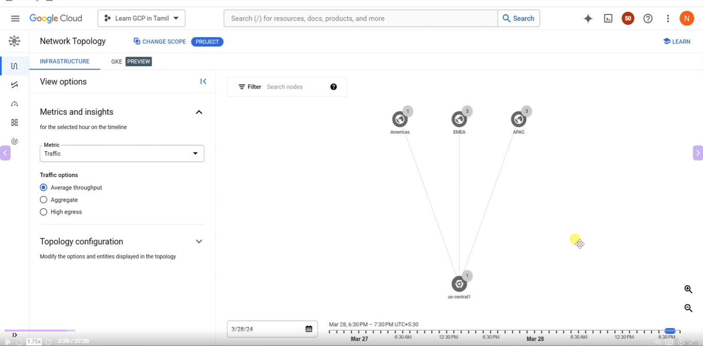
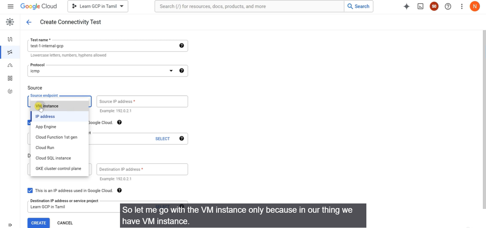
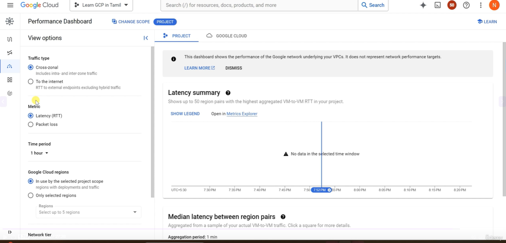
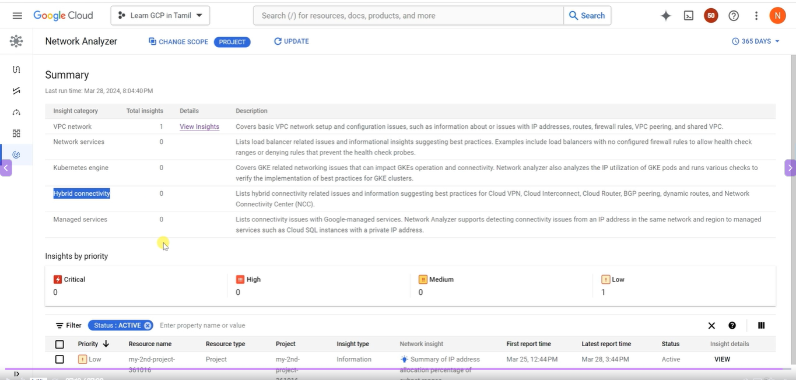
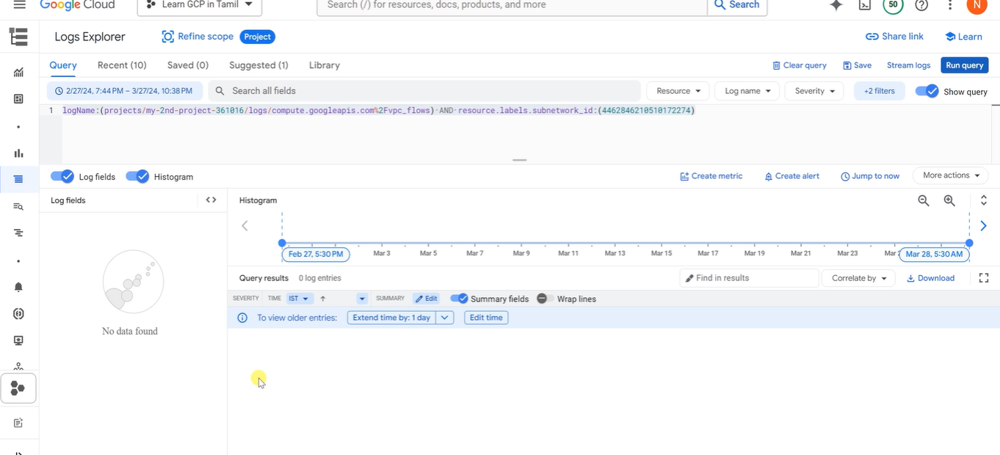
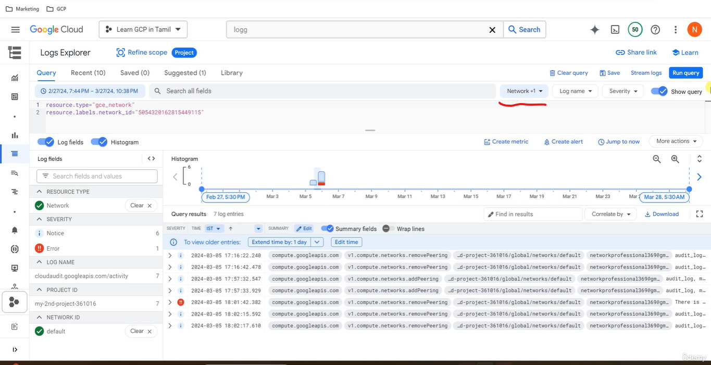
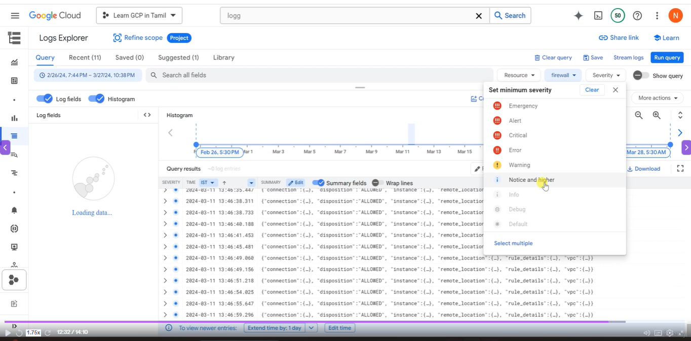

# Cloud Operations

## Cloud Monitoring
* To operate cloud applications effectively, you should know - 
  * Is my application healthy?
  * are the users experiencing any issues?
  * Does my database has enough space?
  * are my servers running in an optimum capacity?
* **Cloud Monitoring** - Tools to monitor your infrastructure
  * Measures key aspects of services(Metrics)
  * Create visualizations(Graphs and Dashboard)
  * Cofigure Alerts(when metrics are NOT healthy)
    * Define Alerting Policies
      * Condition
      * Notifications - Multiple Channels
      * Documentation

## Cloud Montitoring - Workspace
* You can use cloud monitoring to monitor one or more GCP projects and one or more AWS accounts
* How do you group all the information from multiple GCP projects or AWS accounts?
* **Create a Workspace**
* Workspaces are needed to organize monitoring information
  * A workspaces allows you to see monitoring information from multiple projects
  * Step 1 - Create workspace in a specific project(Host Project)
  * Step 2 - Add other GCP projects(or AWS accounts) to the workspace

## Cloud Monitoring - Virtual Machines
* **Default metrics monitored** include
  * CPU utilization
  * Some disk traffic metrics
  * Network traffic and
  * Uptime information
* Install **Cloud Monitoring agent** on the VM to get more disk, CPU, network, and process metrics:
  * collected-based daemon
  * Gathers metrics from VM and sends them to Cloud Monitoring

## Cloud Logging
* Real time log management and analysis tool
* Allows to store, search, analyze and alert on massive volume of data
* Exabyte scale, fully managed service
  * No server provisioning, patching etc
* Ingest Log data from any source
* Key Features - 
  * Logs Explorer - Search, sort & analyze using flexible queries
  * Logs Dashboard - Rich visualization
  * Logs Metrics - Capture metrics from logs(using queries/matching strings)
  * Logs Router - Route different log enteries to different destinations
 
## Cloud Logging - Collection
* Most GCP Managed services automatically send logs to Cloud Logging:
  * GKE
  * App Engine
  * Cloud Run
* Ingest logs from GCE VMs - 
  * Install Logging Agent(based on fluentd)
  * (Recommended)Run Logging Agent on all VM instances
* Ingest logs from on-premises
  * (Recommended) Use the BindPlane tool from Blue Medora
  * Use the Cloud Logging API
## Cloud Logging - Audit and Security Logs
* **Access Transparency Log:** Captures Actions performed by GCP team on your content (NOT supported by all services):
  * ONLY for organizations with Gold support level & above
* **Cloud Audit Logs** - *Answers who did what, when and where-*
  * Admin activity Logs
  * Data Access Logs
  * System Event Audit Logs
  * Policy Denied Audit Logs

## Cloud Logging - Audit Logs
* Which service?
  * protoPayload.serviceName
* Which operation?
  * protoPayload.methodName
* What resource is audited?
  * resource.Type
* Who is making the call?
  * authenticationInfo.principalEmail

## Cloud Audit Logs

|**Feature**|**Admin Activity Logs**|**Data Acess Logs**|**System Event Logs**|**Policy Denied Logs**|
|-------|-------------------|----------------|---------------|-------------------|
|**Logs for**|API calls or otheractions that modify the configuration of resources|Reading configuration of resources|Google Cloud administrative actions|When user or service account is denied access|
|**Default Enabled**|yes|No|Yes|Yes|
|**VM Examples**|VM creation, patching resources, Change in IAM permissions| Listing resources(vms, images etc)|On host maintenance, Instance preemption, Automatic restart|Security policy violation logs|
|**Cloud Storage**|Modiy bucket or object|Modify/Read bucket or object|||
|**Recommended**|Logging/logs viewer|Logging/private|Logging/Logs viewer|Logging/Logs|

## Cloud Logging - Controlling & Routing
* How do you manage your logs?
  * Logs from various sources reaches **Log Router**
  * Log Router checks against configured rules
    * What to ingest? what to discard?
    * Where to route?
* Two types of Logs buckets - 
  * **_Required** - Holds Admin activity, System Events & Access Transparency Logs (retained for 400 days)
    * ZERO charge
    * You cannot delete the bucket
    * You cannot change retention period
  * **_Default** - All other logs (retained for 30 days)
    * You are billed based on Cloud logging pricing
    * You cannot delete the bucket
      * But you can disable the **_Default** log sink route to **disable ingestion**
      * You can edit retention settings(1 to 3650 days/10 years)

## Cloud Logging - Export
* Logs are ideally stored in Cloud Logging for limited period
  * For long term retention(Compliance, Audit) logs can be exported to :
    * Cloud Storage Bucket(ex - bucket/syslog/2025/05/05)
    * Big Query dataset(ex - tables syslog_20250505 > columns timestamp, log)
    * Cloud Pub/Sub topic (base64 encoded log entries)
* How do you export logs?
  * Create **sinks** to these destinations using Log Router.
    * You can create **include or exclude** filters to limit the logs

## Cloud Logging - Export - Use Cases
* Use Case 1  - Troubleshoot using VM logs
* Use Case 2 - Export VM logs to BigQuery for querying using SQL like queries
* Use Case 3 - You want to retain audit logs for external auditors at minimum cost

## Google Cloud Monitoring vs Logging

| Aspect                     | **Cloud Monitoring**                         | **Cloud Logging**                     |
| -------------------------- | -------------------------------------------- | ------------------------------------- |
| What it focuses on         | **Metrics & health**                         | **Logs & events**                     |
| Type of data               | Numeric, time-series data                    | Text / structured log entries         |
| Main purpose               | Detect **performance & availability issues** | Investigate **what happened and why** |
| Typical questions answered | “Is my system healthy?”                      | “What exactly went wrong?”            |
| Data examples              | CPU %, memory usage, latency                 | Error messages, request logs          |
| Alerting                   | ✅ Yes (metric-based alerts)                  | ⚠️ Indirect (via log-based metrics)   |
| Visualization              | Dashboards, charts                           | Log explorer, filters                 |
| Retention style            | Aggregated over time                         | Stored raw or structured              |
| Used by                    | SREs, Ops teams                              | Developers, SREs, Security teams      |

* **Simple mental model** 🧠
Monitoring → “How is my system behaving?”  
Logging     → “What exactly happened inside the system?”

## Cloud Trace
* Distributed tracing system for GCP: **Collect latency data** from:
  * Supported Google Cloud Services
  * Instrumented applications (using tracing libraries) using **Cloud Trace API**
* Find out - 
  * How long does a service take to handle requests?
  * What is the average latency of requests?
  * How are we doing over time? (increasing/decreasing trend)
* Supported for - 
  * Compute Engine, GKE, App Engine (Flexible/Standard) etc
* Trace client libraries available for - 
  * C#, Go, Java, Node.js, PHP, Python & Ruby

## Cloud Debugger
* **How to debug issues that are happening only in test or production environments?**
* **Cloud Debgger** - Capture state of a running application
  * Inspect the state of the application directly in the GCP environment
  * Take snapshots of variables and call stack
  * No need to add logging statements
  * No need to redeploy
  * Very lightweight => Very little impact to users
    * Can be used in any environment- Test, acceptance, Production

## Cloud Profiler
* **How do you identify performance bottlenecks in production?**
* **Cloud Profiler** - Statistical, low-overhead profiler
  * Continuously gathers CPU and Memory usage from production systems
  * Connect profiling data with application source code
    * Easily identify performance bottlenecks
  * Two major components
    * Profiling agent(collects profiling information)
    * Profiler interface(visualization)

## Error Reporting
* How do you identify production problems in real time?
* Real-time **exception monitoring**:
  * Aggregates and displays errors reported from cloud services (using stack traces)
  * Centralized Error Management console:
    * Identify & manage top errors or recent errors
  * Use Firebase Crash Reporting for errors from Android & iOS client
applications
  * Supported for Go, Java, .NET, Node.js, PHP, Python, and Ruby
* Erros can be reported by - 
  * Sending them to Cloud Logging OR
  * By calling Error Reporting API
* Error Reporting can be accessed from desktop
  * Also available in the cloud console mobile app for iOS and Android

## Cloud Operations Scenarios

|Scenario|Solution|
|--|--|
|You would like to record all operations/requests on all objects in a bucket(for auditing)|Turn on data access audit logging for the bucket|
|You want to trace a request across multiple microservices|Cloud Trace|
|You want to identify prominent exceptions(or errors) for a specific microservice|Error Reporting|
|You want to debug a problem in production by executing step by step|Cloud Debugger|
|You want to look at the logs for a specific request| Cloud Logging|

## GCP Network Tier

* **Premium Service Tier**

Traffic travels through the Google's high quality global backbone, entering and exiting at Google edge peering points closest to the user.  
For example: Consider an application is running on a virtual machine (VM) instance deployed in
the us-centrall (iowa) region. A user located in Mumbai, India, attempts to access the
application. Once the user's request reaches their Internet service provider, it is routed to the
closest Google edge peering point. From there, the request travels through Google Cloud's
reliable global backbone network to reach the destination in the us-centrall region (located in
Iowa). Similarly, the response from the application also returns through Google's backbone
network.

* **Standard Service Tier**

Traffic enters and exits the Google network at a peering point closest to the Cloud region it's
destined for or originated in.  

For example: Consider an application is running on a virtual machine (VM) instance deployed in
the us-centrall (iowa) region. A user located in Mumbai, India, attempts to access the
application. Once the user's request reaches their Internet service provider, the traffic is routed
through the internet towards the peering point closest to the cloud region at the destination
(iowa). From there, the request reach the destination in the us-centrall region (located in Iowa).
Similarly, the response from the application also returns through the internet and NOT through
the Google's backbone network

### GCP Network Tier: Premium vs Standard

| Aspect                  | **Premium Tier**                          | **Standard Tier**                            |
| ----------------------- | ----------------------------------------- | -------------------------------------------- |
| Network used            | Google’s **global private backbone**      | Public internet + regional Google network    |
| Traffic routing         | Enters Google network **closest to user** | Enters Google network **near the VM region** |
| Latency                 | **Lower**                                 | Higher                                       |
| Performance consistency | **Very high & predictable**               | Variable                                     |
| Global load balancing   | ✅ Yes                                     | ❌ No                                         |
| SLA                     | **Higher SLA**                            | Lower SLA                                    |
| DDoS protection         | **Advanced (global)**                     | Basic                                        |
| Availability            | Global                                    | Regional                                     |
| Cost                    | **More expensive**                        | **Cheaper**                                  |
| Default tier            | ✅ Yes (default)                           | ❌ No                                         |

* Simple mental model 🧠

**Premium** → Google’s private highway, globally  
**Standard** → Public roads + some Google highways  

* The number of hops is more in standard service tier network when compared to google premium-network
* Hop counts are the intermediate devices

## GCP Network Intelligence Services - Hands-on 

* **Network Topology**
  * It shows the project network over the GCP network

* **Connectivity Test**

* **Performance Dashboard**

* **Firewall Insights**
  * Details about firewall rules

* **Network Analyzer**
  * How many VPC, GKE, Hybrid connectivity are present

## Logging & Monitoring

* > If you click on logs it will automatically redirect to the Logs explorer with a query written
* Logs Explorer

We can filter the logs using **resouce filter**. The query will be automatically applied

Logs can filtered based on severity

