# Getting Started with DevOps

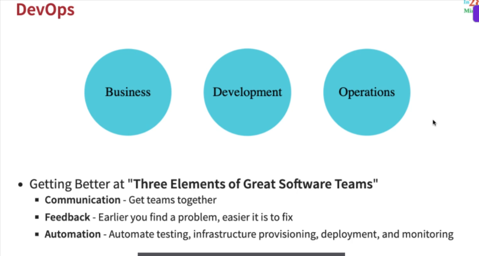

## Exploring DevOps Practices - Continuous Integration , Continuous Deployment

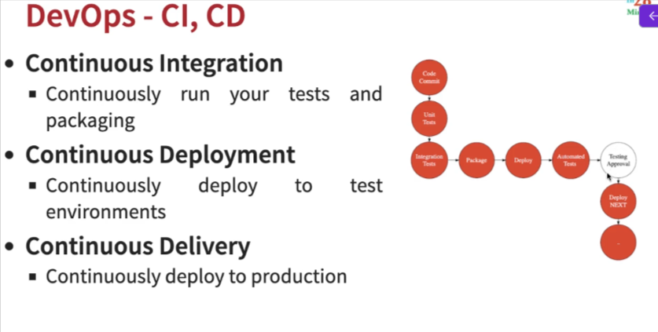

### DevOps - CI CD - Recommended Things to DO

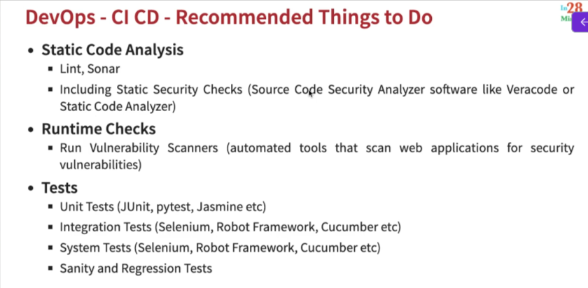

### DevOps in Google Cloud

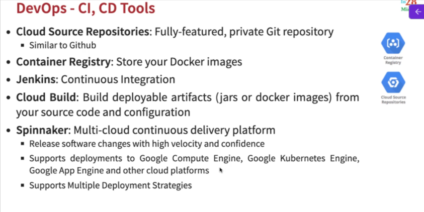

### Exploring Container Registry and Artifact Registry

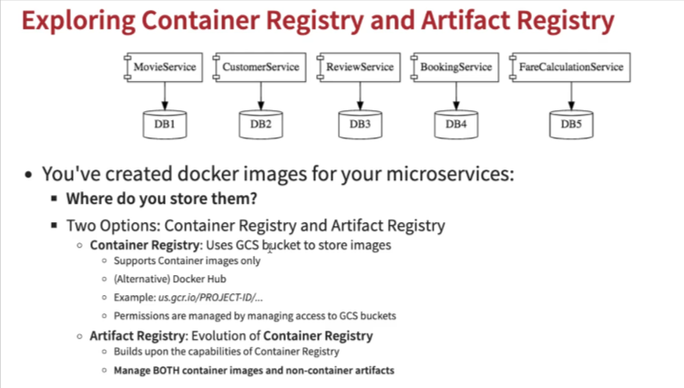

* Artifact Registry

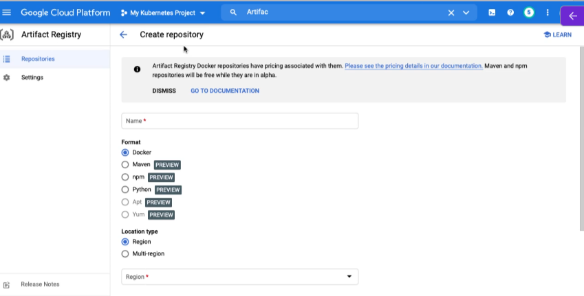

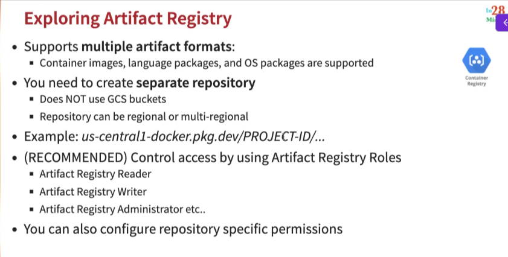

### DevOps Example - Cloud Run with Cloud Build

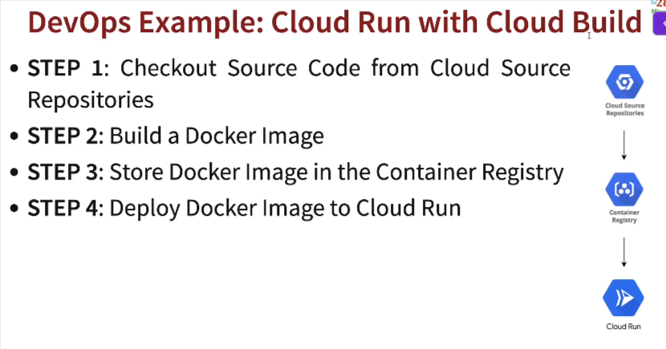

### DevOps - Infrastructure as a Code
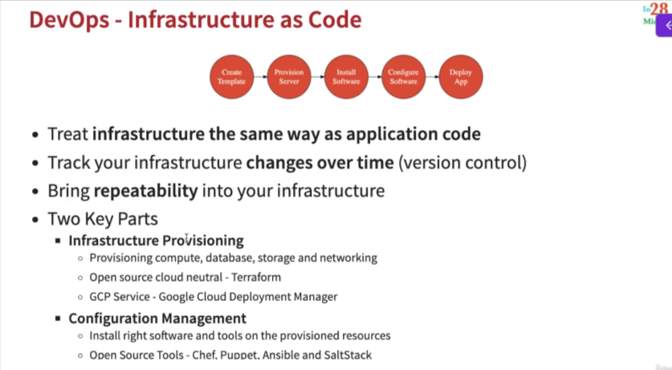

### Exploring DevOps - Operations in Google Cloud

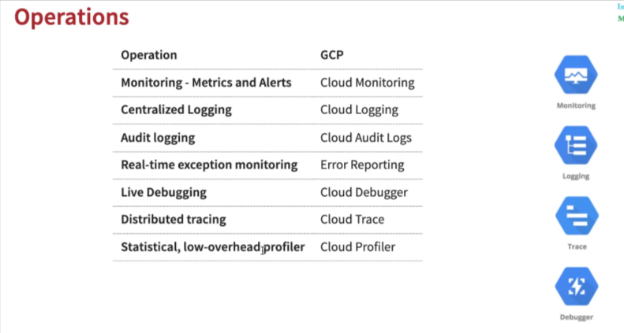

### Cloud Operations Scenarios - Microservies

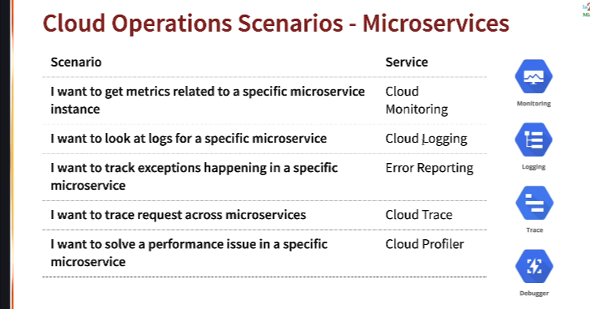

### Site Reliability Engineering (SRE)

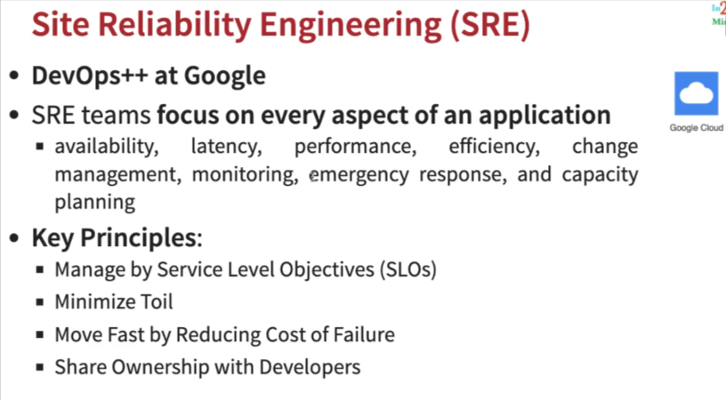

### Understanding Key Metrics for Site Reliability Engineering

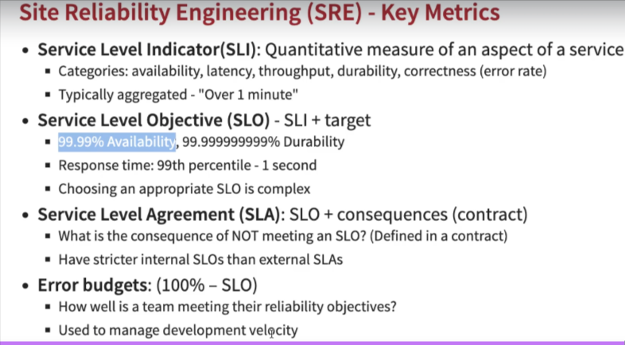

### Site Reliability Engineering(SRE) - Best Practices

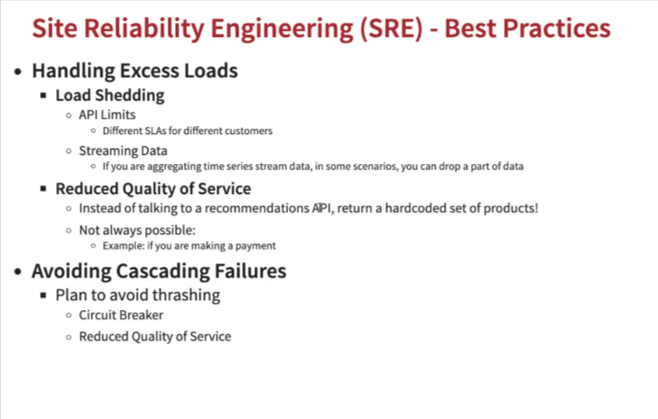

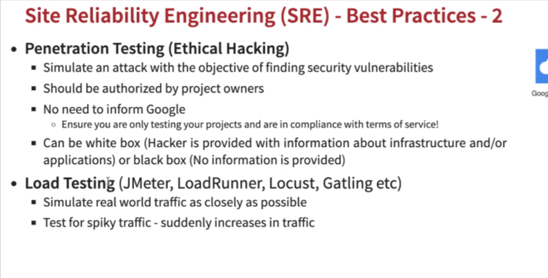

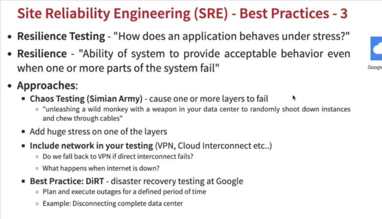

