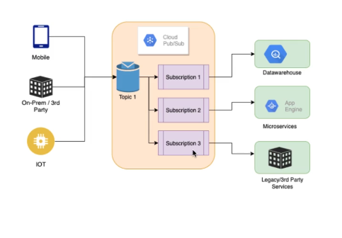
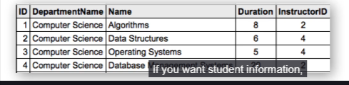
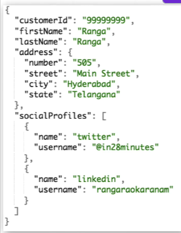
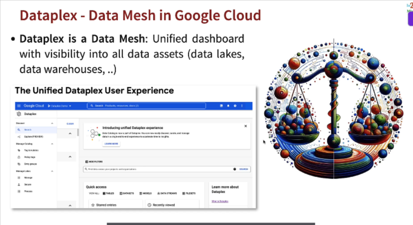
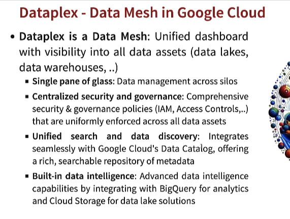
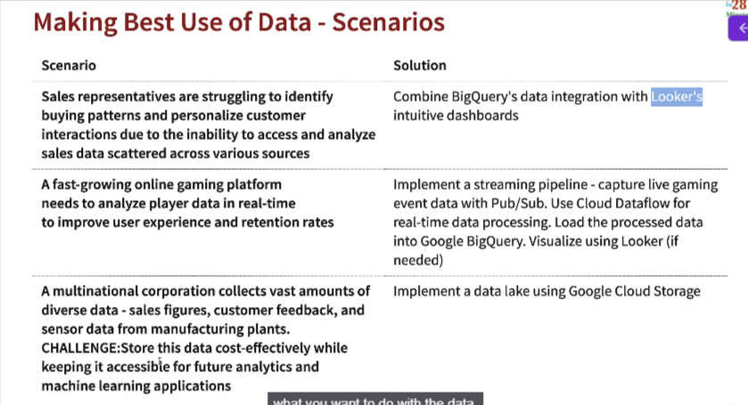

# Google Cloud Architecture for CDL

## => Architecture - Loose Coupling with Pub/Sub

* Whenever you want to **decouple a publisher from a subscriber**, consider Pub/Sub
* Pub/Sub is used in - 
  * Microservices Architecture
  * iOT Architectures
  * Streaming Architectures

## => Data Formats
* **Three Data Formats**
* **Structured** - Tables, Rows and Columns(**Relational database**)
  * Example - Order Information, Product Inventory, etc
    * Google Cloud Services - 
        * Cloud SQL(Regional Tranactional)
        * Cloud Spanner(Global Unlimited Scale Tranactional)
        * BigQuery(Data warehousing and ML using SQL)

* **Semi-Structured** - Flexible Schema
  * Key-Value, Document(**JSON**) - Social Media Profile Information
    * Google Cloud Services - CloudFirestore/Datastore

* **Unstructured** - Video, Audio, Image, Text, Binary files
  * Example - Product images, Product videos
    * Google Cloud Services - Cloud Storage

* (**NEW) BigQuery** can also store **Semi Structured data**
  * **BigQuery ML can be used to do ML using Unstructured data**(images,videos) stored in Cloud Storage

## Cloud Dataproc 
* Managed **Spark and Hadoop** service
  * Variety of jobs are supported - 
    * Spartk, PySpark, SparkR,Hive, SparkSQL, Pig, Hadoop
    * Perform complex batch processing
* **Multiple Cluster Modes**
  * Single Node/Standard/High Availability(3 masters)
  * Use regular/preemptible VMs
* Use case - Move your Hadoop and Spart clusters to the cloud
  * Perform your machine learning and AI development using open source frameworks
* (ALTERNATIVE) **BigQuery** - When you run SQL queries on Petabytes
  * Go for Cloud Dataproc when you need more than queries(Example - Complex batch processing Machine Learning and AI workloads)
* (ALTERNATIVE) **Dataflow** - Simple pipelines without managing clusters

### The basic problem

Data keeps getting bigger and your algorithms don’t magically run faster on one machine. At some point a single CPU, memory, disk, or network link is the bottleneck. To process large datasets (ETL, analytics, ML training, stream processing) you must split work across many machines and coordinate them — that’s **distributed data processing**.

Two core ideas make that possible:

* **Partition the data** so different machines work on different chunks in parallel.
* **Coordinate work and data movement** so intermediate results get combined correctly (think map → shuffle → reduce, or a directed acyclic graph of tasks).

Frameworks such as **Apache Hadoop (MapReduce/YARN)** and **Apache Spark (DAG + in-memory RDDs/DataFrames)** provide programming models and runtime to run those distributed jobs reliably.

### What Cloud Dataproc is (short)

**Cloud Dataproc** is Google Cloud’s managed service that runs those open-source distributed frameworks (Spark, Hadoop, Flink, Trino, etc.) for you — it creates, configures, scales, and tears down clusters so you can focus on your jobs and data instead of on OS/package installation, tuning, and cluster ops.
(Cloud provider: Google Cloud)

### Why a managed service helps — from first principles

1. **Automation of repetitive ops** — instead of manually provisioning VMs, installing the exact Spark/Hadoop versions and libraries, configuring networking and HDFS/Cloud Storage access, a managed service does those steps reliably and fast. That reduces human error and setup time. 
2. **Elastic compute** — big workloads are bursty. Managed clusters can be scaled up for heavy jobs and scaled down (or deleted) when idle so you don’t pay for idle machines. Dataproc supports autoscaling policies that adjust worker nodes automatically (horizontal scaling).
3. **Cost options & complexity hiding** — you can use ephemeral clusters (create → run job → delete), cheaper spot/preemptible workers, or let the platform run Spark serverless so you pay only while code executes. These patterns reduce wasted time/$$ compared with always-on clusters.
4. **Interoperability** — Dataproc connects to GCP storage (Cloud Storage), BigQuery, monitoring/logging, orchestration tools (Airflow), and supports many OSS components so you reuse existing tools and data flow architectures.

### How it actually works (the mental model)

* You request a **cluster** (master + workers). Dataproc provisions Compute Engine VMs with your chosen image and installs/configures Spark, Hadoop, and any init actions you specify.
* You **submit a job** (PySpark, Spark JAR, Hadoop job, Flink job, Trino query). The job is scheduled on the cluster; Spark driver + executors run across nodes and read/write data from Cloud Storage / BigQuery / other systems.
* When finished you either **keep** the cluster for interactive use, **resize** it, or **delete** it. Alternatively, use **Dataproc Serverless for Apache Spark** and submit Spark workloads without provisioning clusters (the control plane runs and autosizes resources for the job).

### Typical usage patterns

* **Batch ETL pipelines:** spin up a short-lived cluster, run ETL PySpark job reading from Cloud Storage, write parquet to GCS or load into BigQuery, delete cluster. (Good for cost control.)
* **Interactive analysis / notebooks:** keep a small cluster / session for data exploration, notebooks connect to Spark.
* **Streaming:** run Flink or Spark Structured Streaming on a persistent cluster or containerized workloads.
* **Lift-and-shift migrations:** move on-prem Hadoop/Spark jobs to Dataproc with minimal code changes because Dataproc supports common OSS versions.

=============================================  

## Why do we need Data Governance

* Key Decisions
  * Data Management
  * Life Cycle Management
  * Ownership and Accountabilit
  * Data Quality Assurance
  * Data Security
  * Risk Management
  * Data Transparency

## Dataplex - Data Mesh in Google Cloud

* For unified visibility of data in different databases - Use Dataplex

## Data - Scenarios

