# Trust and Security in Google Cloud

### Cloud vs On-Premises Security

|**Factor**|**On-Premises Security**|**Cloud Security**|
|--|--|--|
|**Responsibility**|The business is solely responsible for its security|Security is a shared responsibility between the provider and the business|
|**Costs**|Requires significant upfront investment in hardware and software|Typically involves lower upfront costs but ongoing operational expenses|
|**Maintenance**|Businesses need to manage their own updates and maintenance|Depending on the service, the provider helps with security updates and system maintenance|
|**Expertise**|Requires in-house security expertise or external consultants|Option to get access to top-tier security expertise through the provider|
|**Data Control**|Full control over data storage and security protocols|Less direct control over where and how data is stored|
|**Compliance**|Businesses must indidually ensure and maintain compliance|Cloud providers often have certifications making compliance easire(Shared responsibility)|

### Key Characteristics for Cloud Security
* **Control** - Decide who gets access
  * **Example** - Only few employees can view sensitive company data
* **Compliance** - Follows legal rules
  * **Example** - Protect customer data as the law requires
* **Confidentiality** - Keeps information secret
  * **Example** - Encrypt messages so that only sender
* **Integrity** - Ensures data stays accurate
  * **Example** - A bank syste checks that no one changes your balance without permission
* **Availability** - Ensure apps & data are available always
  * **Example** - A banking website remains accessbile even during high traffic or an attack

### Key Characteristics for Cloud Security - Scenarios

|Scenario|Concept|
|--|--|
|Only the HR department has the ability to access employee records, while all other departments are restricted from viewing this sensitive information.|Control|
|A healthcare provider implements robust data protection measures to ensure patient records are handled in accordance with HIPAA regulations, safeguarding personal health information|Compliance|
|A Company uses end-to-end encryption for all internal communications, ensuring that only the sender and the intended recipientcan read the contents of a message| Confidentiality|
|An online banking application regularly verifies transactions and account updates to ensure that no unauthorized changes have been made to user accounts|Integrity|
|Despite experiencing a significant spike in web traffic during a promotional event, an e-commerce platform remains fully operational, thanks to scalable cloud resources and DDoS protection measures|Availability|

### Trusted Infrastructure From Google
* **World's most popular websites** - Google runs and manages high traffic websites like Google Search and YouTube
* Own Infrastructure - Google has build a world class infrastructure for its use
* Used by Google Cloud - The same infrastructure is made available to us by Google Cloud

### Trusted Infrastructure from Google - Advantages
* **Tailored Security** - Google custom-makes its security, making it super tough for hackers
* **Advanced Protection** - Google's own security tech is always a step ahead of hackers
* **Innovative Security Features** - Google keeps adding new security tricks to keep data safe
* **Reduced Vulnerabilites** - Google's unique systems have fewer weak spots for attacks
* **Rapid Response** - Google fixes security problems super fast because it controls everything

### Enhanced Security Using 2 Step Verification (2SV)

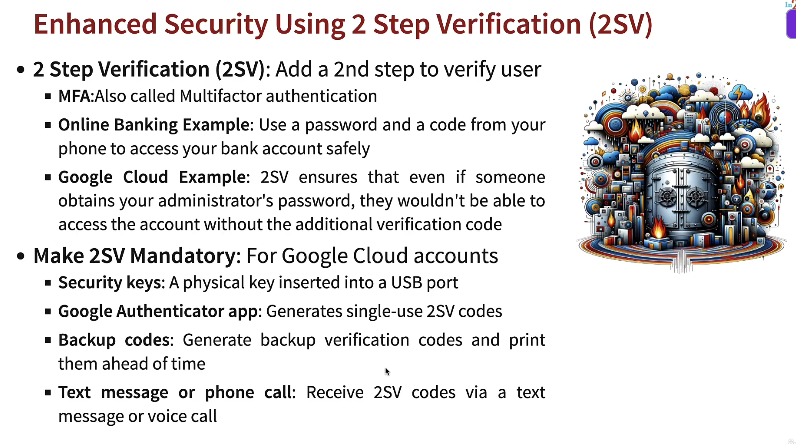

### Exploring SecOps

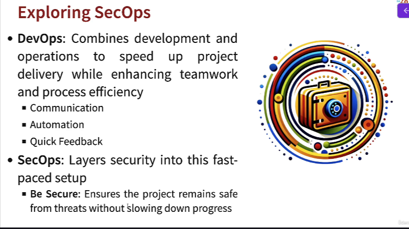

### Comparison between DevOps and SecOps

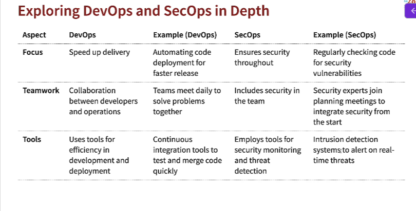

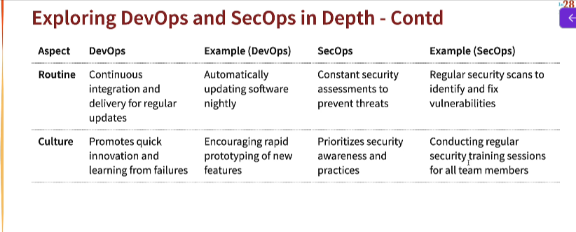

### Exploring Google Cloud's Trust Principles

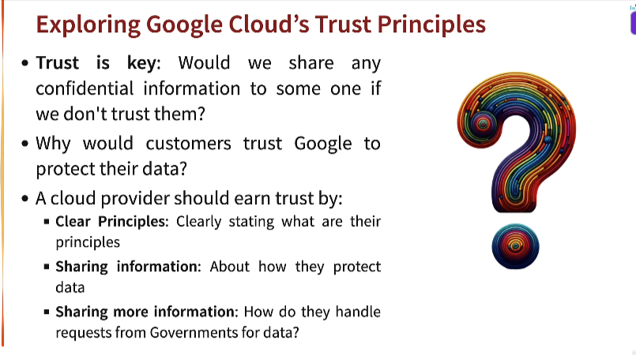

### 7 Google Cloud's Trust Principles

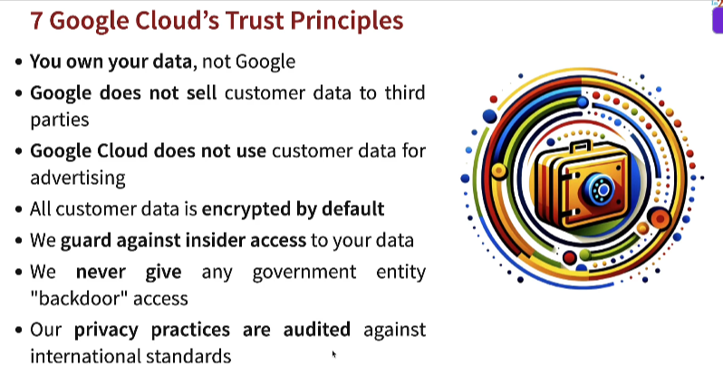

### Exploring Google Transparency Report

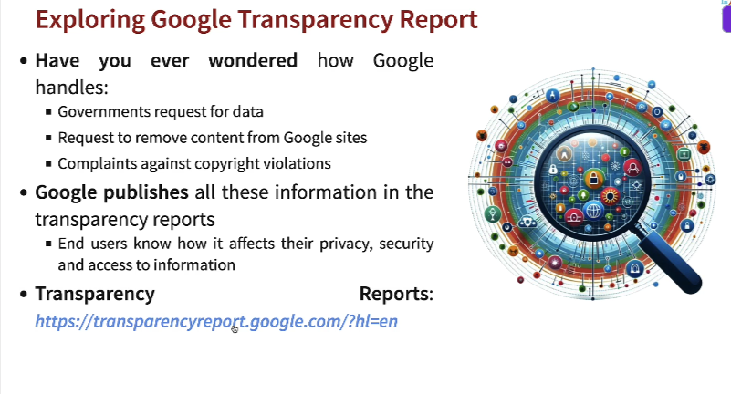

### Third-party Audits for Google Cloud
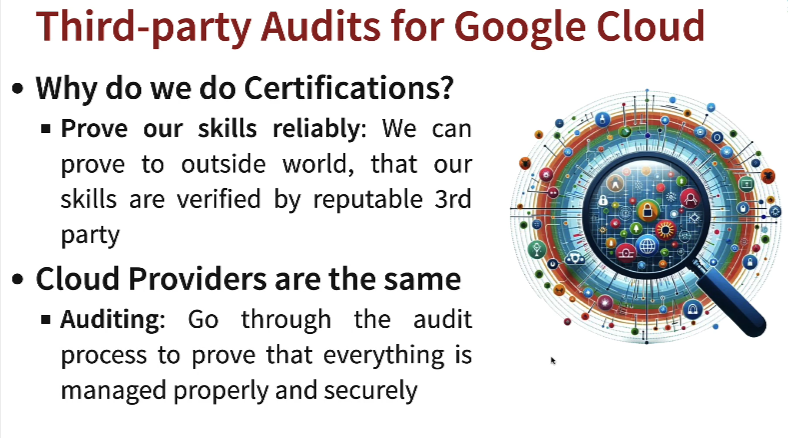

### Third-party Audits for Google Cloud-Examples

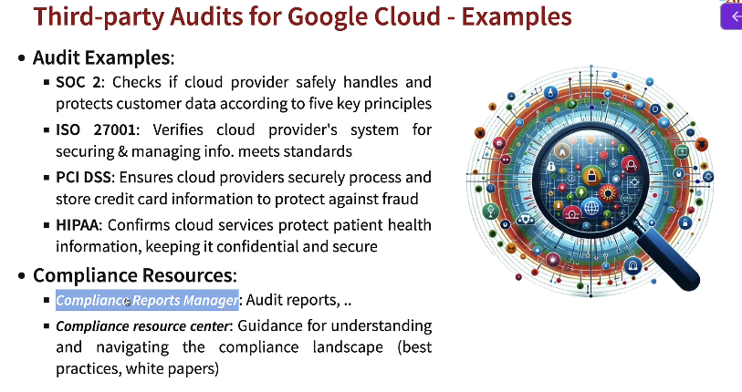

### Data Privacy and data Residency Management

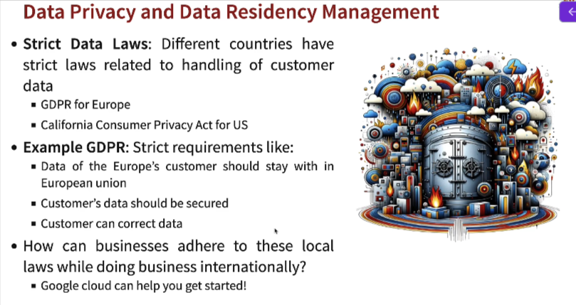

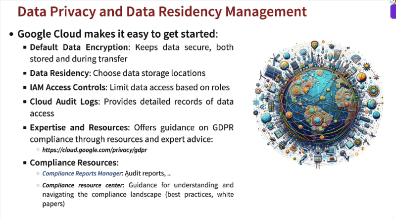

**Compliance Reports Manager** - https://cloud.google.com/security/compliance/compliance-reports-manager

**Compliance resource center** - https://cloud.google.com/compliance?hl=en

### Exploring Google Cloud Security Offerings

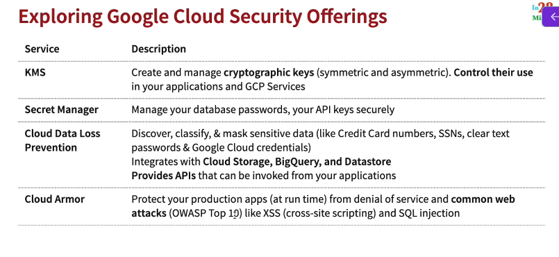

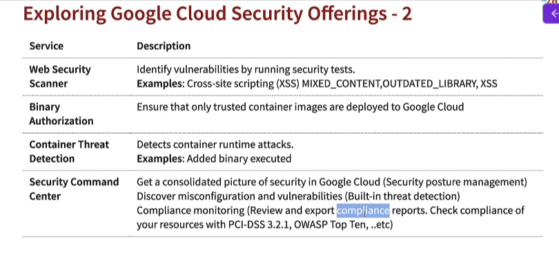

### Understanding Zero Trust Security Model

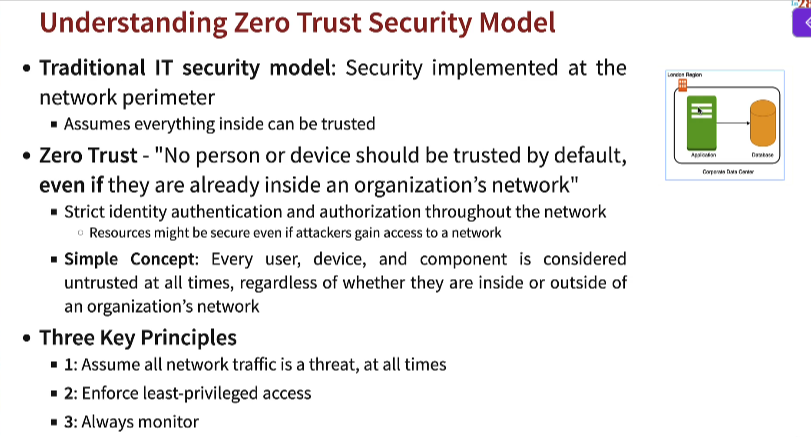

