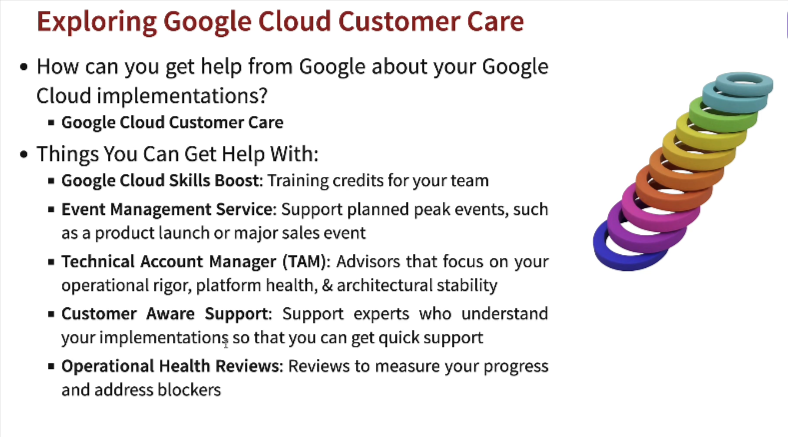
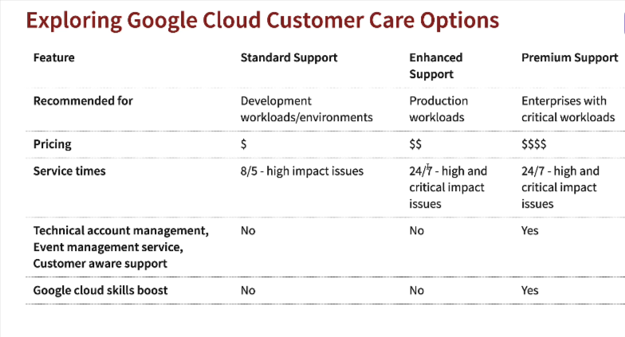
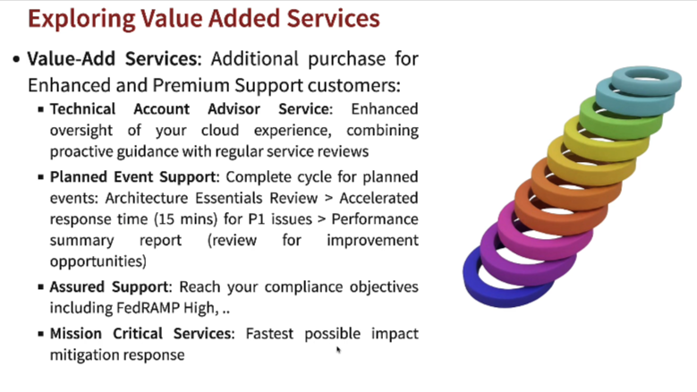
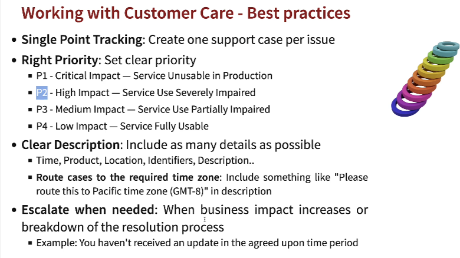
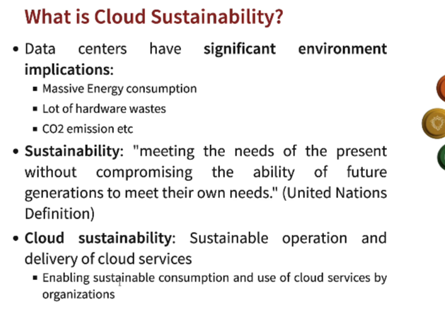
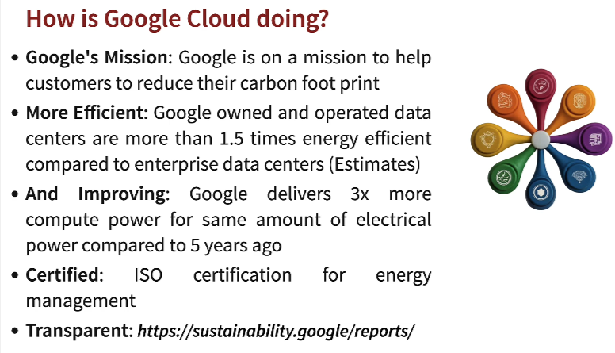
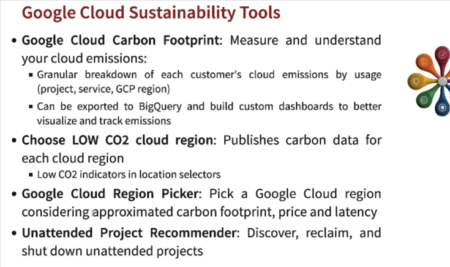
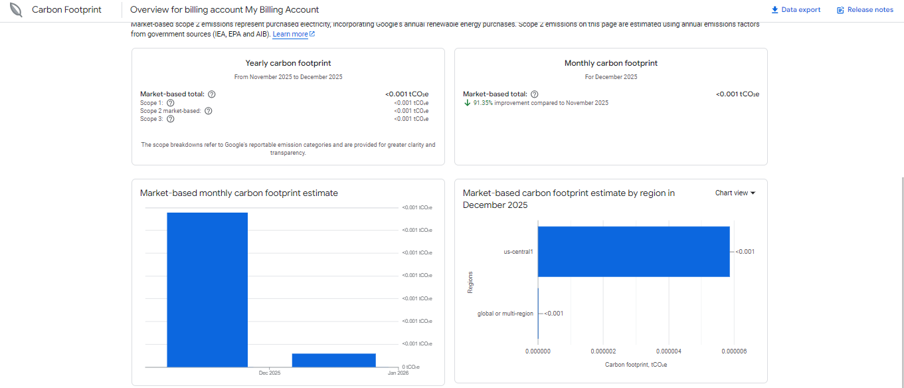
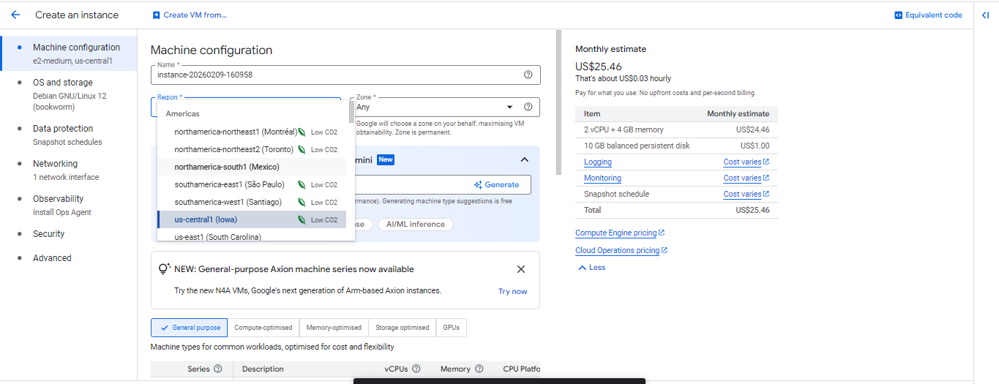

# Scaling operations in Google Cloud

## Exploring Google Cloud Customer Care

## Exploring Google Cloud Customer Care Options

## Exploring Value Added Services

## Exploring Google Cloud Customer Care support

## Working with Customer Care - Best practices

## What is Cloud Sustainability?

### Google Cloud Sustainability tools

Carbon Footprint of the billing account - 

While creating instance we can choose a region with low CO2

Google Cloud region picker - https://cloud.withgoogle.com/region-picker/