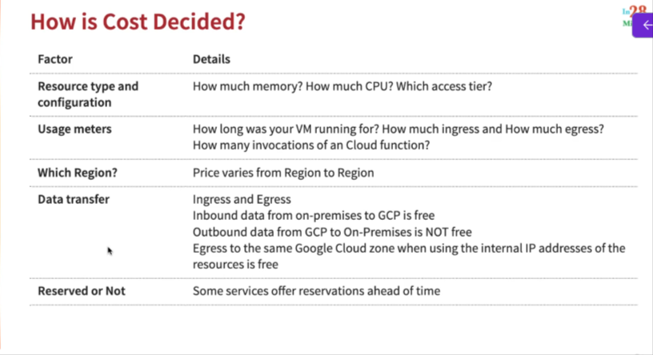
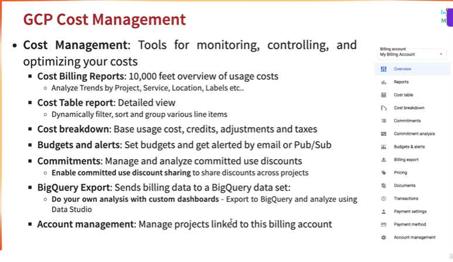
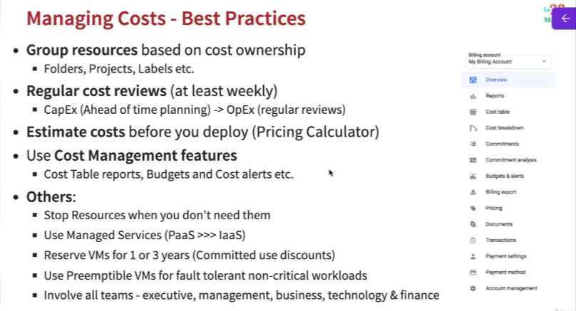
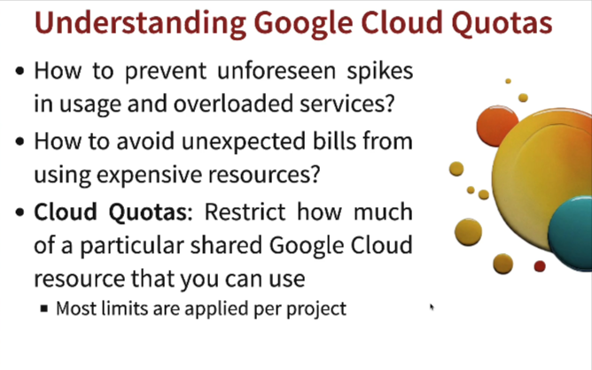
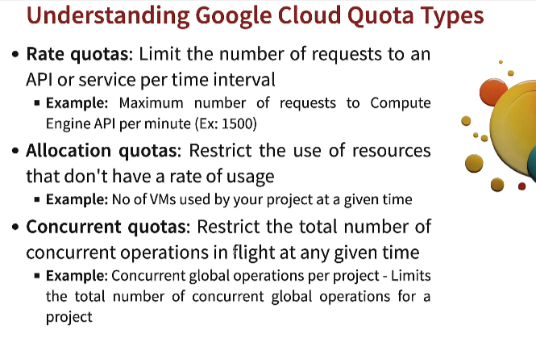
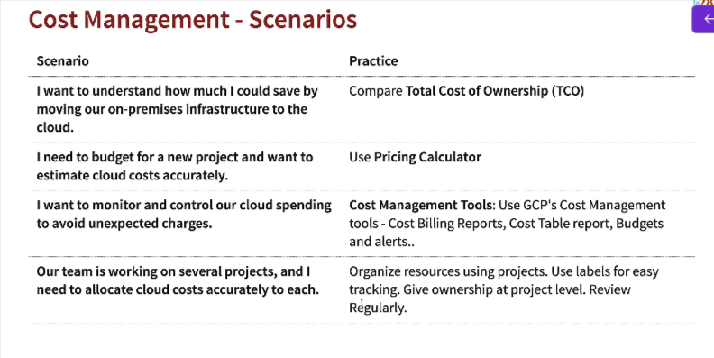

# Cost Management in GCP

## Total Cost of Ownership(TCO)

## Consumption based vs Fixed price Pricing models

## Expenditure Models - CapEx vs OpEx

## How is Cost Decided?

## Exploring Google Pricing Calculator

## GCP Cost Management

## Managing Costs - Best Practices

## Understanding Google Cloud Quotas

### Understanding Google Cloud Quota Types

## Cost Management - Scenarios

